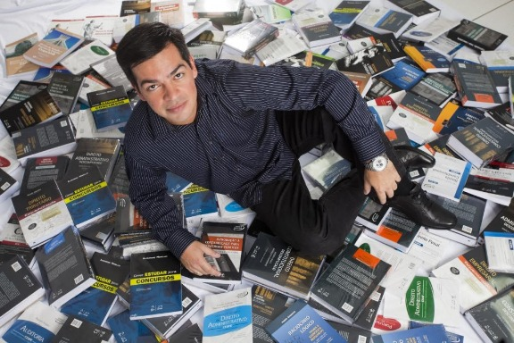
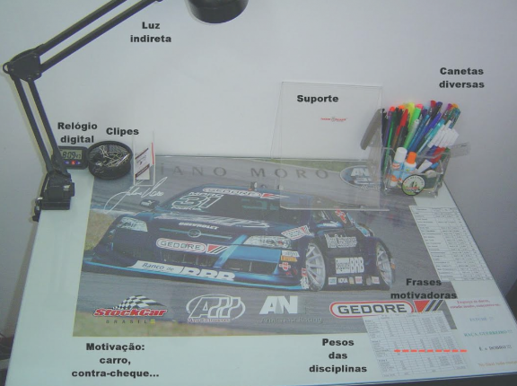
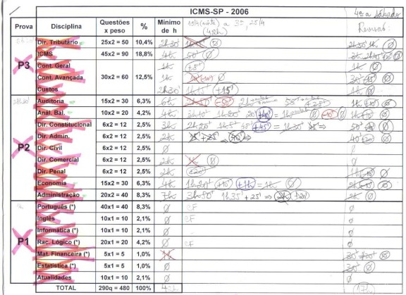
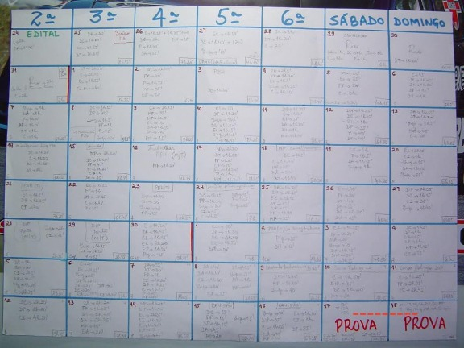
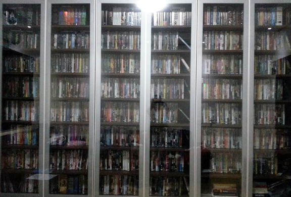
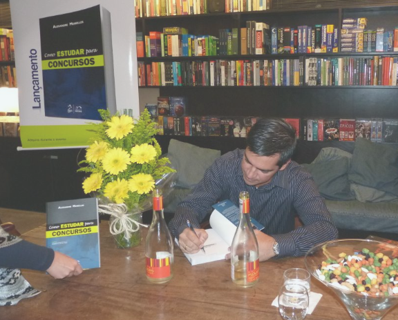
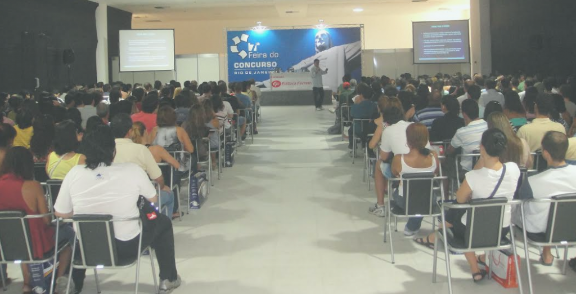

# Como eu me organizo: Alexandre Meirelles

Hoje é a vez de um novo capítulo da série **Como eu me organizo**, em que eu pretendo entrevistar pessoas legais que possam trazer dicas sobre produtividade e inspirar o leitor a viver uma vida mais significativa. Esta série foi idealizada a partir da série How I Work, do blog [Life Hacker](http://lifehacker.com/).

Como o tema do mês de fevereiro é **Aprenda**, convidei para participar uma das maiores inspirações dos estudantes e concurseiros no Brasil: o grande mestre **Alexandre Meirelles**. Alexandre é palestrante, orientador de concurseiros e autor do best-seller “Como estudar para concursos” (Ed. Método). Ficou famoso por ter passado em dois dos mais difíceis fiscos do Brasil: AFRFB (auditor fiscal da Receita Federal do Brasil) e AFR-SP (agente fiscal de rendas do estado de São Paulo) através de um método fantástico de estudos, que compartilha em seu livro e outros artigos na Internet. Em 2014, ele lançou um novo livro, “Concursos fiscais”, onde fala sobre a carreira nos fiscos brasileiros. Confira a sua participação nesta série:

**Nome:** Alexandre Meirelles  
**Onde mora:** Moro em Jundiaí/SP, mas sou carioca da Ilha do Governador, apesar de não morar no Rio há 20 anos.

### Uma palavra que descreva seu estilo de organização:

Anotar tudo no papel.

### O que você faz?

Trabalho há 8 anos como Fiscal da Secretaria da Fazenda do Estado de SP. Fora do horário de trabalho, escrevo e coordeno livros e sou palestrante na área de concursos públicos, nas quais abordo técnicas de estudo.

Meus hobbies são filmes, livros e, principalmente, viajar. De um ano para cá, cuidar do meu filho tornou-se meu maior “hobby”. Mas sempre que ele deixa, corro para os livros e filmes, só viajar para longe que não dá mais, por causa dele.

### Modelo de celular que usa atualmente

iPhone e Galaxy.

### Computador que usa atualmente

PC e macbook.

### Que ferramentas ou aplicativos de organização você não consegue viver sem?

Somente o Excel e o Word, não uso nenhum aplicativo de organização, mas sei que deveria usar. Tenho o Evernote instalado, mas ainda não o uso.

### Como é o seu local de trabalho?

Em casa tenho um escritório no qual colo alguns cartazes e lembretes nas paredes. Nele tem meu PC e meus livros.

Antiga mesa de estudos:

### Qual sua melhor dica para otimizar o tempo?

Saber priorizar as diferentes atividades do dia a dia. Isso é o mais difícil, mas é imprescindível.

### Qual sua maneira preferida de organizar tarefas?

Anoto as mais imediatas na parte de lembretes do celular e mantenho uma agenda em papel, daquelas antigas, que não vivo sem. Já tentei usar a agenda do celular, mas ficava com preguiça de anotar, então voltei à de papel.

### Tirando o celular e o computador, qual sua ferramenta de organização que você não vive sem?

Agenda em papel. Uma pequena, porque se for grande, eu não vou carregá-la sempre. E um caderno, no qual anoto tudo que tenho para fazer em relação a cada assunto. Por exemplo, se estou escrevendo um livro, mantenho um caderno só para ele com todas as ideias que surgem, referências, tarefas a escrever e a fazer relativas ao livro etc.

### O que você acha que faz em termos de organização que é um passo à frente do que vê as outras pessoas fazendo? O que te diferencia, em termos de organização, das outras pessoas?

No dia a dia não sou muito diferente do normal. Eu fui mais organizado que a média quando precisei estudar para concurso, aí sim tenho a certeza de que esse foi o meu maior diferencial em relação aos demais candidatos, porque os métodos de organização que criei e utilizei se mostraram muito eficientes, tanto é que eles que me tornaram conhecido na área dos concursos. Criei formas de organizar o estudo que há anos milhares de concurseiros utilizam, tais como o ciclo de estudos, o quadro de controle de horas, calendário mensal de estudo pós-edital etc., os quais explico no meu livro “Como Estudar para Concursos”.

### O que você gosta de ouvir enquanto está trabalhando?

Alguma música calma, preferencialmente Pink Floyd, Sade, clássica etc. Quando é agitada, desconcentra-me. Mas quando estou escrevendo um texto, prefiro o silêncio.

### Como é a sua rotina de sono?

Durmo de 6h a 7h30 por dia sem muitos problemas com o sono. Geralmente vou dormir lá pela 1h e acordo às 7h30. Agora, com um bebê de um ano, isso bagunçou bastante, mas assim que ele deixar, voltarei à minha rotina. Nunca fui de dormir antes das 23h, sempre produzi melhor tanto nos estudos quanto no trabalho após as 21h.

### O que você faz no dia a dia que melhora muito sua produtividade?

Confesso que ainda preciso melhorar bastante em alguns pontos, como parar de perder tempo navegando pelo e-mail e Facebook a toda hora, mas procuro me manter fiel à agenda e às prioridades.

Não sou um exemplo perfeito de pessoa muito organizada no dia a dia, considero-me na média. Eu sou organizado mesmo é com a forma de escrever meus livros, com as minhas coleções de DVDs e CDs e quando estudo. Nisso sou bem acima da média. Tenho amigos que riram de mim quando contei o que faço. Por exemplo, eu anoto o nome de todo filme a que assisto em um caderno próprio, com a data em que o assisti e ainda dou uma nota de 0 a 10. Faço isso também com os livros que leio, mas para esses eu não dou nota, só anoto o nome e o ano em que li. Para exemplificar, inseri uma foto da minha coleção de uns 1.500 DVDs, todos organizados em ordem alfabética.

### Você prefere trabalhar em casa ou em outro lugar?

Depende. Se for o meu trabalho como fiscal, prefiro no próprio ambiente de trabalho, porque em casa a família toda hora me interrompe. Já como escritor e revisor de livros, prefiro no meu escritório, à noite, sozinho.

### Qual o melhor conselho para a vida que você já recebeu?

Foram vários, não saberia destacar o melhor deles. Já li muitos livros de autoajuda e sempre fui rodeado de bons parentes e amigos, então já recebi muitos conselhos bons. Um que eu me lembro agora é não esperar que as pessoas tomem as decisões que eu acho que tomaria no lugar delas. É uma forma de eu me decepcionar menos com quem me rodeia.

### Existe mais alguma informação que você gostaria de compartilhar com quem estiver lendo?

Mesmo com a correria do dia a dia, raramente eu deixo de reservar um tempo diário para ler um livro ou assistir a um filme. São coisas tão importantes para mim que todo dia 1º de janeiro eu anoto em um papel tudo que quero fazer naquele ano, e nele incluo uma meta de número de filmes e livros. Também incluo um ou dois grandes projetos, como livros, quilos a perder até determinada data, quantidade de dias de atividade física etc. Muda de ano para ano. Digito tudo, imprimo e colo na parede da minha frente no escritório.

Outra coisa que também faço é inserir imagens numa folha do Word que representam meus maiores sonhos ainda a realizar e também imprimo-a e colo na mesma parede. É o meu Mapa dos Sonhos. Nele eu colo uma foto de um carro que pretendo um dia ter, um programa de TV no qual gostaria de ser entrevistado (há três anos é o Jô, já apareci até no Fantástico, mas meu sonho mesmo é ir ao Jô rs), uma cidade onde pretendo visitar etc. Esse mapa não necessariamente é o que tenho que fazer no próximo ano, pois a maioria das fotos são coisas a realizar a médio prazo ou que não dependem tanto de mim (como ser chamado pro Jô). Já a relação de metas é relativa a aquele ano mesmo. Como meu aniversário é justamente no dia que divide o ano ao meio (02/07), para mim fica fácil dividir  as metas a cumprir pela metade até o meio do ano das que são até o final do ano, como livros a ler. Se eu não tiver essa forma de me organizar, se eu não anotar tudo que tenho a fazer, seja para o dia seguinte, seja para o próximo ano, eu não cumpro minhas metas.

Termino agradecendo a oportunidade e dizendo que a base de tudo é a leitura. Qualquer uma. Nunca deixe de ler. Como dica que deixo para adquirir esse hábito, para aumentar a quantidade de livros a ler durante o ano, no ano-novo anote uma meta de livros a serem lidos durante o ano e sempre mantenha a leitura de uns três livros em paralelo, de gêneros diferentes. Assim, dependendo da vontade do momento, irá querer ler mais um livro que outro. E depois de novembro não comece nenhum livro novo, cobre-se a terminar os que deixou pela metade durante o ano, a não ser que não tenha gostado mesmo do livro e resolva abandoná-lo de vez. Enfim, estabeleça um número de livros a serem lidos e anote-os em algum lugar conforme for terminando-os. Isso gerará uma cobrança e aumentará sua motivação para ler mais. E a cada ano aumente esse número. Ainda quero chegar aos 60 livros anuais, estou correndo rumo aos 40, mesmo com tudo que tenho feito em paralelo. Quanto a filmes, eu passo dos 200 anuais (se achou muito, é só parar de ver quase tudo que tem na TV que você atingirá esse número, adquirindo muito mais cultura, vendo coisas agradáveis, que o relaxarão, e não as desgraças dos noticiários que só nos deprimem e estressam).

**Eu adoraria ver participando desta série:** (Alexandre não indicou ninguém).

*Todas as imagens deste post foram cedidas pelo Alexandre, de seu acervo pessoal.*
