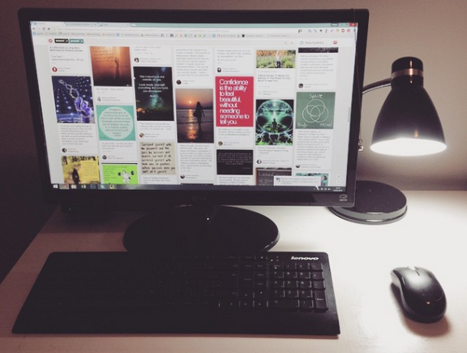
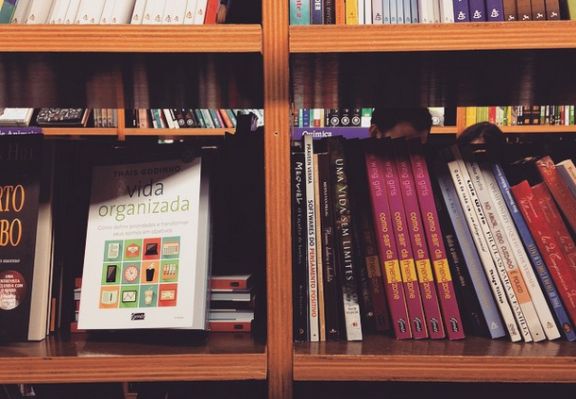

# Eu aprendi sobre: não trabalhar no feriado

Outro dia comentei por aqui sobre os [meus aprendizados nos últimos meses](http://vidaorganizada.com/pessoal/comece/como-eu-me-sinto-depois-de-7-meses-trabalhando-em-casa-como-autonoma/ "Como eu me sinto depois de 7 meses trabalhando em casa como autônoma"), desde que me tornei autônoma e passei a trabalhar em casa. Algo que eu ainda não tinha conseguido trabalhar muito bem, até quando escrevi aquele texto, foi a questão de separar trabalho da vida pessoal. Quando a gente trabalha em casa, não existe a separação física e, quiçá, a mental. no entanto, ultimamente venho entendendo que pode ser necessário fazer essa separação – ter o tempo do trabalho e ter o tempo para a vida pessoal.Estive pesquisando espaços de coworking e outras maneiras de tirar o home do home-office, mas esse é assunto para um outro post, em um futuro breve.

Neste Carnaval, eu fiz a experiência de não trabalhar. Isso incluiu: não escrever para o blog, não trabalhar no meu novo livro, não bolar ideias, não responder (e enviar) e-mails, entre outras atividades. Deu certo? Em partes. Veja neste post o que eu aprendi.

### É fácil quando os outros não trabalham

O que mais me chamou a atenção sobre o fato de ter conseguido parar e descansar nesse feriado foi não ficar preocupada porque outras pessoas poderiam estar esperando alguma resposta minha ou o envio de algum documento ou trabalho. É engraçado porque, quando a gente começa a trabalhar em casa, pensa assim: “oh, que maravilha, vou para a praia de segunda a quarta e trabalho aos finais de semana”. Realmente pode funcionar, porém, eu não sei se funcionaria muito bem comigo nesse momento porque respondo para outras pessoas (clientes, colegas de trabalho, equipe). Não conseguiria ficar tranquilona na praia sabendo que poderia ter alguém trabalhando no horário comercial precisando de mim. Sei que é um pouco de FOMO, mas também é responsabilidade.

Por fim, o que realmente dá aquele click mental de pensar em “eu posso descansar nesse feriado” é o fato de saber que ninguém espera que outra pessoa trabalhe no feriado. Por isso, ninguém acha ruim se você não responder um e-mail ou mensagem. É normal! Pessoas não trabalham em feriados. Logo, mesmo sendo autônoma e tendo toda a flexibilidade de horários do mundo, eu ainda preciso de adequar ao calendário comercial para conseguir fazer as minhas folgas com mais tranquilidade.

E posso dizer? Foi ótimo! Passeei, fiz churrasco, brinquei muito com o Paul, levei minhas sobrinhas para passear, fui à livraria e tirei um maravilhoso cochilo à tarde! Eu sei que posso fazer essas coisas em um dia a dia regular, mas minha mente ainda não se acostumou exatamente com tudo isso! (nem as pessoas ao meu redor!)

Meu livro em destaque na Livraria Cultura nesse final de semana <3

### As ideias não param de chegar

Por mais que eu não estivesse “oficialmente trabalhando”, meu cérebro não sabia disso. É muito difícil para mim, porque amo muito o que eu faço. Logo, pensar sobre trabalho e fazer as coisas acontecerem faz parte de mim, de quem eu sou, da expressão da minha criatividade. Porém, se não cuidar, a tendência a virar workaholic é tremenda. Como lidar com as ideias?

Deixei fluir algumas coisas. Até sábado de manhã, eu precisava colocar no ar o novo formato para o pagamento dos workshops aqui no blog, o que acabou resultando em uma loja. [Dá uma olhada!](http://vidaorganizada.com/loja/ "Loja") Por enquanto, há poucas opções, mas em breve vou povoar aquela seção com muitas coisas legais. Fiquei tão empolgada com esse assunto que trabalhei até de madrugada, na noite de sexta para sábado.

Outra atividade relacionada ao trabalho que eu fiz foi ficar ouvindo alguns *webinars* do [GTD Connect](http://gettingthingsdone.com/), o que me deu a ideia de mudar todo [o meu sistema GTD no Toodledo](http://vidaorganizada.com/ferramentas-metodos/gtd/meu-sistema-gtd/como-estou-organizando-meu-sistema-gtd-atualmente/ "Como estou organizando meu sistema GTD atualmente"). Isso me perturbou um pouco, porque foi uma mudança drástica que eu ainda não me adaptei. Quando estiver à vontade para falar sobre esse novo sistema, publico aqui no blog. Isso me tomou bastante energia e dedicação intelectual durante uns dois dias.

Para lidar com as ideias que vêm e vão, colete! Tire da cabeça e passe para o papel – deixe para lidar com elas quando voltar do feriado. Eu costumo processar minha caixa de entrada física (onde insiro minhas ideias) diariamente mas, para não “trabalhar”, decidi não fazer isso durante o feriado. Ficou bastante coisa para processar depois, mas acho que isso foi um ganho em termos de “ok, agora é hora de descansar. Você coletou a sua ideia incrível e pode lidar com ela quando voltar a trabalhar, na quarta-feira”.

Não trabalhar no feriado foi ótimo e me fez ver que dá para fazer isso com a consciência limpa. Agora quero ver se estendo para outras ocasiões também.
