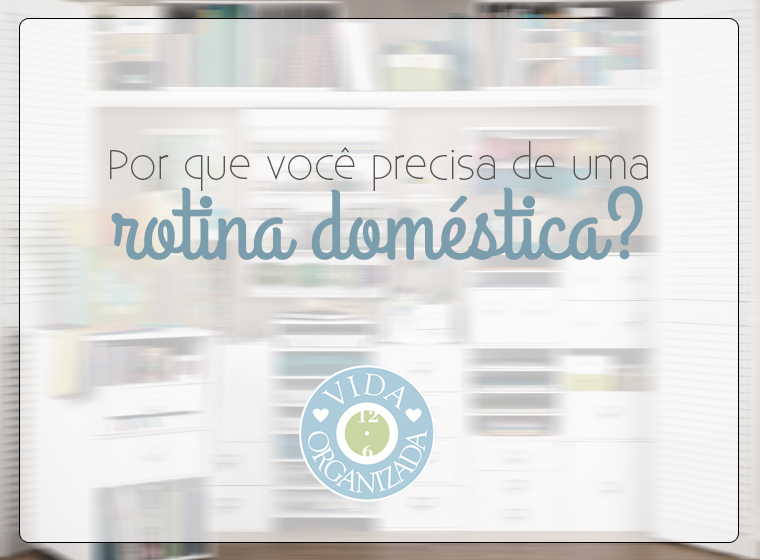

19 *Feb 2015*

## Por que você precisa de uma rotina doméstica?

Recebo muitos comentários de leitores que não conseguem se organizar “porque não têm rotina”. Suas vidas são muito corridas e, com tantas atribuições, um dia pode ser diferente do outro.

Rotina não é horário ou dias pré-estabelecidos, mas sequência. É saber o que tem que ser feito em cada situação. O objetivo de ter rotinas é garantir que tudo o que precisa ser feito seja efetivamente feito, sem você se esquecer de nada, além de dar segurança e sentimento de controle. Rotina não é seguir um cronograma rígido, mas ser flexível e adaptável.

Aqui em casa, eu percebi que minha vida ficaria mais fácil aplicando uma rotina quando nosso filho nasceu. Antes, eu era bastante autônoma com as minhas atividades e ia organizando as coisas “sob demanda”. Quando o Paul nasceu, percebi que, se eu não automatizasse algumas atividades, ficaria maluca tentando fazer “tudo”. Ter algumas rotinas facilitou muito esse processo e a gente conseguiu se organizar, distribuindo atividades e simplificando o máximo possível.

Estabelecer rotinas também me fez ver que eu não precisava de uma faxineira ou empregada doméstica para nos ajudar. Quando estamos no caos, achamos que essa é a saída mais fácil mas, se a gente se organizar, consegue organizar e limpar a casa (e mantê-la assim) trabalhando em equipe (família).

Veja mais alguns motivos que podem te convencer:

- **Ter rotinas deixa tudo mais fácil para você -** Você consegue agrupar tarefas semelhantes em blocos, então não fica perdida no dia a dia correndo para lá e para cá dentro de casa. Você também consegue identificar o que pode ser delegado e ter controle sobre isso.
- **Ter rotinas traz segurança aos seus filhos -** As crianças se sentem seguras com uma rotina, pois sabem o que vem a seguir. Também fica mais fácil de organizar os horários se a sua família tiver uma sequência específica para fazer as coisas acontecerem pela manhã, na chegada da escola e antes de dormir.
- **Ter rotinas faz você economizar tempo e dinheiro -** Quando você tem rotinas estabelecidas, coloca algumas tarefas em piloto automático e tem mais tempo para investir seus pensamentos em coisas mais importantes, como aprender um hobby ou estudar. Além disso, uma rotina bem estabelecida faz com que você economize dinheiro indo na hora certa ao mercado, planejando suas listas, lavando as roupas sem gastar tanta água e por aí vai. Você também não precisará gastar dinheiro com faxineira diarista ou empregada doméstica.
- **Ter rotinas garante que você não esquecerá nada importante -** Quando fazemos as coisas em casa sob demanda, podemos nos esquecer de algo importante que só daremos atenção quando se tornar urgente. Um cano que entope, um ninho de aranhas atrás da estante, uma roupa que você precisaria usar em um evento importante que está suja. Ter rotinas é estar preparado(a) para qualquer situação no seu dia a dia. Isso te caracterizará como uma pessoa organizada.

Caso você queira aprender a organizar sua rotina em casa, estou preparando um workshop que será realizado no dia 14 de março sobre esse tema. [Saiba mais sobre o que será ensinado e faça sua inscrição](http://vidaorganizada.com/loja/workshops/workshop-organize-sua-rotina-domestica/ "Workshop – Organize sua rotina doméstica").

Escrito por [Thais Godinho](http://vidaorganizada.com/sobre/ "Thais Godinho")

em [Comece aqui](http://vidaorganizada.com/categoria/pessoal/comece/ "Comece aqui")

- [0 comentários](http://vidaorganizada.com/pessoal/comece/por-que-voce-precisa-de-uma-rotina-domestica/#comments)
