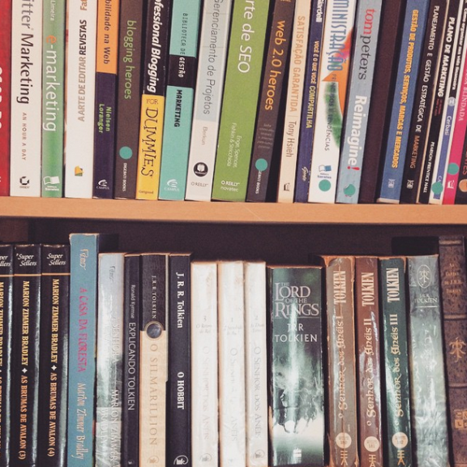
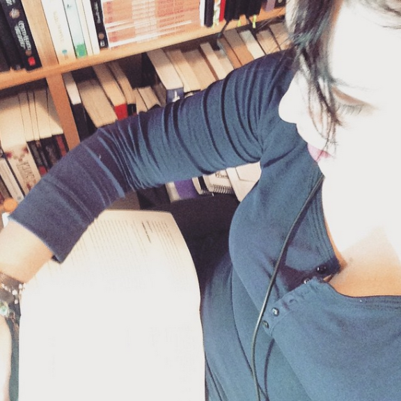
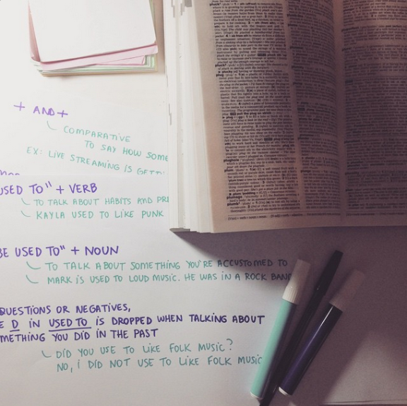
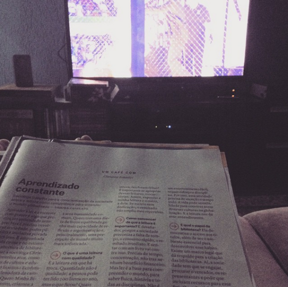

# Universidade pessoal – reflexões de uma pessoa autodidata

Escrevo este post para falar um pouco sobre a minha experiência como pessoa autodidata e o por que das minhas escolhas. Já escrevi aqui no blog uma vez [o que eu entendo pela coisa de estudar a vida inteira](http://vidaorganizada.com/pessoal/comece/estudar-a-vida-inteira-o-que-isso-significa/ "Estudar a vida inteira: o que isso significa?") e amo aquele post… Acho que foi escrito de forma bem apaixonada e reflete bem o meu sentimento com relação a esse assunto. No entanto, sempre que falo sobre estudos ou publico alguma foto no [Instagram](http://instagram.com/blogvidaorganizada) mostrando algum momento de estudo no dia a dia, surgem muitas perguntas como: “Como você consegue estudar com um filho pequeno em casa?” ou “Como você arranja tempo para estudar?”, então este post serve para contar a minha experiência pessoal e também para mostrar algumas dicas que talvez ajudem vocês.

**Trabalhar em casa facilita**. Isso porque consigo gerenciar minhas horas de trabalho de modo que já inclua algum tempo de estudo entre elas. No geral, deixo para fazer atividades que demandem mais concentração enquanto o meu filho está na escola, sejam de trabalho ou de estudo, porque assim consigo me concentrar melhor. Mesmo trabalhando no escritório, dá para ouvir os outros barulhos da casa e, a não ser que eu coloque o fone de ouvido com música tocando em um volume alto, eu não consigo me concentrar.

Também já percebi que **sair de casa ajuda em muitos momentos**. Já fui trabalhar em outros lugares – café, padaria, livraria – porque facilita. É até bom mudar de ares de vez em quando, especialmente para quem trabalha com criatividade, como eu. **Este foi um formato de trabalho que eu construí para mim com o passar dos anos**. Não foi fácil, não foi sempre assim e não é o modelo ideal. Ele ainda está em construção. Porém, já vejo grandes vantagens em fazer como eu faço hoje.

**Quando eu trabalhava fora**, eu aproveitava o meu tempo para estudar de três maneiras: 1) acordava mais cedo que todo mundo e ganhava pelo menos uma hora de estudos, mas odiava fazer isso, porque não gosto de acordar cedo, 2) estudava no meu horário de almoço no trabalho e 3) estudava depois que meu filho ia dormir. A não ser que você esteja estudando para um concurso ou fazendo um curso fora todos os dias, dificilmente alguém precisa de mais horas de estudos do que isso. Para mim, sempre foi suficiente.

**As pessoas me perguntam como eu tenho tempo**, mas bem, acredito que essa seja a principal vantagem de ser organizada! Você consegue priorizar e fazer o dia render. Organizem-se! Essa é a principal vantagem da organização – ter tempo para fazer tudo o que for importante para você. Claro que também entra a questão da motivação e da força de vontade. Não adianta dizer que não tem tempo para estudar mas passar todos os dias vendo tv ou navegando na Internet sem objetivo.

Eu acredito que também faça muita diferença **gostar de ler e estudar**. Tenho hoje em casa uma biblioteca com quase 800 livros (e crescendo) que muitas pessoas vêem e me perguntam: “nossa, mas você lê tudo isso?”. E eu respondo: “quem não leria?”. **Vejo livros como objetos de trabalho**. Tenho livros que leio por hobby, como os livros do Tolkien na foto acima (tenho a edição brasileira, a portuguesa – para comparar a tradução – e a americana, para estudar inglês). Mas a grande maioria dos meus livros é composta por livros de trabalho, que tenham a ver com a minha profissão, o meu trabalho mesmo da vida, desde organização a temas como administração, vendas, internet. São livros de estudo, para ler, reler, estudar capítulos e temas específicos. Quando acho que o livro não tem mais nada para oferecer, dôo para instituições de caridade ou colegas que estejam precisando.

Ou seja, **se ler é um hobby, estudar faz parte da vida**. Você nunca me verá entediada em uma fila de banco porque estarei lendo alguma coisa em vez de escrever bobagens no celular (não que eu não faça isso também… ninguém é de ferro). Mas eu costumo ver muitas pessoas falarem que não têm tempo para ler ou estudar e desperdiçando essas pequenas janelas de tempo do dia a dia com bobagens que nem percebem. Aliás, desculpem pelo termo. Não existe bobagem, quem sou eu para julgar. O que existe é **tempo gasto sem intenção**. Se você dedicou uma hora do seu dia para escrever bobagens no seu Facebook e isso foi algo que você realmente fez de propósito porque queria desestressar, excelente! Mas, se você fez isso porque não tinha nada melhor para fazer com o seu tempo, porque deixou o dia rolar, então foi perda de tempo sim.

Eu me considero uma pessoa autodidata porque **gosto de ter autonomia sobre os meus estudos**. Isso não impede que eu faça cursos e troque ideias com pessoas mas, no geral, o aprendizado é tocado por mim mesma, não um professor, coaching ou orientador. Há alguns anos, tomei a decisão de não fazer mais uma faculdade, porque percebi que preferia gastar o dinheiro da mensalidade com livros novos e cursos esparsos. Já sou formada! Tenho meu diploma, pós-graduação. Não preciso de outra faculdade, apesar de achar maravilhoso emendar um curso no outro. Porém, depois que meu filho nasceu, a realidade mudou. Eu não teria como dedicar todas as noites da minha semana a um curso que eu estava fazendo apenas por hobby, porque é isso que é mesmo. Apesar de tudo o que a gente estuda influenciar no nosso trabalho (pelo menos eu acho), fazer uma nova faculdade apenas para aprender, para mim, é um hobby, porque estudar é um hobby para mim. É diferente de escolher fazer um MBA para dar um up no currículo. Os objetivos são diferentes.

Também pensei o seguinte: **eu gosto de tantos assuntos!** Se for estudar História (minha paixão), vou ter que estudar História do Brasil Colonial, que acho chaaaato. Gosto de Pedagogia mas, se for fazer faculdade de Pedagogia, vou ter que aprender matérias que não me interessam. O mesmo vale para Administração, Artes plásticas, Astronomia, Biologia, Ciências Sociais e todos os outros cursos que já me interessaram.

Por isso, com o tempo eu fui desenvolvendo um negócio que chamei de **“universidade pessoal”**. Eu não preciso fazer uma faculdade para estudar aquele assunto. Posso estudar por mim mesma, com a vantagem de não ter que estudar o que não tem nada a ver comigo.

Para fazer isso, eu seleciono alguns temas que tenho interesse em estudar atualmente e foco neles. Exemplo: vendas. Atualmente, com o blog, os workshops, a loja, eu percebi que me falta know-how desse assunto. Portanto, trata-se de uma disciplina que quero estudar e entra no meu ciclo. Aliás, é através do estudo por ciclos que eu administro a coisa toda ([leia mais sobre o estudo por ciclos aqui](http://vidaorganizada.com/pessoal/comece/organizando-os-estudos-em-ciclos/ "Organizando os estudos em ciclos")).

Outras: inglês, italiano, oratória, crítica literária, empreendedorismo, GTD (sim!), investimentos, andragogia. São assuntos que eu estou estudando agora. **Que faculdade me proporcionaria essa amplitude de temas aleatórios? Como poderia existir um curso perfeito se cada pessoa é de um jeito e tem interesses diferentes?** Então esta sou eu e este é o meu esquema chamado de universidade pessoal, que acredito que todas as pessoas tenham. Quais são as suas disciplinas de estudo no momento? O que você precisa estudar para o trabalho, para a casa, para a sua vida? Aprender a desenhar, jardinagem, web design. **Todos temos interesses. Todos os interesses podem virar objeto de estudo.**

E aí **a forma como você vai estudar varia igualmente**. Para estudar inglês, eu defini qual era o meu objetivo: ficar fluente para estudar fora, tirar uma certificação, trabalhar com pessoas que conversam em inglês. Ou seja, era tudo sobre fluência. Como eu poderia aprender fluência em um idioma sem conversar com ninguém? Não dá. Por isso, me matriculei em um curso online onde estudo tanto fluência quanto pronúncia e gramática. Para treinar a conversação, tenho um amigo que está estudando também e, de vez em quando, marcamos um happy-hour para conversar em inglês. Para alimentar vocabulário, leio artigos em inglês na internet e livros na língua original – como o “Senhor dos Anéis” lá em cima.

Italiano não, já é outra história, como comentei [em um post anterior](http://vidaorganizada.com/rotinas/estudos/idiomas/estudando-um-idioma-sem-pressa-como-se-organizar/ "Estudando um idioma sem pressa – como se organizar"). Estou na fase do aprendizado, estudando gramática, tirando dúvidas com a minha avó (que é fluente), ouvindo músicas para me acostumar com a pronúncia. Oratória: pesquisei quais os melhores livros no mercado e estou lendo. Uso os treinamentos de GTD e os [meus workshops](http://vidaorganizada.com/loja/workshops/ "Workshops") como laboratório para implementar e treinar o que estou estudando. Treino na frente do espelho, recebo orientação de uma profissional sobre voz e pronúncia, gravo vídeos, faço testes. **Cada disciplina demanda recursos de aprendizado diferentes**. E eu adoro isso! Posso me entendiar muito facilmente e, com esse esquema, consigo exercer minha criatividade até mesmo estudando.

Sobre o **local físico para estudar**, não preciso de nada mais sofisticado que uma cadeira, mesa e silêncio. Tenho um escritório em casa com porta que tranca e abafa a maioria dos ruídos, o que já ajuda muito, mas é uma necessidade de trabalho que, por sorte, ajuda com os estudos também. Se não fosse no escritório, faria o mesmo no meu quarto, quando precisasse estudar. E mais uma vez, vale lembrar: sair de casa e ir para outro lugar. Tem gente que estuda em biblioteca, por exemplo. Nunca fui, mas acho uma excelente opção. Quando estou sozinha em casa, sento no sofá para ler, porque é mais confortável. Enfim, depende muito.

O que algumas leitoras me perguntaram no Instagram é **como eu faço para estudar tendo um filho pequeno**. Eu não consigo entender muito bem o problema porque aqui em casa fazemos todo o trabalho em equipe e sempre educamos nosso filho dentro de uma rotina, com disciplina para horários de dormir etc. E olha que nem sou tão rígida – apenas temos algumas orientações que seguimos para dar segurança ao filhote mesmo. Quando ele era bebezinho, de acordar de madrugada para mamar, eu aproveitava quando estava acordada para ler uma coisa ou outra, mas de maneira bem informal. Fui voltando a ter uma vida “normal” só depois que ele já tinha uns seis meses e dormia a noite inteira. E claro que ele só dormiu a noite inteira com essa idade porque tínhamos uma rotina que supria suas necessidades, não o deixava agitado. Não acontece do nada.

Mesmo depois, com ele crescendo mais, o tempo de qualidade que ele passava com o pai dele, eu aproveitava para fazer as minhas coisas. Desde estudar até assistir algum filme que só eu gosto e meu marido não, ou sair com as minhas amigas. Quando eu trabalhava fora, aproveitava todo meu tempo livre com ele e ia estudar depois que ele dormia. Hoje em dia, que trabalho em casa e ele frequenta a escola durante meio período, é o tempo que eu aproveito para fazer as atividades que demandam mais concentração, como eu falei acima. Não tem segredo, de verdade. É questão de organização da rotina e de adequar os horários. É claro que uma família sem rotina e sem força de vontade não vai conseguir o mesmo efeito, porque **nada “acontece” – nós fazemos acontecer!** Tem que ter força de vontade, motivação e um pouco de disciplina. E quando digo “um pouco”, é um pouco mesmo! Não é para ser rígido – somos uma família, não um batalhão do exército.

Tem muito também da questão de **saber aproveitar o tempo da melhor maneira possível**. Eu leio muitas revistas porque trabalho com conteúdo, então a inspiração vem de todo lugar. Leio revistas que tragam matérias sobre produtividade, organização, simplicidade, psicologia, literatura – enfim, o que tiver a ver com o meu trabalho e os meus estudos. Como administrar tudo isso? Bem, eu costumo deixar a revista na minha pasta de trabalho (tenho uma pasta executiva que uso para trabalhar quando saio de casa) e ler na condução, esperando o almoço, o ônibus, na fila do banco. Quando falta pouco para acabar a revista, destaco as matérias que ainda quero ler e levo somente essas comigo, em vez de levar a revista inteira. Tenho uma pastinha dentro da minha pasta que se chama “read / review” (a “ler / revisar” do David Allen), onde coloco todo esse material. Ao longo do dia, vou lendo e despachando. Outro dia mesmo, estava acompanhando o desfile das escolas de samba no Carnaval, e aproveitei para ler algumas reportagens, como na foto acima. É assim que eu aproveito meu tempo.

Quem está lendo este post pode pensar: “credo, ela só estuda! tem que ter um equilíbrio!”. Claro, gente. **Eu não só estudo não. Eu trabalho, cuido do meu filho, limpo a casa, faço minhas atividades rotineiras e de hobbies que gosto. Mas, quando a gente aprende a se organizar, o tempo rende.** E é aquilo que eu falei da intenção: executar com significado. É ok ficar uma hora inteirinha com as pernas para cima, descansando, se aquilo foi uma escolha sua porque você realmente quer e precisa descansar. Outra coisa totalmente diferente é você fazer isso sendo que tem um monte de coisas mais importantes para fazer. Às vezes, descansar é o mais importante mesmo. É disso que se trata a organização: definir o que é importante – o que é prioridade! Sem fazer isso, nunca haverá tempo não só para estudar, mas para fazer qualquer outra coisa.

Algumas dicas finais que podem ajudar:

- Defina um orçamento mensal para comprar livros. Eu faço isso porque, senão, eu gasto muito mesmo. Algumas pessoas podem precisar fazer porque, senão, não compram nenhum, se esquecem etc.
- Leve sempre algum material de estudo com você, seja onde for. Nunca sabemos quando vai aparecer um tempinho e ficar esperando sem fazer nada é meio inadmissível, sabe. A gente se estressa, o tempo demora mais para passar e desperdiçamos minutos preciosos.
- Planeje sua semana ([aprenda sobre o GTD, vai ajudar muito](http://vidaorganizada.com/ferramentas-metodos/gtd/o-que-e-gtd/gtd-getting-things-done-ou-a-melhor-metodologia-de-produtividade-que-existe/ "GTD (Getting Things Done) – ou a melhor metodologia de produtividade que existe")), distribuindo suas atividades nas 168 horas que cada uma contém.

Bons estudos!
