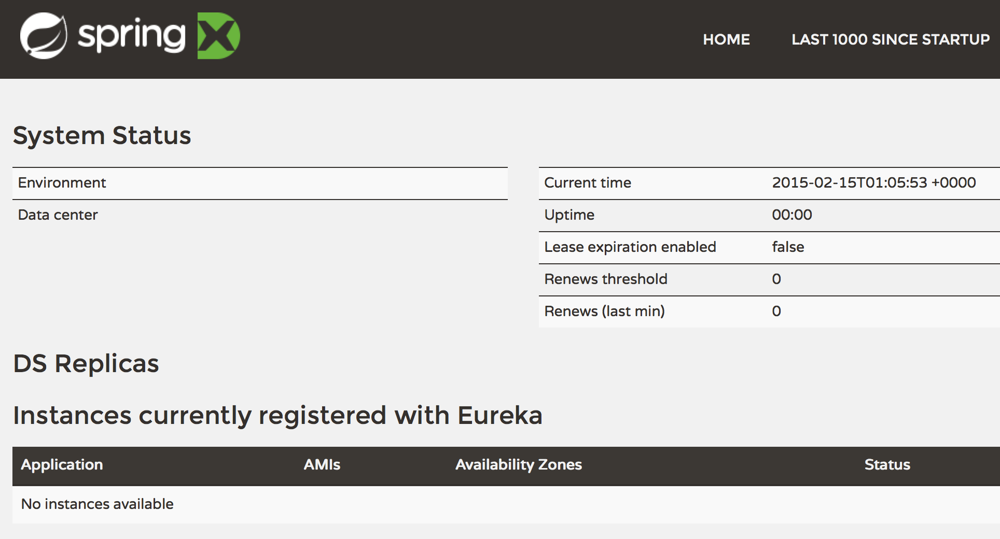
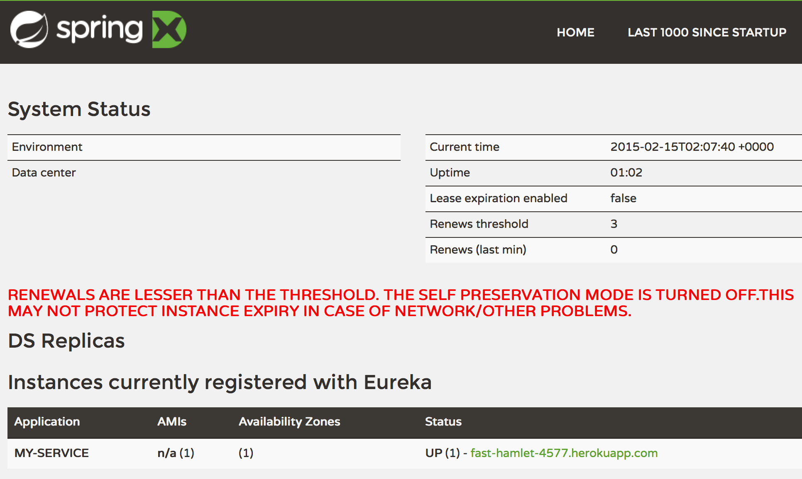
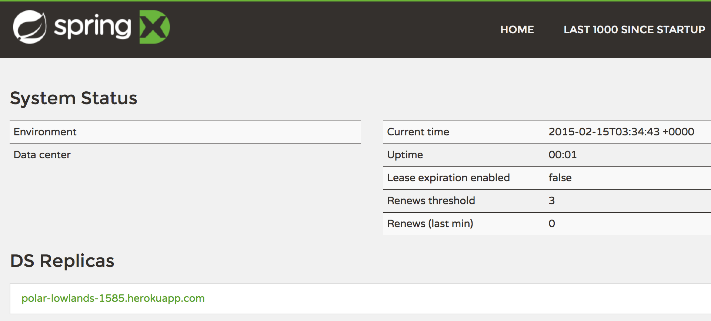

# [Managing your Microservices on Heroku with Netflix's Eureka](https://blog.heroku.com/archives/2015/3/3/managing_your_microservices_on_heroku_with_netflix_s_eureka)

## Posted 6 days ago by Joe

Over the past few years, [Netflix has open sourced](https://netflix.github.io/) many of the components that make up its [production platform](http://techblog.netflix.com/). These include [Eureka](https://github.com/Netflix/eureka) for service discovery, [Hystrix](https://github.com/Netflix/Hystrix) for handling service failure, [Ribbon](https://github.com/Netflix/ribbon) for client side load balancing, and many others.

These projects are powerful, mature, and benefit from Netflix’s many years of experience [deploying service-oriented applications in the cloud](http://aws.amazon.com/solutions/case-studies/netflix/). Adding credence to this, [IBM](https://gigaom.com/2013/07/21/ibm-high-fives-netflix-open-source-tools/), Yelp, Hotels.com and [many others](https://netflix.github.io/#powered) have adopted these technologies for their own systems. And there’s nothing stopping you from building them into your applications, too.

Well, nothing except that many of the Netflix projects have a high barrier to entry because they're geared toward deployment on Amazon's EC2 platform and require a great deal of configuration and management in their raw form. But [thanks to the Spring Framework](http://cloud.spring.io/spring-cloud-netflix/), it's easy to deploy Netflix OSS on Heroku while adhering to the principles of the [Twelve Factor app](http://12factor.net/) and benefiting from Heroku’s first-class developer experience.

In this article, you'll learn how to deploy Netflix's Eureka server to Heroku and connect your own microservice clients to it.

## [Introducing Microservices](https://blog.heroku.com/archives/2015/3/3/managing_your_microservices_on_heroku_with_netflix_s_eureka#introducing-microservices)

The Netflix projects are centered around the concept of microservices, which describe a strategy for decomposing a large project into smaller, more manageable pieces. Although decomposing big projects into smaller pieces is an age-old process, the recent microservices movement captures a number of best practices about how to do it well. For more discussion on microservices, see our recent blog post on [Why Microservices Matter](https://blog.heroku.com/archives/2015/1/20/why_microservices_matter).

One of the problems introduced by microservices is the large volume of services that must invoke other services in the system. Each of these services must know where to find the services it consumes, and attempting to manage the resulting configuration manually is intractable. To solve this problem Netflix created the Eureka server.

A Eureka server is a service registry. It's like a phone book for your microservices. Each microservice registers itself with Eureka, and then consumers of that service will know how to find it. This is similar in spirit to a [DNS service](https://github.com/Netflix/eureka/wiki/Eureka-at-a-glance#how-different-is-eureka-from-route-53) but with additional features such as host-side load-balancing and region-isolation. Eureka also keeps track of health, availability and other metadata about the service. That makes it an ideal place to start when building your own microservices architecture.

## [Creating the Eureka server](https://blog.heroku.com/archives/2015/3/3/managing_your_microservices_on_heroku_with_netflix_s_eureka#creating-the-eureka-server)

To begin, clone the [Heroku Eureka server demo](https://github.com/kissaten/heroku-eureka-server-demo) project, and move into it's root directory like so:

```
$ git clone https://github.com/kissaten/heroku-eureka-server-demo.git
$ cd heroku-eureka-server-demo/
```

Next, [create a Heroku account](http://dashboard.heroku.com/), then [download and install the Heroku toolbelt](https://toolbelt.heroku.com/).

With the toolbelt installed, create a Heroku application by running this command:

```
$ heroku create
Creating fast-beach-5250... done, stack is cedar-14
https://fast-beach-5250.herokuapp.com/ | https://git.heroku.com/fast-beach-5250.git
Git remote heroku added
```

Next, create a configuration variable to define the default user's password.
Run this command, but substitute a unique password for `<PASSWORD>`:

```
$ heroku config:set EUREKA_USER_PASSWORD=<PASSWORD>
```

Now you're ready to deploy. There are two methods you can choose from: Git deployment and
[Maven deployment](https://blog.heroku.com/archives/2015/3/3/articles/deploying-java-applications-with-the-heroku-maven-plugin).
In this article, we'll use Git deployment, which compiles the application remotely. To deploy, run this command:

```
$ git push heroku master
```

Your code will be pushed to the remote Git repository, and the Maven process
will execute on the Heroku servers. When it's finished, you can view your server by running this command:

```
$ heroku open
```

The site will request a username and password. Enter "user" and the password you set for the `EUREKA_USER_PASSWORD` config variable. After you are logged in you will see the Eureka dashboard.



It indicates that no instances are currently registered.

## [Creating a Eureka client](https://blog.heroku.com/archives/2015/3/3/managing_your_microservices_on_heroku_with_netflix_s_eureka#creating-a-eureka-client)

A Eureka client is a service that registers itself with the Eureka server. A client typically provides meta-data about itself such as host and port, health indicator URL, and home page. It will also send heartbeat messages from each instance belonging to the service. If the heartbeat fails over a configurable timetable, the instance will be removed from the registry.

To create your first Eureka client, clone the [Eureka client demo](https://github.com/kissaten/heroku-eureka-client-demo) repo and move into it's root directory by running these command:

```
$ git clone https://github.com/kissaten/heroku-eureka-client-demo.git
$ cd heroku-eureka-client-demo/
```

Then create a Heroku application for the client by running this command:

```
$ heroku create
Creating fast-beach-5250... done, stack is cedar-14
https://fast-beach-5250.herokuapp.com/ | https://git.heroku.com/fast-beach-5250.git
Git remote heroku added
```

Next, create a configuration variable to define the URL of the Eureka server you created in the previous section. Run the following command, but substitute `<URL>` with the URL and credentials for the server in the form `https://user:password@<appname>.herokuapp.com`:

```
$ heroku config:set EUREKA_URL=<URL>
```

You'll also need to create a configuration variable for the domain name of your service -- this represents the domain name used by other components to consume your service. As long as you are using the defaults, it should will be in the form `<appname>.herokuapp.com`. You can set it by running this command (but replace `<appname>` with the app name of the client):

```
$ heroku config:set DOMAIN_NAME="<appname>.herokuapp.com"
```

Now you can deploy. This article will use Git deployment again, but you may also use Maven deployment. Run the following command:

```
$ git push heroku master
```

After the build process finishes, you can view the application in a browser by running `heroku open` to confirm that it is running. Then view the logs by running the following command.

```
$ heroku logs -t
```

After the application has been running for about 30 seconds, you'll see something like this:

```
com.netflix.discovery.DiscoveryClient : DiscoveryClient_MY-SERVICE/fast-hamlet-4577.herokuapp.com: registering service...
com.netflix.discovery.DiscoveryClient : DiscoveryClient_MY-SERVICE/fast-hamlet-4577.herokuapp.com - registration status: 204
com.netflix.discovery.DiscoveryClient : The response status is 200
```

This indicates that the client has registered with the Eureka server. You can confirm this result by refreshing the Eureka server dashboard. In the section titled "Instances currently registered with Eureka", you will see the `MY-SERVICE` instance.



It's also possible to connect non-Spring clients by using [Netflix's Eureka Client](https://github.com/Netflix/eureka/tree/master/eureka-client) in it's raw form. Projects like Netflix's [atlas](https://github.com/Netflix/atlas) and [iep](https://github.com/Netflix/iep) provide examples of using the client from Scala.

## [Creating replica Eureka server instances](https://blog.heroku.com/archives/2015/3/3/managing_your_microservices_on_heroku_with_netflix_s_eureka#creating-replica-eureka-server-instances)

The Eureka server does not have a persistent backing store. The registry is kept in memory because the service instances have to send heartbeats to keep their registrations up to date -- making it naturally resilient. Clients also have an in-memory cache of registrations, which keeps network traffic to a minimum, but also allows the system to continue working even if there is a failure or momentary outage for the Eureka server.

Nonetheless, Eureka is a key part of a microservices architecture and redundancy is still important. That's why Eureka can be configured to register and replicate with other peer instances of the server. Netflix recommends running each Eureka server instance in a different availability zone, but for this article we'll go one step further and demonstrate how to run each server in different *regions*.

First, return to the root directory of your Eureka server source code. Then open the `src/main/resources/application.yml` file and add the following code to the end of it:

```
---
spring:
  profiles: peer
eureka:
  instance:
    hostname: ${APP_NAME}.herokuapp.com
  client:
    registerWithEureka: true
    fetchRegistry: true
    serviceUrl:
      defaultZone: ${EUREKA_PEER_URL}/eureka/
```

This enables replication by defining a new [Spring profile](http://docs.spring.io/spring-boot/docs/current/reference/html/boot-features-profiles.html) called peer. To use this profile you must modify the application's `Procfile` by adding the option `--spring.profiles.active=peer` to the end of the `web` command. The complete `Procfile` should look like this:

```
web: java $JAVA_OPTS -Dserver.port=$PORT -jar target/eureka-server-demo-*.jar --spring.profiles.active=peer
```

Save both files and commit the changes to Git by running these commands:

```
$ git add Procfile src/main/resources/application.yml
$ git commit -m "Added peer profile for replication"
```

Now create a new Heroku application in the EU region by running this command (or you can use `--region us` if your initial application was created in the EU region):

```
$ heroku create --region eu --remote heroku-eu
Creating polar-lowlands-1585... done, stack is cedar-14
https://polar-lowlands-1585.herokuapp.com/ | https://git.heroku.com/polar-lowlands-1585.git
Git remote heroku-eu added
```

Before deploying to the new application, you must set a few config variables on both of your Eureka server applications. Run these commands and substitute the appropriate values accordingly:

```
$ heroku config:set APP_NAME="<appname>" -a <appname>
$ heroku config:set APP_NAME="<appname-eu>" -a <appname-eu>
$ heroku config:set EUREKA_USER_PASSWORD="<PASSWORD>" -a <appname-eu>
$ heroku config:set EUREKA_PEER_URL="https://user:<PASSWORD>@<appname>.herokuapp.com" -a <appname-eu>
$ heroku config:set EUREKA_PEER_URL="https://user:<PASSWORD>@<appname-eu>.herokuapp.com" -a <appname>
```

Note that you are setting the `EUREKA_PEER_URL` on each app with the URL and credentials of the other app.

Now you can deploy. Run these commands, one after the other:

```
$ git push heroku master
$ git push heroku-eu master
```

After both deployments have completed, check the dashboard for each app. In the "DS Replicas" section you will see the opposing app listed. After a few moments, you will also see it listed under "available-replicas" in the "General Info" section (this means it has connected successfully).



Now you can stand up additional replica nodes as necessary.

## [Beyond service discovery](https://blog.heroku.com/archives/2015/3/3/managing_your_microservices_on_heroku_with_netflix_s_eureka#beyond-service-discovery)

Now that you can register and discover services, you're ready to add more of the Netflix components. Spring Cloud has convenient implementations of:

- [Hysterix Clients](http://projects.spring.io/spring-cloud/spring-cloud.html#_circuit_breaker_hystrix_clients): implements a [circuit breaker pattern](http://martinfowler.com/bliki/CircuitBreaker.html).
- [Hysterix Dashboard](http://projects.spring.io/spring-cloud/spring-cloud.html#_circuit_breaker_hystrix_dashboard): displays the health of each circuit breaker.
- [Ribbon](http://projects.spring.io/spring-cloud/spring-cloud.html#spring-cloud-ribbon): a client side load balancer.
- [Feign](http://projects.spring.io/spring-cloud/spring-cloud.html#spring-cloud-feign): a declarative web service client.

The result is a powerful, production ready, microservices architecture with very little operational cost.

## [Further reading](https://blog.heroku.com/archives/2015/3/3/managing_your_microservices_on_heroku_with_netflix_s_eureka#further-reading)

For more information on Netflix open source software, see the [Netflix OSS Homepage](https://netflix.github.io/). For more information on Spring Cloud, see the [Spring Cloud documentation](http://projects.spring.io/spring-cloud/). For further discussion on microservice architectures, see the recent post [Why Microservices Matter](https://blog.heroku.com/archives/2015/1/20/why_microservices_matter) on the Heroku blog.
