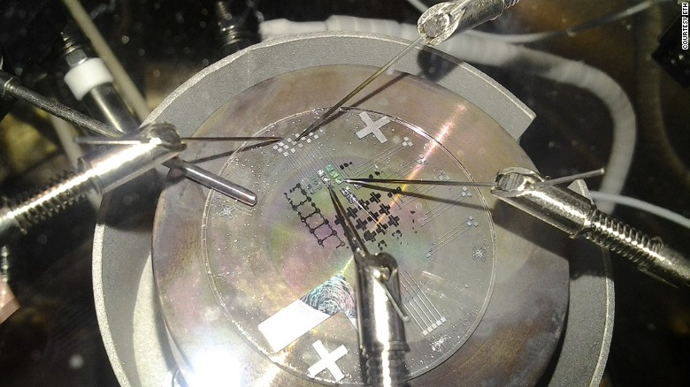
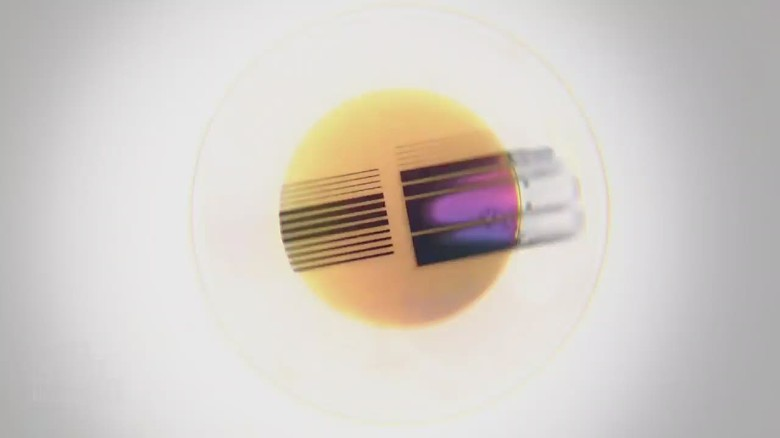

# So long, transistor: How the 'memristor' could revolutionize electronics

Updated 1205 GMT (2005 HKT) March 2, 2015

9 photos

Researchers at ETH in Zurich are working with IBM to create a memristor computer within two years.

9 photos

Memristor chips could one day be integrated in windows, textiles or even coffee cups.

9 photos

Lower power consumption, with a faster speed, and with a higher volume density of information are among the advantages of the technology.

9 photos

The technology could lead to computers that operate in a way reminiscent of the synapses in our brains.

9 photos

A wafer of traditional computer chips containing transistors.

9 photos

Memristors were conceptualized in 1971 but the first one was only built 37 years later, in 2008.

9 photos

A scanning electron microscope view of memristors.

9 photos

Unlike transistors, memristors don't require a silicon layer and therefore don't suffer from the limitations of current microchip manufacturing technology.

9 photos

On top of a flow of electrons, like transistors, memristors also use ions to store data.

9 photos

Researchers at ETH in Zurich are working with IBM to create a memristor computer within two years.

9 photos

Memristor chips could one day be integrated in windows, textiles or even coffee cups.

9 photos

Lower power consumption, with a faster speed, and with a higher volume density of information are among the advantages of the technology.

9 photos

The technology could lead to computers that operate in a way reminiscent of the synapses in our brains.

9 photos

A wafer of traditional computer chips containing transistors.

9 photos

Memristors were conceptualized in 1971 but the first one was only built 37 years later, in 2008.

9 photos

A scanning electron microscope view of memristors.

9 photos

Unlike transistors, memristors don't require a silicon layer and therefore don't suffer from the limitations of current microchip manufacturing technology.

9 photos

On top of a flow of electrons, like transistors, memristors also use ions to store data.

9 photos

Researchers at ETH in Zurich are working with IBM to create a memristor computer within two years.

(CNN)In 1971, a physicist conceptualized the existence of a fourth fundamental element in the electronic circuit, besides the three that were already in use at the time.

His name was Leon Chua and he believed -- for reasons of symmetry -- that an extra component could one day be constructed to join the resistor, the capacitor and the inductor.

He called it "memristor", a portmanteau of the words memory and resistor.

It took 37 years for our engineering abilities to catch up with that idea: the first memristor was built by Hewlett Packard in 2008.

And today, many researchers believe it could spark a revolution in computing.

## Just Watched

### The component that will change the world of electronics

The component that will change the world of electronics 03:39

### From electrons to ions

Simply put, the memristor could mean the end of electronics as we know it and the beginning of a new era called "ionics".

The transistor, developed in 1947, is the main component of computer chips. It functions using a flow of electrons, whereas the memristor couples the electrons with ions, or electrically charged atoms.

In a transistor, once the flow of electrons is interrupted by, say, cutting the power, all information is lost. But a memristor can remember the amount of charge that was flowing through it, and much like a memory stick it will retain the data even when the power is turned off.

This can pave the way for computers that will instantly turn on and off like a light bulb and never lose data: the RAM, or memory, will no longer be erased when the machine is turned off, without the need to save anything to hard drives as with current technology.

But memristors have another fundamental difference compared with transistors: they can escape the boundaries of binary code.

### Like a brain

Initially, the technology will be mostly used to create super-fast memory chips that contain more data and consume less energy. This alone would make regular computers much more powerful, but down the line, the memristor could also take on the processing.

Jennifer Rupp is a Professor of electrochemical materials at [ETH Zurich](https://www.ethz.ch/en.html), and she's working with IBM to build a memristor-based machine.

Memristors, she points out, function in a way that is similar to a human brain: "Unlike a transistor, which is based on binary codes, a memristor can have multi-levels. You could have several states, let's say zero, one half, one quarter, one third, and so on, and that gives us a very powerful new perspective on how our computers may develop in the future," she told CNN's Nick Glass.

Such a shift in computing methodology would allow us to create "smart" computers that operate in a way reminiscent of the synapses in our brains.

Free from the limitations of the 0s and 1s, these more powerful computers would be able to learn and make decisions, ultimately getting us one step closer to creating human-like artificial intelligence.

### So long, and thanks for all the code

Transistors are based on silicon, a rigid material whose properties are used to manage the flow of electrons, and thus information.

In 1975, Gordon Moore, the co-founder of Intel, formulated [a famous law](http://en.wikipedia.org/wiki/Moore%27s_law) which states that the number of transistors in an electronic circuit doubles approximately every two years.

This has so far proven accurate and set the pace for the constant increase in computing power, but the trend might soon come to an end.

There is a physical limit to the number of transistors that we can pack on a chip, and we are already approaching the miniaturization threshold of this technology. It is inevitable that, one day, we will need to move away from silicon based computing.

The memristor technology is a candidate for this crucial step: "It could mean the end of the silicon era, giving us lower power consumption, the ability to compute more information, increased data storage and completely new logic patterns for our computers," says Rupp.

Memristors don't require a silicon layer and different materials can be used as a substrate. This could create a new class of microchips, that could eventually be integrated in everyday items such as windows, clothes or even coffee cups.

### The race is on

After manufacturing the first ever memristor, Hewlett Packard has been working for years on a new type of computer based on the technology. According to plans, it will launch by 2020.

Simply called "The Machine", it uses "electrons for processing, photons for communication, and ions for storage."

"I think there is a race going on," says Rupp. "There is a strong driving force, but at the same time it's very important that there are players like HP, because they want to get to the market, show everyone that this is real."

At the moment, manufacturing costs are still high, but the benefits are worth it: "Memristors operate at a lower power consumption, with a faster speed, and with a higher volume density of information than anything we have based on silicon microchip transistors," Rupp told CNN.

Much like a particle in the realm of physics, the existence of the memristor was theorized long before we could actually build one.

Now that we have that capability to manufacture it, the "missing fourth element" of electronics -- despite its less than catchy name -- might be the key to many further human discoveries.

*Read more from Make, Create, Innovate:*

[Behold the 'Internet of Sheep'](http://www.cnn.com/2015/02/19/tech/mci-internet-of-sheep/index.html)

[Will you soon be able to 'swallow the doctor'?](http://edition.cnn.com/2015/01/29/tech/mci-nanobots-eth/index.html)

[Meet the world's first 1,000 mph car](http://www.cnn.com/2014/12/04/tech/innovation/make-create-innovate-bloodhound-supersonic-car/index.html)
