# 20 Gatos que precisam da sua atenção no exato momento em que você começa a ler

Nathalia Henderson, no [Tudo Interessante](http://www.tudointeressante.com.br/2015/03/20-gatos-que-precisam-da-sua-atencao-no-exato-momento-em-que-voce-comeca-a-ler.html)

Gatos são animais lindos, charmosos e super carinhosos. Eles adoram carinho e a companhia das pessoas da casa, e não dispensam um pouco de atenção (pelo menos alguns deles).

Mas os gatos abaixo precisaram de atenção justamente em um momento bem impróprio: Exatamente quando os seus donos começaram a ler. Eles usaram todo o seu charme e fofura para que seus donos parassem de ler e ficassem mais próximos a eles.

**1 – “Você pode me dar um pouco de atenção ou é pedir demais?”**

[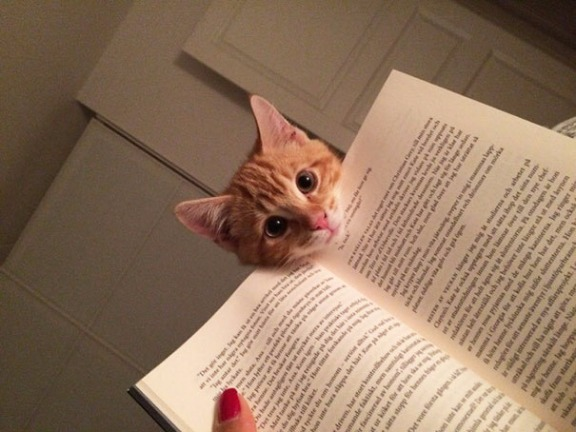](http://www.livrosepessoas.com/wp-content/uploads/2015/03/gatos-atrapalhando-leitura-1.jpg)

  
**2 – “Me deixe aqui quietinho, nem estou atrapalhando tanto assim”**

[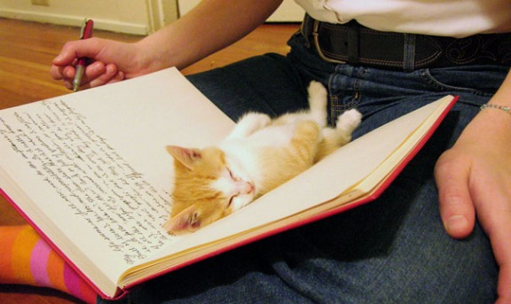](http://www.livrosepessoas.com/wp-content/uploads/2015/03/gatos-atrapalhando-leitura-2.jpg)

  
**3 – “Pode tentar estudar quantas vezes você quiser. Eu não vou deixar!”**

[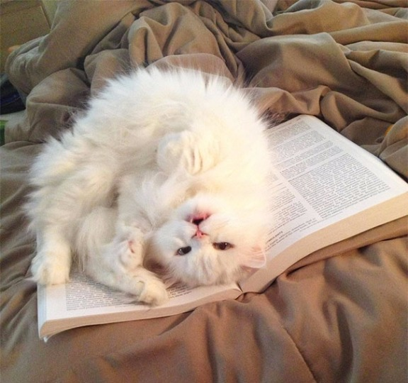](http://www.livrosepessoas.com/wp-content/uploads/2015/03/gatos-atrapalhando-leitura-3.jpg)

  
**4 – “Será que a sua vontade de ler é maior do que me apertar?”**

[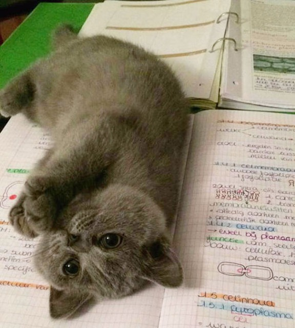](http://www.livrosepessoas.com/wp-content/uploads/2015/03/gatos-atrapalhando-leitura-4.jpg)

  
**5 – Quem resiste a isso? \*-\***

[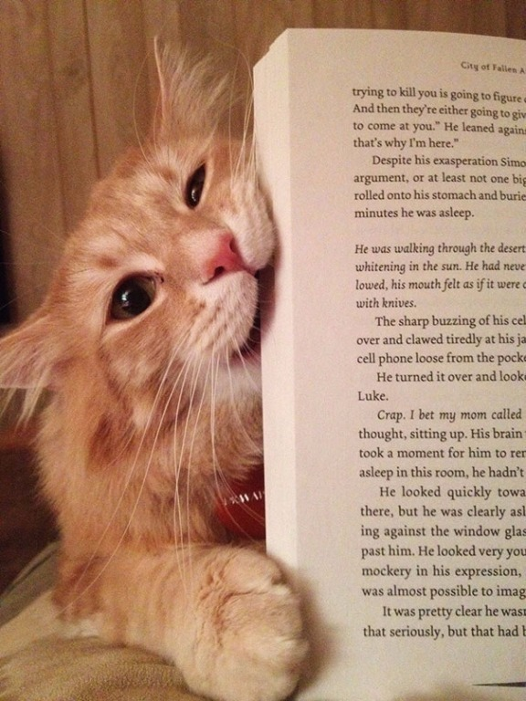](http://www.livrosepessoas.com/wp-content/uploads/2015/03/gatos-atrapalhando-leitura-5.jpg)

  
**6 – Ops…alguém passou por aqui**

[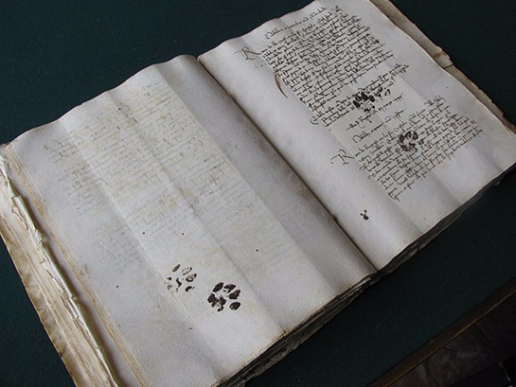](http://www.livrosepessoas.com/wp-content/uploads/2015/03/gatos-atrapalhando-leitura-6.jpg)

  
**7 – oO**

[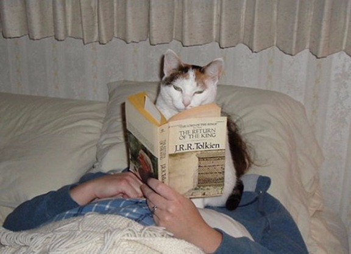](http://www.livrosepessoas.com/wp-content/uploads/2015/03/gatos-atrapalhando-leitura-7.jpg)

  
**8 – “Não trisque nas minhas páginas”**

[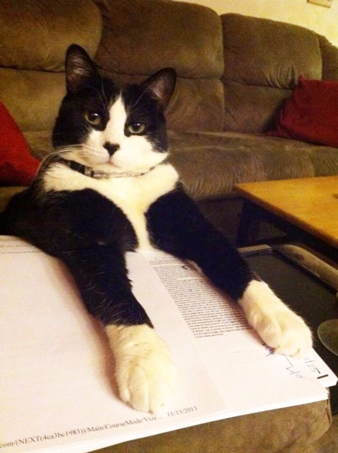](http://www.livrosepessoas.com/wp-content/uploads/2015/03/gatos-atrapalhando-leitura-8.jpg)

  
**9 – “Ei! pare já com isso e me dê atenção”**

[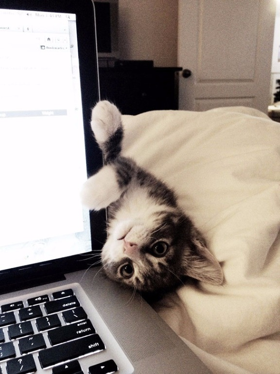](http://www.livrosepessoas.com/wp-content/uploads/2015/03/gatos-atrapalhando-leitura-9.jpg)

  
**10 – Vale até morder**

[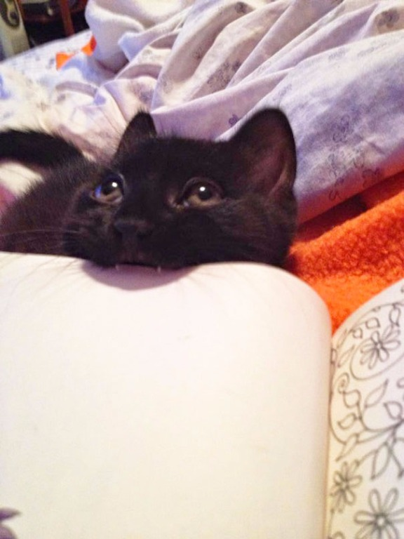](http://www.livrosepessoas.com/wp-content/uploads/2015/03/gatos-atrapalhando-leitura-10.jpg)

  
**11 – “Eu sou muito mais interessante do que esse jornal!”**

[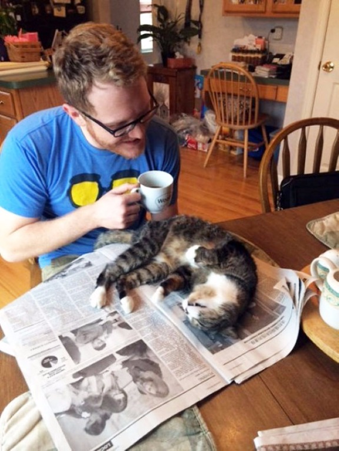](http://www.livrosepessoas.com/wp-content/uploads/2015/03/gatos-atrapalhando-leitura-11.jpg)

  
**12 – Ler é mais divertido com uma patinha**

[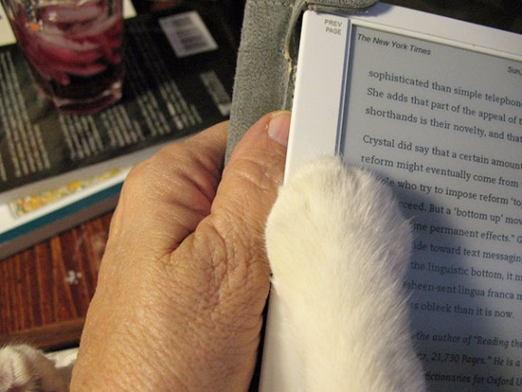](http://www.livrosepessoas.com/wp-content/uploads/2015/03/gatos-atrapalhando-leitura-12.jpg)

  
**13 – “Chega de leituras por hoje. Quem manda aqui sou eu”**

[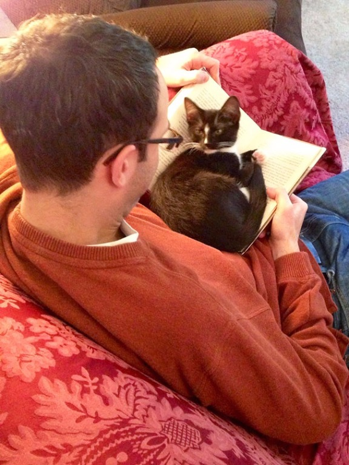](http://www.livrosepessoas.com/wp-content/uploads/2015/03/gatos-atrapalhando-leitura-13.jpg)

  
**14 – “Não me importo de amassar todo o seu jornal, que você note a minha presença”**

[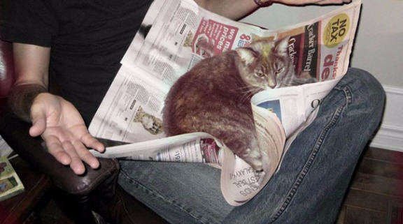](http://www.livrosepessoas.com/wp-content/uploads/2015/03/gatos-atrapalhando-leitura-14.jpg)

  
**15 – “Ei, me deixa ler um pouquinho também!”**

[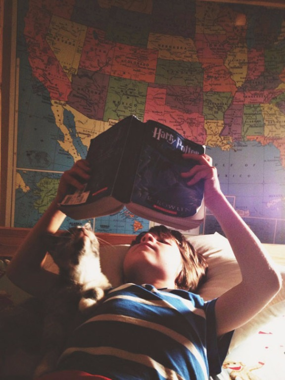](http://www.livrosepessoas.com/wp-content/uploads/2015/03/gatos-atrapalhando-leitura-15.jpg)

  
**16 – Esse fofo só queria ser notado**

[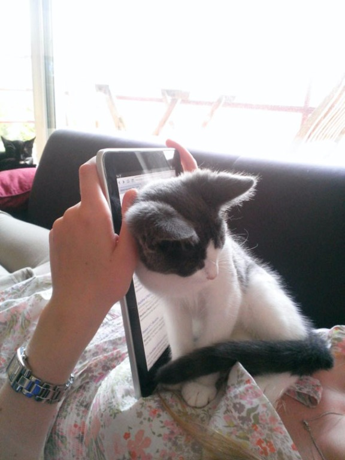](http://www.livrosepessoas.com/wp-content/uploads/2015/03/gatos-atrapalhando-leitura-16.jpg)

  
**17 – “Feche logo esse livro, tô carente”**

[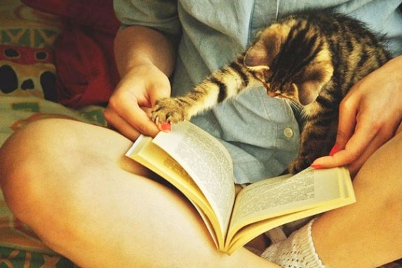](http://www.livrosepessoas.com/wp-content/uploads/2015/03/gatos-atrapalhando-leitura-17.jpg)

  
**18 – “Por que você tem que estudar? Me dar carinho é bem mais interessante”**

[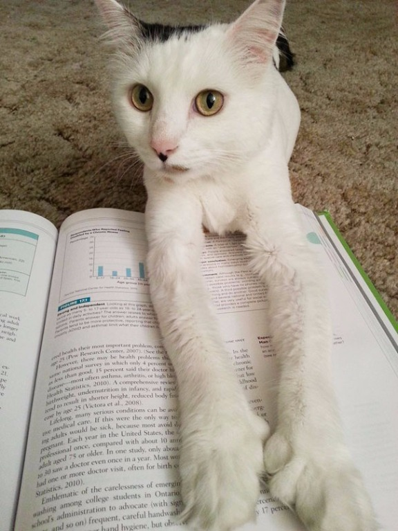](http://www.livrosepessoas.com/wp-content/uploads/2015/03/gatos-atrapalhando-leitura-18.jpg)

  
**19 – “Ei, olha como eu sou lindo \*-\*”**

[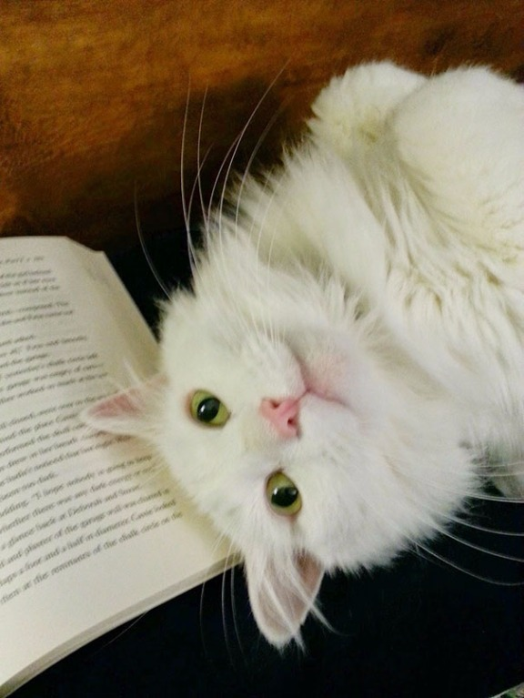](http://www.livrosepessoas.com/wp-content/uploads/2015/03/gatos-atrapalhando-leitura-19.jpg)

  
**20 – “Esqueça seu trabalho no computador. Eu sou a coisa mais importante para você”**

[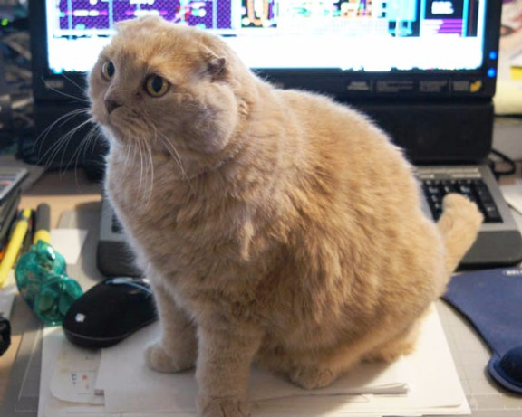](http://www.livrosepessoas.com/wp-content/uploads/2015/03/gatos-atrapalhando-leitura-20.jpg)

  
**Bônus do Livros e Pessoas:**

Esse é o Rodrigo cheio de carência querendo um cafuné =D

[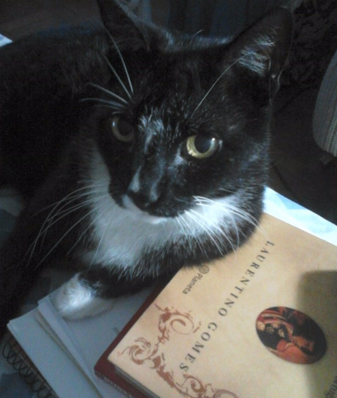](http://www.livrosepessoas.com/wp-content/uploads/2015/03/DSC_01681.jpg)

E esse é o Zarco. Quem consegue estudar assim? =)

[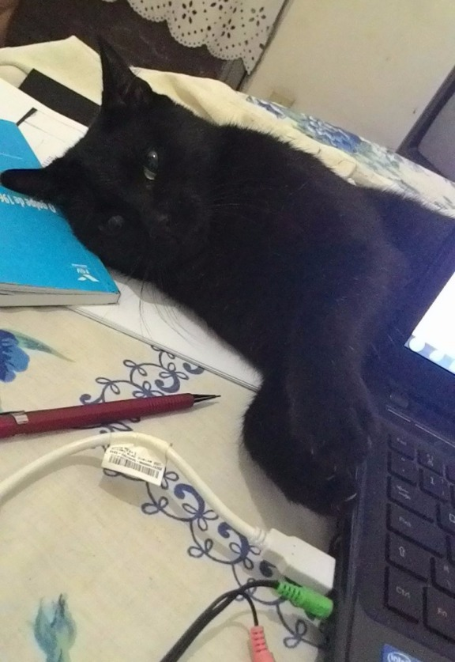](http://www.livrosepessoas.com/wp-content/uploads/2015/03/P_20141110_231119_LL.jpg)

Fonte: Bored Panda

### Comments

comentários

Powered by [Facebook Comments](http://peadig.com/wordpress-plugins/facebook-comments/)
