# JavaScript World Domination — Medium

### How exactly did we end up here?

In recent months I was frequently asked to talk about some next-level JavaScript (mostly ES6 and the [JavaScript-of-things](http://slides.com/flaki/jot)) & DOM technologies (i.e. [Service Workers](http://slides.com/flaki/offline)) on meetups and conferences in Hungary.

[At one of those meetups](http://www.meetup.com/newtech-42/) I had a chance to present on “[JavaScript’s World Domination](http://slides.com/flaki/js-eating-the-world)”. In retrospect — five minutes of stage time *might be a bit slim* if you wanted to go over a bit of JavaScript history, while also touching on the incredibly vast and diverse potential just waiting to explode onto the JS-biosphere — yet that was the basic idea here.  
Anyway, to stick to the point, after the talk someone in the audience asked me the question:

> “Why hadn’t you mentioned Netscape’s [original server-side JavaScript solution](https://en.wikipedia.org/wiki/SSJS) — but instead [pointed out node.js as “How it all started”?](http://slides.com/flaki/js-eating-the-world#/2)

Well (apart from the obvious time constraint involved) this was a fair question — even though I think it was based on the wrong assumption of what “*How it all started*” referred to. I thought this might have deserved a bit more elaborate answer than the one given, which was something like:

> “While node wasn’t the **first** server-side JavaScript solution, it certainly was a turning point with regard to **how** JavaScript’s used today”.

Server-side JavaScript in itself would be a topic that would have barely fit in its own five-minute talk — but here, what I meant is that with node.js a *new era* has begun for JavaScript — and this new era was about *so much more*, than just server-side JavaScript! But well, let’s not get ahead of ourselves…

### Accidental JavaScript

David Linden’s original, [“The Accidental Mind”](http://www.hup.harvard.edu/catalog.php?isbn=9780674030589) reimagined

When someone starts off to learn the ropes of the ECMAScript standard, (s)he is bound to learn a lot — not just about the future of JavaScript, but (in order to fully understand the editors’ motivations and constraints) its history, too. This was the exact thing that happened to me, as I’ve slowly pieced together the fragments of the JavaScript lore, it became apparent that this was a language with a lot of “baggage” — one with quite a few skeletons in various closets to uncover.  
JavaScript is a [kludge](https://en.wikipedia.org/wiki/Kludge) — most of you reading this will be well aware of its anecdotal hasty inception, by its creator Brendan Eich. However (and this is important) this isn’t necessarily a *bad* thing!  
JavaScript is a kludge [in a way our very brains are](http://www.hup.harvard.edu/catalog.php?isbn=9780674030589) — in its advances being more *evolutionary* than revolutionary, hogged by all the cruft accumulated during its early days that it just could not afford to dispose of — but in the meantime, thriving both in numbers and in finicky smart additions that cover over its ancient aspects.

Before we go on a trip down memory lane, to start our Civilization-esque journey of JS-evolution, here is a bit of glossary of JavaScript-monikers and early history, just to get these things out of the way:

**JavaScript** is the name you most likely are familiar with — the name that stuck, but which is basically a marketing-stunt to ride Java’s fame, as early on Netscape’s browser-scripting language it refers to was called **LiveScript**. Heck, if you’ve [spent enough time around Brendan Eich](http://devchat.tv/js-jabber/124-jsj-the-origin-of-javascript-with-brendan-eich), you may even heard how they wanted to call it “**Mocha**”.  
Netscape of course couldn’t get away with being the sole browser offering in-browser client-side scripting — Microsoft’s Internet Explorer sported its very own interpreted script language, called **JScript**. This of course was enough for trouble and incompatibility arise and plague the lives of contemporary “web designers”, so Netscape, Microsoft and the European Computer Manufacturers Association (now Ecma International) went ahead to standardize browser scripting under the name — you guessed it — **ECMAScript**.

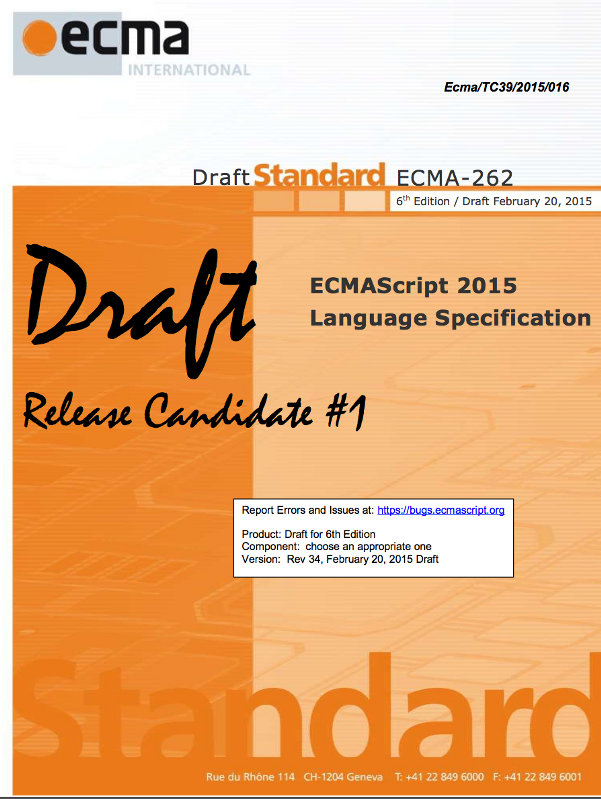

ECMAScript 2015 Release Candidate 1 ([via Allen Wirfs-Brock](https://twitter.com/awbjs/status/568632824066019328/photo/1))

Then popped up several languages, themselves based on the ECMAScript standard — probably the most widely-known being flash’s **ActionScript**. Other than that, quite a few languages since then extended JavaScript in ways (like **CoffeeScript** or **TypeScript**), while the language itself evolved, incorporating the best ideas into the core. ECMA (more specifically, [TC39](http://www.ecma-international.org/memento/TC39.htm)) has released several editions of the base standard since then —**ECMAScript 5.1** being the most recent (stable) one, while **ECMAScript 2015** — or as it was previously known *Harmony*, *ES.Next* or simply the *6th edition (ES6)* — is in the [Release Candidate 3](http://wiki.ecmascript.org/doku.php?id=harmony:specification_drafts#march_17_2015_rev_36_release_candidate_3) phase and is slated for approval by the ECMA general assembly [in June](http://sdtimes.com/milestone-ecmascript-6-track-june-release/).

### Occupying the browser

With this post I am not in the market of selling ES6's advances — there are a lot of [great](https://github.com/lukehoban/es6features) [sources](http://www.2ality.com/search/label/esnext) one could find to learn on the upcoming cool features and extensions — however I think we could agree on the fact that JavaScript has *pretty much dominated the browser market*. There aren’t a whole lot of client-side languages in browsers today, [and that’s for a reason](https://news.ycombinator.com/item?id=9201747): VBScript was [dropped in IE11](https://msdn.microsoft.com/en-us/library/ie/dn384057%28v=vs.85%29.aspx) and Google is still trying to shoehorn Dart into the web (well, that mostly means, Chrome) — [with not much success](http://www.walkercoderanger.com/blog/2014/03/dart-isnt-the-answer/).  
Besides those two basically all that remains are [compile-to-js & JavaScript-superset languages](https://github.com/jashkenas/coffeescript/wiki/List-of-languages-that-compile-to-JS#coffeescript-family--friends), which, at the end of the day, are really just pushing JavaScript’s agenda forward. Heck, JavaScript even compiles to *itself* — with [tools](https://babeljs.io/) being able to [transpile](http://en.wikipedia.org/wiki/Source-to-source_compiler) the new functionality in ES6 into previous versions of the standard for backward compatibility.

### Suddenly — a wild JavaScript appears

As JavaScript was becoming more-and-more ubiquitous as it was accumulating developer mindshare, it started popping up in weird and unexpected parts of the IT-field: initially, this was just the corners of the web previously untouched by the JS-pandemic, but soon after that, JavaScript was all over the place. There were essentially two (more-or-less) well-known laws in the IT community that contributed to (predicted, even) JavaScript’s world domination.

#### Moore’s Law

I don’t think computing’s most essential law needs any explaining to anyone who got this far in reading this article: [Moore’s law](http://en.wikipedia.org/wiki/Moore%27s_law) has been generalized in several ways, how it is really about “[exponential progress, in the wake of tiny revolutions and paradigm shifts](https://medium.com/@nivo0o0/when-exponential-technological-progress-becomes-our-reality-74acafd65e26)” — but regarding the JavaScript world domination we are interested in its raw aspect: explosive growth of brute computing power in an ever-shrinking package.

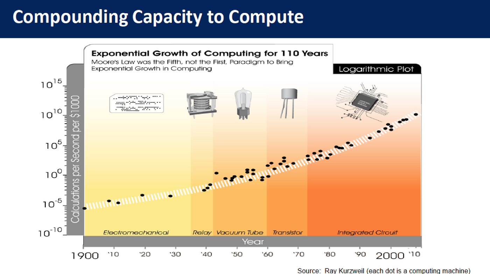

Moore’s Law explained (by Ray Kurzweil, [via Niv Dror](http://digitalcommons.usu.edu/cgi/viewcontent.cgi?article=3164&context=smallsat))

What these seemingly unstoppable technological advances made possible: they made performance *less of a sensitive aspect* when developing applications. In a software ecosystem, performance is just one aspect — developer mindshare (programmers familiar with the language & environment), available tools and libraries, openness & onboarding cost are all very real constraints one has to deal with. Back in the days where megahertz’ and kilobytes were of scarce serving JavaScript’s suboptimal nature was a much bigger hindrance, than in today’s amply-powered cheap devices.  
Moore’s law was what made the *mobile web* possible — while in the meantime JavaScript taking a stab on the [server-side](http://hu.wikipedia.org/wiki/Node.js), [desktop](http://en.wikipedia.org/wiki/Chromebook) & [mobile operating systems](https://developer.mozilla.org/en/Firefox_OS), eventually seeping into the [tiniest microcontrollers](http://www.espruino.com/Pico).

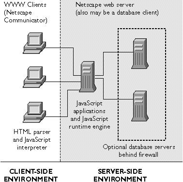

[Netscape’s original Client+Server-side JavaScript architecture](http://docs.oracle.com/cd/E19957-01/816-6411-10/getstart.htm)

#### Serve your script, and eat it too

As mentioned above, node.js wasn’t the first time JavaScript has wandered server-side — Netscape has offered server-side JavaScript execution [in its Enterprise Server](http://en.wikipedia.org/wiki/JavaScript#Server-side_JavaScript) as early as 1994, right after the language’s inception.

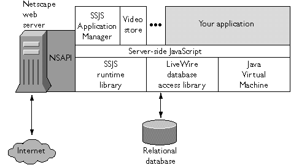

*But it didn’t stick.*Why? Well mostly because [it was a serious pain in the bum using it](http://philip.greenspun.com/wtr/livewire.html). For one thing — *it wasn’t live at at all*, the application had to be *compiled* after the slightest modification.  
Of course, just because it didn’t work out for Netscape, that doesn’t neccessarily mean server-side JavaScript is doomed, so various solutions to the same issue kept popping up.

[Helma](http://helma.org/) & [Narwhal](https://github.com/tlrobinson/narwhal/) were one of those projects. Helma — now abandoned (*rather, spun out into* [*Ringo.js*](http://ringojs.org/)) — was running Mozilla’s Java-based JS-engine, [Rhino](https://developer.mozilla.org/en-US/docs/Mozilla/Projects/Rhino), while Narwhal theoretically supported [several different JS-backends](https://github.com/tlrobinson/narwhal/blob/master/docs/engines.md#engines). Both of those frameworks found their respective niches — but neither of those found widespread popularity — that could be chalked up for several of their shortcomings, but before we get there, there is one more thing we need to mention: *the DOM*.

#### DOMinating the JavaScript World

When Microsoft and Netscape released their respective scripting-enabled browser offerings, they started standardizing the programming languages — which effort was to become ECMAScript later. However, web browsers (even back then) were not just empty shells — nice facades for a script console. Web browsers comprised a full environment (an operating system of their own, so to speak), of which JavaScript(/JScript) was just a tiny fragment — every time one needed to *interface* with some of the browser’s features (like the HTML markup of the document itself, or the styling of the nodes) one needed an [API](http://en.wikipedia.org/wiki/Application_programming_interface) for that.

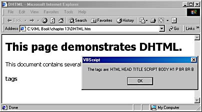

Internet Explorer’s dHTML (from the book [“Developing XML Solutions”](http://www.amazon.com/Developing-XML-Solutions-DV-MPS-General/dp/0735607966/ref=sr_1_1?s=books&ie=UTF8&qid=1427190566&sr=1-1&keywords=0735607966) via [flylib.com](http://flylib.com/books/en/3.247.1.88/1/))

Both Netscape Navigator and Internet Explorer went on to introduce their own (of course, incompatible) API-s for accessing the document object model, which eventually went on to be standardized separately and [became the DOM standard](http://www.w3.org/2002/07/26-dom-article.html#history). The DOM is supposed to be supplying bindings — both language and platform-independent — to the features exposed in a browser (or more broadly, by the *environment*), and has evolved just es ECMAScript evolved, in standards released by W3C in tandem.

Basic schematic of the [DOM](http://en.wikipedia.org/wiki/Document_Object_Model) — image [via James Padolsey](http://code.tutsplus.com/tutorials/javascript-and-the-dom-series-lesson-1--net-3134)

Eventually, besides the DOM several other features and extensions emerged, some of which went on to be standardized and accepted cross-browser, some of which remained confined to a single browser vendor or environment. Such efforts are continuously being worked on as of today (one particular cooperative effort being the [Service Worker specification](http://www.w3.org/TR/service-workers/)), and are even *encouraged,* [as a means of extending the web](https://extensiblewebmanifesto.org/) and keeping it up to speed with technological advancements.

Why all the above is relevant? Well, for once it is often confused and was nice to get that misunderstanding out of the way — but more importantly, is because while all client-side JavaScript solutions at this point had *some* standardized environment-accessing API-s, all the above server-side solutions were vastly incompatible in their ways (i.e. accessing a file’s contents on the server). There were attempts trying to weld the two technologies together before (one such unlikely hybrid was [Jaxer](https://github.com/aptana/Jaxer), running a fairly complete *Firefox instance, complete with browser DOM* on the server-side — but even it had its own way of [dealing with lots of the environmental factors](http://ejohn.org/blog/server-side-javascript-with-jaxer/)), but for really useful outcomes of this hybridization, we still had to wait for node.js to arrive.

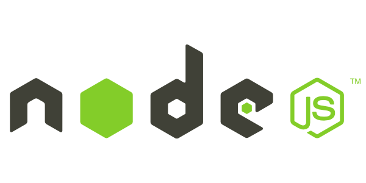

### Enter node.js

Whoah, I have sure preached quite extensively about node up to this point (not that I have any particular interest in selling it to anyone), but hopefully I have managed give a fair preface to:

*Why was node.js* ***a big deal****?*

#### It just happened to be in the right time, at the right place.

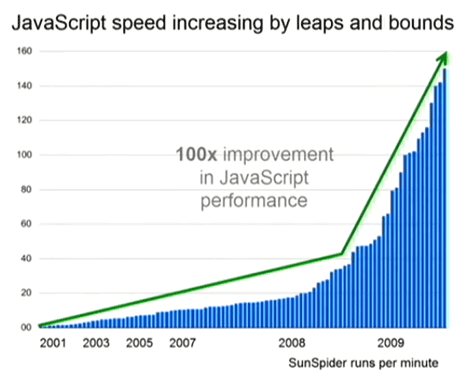

JavaScript speed increase during the browser vars ([via Brendan Kenny](http://extremelysatisfactorytotalitarianism.com/blog/?p=514))

The [browser-wars were raging](http://en.wikipedia.org/wiki/Browser_wars#Updated_browsers_released), JavaScript execution speed was tenfold ahead of anything anyone has ever seen before — and due to the fierce competition, was still steadily increasing… and yet,  
[Ryan Dahl, the creator of node.js](http://jsconf.eu/2009/video_nodejs_by_ryan_dahl.html) wasn’t even *trying* to shoehorn JavaScript into a server environment.  
Au contraire, admittedly [he just stumbled upon](http://www.reddit.com/r/node/comments/h1m2o/i_am_ryan_dahl_creator_of_nodejs_ama/c1rxnb8) the mighty V8 engine while researching event-driven server techniques — JavaScript just *happened* to be a nice fit to evented, non-blocking I/O, and a single-threaded event-loop based environment.

#### A-synchronicity

Even though the idea of asynchronous, non-blocking/evented I/O wasn’t new at all, [event-driven web servers](http://daverecycles.tumblr.com/post/3104767110/explain-event-driven-web-servers-to-your-grandma) were not all that abundant. Event-driven server origins go as far back to as [1999, the nascent Flash](http://www.cs.princeton.edu/~vivek/flash/) (no, not *that* flash) server used this technique — but other server-side solutions using the same paradigm are on quite short order. In fact, (and please correct me if I’m wrong), node.js actually predates the single other relevant solution I could find, [the Tornado web server](http://www.tornadoweb.org/en/stable/guide.html) ([written in Python](https://github.com/tornadoweb/tornado)) by at least half a year.

*Pointed out by Alexandre in the comments — the Nginx server was also event-driven (which actually is mentioned in Ryan’s original presentation, pitching it against Apache’s threaded system), however I would argue that it is much less powerful/flexible for this to count as fair comparison.*

*Also pointed out by several readers, the* [*Twisted Framework*](http://en.wikipedia.org/wiki/Twisted_%28software%29) *(written also in Python) was an event-driven async networking framework, which well predates node’s release. One could argue whether Twisted fits the above argument or not, but certainly is a valid point — thanks for pitching in!  
(Twisted also has* [*extensive interoperability with above mentioned Tornado web server*](http://www.tornadoweb.org/en/stable/twisted.html) *which I think better fits node, but that’s simply personal opinion)*

#### Gathering a Commonity

Node was the first server-side JavaScript solution to gather a sizable community (on several different levels). Releasing it as open-source software, contributions flowed in ([arguably not at a pace that was satisfactory for some](http://www.infoworld.com/article/2855057/application-development/why-iojs-decided-to-fork-nodejs.html), but well, it was a start), adopting [CommonJS](http://en.wikipedia.org/wiki/CommonJS) as the interoperability platform in node (and thanks to [npm](https://www.npmjs.com/)), the developer ecosystem thrived (Narwhal/RingoJS both utilized the CommonJS standard — but neither could pull of anything like what the advent of node.js and npm spurred).

The arrival of IO.js in early 2015 has further extended and revitalized the community around node, contributions soared sky-high like never before as the [open-governance model](https://iojs.org/en/faq.html) selected by the fork’s authors started to do its magic:  
in a few months, [the number of active contributors has overtook that of the early node.js days](https://medium.com/@iojs/io-js-and-a-node-js-foundation-4e14699fb7be), and localization teams took the community to new places.

*“Okay, okay — node.js breathed new life into server-side programming, it is our savior, a fearless knight in shining armor, yadda-yadda — I get it, sheesh…”* — well yes, but it didn’t even stop there!

#### Extending the chain of command

Node also made it trivial, to embed JavaScript in a cross-platform way into… well practically *anything*. It all started with the [command line](http://www.2ality.com/2011/12/nodejs-shell-scripting.html), and at a blink of an eye JavaScript based scripting and tooling was zapped into the world.

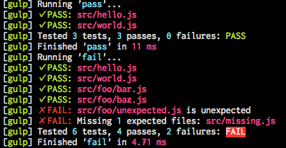

Node.js and the myriad of tools it has spawned has made cross-platform task automation a breeze, extending the JavaScript tooling leaps and bounds beyond what was possible before.

Easy to use, extensible, and available for all relevant platforms [Grunt](http://gruntjs.com/), [Gulp](http://gulpjs.com/) & co. extended the tooling put around not just JavaScript and the web, but any conceivable platform (did you know [Photoshop had its own scriptable node.js instance](https://www.youtube.com/watch?v=wqmMqB91zdI) built in?).

Also, what Jaxer couldn’t pull off (an embedded browser with DOM), came almost naturally to node — first via the help of [PhantomJS](http://phantomjs.org/), and not long after that with [JSDOM adding JavaScript-native first-class support](https://github.com/tmpvar/jsdom) for accessing the DOM in node.js — automated client testing for web content was reinvented in a familiar package (check out Domenic Denicola’s superb talk on [JSDOM and its motivations](http://www.thedotpost.com/2014/11/domenic-denicola-the-jsdom#autoplay)!). And even that wasn’t enough, and after conquering the browser, the server and the command line — node went for an even bigger fish in the fishbowl: *desktop apps*.

#### A NW era

Thanks to the speedups of JavaScript and advances in HTML5/CSS web technology, HTML5 apps are all the rage — and most of the time they run at ample speed on a common low-to-moderately specced device. As node.js brought a myriad of API-s to access low-level (such as filesystem and networking) operating systems primitives — it was only trivial to expose these primitives to a web rendering context instance — since [both Chromium and node.js used V8 as their JavaScript engine](https://github.com/nwjs/nw.js/wiki/How-node.js-is-integrated-with-chromium), melding the two together was a no-brainer: this was how [node-webkit (now named NW.js)](https://github.com/nwjs/nw.js) was born.

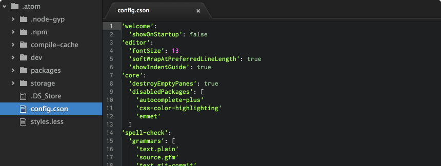

[Atom Editor](https://atom.io/)’s interface (all in its pure HTML5-glory) could match any of the contemporary native-code editors’

Node-webkit spurred a whole knew class of new desktop projects into existence, and after [Cloud9 IDE](https://c9.io/) successfully wedded node.js and web technologies in what became a state-of-the-art Integrated Developer Environment, projects like [Brackets](http://brackets.io/) and [ATOM](https://atom.io/) brought the experience to the desktop (while keeping best of both worlds — cross-platform interoperability, extensibility — intact).

#### Harder, Better, Faster, Stronger

While JavaScript was becoming more-and-more sophisticated and powerful (thanks to the work of TC39 on the ECMAScript standard), and ever- increasingly ubiquitous (reaching farther-than-ever thanks to node.js et al.), its evolution didn’t seem to stop, not even slowing down.  
JavaScript was bound to become even *faster* while, in the meantime also shrinking *smaller and smaller*.

Okay, JavaScript — sooo…  
Browsers? *Done*. Servers? *Easy!* Mobile? *Like a glove!* Desktop? *Done & dusted!* Anything else you might want to try?  
*Well what about IoT?*

The JavaScript of Things ([based on the image at the blogpost by **ayza**](http://blogs.salleurl.edu/networking-and-internet-technologies/el-reto-de-internet-of-things/))

### The JavaScript of Things

Well, this idea of the “internet-of-things” is quite popular nowadays, one might say. Smart watches, smart lighting, smart heating, smart houses; internet-connected fridges and washing machines and electric kettles — you name it.

But these are small, limited power devices, tiny chips with tiny memories, also with tiny power supplies — such a resource-hog, power-hungry language like JavaScript shouldn’t be driving these, no?  
Well, **think again!** An era of the [JavaScript of things](http://slid.es/flaki/jot) is closer than you might imagine.

#### A fiery fox to the rescue

A few years ago no one would have thought a low-power, cost-conscious mobile device based on web technologies would be even possible — and yet [Firefox OS](https://www.mozilla.org/en-US/firefox/os/) has proven that it was not simply possible, but very much feasible by releasing ~15 different Firefox OS-powered devices in about ~[30 countries](https://blog.mozilla.org/blog/2014/12/16/firefox-os-expands-to-nearly-30-countries) in the last two years.  
All these devices are internet-capable touchscreen, full-blown smartphones — yet some of them selling for as low as ~$33 USD, proving that JavaScript and web technology is still rather far from hitting its limits yet.

It is so far from said limits, actually, that Samsung decided on using it on its [smartwatch platform, based on the Tizen operating system](http://slides.com/flaki/js-eating-the-world#/4/2) — while at the same time, [approaching Ecma International’s TC39 with the idea](https://esdiscuss.org/notes/2014-04/ecma-tc39-talk-samsung.pdf) of standardizing a mobile-conscious, even more prudent subset of the language to be used on the smallest scales of devices.

While we don’t know what has came out from Samsung’s proposal — embedded JavaScript is a *very lively* topic of its own. Mentioned both in Samsung’s original pitch, [Technical Machine’s Tessel](https://tessel.io/) and the [Espruino](http://www.espruino.com/).  
Before I dive into the details of creating a JavaScript solution for a highly resource-constrained hardware like those above, I would like to introduce to the second law I wanted to share with you:

#### “Any application that *can* be written in JavaScript, *will* eventually be written in JavaScript.” — [**Atwood’s Law** by Jeff Atwood](http://blog.codinghorror.com/the-principle-of-least-power/)

I won’t try to over-explain the above law (it’s pretty self-explanatory, anyway), but will try to show it in the works in the remaining part of this article.

#### Minuscule Scripts

JavaScript at its core is an interpreted language. This means, that it is ran by evaluating its source code just before executing it. Of course, various optimizations could be percieved to ease and speed up JavaScript execution — one of the most basic (and also very powerful) one is parsing the source and building an AST, an [Abstract Syntax Tree](http://en.wikipedia.org/wiki/Abstract_syntax_tree). An AST is a representation of the source code that’s much easily traversed by the interpreter — source code is still not compiled beforehand, but executed on the fly, but the overhead of parsing (and re-parsing) and tokenizing the source code is avoided. This is an obvious gain, without much drawbacks — that is exactly why nearly all JavaScript engines use this method. There are even some tokenizers [written in JavaScript itself (like Esprima)](http://esprima.org/demo/parse.html) that could be used to view and fiddle with this intermediary state, that could be used for several interesting use cases like transpiling and code-completion.  
There is one small problem with this approach — besides the initial processing requirement, memory space is required to *store* the AST so it could be executed. For most of the applications this should not be a limiting factor, but when we get down to as low as the sub-megabyte memory capacities of microcontrollers, this arises as a serious limitation.

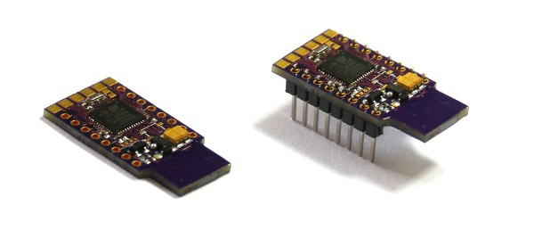

Espruino’s next generation, [the Pico](http://www.espruino.com/Pico) — slated for release in May

#### The Espruino

The above issue was exactly what [Gordon Williams](https://twitter.com/Espruino), creator of the original Espruino faced — a consisting of a single microcontroller with 64 kilobytes of memory — executing JavaScript. Compiling or parsing to AST was not an option on such a low-memory device (some of the standard’s requirements must have been lifted, too, like Unicode-support because of the limited memory capacity). For that reason, code on the Espruino [executes from the source itself, parsed and executed on the fly](http://www.espruino.com/Performance)! This, of course, comes with quite a few peculiarities that should be taken into account — like white-space affecting the speed at which the code runs on the Espruino!\*

The upcoming new iteration of the Espruino, the [Espruino Pico](http://www.espruino.com/Pico) will have a tiny bit more memory at its disposal (96KB), but even that is not that much, either for this issue to be adequately solved. For these reasons (code size & compatibility) Espruino boards might be programmed via the familiar JavaScript language, could still remain dynamic (=interpreted on the fly), but are unable to take advantage of much of the rich ecosystem that JavaScript could offer.

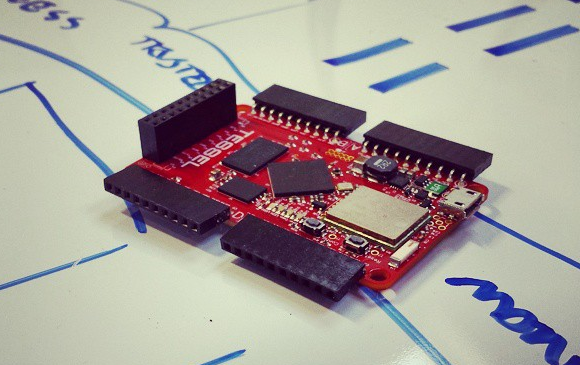

The original Tessel ([via Technical Machine’s Instagram](https://instagram.com/technicalhumans))

#### The original Tessel

For some of these reasons, stated above the great folks developing [Tessel](http://tessel.io/) at [Technical Machine](https://twitter.com/technicalhumans) choose a different approach. The Tessel had ample RAM (32MB) at the disposal of the JavaScript interpreter — however the Cortex M3 microcontroller that drives the whole machinery [has about 200KB of memory](https://tessel.io/blog/102381339917/a-new-engine-for-your-tessel), which makes it quite difficult to run any high-level JavaScript interpreter on it.  
There was, however, one language that was *begging* to be embedded from the very beginnings: [Lua](http://www.lua.org/). Lua itself is a programming language that closely resembles JavaScript, so writing a compiler that *translated the JavaScript source to Lu*a and [executed the translated code on the very compact Lua virtual machine](https://tessel.io/blog/98257815497/how-tessel-works-the-basics) on the microprocessor of the device sounded like an epiphany.  
For the above reason, Tessel was to be “node-compatible”, which meant it was able to run most of the modules straight out of npm, without much hassle (provided they didn’t have any binary dependencies — but that’s another story).

The above concept worked in some places, and failed in some others, but it most of the time got the job done — yet Tessel’s strong suite wasn’t its JavaScript compatibility or performance anyway: it was **its plug-n-play nature**. One could order [pre-manufactured extension modules](https://tessel.io/modules) from the website and simply by typing the module identifier into an npm install command, they could be accessing the additional hardware in 5 seconds via simple JavaScript call(back)s. This extensibility and modularity should be the next step to conquer as we approach standardizing extensibility on the web. Now before we march on to review Tessel’s second iteration, I think we should take a little detour back into Firefox-OS-land:

#### Firefox OS’s twisted twin brother: Jan OS

Well [Jan OS](http://janos.io/) is a strange animal! Invented by the crazy dutch, Frankenstein of Amsterdam [Jan Jongboom](https://twitter.com/janjongboom) — it is neither a phone (any more), nor a microcontroller platform (yet) — but a bit of both.

Jan OS is based on (it’s a fork, if you will) the Firefox OS source code, and focuses on the hardware and sensors. The same sensors and modules you could buy for hundreds of dollars as addons to your Tessel, here come pre-soldered to a highly compact and power-conscious IT board (that you got for a few tens of bucks, but back then they called it a *phone*).

The whole of all these sensors and circuitry fits an IC-board smaller than a credit card!

With Firefox OS’s (dead-simple) hardware API’s all right there, by stripping the unneeded cruft and the UI (GAIA) and security/permission mechanics (basically *rooting* the phone) you get a highly optimized, cellular-network-connected, low-power internet-of-things board that with an ample power supply you [could stuck out in the wild and have it transmit images for a *whole month*](http://ee.telenor.io/about-gonzo/)!

What happens here, is that you are basically running a slim, mobile-optimized Linux kernel (Firefox OS’s kernel, Gonk is [based on the AOSP kernel](https://source.android.com/source/building-kernels.html)), with Mozilla’s Gecko engine (including the SpiderMonkey JavaScript engine it comes with — with all optimizations, bells-n-whistles you would get on the mobile or desktop browser —*hellooooh, Jaxer!*), but with the addition of [WebAPI](https://developer.mozilla.org/en-US/docs/Web/API)-s for accessing the mobile chipset, wifi, FM radio(!), sending SMSes, initiating calls or capturing gyroscope data!

Also, it would soon become clear why I chose to plug this paragraph before we talked about Tessel 2 — as I add, there is even support (in both Firefox OS and Jan OS) [for the Raspberry Pi](http://janos.io/device-list.html).

#### Tessel 2 — hardcore prototyping

[Two Tessels connected to the USB ports of a Tessel 2](https://instagram.com/technicalhumans)

The [second iteration of Tessel](https://forums.tessel.io/t/introducing-tessel-2/1571) positions itself on the sweet spot of all those hardware mentioned above: It is nearly as powerful as the Raspberry Pi, it is much cheaper than the original Tessel was (less than half the price!), it is just as modular and extensible as the first one was (heck, it even got better with the inclusion of *two standard USB ports*!) — and last, but not least, runs a tiny Linux kernel and [io.js](http://iojs.org/), [leveraging the full power, speed and ecosystem node/io.js has to offer](https://forums.tessel.io/t/introducing-tessel-2/1571), while in the meantime doing away with compatibility issues once and for all!  
Well that’s already nice — but the best thing is yet to come — you could use the Tessel 2 to *prototype* your product, and also to bring it to market — as, if you so choose, you could order a bunch of pre-fabricated Tessel 2-s, with integrated module boards and [put it *right into your final product*](https://tessel.io/#scale)!

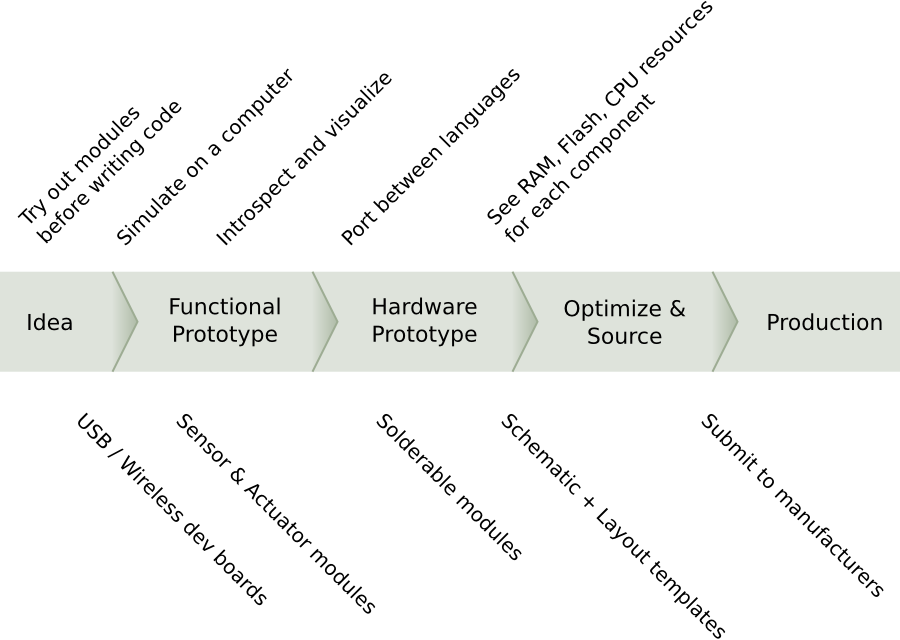

The “Fractal” concept [from the docs](https://github.com/technicalmachine/fractal-docs)

Technical Machines’ [“Fractal” concept](https://tessel.io/blog/101109458547/what-comes-next-fractal) makes the above scenario even more tempting — taking modularity and prototyping to a whole new level, by using seamless interactions between JavaScript-driven and performance-sensitive close-to-the-metal compiled modules.

Performance-sensitive you say? Close to the metal? Let’s dive a bit further into the wizards’ den, see what JavaScript’s future has on offer…

### Way ahead of its time: JavaScript Droids from the Future

[ASM.js](http://acko.net/blog/on-asmjs/) is not a new technology. Well — it’s not really even a technology, but rather [bunch of iterative optimizations](http://mozakai.blogspot.se/2013/06/what-asmjs-is-and-what-asmjs-isnt.html) that in the end just happened to be easily optimized and, well, *simply running really fast —*it is more like a kind of *guided evolution*, if you wish. Already mentioned before some optimizations, like the AST, which help JavaScript performance-wise. The AST is used to speed up the interpreter and make runtime execution speedier — but nobody said that a this is the *only* way JavaScript could be executed.  
The keyword here is: *compilation*. [Just-in-time (JIT) compilers](http://en.wikipedia.org/wiki/Just-in-time_compilation) have been widely known and used since the earliest days of interpreted languages — and JavaScript is no different (however, for dynamically typed languages like JavaScript, JIT-ting does have its fare share of quirks and pitfalls).

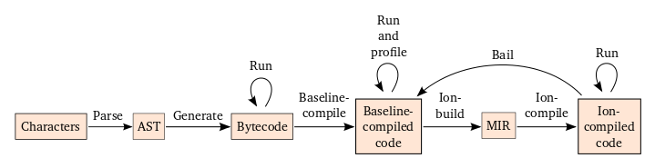

Structure of SpiderMonkey’s JIT in Firefox ([via Luke Wagner](https://blog.mozilla.org/luke/2014/01/14/asm-js-aot-compilation-and-startup-performance/))

Optimizing hot code (like long loops or frequently called functions), by compiling it to *directly executable machine code instructions* could result in sizable gains in execution performance. What ASM.js tries to achieve is to make AOT (ahead-of-time) compilation of swaths of JS source possible by defining an intermediary [JavaScript subset-syntax](http://asmjs.org/spec/latest/) that makes it possible to compile the JavaScript source, well before execution into type-safe machine code while achieving predictable performance by eliminating managed memory and garbage collection *altogether*.

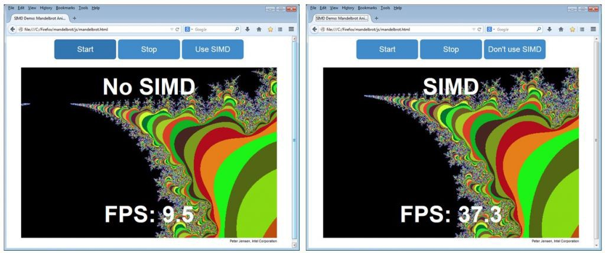

Also coming to JavaScript — support for native [SIMD](http://en.wikipedia.org/wiki/SIMD) instructions ([image via Intel OpenSource blog](https://01.org/blogs/tlcounts/2014/bringing-simd-javascript))

There is also a second, no less important goal to ASM.js — establishing JavaScript as a fast *target-language*. Compile-to-JS tools, like [Emscripten](https://github.com/kripken/emscripten) or [GWT](http://www.gwtproject.org/) have existed for quite some time before ASM.js, and as the habit of compiling low-level langueages into JavaScript persisted, engines started optimizing for the kind of source code these compilers emitted. ASM.js is the natural continuation (I am trying not to over-use the word “evolution” as you might notice…) of this effort, by defining a common “language” (a standard syntax format) that makes the output of these tools comparable, more easily optimizable and [perhaps a bit more readable (not that anyone would want to do that to themselves, anyway)](http://mozakai.blogspot.hu/2014/06/looking-through-emscripten-output.html).

#### Look Ma’ — a time machine!

The results? Well, certainly awe-inducing — whether one talks about the thousands of MS-DOS games running nothing but a browser, thanks to [archive.org’s collected library](https://archive.org/details/softwarelibrary_msdos_games), or the wonders of 3D graphics that contemporary tools with built-in HTML5 (WebGL/JavaScript/ASM.js) output produce (like the [Unreal engine](https://blog.mozilla.org/blog/2015/02/24/unreal-engine-4-7-binary-release-includes-html5-export-3/) or Unity):

Unity 5's HTML5 export demoed at GDC2015

With [browser support expanding](https://hacks.mozilla.org/2015/03/asm-speedups-everywhere/), these wonders are reaching more and more users on the web every day, bringing high-performance [games](https://www.facebook.com/cloudraidersgame) and [even physics simulation](http://jlongster.com/s/lljs-cloth/) into browsers and to the open web.  
Speed, however is not the only concern — sometimes size (see above, for the Espruino) is just as important — if not more important — that’s where our tiny script engines come onto the stage.

### TinyScript — the Davids to your JavaScript Goliaths

Mentioned earlier, Lua has been readily and frequently used embedded in other software products to provide extensibility/scripting to its host software. This was, in part due to its simplicity and extensibility — and in part because of its small footprint.

Unfortunately for JavaScript (while being equally simple, quite extensible and certainly well-known) — size has been always an issue for JavaScript engines, so it didn’t achieve great adoption… yet. Based our learnings and assumptions of the Espruino engine, we might feel compelled to say that “a fast and standards-compliant JavaScript just can not be squeezed into such a small footprint these applications would require” — but again, we would be wrong.

Fast-forward to 2015, enter [muJS](http://mujs.com/docs/about) and [Duktape](http://duktape.org/) — two tiny JavaScript interpreters built for just those purposes mentioned above! Clocking in at ~200KB compiled size, they are light-weight and easily embeddable in any product (or microcontroller, for that matter!): the Duktape engine could be slipped onto a small embedded system with 256KB of flash storage and as low as 96KB of RAM and would hum along nicely!

The Atomic Game Engine uses Duktape for embedded scripting

Sporting all the bells-and-whistles a modern JS-interpreter should have (garbage collector, unicode support, RegEx engine — you name it) and ECMAScript standard compliance these tiny powerhouses are no small feat of engineering — and are already being used, such as in gaming engines like the [Atomic Game Engine](http://atomicgameengine.com/) — and has started to seep closer to the metal in software like the [IoT framework “AllJoyn.js”](https://wiki.allseenalliance.org/_media/training/programming_alljoyn.js.pdf).

Tilmann Scheller at Samsung has also evaluated the fitness of the Duktape engine for baremetal microcontroller use, and [his results are also very promising](http://www.slideshare.net/seoyounghwang77/js-onmicrocontrollers).

### Takeways?

Actually I don’t think there is anything else (besides all those points already mentioned above).

One thing seems pretty clear, though: JavaScript is not going away anytime soon — so one might as well learn a thing or two about it. *Just in case*.

#### Actually…

There indeed is one more thing. Seeing people on all over the web chanting the old slogan (even those who actually read the article above):

*“Well JavaScript is still butt ugly & unusable,  
it is a disgrace of a language and will surely remain so!”*

To those people: **not to worry**, give it a few years and **JavaScript is destined to be practically extinct** — dead as a dodo!  
*Whaaat?!*After all this preaching why on Earth would anyone say that? I am truly sorry, but you will have to see [Gary Bernhardt](https://twitter.com/garybernhardt)’s prophetic talk to find out:

[***The Birth and Death of JavaScript***](https://www.destroyallsoftware.com/talks/the-birth-and-death-of-javascript)

*Hint: Steven Wittens’ previously linked article on ASM.js also has some pointers.*

*\* in fact V8's “Crankshaft” optimizing compiler has similar peculiarities that arise from code size, because it chooses to* [*inline functions based on their text-size*](http://floitsch.blogspot.hu/2012/03/optimizing-for-v8-inlining.html) *(and that includes white-space and comments, too!).*
