### VING TSUN KUEN KUIT LECTURE IN RIO

[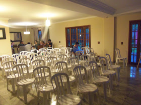](http://1.bp.blogspot.com/-9dJ7xNSoJBs/VQraOPJ5g_I/AAAAAAAARyk/S6r5SL7q47o/s1600/103_2652.JPG)

(Sala principal da casa onde ocorreram os 3 dias de Evento no Rio de Janeiro. Preparação para a palestra de Mestre Leonardo Mordente)

(Main Room of the house where the 3 days of the event happened. This was the chairs for the lecture by Master Leonardo Mordente later that night)

  

[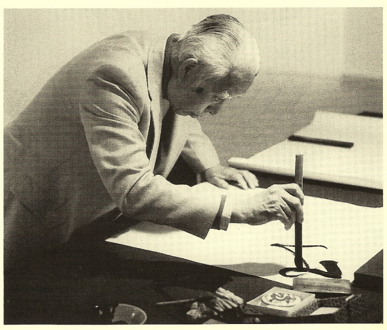](http://elizabethwanggallery.com.previewyoursite.com/ESW/Images/WFY-photo.jpg)

Nas palavras DO ARTISTA E INTELECTUAL WANG FANGYU(foto), a coleção Ving Tsun Kuen  
Kuit Suen Hak é “um tesouro no círculo marcial”, “uma empresa sem precedentes no meio  
artístico”. Costumamos, de bom grado, concordar com afirmações dessa natureza, não tendo  
nenhuma dificuldade em falar da obra de modo semelhante. Quanto, porém, realmente conhecemos  
a respeito desse magnífico trabalho? Uma observação mais cuidadosa nos levará à conclusão de que  
a empresa dos artistas Moy Yat e Kwong Chi Nam carece de tratamento à altura dos elogios que  
recebe, já que muitas de suas excepcionalidades ainda não foram plenamente exploradas e outras  
continuam desconhecidas.  
  
  
  
In the words of the artist and scholar Wang Fangyu, the Ving Tsun Kuen Kuit Suen Hak collection   
is a “martial circle treasure”, “an unprecedented endeavor in the artistic field”. We will gratefully   
agree with such definitions, having no qualms in referring to the artwork in similar ways. How   
deeply, however, do we really understand this magnificent work? Careful examination will lead us   
to the conclusion that this undertaking by artists Moy Yat and Kwong Chi Nam lacks a treatment   
fitting the praise it receives, once, as we intend to evince, many of its exceptional features are yet to   
be completely unveiled, while others remain unknown.  
  
  
  

[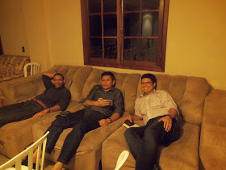](http://4.bp.blogspot.com/-tyIpoljhKrI/VQrbY2FiX0I/AAAAAAAARys/hgt2cFFJTmg/s1600/103_2655.JPG)

(Mestres Nataniel Rosa, Mestre Leo Imamura e Mestre Domenico Venturelli em momento de descontração pouco antes da palestra.)  
(Masters Nataniel Rosa, Master Leo Imamura and Master Domenico Venturelli in relaxing moment just before the lecture.)

  
Esse evento histórico começou na Sexta as 18h... Bom, pelo menos era pra ser assim... Uma forte chuva caiu no Rio e como se não bastasse, por alguma razão mística , como diria um grande amigo meu na época da faculdade,  o transito de nossa cidade deu um nó. Isso fez com que o Mestre Leonardo Mordente, meu Si Sok que faria a palestra de abertura falando do projeto “Ving Tsun Kuen Kuit Suen Hak” ficasse por 4 horas e meia no trajeto Aeroporto Santos Dumont x Barra (!!!)  
  
This historic event began on Friday 18h ... Well, at least it was supposed to be like this ... A heavy rain fell in Rio and to top it off, for some mystical reason, like  a big friend of mine in college ued to say, the traffic of our city knotted. This made  Master Leonardo Mordente, my Si Sok that would make the opening lecture about "Ving Tsun Kuen Kuit Hak Suen" stay for 4 hours and a half on the way from Santos Dumont Airport (Downtown) to Barra (West Zone) (!!!)  

[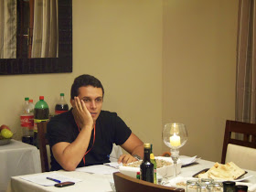](http://2.bp.blogspot.com/-DhBWbZm6Kvs/VQrbzUtnCaI/AAAAAAAARy0/X3FViUYvMlk/s1600/103_2675.JPG)

(Alguém registrou minha cara de bobo enquanto me deslumbrava com as descobertas proporcionadas pela palestra naquela noite. Realmente fui muito surpreendido pelo Estudo dos Kuen Kuit)  
  
(Someone posted my silly face as dazzled me with the findings provided by the lecture that night. I  was really very surprised by the study of Kuen Kuit)

  
  
Estavamos todos ansiosos para saber o que ele tinha a dizer. Eu pelo menos estava bastante, pois nunca tinha assistido uma palestra dele .  
  
We were all eager to know what he had to say. I was very esxcited, because I had never attended a lecture by  him.  

[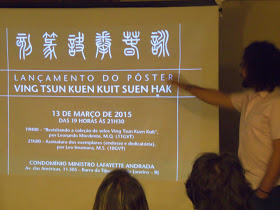](http://4.bp.blogspot.com/-JyJ5VXvx5c8/VQrcO4cTi-I/AAAAAAAARy8/fw2QqSA5VI8/s1600/103_2672.JPG)

  
Si Sok Leonardo Mordente falou sobre o projeto “*Ving  Tsun Kuen Kuit Suen Hak*” e abriu a palestra nos perguntando sobre o que sabíamos da tradução desse termo.  Ele disse depois de ouvir algumas colocações dos presentes que "Suen Hak" significava  "*Inscultura Sigilar*" (Gravação de Selos). Se você  consultar *["O Livro de Pedra do Ving Tsun", de autoria do próprio Mestre Leonardo](http://www.onboardtheredboat.com/vtbook.html)*, poderá ver mais explicações.  
  
Si Sok Leonardo Mordente spoke about the project "Ving Tsun Kuen Kuit Suen Hak" and opened the lecture asking us about what we knew on the translation of this term. He said after hearing some of the present people that  "Suen Hak" meant "Seal Engraving". If you read *["The Stone Book  ofVing Tsun", authored by Master Leonardo himself may see further explanation.](http://www.onboardtheredboat.com/vtbook.html)*  

[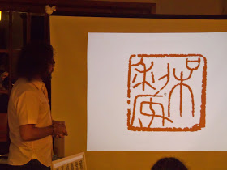](http://2.bp.blogspot.com/-KLWUDUB3Nac/VQrctnfqycI/AAAAAAAARzE/MjjhbbASmVg/s1600/103_2690.JPG)

  
Si Sok mostrou diferentes tipos de selos de pedra nos slides, alguns de Si Taai Gung Moy Yat e de seu parceiro artístico e Si Jak , Kwong Chi Nam, como também de outros artistas.  
Os selos mostravam não só um conhecimento apurado de ideogramas arcaicos, como também falavam da combinação estética entre eles a fim de trazer harmonia a quem o aprecia. Como no caso do ideograma acima(foto), quando ele falou de um radical jogado para o canto superior direito  fim de complementar melhor a ocupação do espaço.  
  
Si Sok showed different types of stone seals on the slides, some by Si Taai Gung and his artistic partner and Si Jak, Kwong Chi Nam, as well as other artists.  
The seals showed not only a keen knowledge of archaic ideograms, but also spoke of the aesthetic combination of them in order to bring harmony to those who enjoy it. As in the case of the character above (photo) when he spoke of a radical thrown to the upper right corner for a best complement to use of space.  

[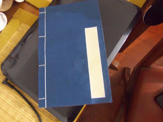](http://4.bp.blogspot.com/-6HxqwSIQFWg/VQ9X5seZN9I/AAAAAAAARzc/NaYbOc7-a7E/s1600/101_3270.JPG)

Foto do caderno fechado.

(Photo of the notebook)

[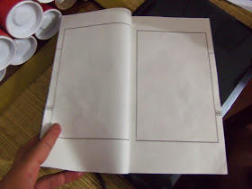](http://2.bp.blogspot.com/-dYHnrUF9dRk/VQ9X5vyuu8I/AAAAAAAARzY/_q-soEDuXQ4/s1600/101_3271.JPG)

(Foto do caderno aberto. As paginas tem um material especial e macio a fim de permitir a melhor absorção da tinta dos selos)

(Photo of the open notebook. The pages are made of a special material to allow better absorption of ink from the seals )

  
Si Sok Leonardo contou um pouco sobre o estúdio artístico de Si Taai Gung Moy Yat e Kwong Chi  Nam. Falou sobre como catalogar selos, algo que me fascinou bastante. Ele mostrou um caderno de capa azul bem tradicional , que eu já havia visto em novelas e filmes como compêndios de medicina, como na novela “WING CHUN” de 2007 que conta a história de Leung Jaan. Mas nunca tinha visto seu uso para catalogar selos.  
Segundo Si Sok, o artista carimba as folhas a fim de fazer uma espécie de portifolio já que talvez seja o caso de vender o selo, e ter em seu catalogo aquela sua obra que nunca mais poderá usar, já que vendeu.  
  
Si Sok Leonardo told a little about the art studio  of Si Taai Gung Moy Yat and Kwong Chi Nam. He talked about how to catalog stamps, something that fascinated me a lot. He showed a very traditional blue cover notebook, which I had seen in novels and films such as medical textbooks, as in the novel "WING CHUN" 2007. that tells the story of Leung Jaan. But had never seen its use to catalog stamps.  
According to Si Sok, the artist leaves to make a kind of portifolio as may be the case of selling the seal, and have in his catalog that his work would never be able to use, since sold.  

[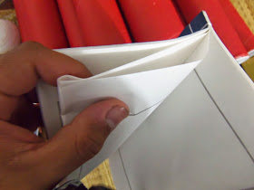](http://1.bp.blogspot.com/-_vKlqrYD3VM/VQ9Y93SmXZI/AAAAAAAARzo/awtajv5J-W0/s1600/101_3272.JPG)

  
A construção do caderno é muito interessante, quando o peguei em minhas mãos , não percebi mas suas folhas são presas ao contrário, fazendo uma espécie de espaço entre uma mesma folha(foto). Isso, segundo Si Sok , permite com que o artista carimbe, e não manche a folha de trás.  
Como sou muito sortudo as vezes, ganhei de presente de Si Sok o tal caderno (catálogo). Ele me deu dizendo que acreditava que faria bom uso.  
  
Devo dizer que fiquei bem feliz pois , realmente sempre quis um caderno desses. Ele disse que foi comprado em Hong Kong, numa loja especializada indicada pelo próprio Kwong Chi Nam.  
 Estes posters foram disponibilizados aos que quisessem adiquiri-lo. Segundo Si Sok, após uma palestra magnífica, uma das ideias era através desse pôster, fazer com que o praticante possa apreciar os selos, em suas diferentes construções, ao olhar para o pôster.  
O Projeto Ving Tsun Kuen Kuit Suen Hak tem como objetivo precípuo elevar a coleção Ving Tsun Kuen Kuit Suen Hak ao patamar a que faz jus. Para oferecer condições plenas de apreciação, pretendemos pôr à disposição do público interessado todos os tipos de edição capazes de atender a  
suas necessidades com relação ao conjunto dos selos de pedra.  
  
The construction of the book is very interesting, when I took in my hands, but did not realize its pages are attached to the contrary, making a sort of space between the paper (photo). This, as Si Sok said to me, allows the artist to stamp, and not stick the back of the paper.  
How I am very lucky sometimes, Si Sok gave me the book (catalog). He gave me saying that he believed I would make good use.  
  
I must say I was very happy because, I really always wanted a notebook of these. He said that was bought in Hong Kong, a pro shop indicated by the very Kwong Chi Nam.  
  These posters were made available to those who wanted it. According to Si Sok, after a magnificent lecture, one of the ideas was through this poster, cause the practitioner can enjoy the seals in their different buildings, looking at the poster.  
  
The Ving Tsun Kuen Kuit Suen Hak Project, as we now present it, is aimed at raising the Ving   
Tsun Kuen Kuit Suen Hak collection to the place it belongs. In order to offer the conditions for   
a full appraisal, we intend to provide the interested public with all manner of editions capable of   
meeting their needs concerning the body of stone chops.  
  

[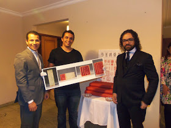](http://3.bp.blogspot.com/-zrz3F4CFT48/VQ_5Ptr7fxI/AAAAAAAAR0U/IsRuamVGDlE/s1600/101_3162.JPG)

(Aqui seguro , usando luvas, uma das fases seguintes do projeto. Fotos em alta resolução de cada um dos selos em papel especial. Ao vivo, é algo simplesmente incrivel! Tive a honra de tocar no material e ser convidado pra posar ao lado de Si Baak Anderson Maia e Si Sok Leo Mordente)

((Here I hold, wearing gloves, one of the following phases of the project. High resolution photos of each seals on special paper. Live, is something simply amazing! I had the honor of hold the material and be invited to pose next to Si Baak Anderson Maia and Si Sok Leo Mordente)

  
  
Considerando-se a produção feita até o momento e tendo em vista o suprimento das lacunas deixadas em cada obra, propõe-se a elaboração da seguinte série de publicações (para mais detalhes, por favor, visite [www.vingtsunkuenkuit.com](http://www.vingtsunkuenkuit.com/)):  
  
1) Pôster Ving Tsun Kuen Kuit Suen Hak  
2) Ving Tsun Kuen Kuit: Uma Nova Tradução  
3) Ngau Gu Jaai Yan Po [Catálogo de Selos do Estúdio dos Paleófilos]: Edição Fac-similar,  
  
Transcrição e Tradução  
4) Ving Tsun Kuen Kuit Suen Hak: Edição Completa  
5) Ving Tsun Kuen Kuit Suen Hak: Edição de Luxo  
  
Considering the production to this date and focusing on filling the existing gaps on each of   
the works, we propose the development of the following series of publications (for a detailed   
information, please visit [www.vingtsunkuenkuit.com](http://www.vingtsunkuenkuit.com/)):  
  
1) Ving Tsun Kuen Kuit Suen Hak Poster  
2) Ving Tsun Kuen Kuit: A New Translation  
3) Ngau Gu Jaai Yan Po [Catalog of Seals of the Palaeophiles’ Studio]: Facsmile Edition,   
  
Transcription and Translation  
  
4) Ving Tsun Kuen Kuit Suen Hak: The Complete Edition  
5) Ving Tsun Kuen Kuit Suen Hak: Deluxe Edition  

[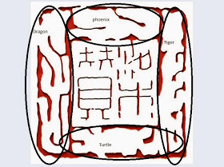](http://2.bp.blogspot.com/-0kIhWFmkXVE/VQ9bMtx87wI/AAAAAAAARz0/ZSg_BnzrWQ0/s1600/jaan%2Bok.jpg)

Eu passei por essa experiência já na própria palestra, quando Si Sok Leonardo Mordente mostrou o selo de Leung Jaan , e pra minha surpresa , continha mais do que simplesmente imaginaria todos esses anos... Você consegue ver : Um Dragão, tigre, fênix, tartaruga.Nesse selo?  
  
I went through this experience already in his own lecture, when Si Sok Leonardo Mordente showed Leung Jaan seal, and to my surprise, contained more than just imagine all these years ... Can you see: A dragon, tiger, phoenix and a turtle .In this seal?  
  

[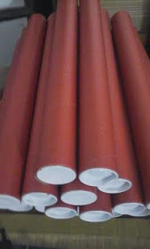](http://4.bp.blogspot.com/-O0U72_fZs7I/VQ_3FrKIT3I/AAAAAAAAR0I/rx6TBsKkgyU/s1600/unnamed%2B(1).jpg)

  
  
Si Sok Leonardo Mordente deixou um bom número de pôsteres comigo para que as pessoas do Rio tenham acesso caso queiram adiquirir. Para isso é só entrar em contato comigo pelo email: moyfatlei.myvt@gmail.com  
Si Sok LeonardoMordente left a number of posters with me so that people of Rio have access if they want to buy. For it is only contact me by email: moyfatlei.myvt@gmail.com  
  
  
  

**THE DISCIPLE OF MASTER JULIO CAMACHO**  
**THiago Pereira "Moy Fat Lei"**  
**moyfatlei.myvt@gmail.com**

[BLOG DO PEREIRA](http://www.blogger.com/profile/16153233145352960778 "author profile")

at
[14:34](http://moyfatlei.blogspot.com.br/2015/03/ving-tsun-kuen-kuit-lecture-in-rio.html?m=1 "permanent link")
