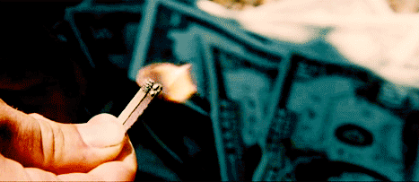
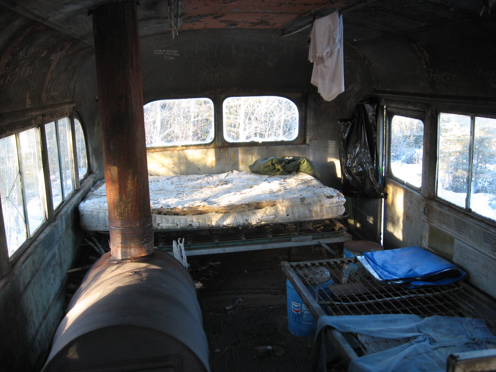
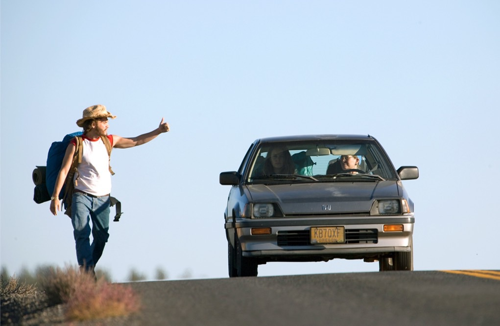

# 23 dicas práticas para viajar mais

Juntar grana, planejar a viagem e saber viajar barato rendem probabilidades muito maiores de você sair mais vezes com a mochila nas costas

Você jurou que em 2015 ia viajar mais, mas março já está no fim e até agora nada. Pior: tem mais um feriado chegando, mas você ainda não sabe o que fazer.

E ainda tem aquela sonhada viagem de férias, seja [para a Europa](http://www.360meridianos.com/2014/04/quanto-custa-um-mochilao-pela-europa.html), para [um paraíso na Ásia](http://www.360meridianos.com/2013/03/dicas-de-viagem-para-a-asia.html) ou [um mochilão pela América do Sul](http://www.360meridianos.com/2015/03/quanto-custa-um-mochilao-pela-america-do-sul.html). Como tornar esses sonhos reais? Juntei algumas dicas que aprendi nos últimos anos. Todas elas já me garantiram algumas viagens.

### Para juntar dinheiro e viajar mais

Não torra sua grana assim não, fera

**1.** Estude seus gastos mensais. Há algo que possa ser cortado? Não responda rapidamente a essa pergunta, pois sua tendência é dizer não. Faça uma análise cuidadosa de tudo, começando um orçamento base zero.

Você precisa mesmo de TV a cabo? Qual o seu gasto mensal com coisas pequenas, tipo um cafezinho diário ou aquela barra de chocolate? Tem carro? Você gasta quanto para usá-lo? Ficaria mais barato usar o transporte público? E sua conta de celular, dá para reduzir?

**2.** Defina uma poupança de viagem. Uma vez analisado o orçamento, defina quanto você pode guardar na sua poupança de viagem, todo mês. Mande esse dinheiro para a poupança **assim que você receber o salário**.

**3.** Não faça compras desnecessárias. Isso vale até para o supermercado - vá sabendo o que você realmente precisa, de forma a evitar gastos muito grandes. Vale também procurar supermercados mais baratos. Aquele que tem ar-condicionado e toca música durante suas compras certamente será mais caro do que aquele que é quente feito o inferno e tem uma fila gigante.

A experiência de compras nele é pior, mas seu bolso vai te agradecer.

**4.** Tudo é uma questão de prioridades. Não há nada de errado em gostar de bons restaurantes ou de sair para beber todo fim de semana. Mas se seu orçamento não comporta esses gastos e viagens frequentes, você terá que escolher entre eles.

Toda escolha é válida.

Se optar por viajar mais, passe a tomar uma cervejinha em casa, a assistir filmes da sala de TV ou a ir a restaurantes mais baratos. **E isso não significa abandonar completamente a vida social**, claro. Mantenha o equilíbrio.

Bater um papo com os bróder

**5.** Tem algo que você possa vender? Antes [da minha viagem de volta ao mundo](http://www.papodehomem.com.br/como-dar-a-volta-ao-mundo-passo-a-passo), quando passei quase um ano na estrada, vendi meu carro. **É claro que essa não é a saída para todo mundo**, mas vender algo que você não precisa pode te ajudar a financiar até uma viagem mais curta, de férias mesmo.

Tipo um videogame, uma câmera, uma guitarra ou um smartphone.

**6.** Antes de relaxar, trabalhe mais. Tem quem pegue frilas, quem encare um segundo emprego temporário e até quem peça para fazer horas extras no trampo. Eu usei todas essas estratégias para juntar dinheiro para minha viagem de volta ao mundo.

Para quem vai fazer viagens mais curtas, **um frila já deve ajudar**.

### Planejando a viagem

**7.** Você não precisa viver só de grandes viagens. Dá para fazer muita coisa legal só durante feriados e fins de semana. Foi assim que eu conheci [Florianópolis](http://www.360meridianos.com/tag/florianopolis) e [Foz do Iguaçu](http://www.360meridianos.com/tag/foz-do-iguacu), por exemplo.

E tem gente que encara até viagem internacional com dois ou três dias: [Buenos Aires](http://www.360meridianos.com/tag/buenos-aires), [Montevidéu](http://www.360meridianos.com/2014/11/o-que-fazer-em-montevideu-uruguai.html) e [Santiago](http://www.360meridianos.com/santiago-chile-planejar-viagem) estão logo ali, quase sempre com preços de passagens convidativos. **Pelo menos se forem compradas com antecedência**.

**8.** Nem sempre o problema é dinheiro. Muitas vezes é só falta de planejamento. Se você quer viajar no feriado de Corpus Christi (uma quinta feira, no dia 4 de junho), a hora de se planejar é agora.

Não adianta lamentar por não ter feito isso para a Semana Santa.  **Olhe para o futuro** para garantir uma viagem incrível no feriado.

**9.** Ainda sobre planejamento: há um senso comum que diz que viajar pelo Brasil é sempre caro. Embora exista um fundo de verdade nessa afirmação, quem se planeja, compra passagens e reserva hotéis com antecedência gasta bem menos.

Por exemplo, na Semana Santa eu vou para o Maranhão. E paguei apenas R$ 220, ida e volta e com taxas, no voo entre Belo Horizonte e São Luís. Também  paguei um valor semelhante para ir a Porto Alegre, no começo de março, e em passagens para Alagoas, no meio de abril. **Sempre dá para achar preços assim**, basta se planejar.

**10.** Não se planejou? Talvez ainda tenha uma saída. Entre nos sites das principais empresas aéreas e busque pela passagem mais barata partindo da sua cidade. Abra a cabeça e abrace os destinos que aparecerem para você.

Capitais brasileiras menos turísticas, como Porto Alegre, Brasília, Curitiba e Belo Horizonte, costumam ter voos mais em conta, mesmo em feriados.  Eu já consegui preços incríveis até para o dia da viagem. Isso também vale para reservar hotéis - alguns oferecem bons descontos para reservas feitas na última hora, tudo para encher os quartos vagos.

**11.** Seja realista. Alguns destinos sempre serão caros, por mais que você seja mágico na hora da economia. Por isso, o viajante econômico evita focar muito naquela viagem para Fernando de Noronha ou para a Ilha de Páscoa. Até que apareça uma promoção para esses lugares, claro.

Outro exemplo: você pode até conseguir ir para Maragogi, mas talvez o resort all inclusive não seja para você, pelo menos não dessa vez. E isso não é um problema.

### Para deixar sua viagem mais barata:

**12.** Fique de olho nas promoções de passagens aéreas. Vez ou outra aparecem preços inacreditáveis, tanto para o Brasil quanto para o exterior - esse ano teve um monte de gente que pagou R$ 600 em passagens para a Europa, ida e volta e com taxas.

Para isso, um site muito útil é o [Melhores Destinos](http://www.melhoresdestinos.com.br/), que só este ano já me garantiu duas viagens. Preste ainda mais atenção nos fins de semana, quando as empresas aéreas costumam fazer promoções.

***Obs. do editor:** também há o site [Skyscanner](http://www.skyscanner.com.br/), em que você cadastra seu destino e data planejada e ele envia e-mails com informações de baixa e aumento do preço na passagem em dezenas de sites. Quando estiver no preço que você gostaria ou acha interessante, basta entrar e comprar.*

**13.** Utilize milhas aéreas. O grande segredo para viajar com milhas envolve pagar tudo no cartão de crédito - até aquele cafezinho ou o refri que você compra na padaria. **Isso significa ter um controle financeiro gigante**, afinal suas contas virão só mês seguinte.

Se você acha que consegue, pode ser uma boa.

Procure cartões que garantam mais milhas por dólar gasto. Além disso, escolha um bom programa de milhagem e tente ser fiel àquela empresa aérea.

**14.** Cozinhe! Sim, viajar é uma ótima oportunidade de provar novas comidas. Mas se você tem pouca grana, uma forma de deixar tudo mais barato é indo ao supermercado. **Faça compras, leve tudo para o hostel/hotel e cozinhe por lá**. Por isso mesmo, vale a pena ficar em locais que ofereçam uma cozinha equipada. Está na rua? Vá aos mercados, abuse da comida de rua ou encare um piquenique.

**15.** Escolha destinos baratos para viajar. Eu sei que você sonha em ir para a Europa e morre de vontade de fazer uma road trip pelos Estados Unidos. Mas o mundo é gigante. E, o melhor, [cheio de lugares absurdamente baratos para viajar](http://www.360meridianos.com/2014/03/9-paises-fugir-precos-sao-paulo.html).

Já cheguei a pagar R$ 14 na diária de um hotel em Katmandu, no Nepal. R$ 14 para o quarto de casal. E com café da manhã. Na Malásia, paguei R$ 13 num quarto duplo que ficava de frente para a praia.

**É claro que as passagens para esses lugares são mais caras**, mas no resto você economiza. E muito. Fora que sempre dá para achar promoções.

**16.** Visite atrações gratuitas. Vai passar por Veneza? Prepare-se para gastar muito dinheiro se quiser fazer um dos tradicionais passeios de gôndola. Ou, se você preferir, **esqueça o barquinho e perambule (de graça) pela cidade**. Foi o que eu fiz. Comprei uma garrafa de vinho, queijos, me sentei de frente para um canal e observei Veneza. Com direito a ouvir as músicas que vinham das gôndolas.

**17.** Prefira viajar na baixa temporada. Ok, isso nem sempre é possível, mas pode tornar tudo mais barato. Desnecessário explicar mais, né?

**18.** Faça couchsurfing. Além de deixar sua viagem mais barata, afinal você não paga pela hospedagem, **o couchsurfing é uma possibilidade incrível de conhecer novas pessoas**. Fez toda a diferença durante os dias que fiquei em Kuala Lumpur, na Malásia. E foi a única coisa que tornou possível passar um Oktoberfest em Munique, afinal eu jamais conseguiria pagar um hotel na época mais concorrida da Alemanha.

**19.** Pegue carona. Tá aí uma coisa que eu nunca fiz, mas com certeza tornaria a viagem mais barata. **Na Europa existem até sites e apps para você combinar uma carona**, como o Carpooling e o  Blablacar. E o PapodeHomem [tem um texto sobre como pegar carona com caminhoneiros](http://www.papodehomem.com.br/como-pegar-carona-com-caminhoneiros/).

**20.** Viaje devagar. Quanto mais deslocamentos você fizer, mais cara fica sua viagem. Por isso, o mantra do viajante econômico é: viaje com calma, sem estresse. Nada de transformar 15 dias na Europa numa maratona, uma corrida para percorrer cinco cidades.

Escolha um lugar e fique por lá um tempo razoável antes de se deslocar para outras cidades. Tão importante quanto isso é entender que você não precisa ver tudo. **Não é necessário entrar em todas as atrações turísticas**, pagar a entrada em todos os museus, investir em todos os programas.

Faça o que você realmente quer, aquilo que você gosta. E guarde um tempo para relaxar, afinal você está de férias, certo?

**21.** Tenha um orçamento definido. Para isso, saiba exatamente quanto você pode gastar por dia, já descontados gastos maiores, como as passagens de avião ou o seguro de viagem.

Exemplo prático: suponha que você tenha 60 euros por dia para gastar durante um mochilão pela Europa. Esse valor inclui tudo, hospedagem, comida, passeios, bares, cervejas. **Ao fim de cada dia, anote todos os seus gastos e veja qual a sua média diária**. Isso pode te mostrar se há necessidade de economizar. Ou, pensamento positivo, se você pode gastar mais - e esbanjar.

**22.** Compre pouco. Ou melhor, não compre quase nada, só lembrancinhas.  Não há nenhum problema em fazer compras, mas a necessidade de encher malas e malas com compras - para você, seus familiares e amigos - tende a aumentar bastante o custo da viagem. Além dos gastos com as compras em si, ainda tem o problema do excesso de bagagem. O que leva ao próximo tópico.

23 - Viaje leve. Quanto menos malas você levar, mais barato fica. Na Europa e na Ásia, por exemplo, **as companhias low costs costumam oferecer preços incríveis**, mas normalmente a oferta só fica boa mesmo se você não precisar despachar bagagem.

Acredite: tem jeito de encarar uma viagem intercontinental sem despachar sua mala.

---

*publicado em 21 de Março de 2015, 00:00*
