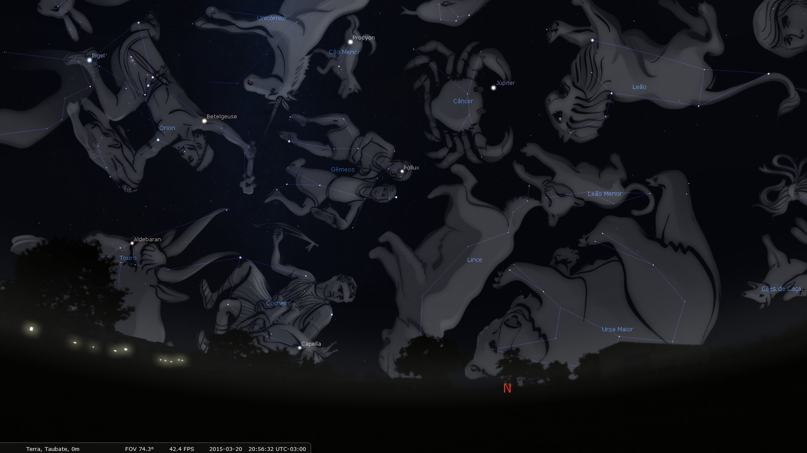
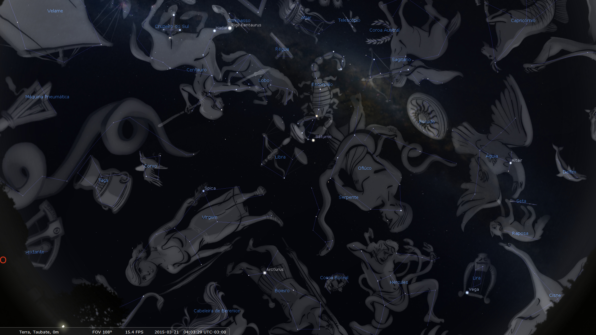

# A dança de Ártemis

Como a mitologia e a mudança de estações podem te colocar em contato com o mundo natural e ajudar a entender melhor o que está à nossa volta

As nuvens no céu tal qual espuma branca espalhada no mar
azul anunciam a aproximação da frente fria.

Dias cada vez mais curtos, viajamos na nave Terra rumo ao
momento em que dias e noites são iguais em ambos os hemisférios do globo – encontro
de forças especial que ocorre duas vezes ao ano. No último dia 20 de março,
tivemos o Equinócio de Outono aqui na metade Sul da esfera terrestre: a partir
dessa data literalmente mergulhamos na escuridão enquanto as populações do
Norte saem dela ao encontro da luz. As forças de vida e crescimento existentes
no verão – luz, calor, água, brotação, germinação – lentamente diminuem sua
atuação, abrindo caminho para o escuro, frio, seca, dormência no crescimento e
queda de folhas. O Equinócio de Outono é o clímax de celebração da abundância
das colheitas de um Verão bem trabalhado.

[No sítio](http://www.papodehomem.com.br/exodo-urbano-a-saga-de-uma-familia-que-largou-a-cidade-e-foi-viver-no-campo),
longe das distrações modernas, é possível reduzir a Vida aos seus termos mais
simples. Os poros da pele pulsam no ritmo do Universo. A mente migra do mundo
material exterior para a imensidão das dimensões interiores e a natureza exala
o sopro final de um ciclo para iniciar uma longa inspiração.

É tempo de introspecção; desde os tempos em que os deuses
caminhavam pela Terra.

Quem não se apaixonaria por Ártemis…

Rainha das florestas, de temperamento introvertido,
aventuroso, independente. Deusa da caça de corpo viril, sempre acompanhada por
animais, pássaros e lobos. Nasceu muito rapidamente e logo em seguida ajudou
sua mãe a parir o irmão gêmeo, Apolo, que nutria por ela um enorme ciúme.  Em
sua infância, Ártemis pediu ao pai Zeus que a deixasse passear e bailar
livremente pelas matas em companhia dos animais e feras, livrando-se da
obrigação do casamento. Ártemis dançava pelas florestas com sua túnica branca
esvoaçante e arco de caça dourado pendurado ao ombro. Os Deuses abandonariam o
Olimpo em um segundo para passar o resto de seus dias como mortais ao seu lado.
Mas homem – ou Deus – algum tinha capacidade de conquistar sua atenção.

Com exceção de Órion.

Filho de Poseidon, Deus do mar, e de Gaia, Deusa da terra,
possuía beleza magnífica e cresceu tanto em altura que era capaz de caminhar
pelo leito oceânico sem que as águas cobrissem seus ombros. Caçador
extraordinário, ele e Ártemis encontravam-se em uma dimensão inalcançável por
qualquer outra companhia. Quando estavam juntos, suas personalidades fortes e
individuais jamais se fundiam; complementavam-se em poderosa simbiose.

No entanto, quanto mais luz, maior a sombra. Apolo nutria
pela relação dos dois um ciúme incontrolável.

Certo dia, enquanto Órion fugia de um escorpião gigante,
Apolo desafiou sua irmã gêmea nas habilidades com o arco. À beira da praia,
apontou um pequeno ponto escuro no horizonte e duvidou da capacidade de Ártemis
em acertá-lo. Orgulhosa, ela retesou a corda do arco dourado e disparou uma
flecha certeira. Em alguns instantes seus pés imersos na água mancharam-se com
sangue, e com um sobressalto percebeu o corpo inerte de seu grande amor
flutuando em direção à areia.

Órion é uma das constelações mais notáveis e de mais fácil
identificação no firmamento. As três estrelas conhecidas como “três Marias”
formam seu cinturão. Uma das estrelas mais brilhantes, Betelguese, de brilho
avermelhado, forma o ombro do caçador. Rigel, também de briho intenso, forma a
diagonal do tronco de Órion.

Simulação de imagem do céu em Taubaté, em 20 de Março de 2015 às 21:00. Note Órion de cabeça para baixo, à Noroeste. Imagem feita com o software Open Source

Ártemis, ou Artemísia, está presente no firmamento
representada pela lua – que quando crescente desenha seu arco. O escorpião é a
constelação mais característica do céu de inverno e, uma vez encontrado, sua
imagem jamais é esquecida. Ele aparece sempre à leste de Órion, e poucos dias
do ano ambos estão presentes juntos no céu noturno.

Simulação do céu de Taubaté em 20 de Março de 2015 às 04:11. Note o Escorpião no topo do firmamento. Imagem feita com o software Open Source

À noite, Órion continua sua jornada para Oeste em fuga
incessante do Escorpião; que dominará o firmamento. A nós, reles mortais, em
dúvida quanto ao desfecho da mítica estória de amor, resta assistir ao
espetáculo dos Deuses que se desdobra no palco celeste.

Essa pequena estória da mitologia Grega foi contada milhares
de vezes por mães e pais ao colocar os filhos para dormir e entreter as
crianças. Conectando elementos da natureza presentes na vida cotidiana à
imaginação, os gregos antigos desenharam figuras no céu e criaram estórias
riquíssimas em valores morais, éticos, hábitos e costumes de seu tempo. E o
pano de fundo das estórias, o firmamento, se movimentava ao longo do ano na
mesma cadência dos movimentos terrestres, dando ritmo e dinamismo à transmissão
cultural do povo fundador do que chamamos de cultura ocidental.

Da mesma forma, outro povos milenares – como os Chineses e
Egípcios, povos tradicionais Tupi-guarani, Lakotas, Maoris, a cultura Nórdica e
Polinésia pré-industriais – tinham na natureza, e especialmente no céu
estrelado, as páginas ilustradas dos livros que transmitiam sua cultura e modo
de vida. O calendário de plantio e colheita, corte de madeira, festas, rituais
religiosos e estações de caça eram todos definidos pela posição dos astros no
céu.

Assim como outros navegadores, [os Polinésios utilizavam as
estrelas como referências para estimar sua localização no oceano](http://www.exploratorium.edu/neverlost/). Como
complemento ao método de navegação, cada caminho entre as milhares de ilhotas
do arquipélago tinha uma música específica, cujo tempo de duração era
exatamente o tempo para chegar ao destino. A letra da música descrevia as
particularidades do caminho: cardumes de peixes, plantas, recifes de corais e
até sons. Algumas das embarcações possuíam no casco uma “câmara” localizada
abaixo da linha d’água, onde um navegador experiente viajava deitado apenas ouvindo
os sons do percurso.

Ritmo é uma qualidade intrínseca da Natureza e do Universo,
e criar sincronia com esses pulsos universais causa uma enorme sensação de
pertencimento a algo muito maior. É um exercício interessante e divertido
“parear” o ritmo individual de nosso organismo com os ritmos maiores do planeta
e do cosmos, e a mudança de estações do ano é uma excelente oportunidade para
começar.

À medida que enxergamos o dinamismo do mundo natural no qual
estamos imersos (mudanças nas cores das folhas de árvores, épocas de floração
das plantas,  nível dos rios, cor do céu, forma das nuvens, movimento dos
insetos, canto dos pássaros, qualidades do pensamento e da ação individuais e
coletivas), ganhamos vocabulário e narrativas ecológicas que nos ajudam a
entender melhor o mundo à nossa volta. E não é preciso estar em um sítio ou
isolado em locais remotos para começar a fazer essa conexão. As grandes cidades
oferecem uma enormidade de oportunidades para mergulharmos no mundo natural no
qual estão inseridas. Basta abrir os olhos.

\*\*\*  
  
PS: Aos interessados em saber mais sobre o céu e as constelações, vale a pena
baixar [o software Open Source “Stellarium”](http://www.stellarium.org/pt/). Com ele, é
possível simular o céu em diversas localidades e épocas do ano, visualizar as
constelações e se aprofundar na maravilhosa ciência da Astronomia. E de quebra,
mergulhar na mitologia e compreender um pouco mais o espírito humano.

---

*publicado em 22 de Março de 2015, 00:05*
