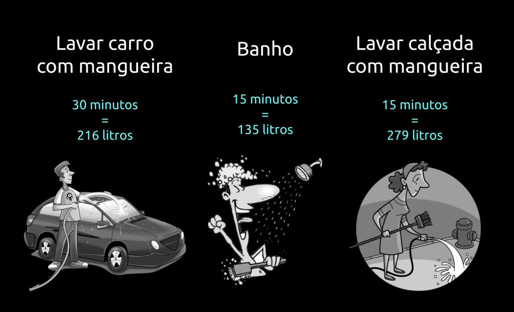
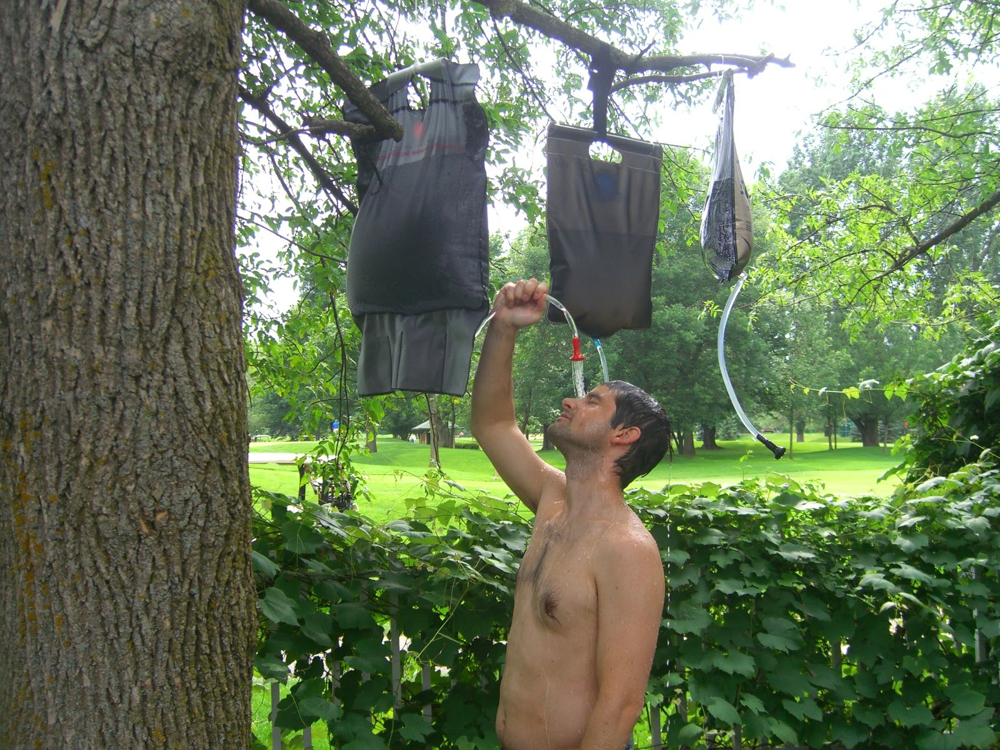
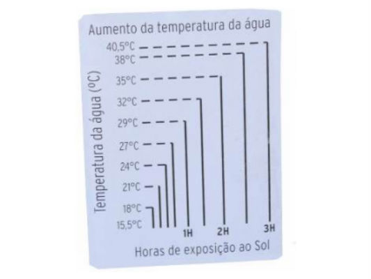
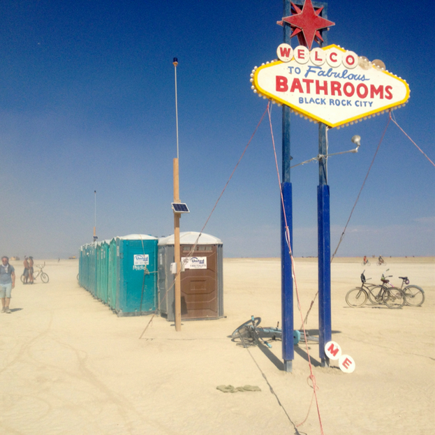

# Como economizar água: dicas de sobrevivência no deserto para aplicar no dia a dia

Você não precisa viver como se estivesse no deserto - ainda - mas essas dicas podem ser bem úteis para diminuir seu consumo e economizar na conta de água

Não é novidade para ninguém a falta de água em São Paulo. Dicas sobre como economizar água estão em todos os lugares.

Também não é novidade os maus hábitos do brasileiro no consumo de água.

Se você quer saber mais sobre o problema da água em São Paulo, o UOL TAB fez um excelente trabalho para explicar isso.

Nosso objetivo aqui é outro: sabendo da falta d’água, como você vai fazer para sobreviver como um ninja, se realmente a água acabar, ou como fazer para gastar o mínimo de água possível, e, com isso, economizar uma grana também.

No Brasil, [consumimos uma média de 166.3 litros diários](http://www1.folha.uol.com.br/infograficos/2015/01/118521-agua-no-brasil.shtml), enquanto a ONU (Organização das Nações Unidas), recomenda que o mínimo necessário para um cidadão ter uma vida saudável é 110 litros por dia.

Guarde esse número, 166 litros, que é o consumo per capita de água no Brasil, voltaremos a ele logo.

Aqui, vamos fazer um paralelo com o [Burning Man](http://www.hacklife.co/2014/10/27/burning-man-101/), um festival de contracultura que acontece no meio do deserto de Nevada.

Lá, você é o responsável por levar e administrar toda a água que você vai usar. Não tem como comprar, trocar, nada. Se você planejou errado, se ferrou. Se desperdiçar, também.

No Burning Man, [o recomendável é que se leve 1.5 gallons](http://burningman.org/event/preparation/playa-living/water/) (5.67 L, traduzindo do sistema imperial dos americanos) por dia.

Com essa água você vai:

- beber
- dar descarga
- tomar banho
- lavar louça
- lavar as mãos
- escovar os dentes

Isso mesmo, com quase 6L, isso é o suficiente para você passar pelo seu dia tranquilamente.

Na minha experiência, depois de 7 dias, eu consegui trazer de volta uma garrafa de 1.5 Gallon.

Não, eu não deixei de tomar banho nem escovar os dentes por um dia sequer, antes que perguntem.

Vamos descobrir como tudo isso é possível a seguir.

### Água para beber

Muito bem, para começar, vamos logo tirar a quantidade de água que você vai beber.

Estamos em condições extremas de seca e calor, portanto deve-se beber entre 2L e 3L de água por dia.

Considerando que vamos beber 2.5L de água por dia, ainda temos 3.5L.

Consumo total: 2.5 de 6 L

### Água para Banho

No meio do deserto, ninguém tem dúvidas, um chuveiro de acampamento é a melhor pedida.

Geralmente com capacidade de 20L, pode-se encher ele de uma vez e deixar tomando sol para que a água esquente. O gráfico abaixo mostra como funciona:

Cada banho não deve usar mais que 2.5L de água.

Sim, é possível. O banho é apenas para tirar a sujeira do corpo, ele não é seu terapeuta.

Era possível lavar inclusive o cabelo todos os dias no festival com essa água. Várias mulheres utilizavam a mesma quantidade de água e tinham cabelos compridos.

Todo e qualquer banho deve ser tomado com uma bacia embaixo de você, dessa forma, você reaproveita a água e pode usá-la para descarga. Apesar de, no Burning Man, a maioria utilizar banheiros químicos, algumas pessoas utilizavam dessa técnicas quando vinham em trailers.

Dessa maneira, podemos considerar que a água do banho é a mesma para a descarga. Em um ambiente urbano, isso funciona muito bem!

Consumo total: 2.5 + 2.5L = 5 de 6 L

Ainda temos 1 L.

### Lavar as mãos

Deve ser feito apenas quando extremamente necessário.

De acordo com a organização mundial da saúde, o [álcool gel satisfaz todas as condições de higienização](http://www.who.int/gpsc/tools/faqs/system_change/en/). A não ser que sua mão apresente sinais evidentes de sujeira que só podem ser eliminadas com sabão (se você é um mecânico que mexe com graxa e óleo o dia inteiro), o álcool gel vai ser o seu aliado.

Dessa maneira, vamos considerar que sua mão será lavada no banho, e no resto do dia deverá ser higienizada com álcool gel.

Pois bem, você ainda tem 1L.

### Escovar os dentes

Para escovar os dentes, 200ml por dia é mais que o suficiente.

Não precisa abrir a torneira antes. Escove seus dentes usando apenas a escova e a pasta. Para enxaguar a boca, faça um leve bochecho com 50-100ml de água, e pronto.

Consumo total: 5.2 de 6 L

### Cozinhar, lavar a louça e a roupa

Tudo bem, você ainda tem que cozinhar, lavar louça e lavar a roupa certo?

Vou dar uma colher de chá, vamos multiplicar tudo isso por 4.

Arredondando, você tem 20L de água por dia.

Você deve saber o consumo da sua máquina de lavar roupas. É possível que ela chegue a até [100 litros por lavagem](http://g1.globo.com/sao-paulo/blog/como-economizar-agua/post/como-economizar-escolhendo-o-modelo-correto-da-lavadora-de-roupas.html).

Se você economizar 10L de água por dia, você pode fazer uma lavagem a cada 10 dias. Acredito que seja o suficiente para encher sua máquina.

A roupa você pode acumular a da semana inteira.

O mesmo se aplica a lavar louças. Supondo que sua máquina [gaste 10 litros por lavagem](http://g1.globo.com/sao-paulo/blog/como-economizar-agua/post/como-economizar-agua-com-maquina-lava-loucas-no-lugar-da-lavagem-manual.html), espere lotar a máquina, e então lave toda a sua louça de uma vez.

Evite lavar louças manualmente, estima-se que a máquina de lavar louças traz uma economia de até 80% de uso de água.

### Conclusão

Você lembra do número que pedi para guardar? 166 litros?

Se o Brasileiro usa em média 166.3 L por dia, vimos muito bem que é possível ser apenas 12% de um brasileiro.

20/ 166.3 = 12.03 %

Acabamos de mostrar que é possível, caso necessário, viver com 20 litros de água por dia. Onde você está gastando os outros 146.3??

Não fique feliz em estar na média. Faça sua parte, fique de consciência limpa.

Que tal escolher uma das técnicas e experimentar durante duas semanas?

Com tudo isso, ainda resta o maior inimigo da economia de água. Somos todos seres humanos e sabemos o quanto é difícil [mudar hábitos](http://www.hacklife.co/2014/12/20/como-mudar-habitos/). Mas, passo a passo conseguimos grandes mudanças.

Deixo o desafio: quantos litros de água você consegue economizar em seu dia a dia?

---

*publicado em 11 de Março de 2015, 21:18*
