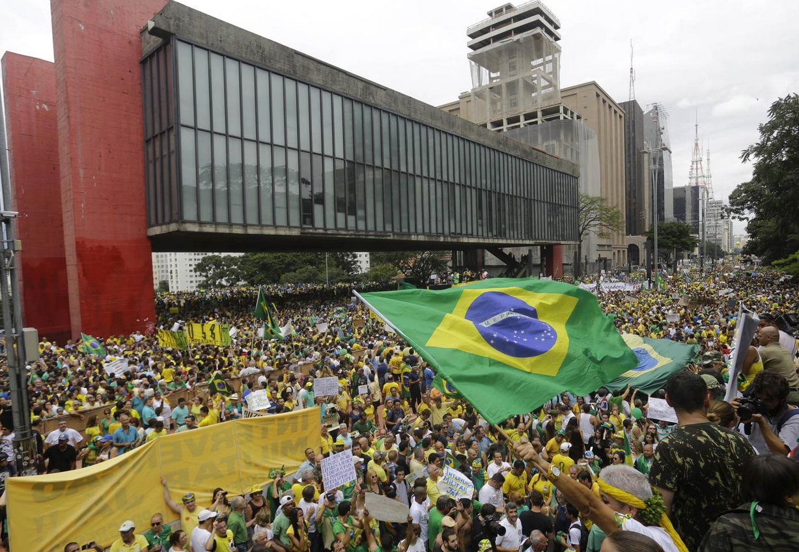

# Impeachment e renúncia: como funcionam e por quais motivos poderíamos querer um presidente fora de seu cargo?

Protesto pelo protesto não adianta, para sermos melhores políticos e cidadãos é essencial entendermos os impactos de nossas demandas

Não estava nos planos, mas parece ser necessário tratar das manifestações de hoje. Em razão do calor do momento, quero discutir brevemente alguns pontos que estão na pauta. Vamos por itens.

1. Impeachment já?

Muito tem se falado do impeachment. Inclusive, o UOL fez [uma boa matéria esclarecendo diversas dúvidas comuns que rondam esse assunto](http://noticias.uol.com.br/politica/ultimas-noticias/2015/03/11/conheca-mitos-e-verdades-sobre-o-impeachment-no-brasil.htm)

Basicamente, você precisa saber do seguinte: se o Presidente se tornar impedido, toma posse o Vice-Presidente, Michel Temer. Não são convocadas novas eleições, nem o segundo colocado assume o cargo.

Se o Vice-Presidente também se tornar impedido, aí, sim, há novas eleições: indiretas, por meio do Congresso Nacional, se o impedimento do Vice-Presidente acontecer na segunda metade do mandato, e diretas, caso o impedimento aconteça nos dois primeiros anos. Simples assim. Dá uma conferida nos artigos 79, 80 e 81 da Constituição Federal.

Seguindo, vou procurar abordar aspectos jurídicos e manter a linha do percurso "[Para entender política](http://www.papodehomem.com.br/percursos/para-entender-politica)".

O impeachment pode ser definido como a perda do mandato em razão do cometimento de crimes de responsabilidade, que estão arrolados no artigo 85 da Constituição Federal e mais bem detalhados na [Lei 1.079](http://www.planalto.gov.br/ccivil_03/leis/l1079.htm). São considerados crimes de responsabilidades aqueles cometidos contra:

(i) a existência da União;

(ii) o livre exercício do Poder Legislativo, do Poder Judiciário, do Ministério Público e dos Poderes constitucionais das unidades da Federação;

(iii) o exercício dos direitos políticos, individuais e sociais;

(iv) a segurança interna do País;

(v) a probidade na administração;

(vi) a lei orçamentária; e

(vii) o cumprimento das leis e das decisões judiciais.

Importante manter a noção de **crime**. O direito penal é o mais formalista das áreas jurídicas, especialmente porque tem a capacidade de restringir a liberdade de um cidadão.

Por isso, o princípio da presunção da inocência, segundo o qual ninguém será considerado culpado até o fim do processo penal, é tão importante. Ele protege, acima de tudo, a nossa liberdade de ir e vir. Assim, o denunciante deve provar a culpa do acusado, o que é bastante diferente de se exigir que o acusado prove sua inocência.

Imagine você tendo que provar que não fez alguma coisa?

A prova de um fato negativo é um assunto tão discutido nos meios jurídicos que tem até um apelido bem sugestivo: prova diabólica.

Por isso, quando falamos de impeachment, há que se considerar:

1. os crimes capazes de gerar a destituição do cargo
2. a presunção de que o acusado é inocente até que se prove o contrário

Pois bem. Particularmente, não tenho conhecimento de provas irrefutáveis sobre o envolvimento da Presidente em qualquer dos crimes de responsabilidade. Faço questão de ressaltar o **irrefutáveis**. Argumentos do tipo “não é possível que ela não soubesse” são absolutamente úteis para você formar sua opinião acerca da figura política, mas não são argumentos jurídicos válidos para condenar qualquer pessoa em qualquer crime.

Já antevejo a crítica de formalismo excessivo, e realmente entendo a indignação que a origina, mas eu gostaria de começar a desconstruir a imagem de que as garantias processuais, em especial aquelas relacionadas ao direito penal, são nocivas à sociedade ou incentivam a criminalidade em qualquer nível. Uma boa pergunta para começar essa desconstrução é a seguinte:

> "Você gostaria de viver em uma sociedade em que é juridicamente aceitável punir alguém possivelmente inocente?"

*Ah, mas estamos falando da Presidente, não de uma pessoa qualquer!* Sim, estamos. E respondo ao questionamento com uma outra pergunta:

> "Você gostaria de viver em uma sociedade em que as leis se aplicam de forma diferente a depender de quem seja acusado?"

### 2. Renúncia já?

Se você é contrário à Presidente, me parece que este seria o seu melhor discurso por enquanto, pois exigir a renúncia tem um caráter muito mais político do que jurídico. Sugiro, contudo, algumas reflexões.

Eu fui à passeata de hoje aqui em São Paulo, como observador.

Queria ver as coisas por mim mesmo, sem depender de filtros editoriais, e o que eu senti foi uma indignação bruta e visceral presente nos manifestantes. Uma manifestação da proporção que vi hoje, com o nível de exaltação que presenciei, simplesmente não pode ser chamada de *massa de manobra, elite le creuset* e congêneres.

Essa parcela da população está sinceramente indignada, e desqualificar ou ignorar tamanha indignação não me parece sábio.

Confesso, porém, que alguns dos manifestantes me pareceram pouco preparados, e por isso digo que tinham uma indignação bruta. Para eles, é claro que a Dilma teria que renunciar *por causa de toda essa corrupção que a gente está vendo, e que do jeito que está, não dá para ficar*.

Mesmo o panelaço durante os pronunciamentos federais demonstra essa indignação visceral – eu particularmente tenho muita dificuldade em classificar como racional o ato de preferir bater panelas a ouvir os argumentos da parte contrária. Que tal ouvir o pronunciamento, separar as informações relevantes, digerir os argumentos para então discuti-lo? Me parece muito mais maduro e frutífero.

Outro ponto importante é a indignação seletiva que parece ter tomado conta dos manifestantes de hoje. É óbvio que a situação da Petrobrás é ultrajante. Entretanto, não localizei, por exemplo, indignação com o fato de os presidentes da Câmara e do Senado estarem, eles sim, na lista de investigados da operação Lava a Jato.

Também não ouvi ninguém acusar de ***estelionato eleitoral*** o Governador de São Paulo, que somente admitiu a existência da crise hídrica após o resultado das eleições. Essa indignação direcionada somente às falhas do PT e a aparente leniência com o PMDB e o PSDB, julgo, minam um pouco a legitimidade da manifestação.

Tanto a visceralidade quanto a indignação seletiva podem ser trabalhadas pelos manifestantes para melhorar o debate político e diminuir esse clima maniqueísta de FLA-FLU para o qual caminha a discussão política no Brasil.

Há muita lógica, também, por trás daqueles que defendem a permanência da Presidente.

As eleições aconteceram há menos de 6 meses, a Presidente não está impedindo as investigações policiais sobre o caso da Petrobrás, não há provas concretas de seu envolvimento com qualquer caso de corrupção e as medidas de austeridade econômica e social que estão sendo tomadas pelo governo seriam adotadas por qualquer outro político responsável que estivesse no cargo. Racionalmente, não são argumentos desprezíveis.

Se queremos políticos novos, devemos adotar novos padrões de conduta. Estabelecer o diálogo de argumentos entre situação e oposição deve ser prioridade de ambos os lados.

Este texto, mais curto e preparado no calor do momento, tem uma carga de julgamento pessoal que tentei ao máximo evitar nos outros textos da série. Mas, como de costume, aguardo seus comentários para construirmos um debate qualificado e, quem sabe, mudar algumas de minhas opiniões.

Vamos juntos.

**Para aprofundar em política:**

**Para aprofundar em bons diálogos:**

***Nota do editor, Guilherme:** convidei o Thiago para escrever esse texto no meio da tarde, trocando mensagens sobre a manifestação enquanto ela acontecia. Fiquei bastante feliz com sua disposição em escrever tão rápido mais um artigo que nos ajude em nosso percurso de alfabetização política.*

---

*publicado em 15 de Março de 2015, 21:18*
