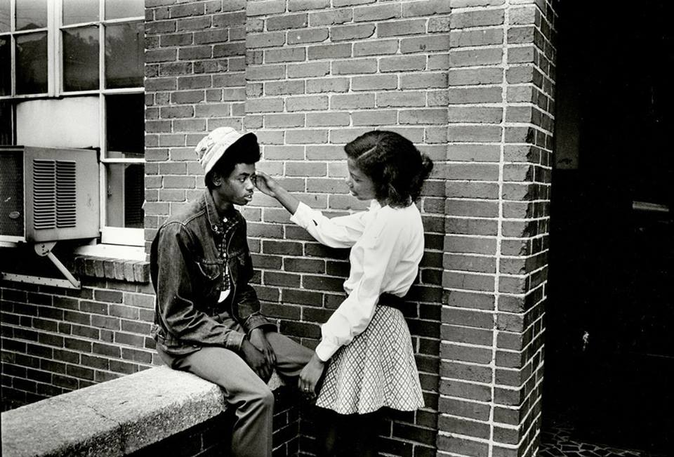

# "Meu marido não quer falar de sexo" | ID #42

Rigidez, obsessividade, tabus, quais fatores podem levar um homem a ter vergonha de transar?

> Estou casada há 7 meses e tenho muitas dúvidas em relação ao comportamento e desempenho sexual do meu esposo.
>
> 1. Ele nunca transa na posição "papai e mamãe";
>
> 1. Quase nunca temos preliminares;
>
> 1. No início ele broxava (desde o namoro);
>
> 1. Não se sente a vontade de falar sobre a vida íntima.
>
> Estou muito triste, pois amo meu marido, ele é compreensivo, companheiro, atencioso, muito dedicado, porém, se sente mal quando tento falar sobre sexo ou dar dicas do que gosto. Normalmente, se falo algo e ele sentir que é uma crítica, acaba se fechando.  
> Me ajude a entender e ajudá-lo, estou perdendo o interesse sexual por ele e sinto falta do sexo "papai e mamãe" no qual os corpos se tocam mais.  
> Obrigada, J.S.

Querida J.S.

Para seu consolo – se é que isso é um consolo – sua situação não é única e nem rara. Muitas mulheres se queixam de incompatibilidades sexuais com seus parceiros, mas vamos olhar essa questão com calma, tirando algumas possibilidades como uma homossexualidade latente, uma doença física que iniba produção de testosterona ou o desinteresse pessoal por você ter diminuído.

Minhas hipóteses vão pressupor que, apesar dele ter essa baixa de desejo e inacessibilidade emocional, ele é heterossexual, a ama, a deseja (à moda dele) e você é uma pessoa de personalidade agradável e disponível. Com isso em mente, podemos seguir.

### Cultura da hipersexualidade masculina

Nossa cultura reservou um papel sexual contraditório para o homem.

O sexo é algo que depende de entrega, confiança, relaxamento e uma dose de risco, no entanto, é comum um homem sentir-se cobrado e pressionado a ter uma desenvoltura olímpica (não necessariamente por parte da mulher, mas uma nuvem que carrega nos seus pensamentos). Broxar, então, não é uma opção.

Além da dificuldade em lidar com qualquer tipo de falha ou dificuldade, também existe um mito do amante latino-brasileiro que o espreme a ser ultra-desejoso e disponível para o sexo.

O homem que deseja menos do que o mito corrente (no mínimo, uma transa por dia) está inevitavelmente fadado a ser visto como fraco, frouxo, homossexual e candidato à corno. Ele pode não fazer nenhum gol, mas tem que tentar incansavelmente.

Isso parece ser ainda mais notório nos jovens casais, inconscientemente pressionados a manter o forno altamente aquecido, pelo menos nos primeiros anos.

A realidade é que as pessoas tem gostos e impulsos sexuais diferentes, seja em objetos de desejos e frequência sexual.

Há pessoas que colocam o sexo como prioridade máxima em suas vidas (porque se sentem habilidosas na cama), enquanto outras se sentem mais à vontade estudando, viajando, conversando ou qualquer outra coisa.

Para alguns, o sexo é uma das muitas possibilidades de entretenimento, para outros é a melhor atividade da vida. Cabe ver em que ponto cada um se encontra entre esses dois extremos.

### Ele tem tabus

Por que um homem não pode ter travas, medos e tabus sexuais?

O fato é que, sim, podem (e têm!), mas na nossa cultura isso não é bem visto.

Na realidade, uma quantidade muito grande de homens sofre do mesmo tipo de repressão cultural que já é velha conhecida das mulheres.

Os homens que passam por esse constrangimento não tem para quem contar o que acontece entre quatro paredes, afinal, os amigos tirariam sarro e ele se sentiria tolo. Entre as muitas possibilidades, ele pode achar sexo anal um pecado, oral um desperdício e achar que sexo mesmo (na cabeça dele) é o penetrativo e reprodutivo.

Para algumas pessoas que têm tabus, o sexo não foi feito para o prazer improdutivo, mas para a reprodução e para selar a união do matrimônio. Nem mais e nem menos.

### Ele pode ter uma personalidade obsessiva

Pessoas com [personalidade obsessiva](http://www.sobreavida.com.br/2013/08/13/obsessivo/) são fascinadas por controle, seja ele de emoções, pessoas, acontecimentos.

Seu objetivo principal é evitar mudanças, imprevistos ou ser assaltado por qualquer emoção perturbadora, sua meta é parecer o mais equilibrado e menos frágil possível.

Para sustentar essas aspirações impossíveis, desenvolve uma metodologia própria cheia de regras e caminhos que só fazem sentido para ele, é capaz de passar boa parte do seu tempo ruminando ideias.

Esse hábito adia suas realizações por meio da busca pela perfeição. Quando falha, fica remoendo seu erro numa artilharia de autocrítica infinita e, se os outros falham com ele (e não precisa muito para riscar sua película de imutabilidade), pode ter certeza que um inimigo foi criado para sempre.

A incapacidade de perdoar ou seguir com a vida é uma marca dos obsessivos, tanto que eles costumam ter mais bloqueios para perdoar ou tolerar injustiças, pois querem um mundo igualitário. Não raro, são muito possessivos, ciumentos e mesquinhos financeiramente, como resultado de sua necessidade de ter controle e acumular bens. Ele sempre acha que em algum momento vai precisar daquilo, então, seja com dinheiro ou amor, ele quer exclusividade plena e não deixará que nada do que é seu seja "profanado".

Na cama, os obsessivos tendem a ser mais passíveis de [broxar](http://www.papodehomem.com.br/broxei-por-que-id-2), ter [ejaculação precoce](http://www.papodehomem.com.br/tenho-ejaculacao-precoce-e-estou-viciado-em-punheta-or-id-39), incapacidade de gozar ou inibições com fantasias sexuais, pois ele tem dificuldade para relaxar, permitir, soltar, gozar. Sua personalidade costuma ser pautada em cima do controle e sexo tem muito de não controlar.

Relaxar é uma das coisas mais difíceis da vida, [não é algo que já sabemos](http://olugar.org/relaxar-e/). Para alguém que passou a vida inteira encarando tudo com excessiva seriedade e rigidez, talvez seja ainda mais complicado conseguir soltar e aproveitar. Além do mais, se houver um lado metódico mais exacerbado, isso pode explicar o motivo pelo qual o tesão dele só surge em determinada posição.

Isso não é culpa sua, J.S., e **nem dele**. Calhou de ter sido assim que ele conseguiu "fluir" na vida.

Muitas pessoas obsessivas resistem a procurar tratamento ou ajuda, pois os ganhos secundários de ser "duro" consigo são variados, seja pelas poupanças enormes (nunca usufruídas), ou pela respeitabilidade moral que ele se vangloria de carregar. Para alguém assim, o mundo é torto e só ele é correto, então, por que abriria mão de ser o paladino da verdade, da justiça e da bondade em troca de um orgasmo? Ele prefere seguir sendo visto como chato, mas secretamente superior aos demais.

### Ele tem raiva de ser questionado na performance

E por que ele não se abre para falar disso? Porque ele também tem vergonha e raiva de lidar com essa questão.

Nós, homens, não lidamos muito bem com o fato de ser questionados, não é como se fôssemos educados a admitir os erros. O inconsciente coletivo de masculinidade está intimamente associada à indestrutibilidade e infalibilidade. Assim, quando você tenta uma conversa, há a chance de ele se sentir frontalmente atacado em suas convicções mais profundas, mesmo aquelas das quais, no fundo, sente-se refém.

Para se sentir coerente, ele acaba defendendo aquilo que o prejudica, como se fosse uma síndrome de Estocolmo. A sensação dele deve ser muito perturbadora, pois talvez esteja trancafiado no medo de ser taxado como incapaz, limitado ou o pior, menos homem.

O que quero dizer com tudo isso, J.S., é que o fato dele não transar com você na frequência e do jeito que você deseja é apenas um tipo de incompatibilidade que vocês tem, como acontece com gosto musical ou gosto por comida. A diferença reside na importância que se dá a cada coisa. Se ele come *fast food* ou ouve música pop, isso deve afetá-la menos do que não transar com a frequência que deseja.

Falta de sexo não é sinal de ausência de amor, mas pode ser um estilo de ser, uma trava ou um bloqueio mais profundo, não há como saber de fato sem uma análise mais profunda.

Mas, seja lá o que for, você pode abrir conversas menos confrontadoras e que demonstrem suas vulnerabilidades também. Caso isso esteja fora do seu alcance, talvez ele precise ver isso com mais importância, percebendo o que está em risco e procurar ajuda especializada.

Infelizmente, muitos homens se sentem particularmente inibidos de procurar apoio psicológico para tratar de suas fragilidades, em especial as sexuais, mas é importante frisar: dá para avançar bastante no aspecto sexual dissolvendo travas de personalidade.

Se nada funcionar, você pode tomar a decisão de seguir na relação sem usar o sexo como termômetro ou seguir em outra direção, se esse aspecto for central na sua maneira de conduzir um relacionamento.

Não há fórmula e nem regra para isso, pois para algumas pessoas, a harmonia interna pode compensar uma cama fraca, para outras isso é impensável.

Não se deixe seduzir pelo discurso corrente, pois as pessoas, de modo geral, mentem muito sobre suas vidas sexuais e gostam de dizer que se sentem satisfeitas com mais frequência do que realmente estão.

---

*publicado em 26 de Março de 2015, 11:09*
