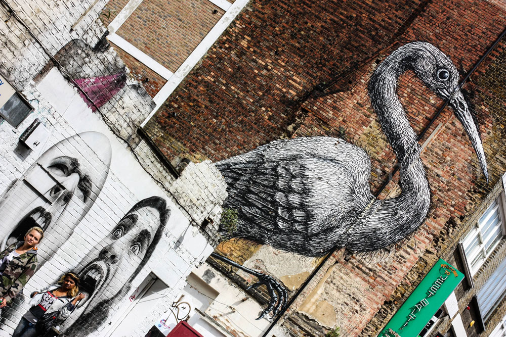
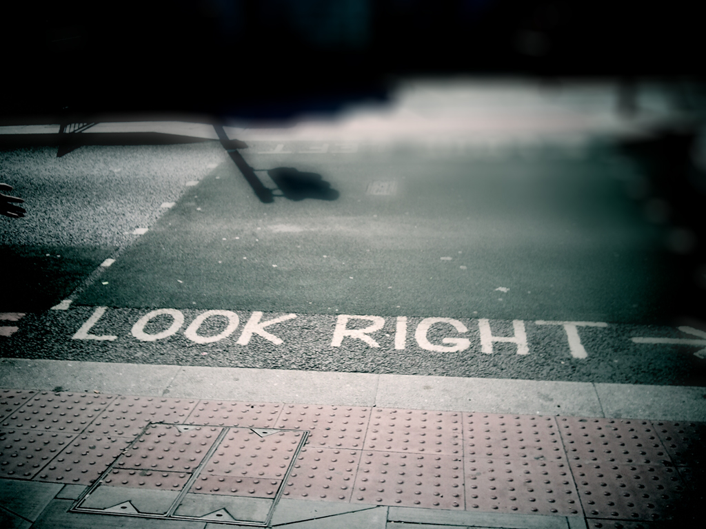

# Para inglês ver e brasileiro ficar esperto | Cotidiano #16

Salvo pelo pragmatismo inglês, sempre pecando pelo excesso brasileirinho

Aqui nas terras Calientes Brasilis, peca-se pelo excesso. Come demais, desperdiça demais. O brasileiro peca, o brasileiro exagera, tanto que a água já é pouca (mas quem se importa, né?). Mas enquanto somos (nós, os calientes-brasilis) estigmatizados como excessivos, o inglês cumpre o papel oposto.

Britânicos são sintéticos e acabam se mostrando gélidos e mal-humorados. Eles pecam sim (eles, os gélidis britaniquis, como gostaria de enfatizar nosso saudoso Mussum, um caliente-brasilis de primeira), mas não podem ser condenados antes mesmo de uma defesa.

O londrino fala pouco, tem aquele sotaque almofadinha e possui regras curtas e diretas. No Underground (o metrô deles), por exemplo, experimente só subir parado na escada rolante pelo lado esquerdo. É peteleco na certa. Isso porque todo inglês sabe muito bem que, quem não está com pressa ou não aguenta o tranco, deve ficar do lado direito da escada, deixando a porção esquerda para os apressadinhos e mais atléticos. Os ingleses também sabem que, se encontrar um sujeito “caçando sapos” parado do lado esquerdo, é gringo (não o nosso gringo. O gringo deles, ou seja, a gente). Mas nem pelo infortúnio de nascer em outro lugar que não na ilha, esse tal merece uma colher de chá-das-cinco. É peteleco na orelha, cutucão nervoso e advertência seca e direta: “Stand on your right” (mantenha-se à sua direita, ou como eu gosto de supor, fica pra tua direita, ô mané). É um sistema de regras secas e diretas, mas que, diabos, funcionam bem pra cacete.

Não que a nossa confusão de filas e indicações exacerbadas não funcione, mas só são feitas de formas diferentes para diferentes pessoas (os brasilis e os britaniquis). Diferentes meios para um mesmo fim. Só que, enquanto o inglês se orienta atentamente com as informações disponíveis ao redor, a gente faz aquele fuzuê ao pé da placa, querendo saber de cinco pessoas diferentes qual o nome da bendita rua. O inglês não gosta muito de perguntas, muito menos de respondê-las. Contudo, de um jeito ou de outro, o troço todo tem de dar certo.

Eu caminhava matutando a vida na Brick Lane, centro nervoso do East Side (lugar com vários restaurantes e casas noturnas). Estava por lá fazia um par de dias e vagueava justamente por fatos que me diferenciava dos ingleses e suas caras sisudas. Vi, enquanto perambulava, que deveria ser daí o cinza que faz a Londres ser tão cinza, mesmo com o verde forte e o vermelho intenso das cortinas dos estabelecimentos que eu passava em frente. O sorriso dos ingleses era tão marrom e preto como os tijolos que dão identidade tão característica aos prédios aglutinados daquela região. Ficava também fantasiando por ali algumas memórias falsas do tempo macabro em que a região era parque de diversões do Jack (o Estripador). Conseguia sentir o ar em estado de torpor que inundava aquelas noites doentias. E com todas essas considerações o em movimento, quase que eu próprio faço daquela tarde, uma tarde fúnebre.

Andava a fitar uns telhados na esquina do Preem Restaurant quando meus pensamentos correram assustados com uma demonstração de força bruta. Um cara de camiseta listrada e cabelo estranho vinha em minha direção com dois olhos embutidos em angústia e com a boca vomitando três letras repetidamente: “Hey…hey…hey”. Seu dedo em riste me fez olhar para a beira do asfalto e decifrar tudo no turbilhão que me fazia a mente em imagens, cores, palavras, signos, significados, sentidos.

O branco pintado logo depois do meio-fio me avisava para olhar pro outro lado ao atravessar. A beira do asfalto estava gemendo Look Right (olhe para a direita, já que os ingleses dirigem na mão contrária) enquanto alguns carros passavam em velocidade irrepreensível a alguns palmos do meu passo. Fui salvo pelo empurrão grosseiro e impaciente do mancebo de calças apertadas e brinco no nariz que me foi seco e direto: “You. Look right”. E com a mesma injúria nos olhos, ele se foi.

E eu ali, com os gritos ecoando na cabeça enquanto carros ingleses passavam na mão contrária nossa (e certa pra eles). Curto, grosso, eficiente. Quer mais pra quê?

A base de patada, deu certo. Uma comunicação para inglês ver e pra caliente-brasilis ouvir.

---

*publicado em 27 de Março de 2015, 00:00*
