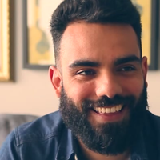
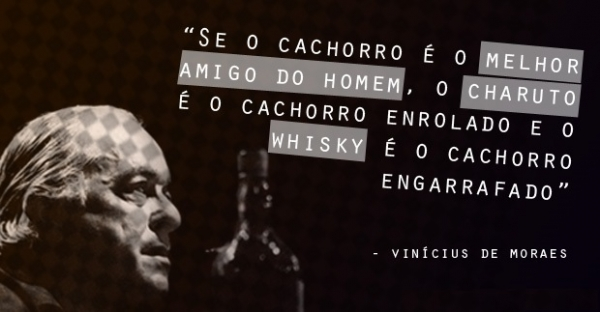
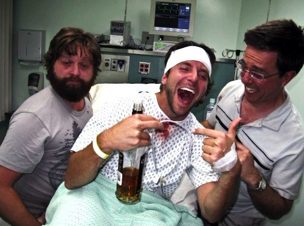
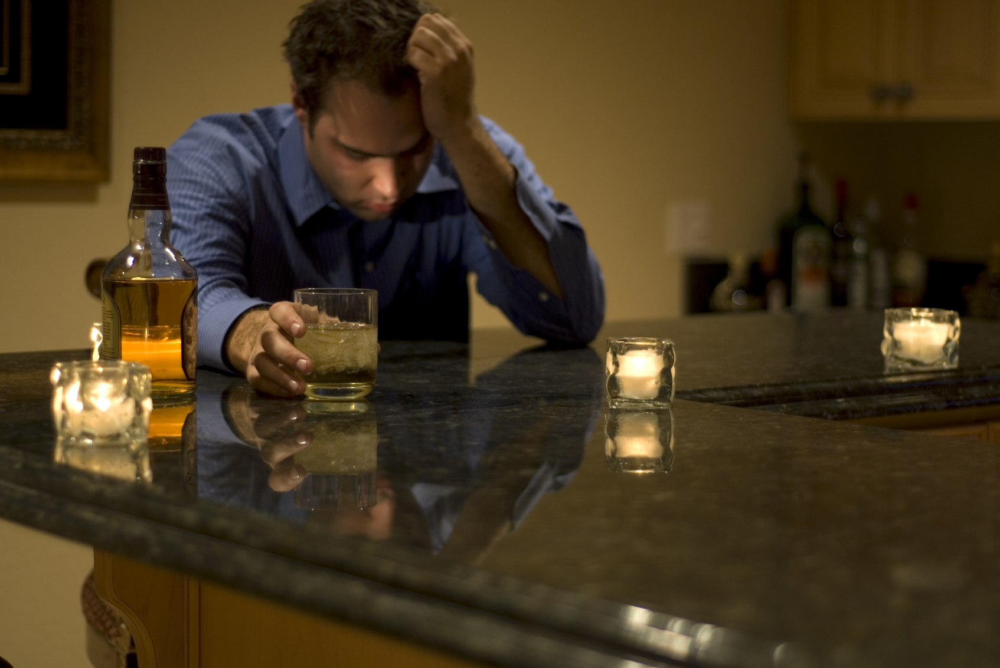

# Precisamos conversar sobre o estudante que morreu após beber trinta doses de vodca

O que a morte de um jovem de 23 anos numa festa tem a nos dizer sobre como nos educamos a beber

[Guilherme Nascimento Valadares](http://www.papodehomem.com.br/autores/guilherme#artigos)

[Homens possíveis](http://www.papodehomem.com.br/colecoes/homens-possiveis)

- [**171**

  likes](http://www.papodehomem.com.br/precisamos-conversar-sobre-o-estudante-que-morreu-apos-beber-trinta-doses-de-vodca#)
- [**0**

  tweets](http://www.papodehomem.com.br/precisamos-conversar-sobre-o-estudante-que-morreu-apos-beber-trinta-doses-de-vodca#)
- [**0**

  google +](http://www.papodehomem.com.br/precisamos-conversar-sobre-o-estudante-que-morreu-apos-beber-trinta-doses-de-vodca#)
- [**2**

  comentários](http://www.papodehomem.com.br/precisamos-conversar-sobre-o-estudante-que-morreu-apos-beber-trinta-doses-de-vodca#disqus_thread)

Há alguns anos estava de férias com amigos numa praia fazendo churrasco na casa que alugamos. Começamos na hora do almoço. Próximo da meia-noite um dos caras que mais bebeu arrota e diz "não aguento mais cerveja", logo emendando com "é, vou pegar mais uma". 

Todos em volta riem. Um diz, em tom alegre, que nunca viu alguém beber tanto quanto ele. A namorada concorda um tanto indignada, mas prossegue narrando feitos de resistência etilíca do namorado.

Ele escuta em silêncio, com expressão de contentamento, enquanto saboreia mais um gole.

\* \* \*

Entre homens surge esse orgulho bastante específico ao se tornar capaz de ingerir quantidades obscenas de álcool.

PUBLICIDADE

A **formação alcóolica** é, ainda que se negue, um dos tijolos da identidade masculina.

Uma atividade louvada por um artista que todos louvamos não pode ser ruim. Certo?

Não sabemos quais os maiores medos de nossos amigos, mas com absoluta certeza sabemos quem é o mais resistente da turma, quem mais vomita, quem chora, quem fica agressivo, quem pega todas, quem mente, quem conta piadas ruins e quem brocha quando bebe.

Essa obsessão começa cedo.

Em uma cultura na qual vivemos domesticados em cadeiras de escola, cubículos da empresa, salas de cinema, salas de teatro, cadeiras de restaurantes, assentos de avião, pacotes turísticos e sofás, o álcool parece ser o elixir da felicidade.

O primeiro gole é um momento quase ritual entre adolescentes. Talvez venha do próprio pai, que vai dar risada da careta do filho inexperiente. O filho não precisa receber instruções, ele apenas observa que beber é coisa importante para os adultos. Se faz para relaxar ao final de um dia cansativo, para contar piadas no almoço de domingo com a família, em festas quando se quer paquerar.

Ficar desinibido, mais agressivo, eufórico e reativo parece ser um colateral positivo, uma expressão de virilidade.

O recado vem claro: beber é bom. É coisa de homem.

Os primeiros porres quase sempre chegam antes dos dezoito. 

As namoradas reclamam dos namorados beberrões, mas muitas vezes rejeitam e fazem piadas com os que não bebem, chamados de "frescos".

Escutar que você "bebe como uma moça" é ofensa grave.

"Não guenta, bebe leite!" é a provocação que todo homem escuta centenas de vezes ao longo de sua vida. Afinal, "se bebe pra ficar ruim, se fosse pra ficar bom tomava remédio".

Batemos palma e repetimos as histórias de porres, nossas e dos amigos, incontáveis vezes.

Ser um homem adulto e não beber soa quase impossível. Ser um homem adulto e não beber até seu limite é coisa de "fraco".

Essa realidade silenciosa aceita por todos contrasta com as mais de [50 mil mortes anuais](http://drauziovarella.com.br/dependencia-quimica/acao-e-efeitos-do-alcool/) relacionadas a acidentes de carro com álcool.

Sabe onde morria gente na mesma velocidade? Na Guerra do Vietnam. Mas chuto que ler isso não vai mudar uma gota do quanto você vai beber na próxima ida ao bar. 

Não aguentamos mais lidar com tanta pressão e culpa em nosso dia-a-dia, não à toa bebemos como retardados sempre que surge a chance, queremos esquecer do mundo. Campanhas baseadas na culpa, sozinhas, não vão funcionar.

Francamente, beba o quanto quiser.

Não creio que o ponto é condenarmos o ato.

O ponto é tornarmos nossa relação com a bebida mais lúcida e menos autodestrutiva. 

É parar de glorificar a bebedeira sem limites. É sair de táxi quando for beber. É não fazer piada com os amigos que bebem pouco ou nada. É conversar abertamente sobre o quão dependentes nos tornarmos de latinhas e copos com gelo numa sexta à noite.

Eu demorei quase quinze anos para me permitir comprar garrafas d'água entre drinks e cervejas em festas. Por medo de ser percebido, e me perceber, como menos homem.

Óbvio que não racionalizava isso, apenas pensava "ah, não preciso de água, guento um pouco mais de boa". Na real eu nem pensava, só seguia o hábito de beber como sempre bebi. Era parte de minha formação alcoólica. E talvez faça parte da sua também.

Romper esse padrão é osso duríssimo de roer.

Por isso fiquei admirado quando, semana passada, um grupo de amigos meus, espalhados em diferentes cidades do Brasil, se encontraram numa conferência via Google Hangout, num sábado de manhã, para conversar sobre experiências relacionadas a abstinência – sendo a abstinência de álcool a principal delas.

O quão raro é uma conversa como essa surgir entre homens e o quão fácil seria taxar esse papo como frescura e perda de tempo?

Eu gosto de álcool. Ontem saí e tomei mojitos, caipirinha e cerveja. Comprei chocolate e água pra cortar um pouco do efeito. Dei risada pensando em como estou bem menos resistente agora que tenho bebido com menos frequência e intensidade.

Soa bobo, mas para mim não é.

Me reeducar alcoolicamente tem sido um dos processos mais lentos e penosos de toda minha vida. Primeiro porque meus hábitos estão arraigados de um modo que apenas se dar conta deles demora, e muito. Segundo, porque como não tenho uma doença ou problema sério de comportamento relacionado a àlcool, sempre parecia pouco importante mudar essa relação.

É como o sujeito com mil insatisfações crônicas e dramas emocionais, que tornam sua vida cotidiana um pequeno inferno que aprendeu a suportar, e acredita não precisar de psicólogo ou explorar seu mundo interno porque ainda não teve um surto ou crise.

Pensamento masculino típico: só cuidar de si quando a tragédia bate na porta.

E o terceiro motivo que dificulta mudar a minha(e a nossa) relação com o álcool é a falta de amigos próximos engajados em processo similar. Chega a ser vergonhoso como homens crescidos e supostamente independentes dependem de validação externa para mudar. Se dizem durões, mas por dentro da casca, têm pânico de ter a virilidade em cheque. 

[O estudante que morreu após trinta doses de vodca numa festa em Bauru](http://g1.globo.com/mg/sul-de-minas/noticia/2015/03/corpo-de-estudante-morto-em-festa-universitaria-e-sepultado-em-mg.html) é só um trágico sintoma dessa cultura.

### Não pare de beber, apenas tenha a coragem de transformar sua relação com a bebida

Não ter medo de comprar uma garrafa d'água entre seus amigos na festa do final de semana é ativismo corajoso. Oferecer água para os mais bêbados, e insistir para que eles bebam, pois muitos vão negar por orgulho, também.

Ir de táxi, superando o papo furado de que precisa economizar grana ou qualquer outra desculpa, também.

Não incentivar o amigo do lado a tomar mais uma quando ele estiver além da conta é um gesto lindo.

Elogiar os amigos e amigas que bebem e se divertem sem ter a bebida como muleta é maravilhoso.

Conversar com o amigo sobre como anda a relação dele com a bebida, expondo seus medos, dúvidas, hábitos e obstáculos, é quase tão mágico como encontrar um pote de ouro ao final do arco íris.

Não fazer piadas com quem quiser beber pouco (ou nada) é uma guerrilha silenciosa em favor de uma cultura mais lúcida de relação com o álcool. Em especial, evite as piadas que associem isso a ser fresco, gay, mocinha. Elas [reforçam uma ideia de masculinidade limitada](http://www.papodehomem.com.br/regata-rosa-na-academia). 

A quem vier com papo de que você agora está todo politicamente correto, diga que não, que contrariar toda uma cultura que estimula homens a beberem como animais, em um país com [5.8 milhões de alcoólatras](http://noticias.r7.com/saude/quase-6-milhoes-de-pessoas-sao-alcoolatras-no-brasil-18032013), no qual pessoas se matam bêbadas no trânsito todos os dias, sem falar nas brigas, estupros, abusos e violências em lares, festas, bares, becos e estádios, é, na bem da verdade, subversivo pra caralho.

No seu próximo encontro com a bebida, seja homem o suficiente pra peitar essa luta.

---

*[Homens possíveis](http://www.papodehomem.com.br/colecoes/homens-possiveis) é uma coluna quinzenal, sai sempre aos domingos.*

---

*publicado em 02 de Março de 2015, 00:59*
