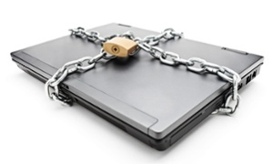
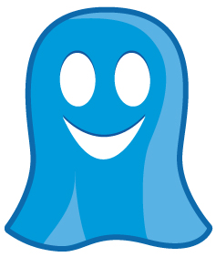
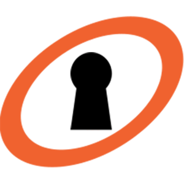
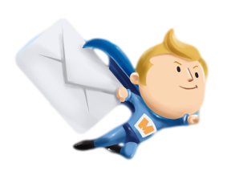
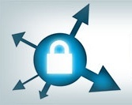
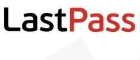
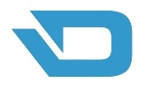

# 21 tips, tricks and shortcuts to help you stay anonymous online

Avoiding being tracked online is nearly impossible, but here are a few ways to reduce the risk

How to achieve online lockdown. Photograph: LJSphotography / Alamy/Alamy

## 1. SECURE WEBMAIL WITH EXTENSIONS

If you’re using a popular webmail service, such as Gmail or Yahoo Mail, and you don’t or can’t make the switch to a more secure service, then consider installing Mailvelope. [Mailvelope](https://www.mailvelope.com/) is a browser extension for Google Chrome or Mozilla Firefox that brings OpenPGP encryption to your webmail service. Similar extensions exist, such as [SecureGmail](https://www.streak.com/securegmail), which encrypts and decrypts emails you send through Gmail. Using this extension means the unencrypted text should never reach Google servers. Recipients will need to install the extension in order to decrypt and read the encrypted email.

## 2. INCOGNITO

This is perhaps one of the most basic privacy options that just about anyone can take advantage of. The top four most popular browsers - Google Chrome, [Internet](http://www.theguardian.com/technology/internet) Explorer, Mozilla Firefox and Safari - have a private browsing mode, which can be found in their respective settings menus. With private browsing activated, your browser will not store cookies or internet history on your computer. This has very limited uses and is perhaps really only effective at hiding your browsing history from your significant other, siblings or parents. Private browsing does not securely hide your identity or browsing activities beyond your local machine as your IP address can still be tracked.

## 3. DON’T USE SOCIAL MEDIA

The amount of personal data that social networking sites like Facebook, Google Plus and Twitter have harvested from their billions of users is shocking. Head to facebook.com/settings and click ‘[Download a copy of your Facebook data](https://www.facebook.com/help/212802592074644)’ and you might be surprised to see just how much information is on file. Everything from who you have poked, what events you have or have not attended and when and where you have logged into your account is logged and saved. Similar levels of data harvesting occurs on all major social media sites. This is the price you pay for using a ‘free’ service. The only sure-fire way to avoid giving up this information is to delete your accounts entirely. A word of warning, ‘deactivating’ your account is not the same as deleting it. Deactivating your account is sort of like putting it into hibernation - all your information is stored and can be re-activated if you have second thoughts. Always delete rather than deactivate an account if you wish to completely wipe it.

## 4. BLOCK AND MANAGE TRACKERS

A large amount of websites track and collect the browsing habits of the users that visit them. These trackers are invisible and most people aren’t aware that they’re being tracked. [Ghostery](https://www.ghostery.com/en-GB/) is a free browser extension - available on all major web browsers - that will reveal these trackers, also known as web bugs. You can then decide which web bugs you’re comfortable with tracking you and which ones you’d like to block. In total, Ghostery keeps track of over 1,900 companies. Each company has a profile in the Ghostery Knowledge Library, allowing you to better understand who and why someone is keeping tabs on you and what action you would like to take.

## 5. ENCRYPTED EMAIL

Most of the well known and popular email services - Gmail, Hotmail, Yahoo Mail, Outlook - are not particularly privacy-friendly. For full Pretty Good Privacy (PGP) encrypted emails, consider signing up to a more secure provider. [Hushmail](https://www.hushmail.com/) is currently very popular, it provides a private email account with no ads, built-in encryption and unlimited email aliases. A limited free service is offered, with more features available for a monthly subscription fee. However, Hushmail is not above the law and in the past it has been forced to reveal user data to U.S. authorities following a court order. The company also logs user IP addresses. [MyKolab](https://ct.mykolab.com/) is a similar service that has not revealed any user information in the past, however, they are also obliged to provide access to lawful interception requests so this still remains a possibility.

## 6. TEMPORARY EMAIL

Disposable Email Addresses (DEAs) are anonymous and temporary. They allow users to quickly create new email addresses as-and-when they’re needed, which can then be disposed of after use. This is particularly useful for avoiding spam when filling in forms on websites that require an email address to proceed. Keeping your real email address away from spammers is crucial to protecting your identity online and DEAs are a great solution. Popular providers of this service include [Guerrilla Mail](https://www.guerrillamail.com/) and [Mailinator](https://mailinator.com/), although there are hundreds out there to choose from. Most DEAs are not particularly secure, so it is not advised to use these services to send sensitive information - rather, use them as a way to avoid giving away your own information in situations where you are obliged to do so.

## 7. VPN

Virtual Private Networks (VPNs) are one of the most effective ways to protect your privacy online. A VPN essentially hides your IP address - your unique online identifier - and runs all your online data via a secure and encrypted virtual tunnel, which can keep websites from tracking your online activity or even knowing which country you’re browsing from. These days, there are many VPNs to choose from. [Hotspot Shield](http://www.hotspotshield.com/), [TorGuard](http://torguard.net/), [CyberGhost](http://www.cyberghostvpn.com/en_gb) and [HideMyAss](https://www.hidemyass.com/) are some of the more popular ones that are currently available. Most of them require a small monthly subscription fee and they don’t all provide the same list of features, so it’s worth shopping around for a VPN that suits you.

## 8. TOR

Originally developed with the U.S. Navy in mind as a way to protect government communications, [Tor](https://www.torproject.org/) is a network of “virtual tunnels that allows people and groups to improve their privacy and security on the Internet.” Tor’s anonymity network allows access to the ‘deep’ or ‘hidden’ web, where websites can be created anonymously and individuals can communicate privately with each other. When using the Tor browser - which can be downloaded for free from torproject.org - it is very difficult for websites or individuals to track your online activity and location. However, while Tor is quite effective at protecting your online anonymity, it can be slow, complicated and restricting. It’s also worth noting that while the network can and has been used for good, it has also been used for illicit purposes, such as selling drugs and distributing images of child abuse.

## 9. PROXY SERVER

A proxy server is a computer through which your online activity can be processed, essentially acting as an intermediary between your computer and the internet. As such, this can be a great way to maintain your online anonymity as the proxy basically masks your IP address with its own. If the proxy is based in a different country than your own, you can fool websites and trackers into thinking you’re browsing from a completely different continent. There are many ways to use proxies and there are various free and paid services on offer. [HideMyAss.com/proxy](https://www.hidemyass.com/proxy) has a limited free web proxy service that you can start using immediately if you’d like try it out.

## 10. HTTPS EVERYWHERE

Hypertext Transfer Protocol Secure (HTTPS) is the encrypted version of HTTP, the technology protocol which determines how web servers and browsers respond to commands and how messages are sent and received. The Electronic Frontier Foundation’s (EFF) [HTTPS Everywhere](https://www.eff.org/Https-everywhere) is a neat little extension - available on Google Chrome, Mozilla Firefox and Opera - that forces websites to use HTTPS, even when they default to the less secure and unencrypted HTTP. By EFF’s own admission it’s still feasible for “some attackers to break HTTPS,” but it’s certainly not a bad idea to install their extension as HTTPS is still far more secure than HTTP and will certainly help to protect your privacy and consequently maintain your anonymity. EFF is a nonprofit organisation that seeks to defend civil liberties in the digital world.

## 11. DESTROY COOKIES

Cookies are little bits of code that are automatically downloaded from a website and stored on your system. Cookies allow websites to quickly and easily remember if you’ve been there before - if you have, the website may then alter certain variables based on the information that has been stored in the cookie in order to give you a more personalised and potentially useful experience. However, some cookies can be very intrusive, logging information such as how long you’ve been visiting a particular website, how many clicks you’ve made and what content you seem to prefer reading. It doesn’t hurt, then, to occasionally wipe your system of any and all cookies. Admittedly this won’t do a huge amount to protect your anonymity, but it will make it harder for websites to learn and understand your viewing habits. You can delete cookies from within your browser, but to make sure you nuke the lot, you can use an app like CCleaner, which is free and powerful.

# DuckDuckGo: the plucky upstart taking on Google with secure searches

Read more

## 12. USE ALTERNATIVE SEARCH ENGINES

Like most people, you probably use Google to search for things online. Google is an undeniably accurate, fast and efficient search engine, however, this is largely helped by its personalised search system. This is a feature that uses your past search history, rather than just relying on the terms you’ve typed into the search bar, to present you with results that are more relevant to your personal tastes. To do this, Google keeps track of your search habits in a number of ways, including browser cookies. You can turn off this personalised search by clicking Search Tools > All Results > Verbatim. But if you really want to make sure Google isn’t tracking your searches, consider using a different search engine entirely, such as [DuckDuckGo](https://duckduckgo.com/), which promises never to track your searches and “emphasizes protecting searchers’ privacy and avoiding filter bubble of personalized search results.”

## 13. USE ALTERNATIVE BROWSERS

While Google Chrome, Firefox and Internet Explorer are popular, they’re not as secure as they have the potential to be. If you would like a more guarded browsing experience that has a more earnest approach to secure web browsing, consider trying out a privacy-focused browser such as [Dooble](http://dooble.sourceforge.net/), [Comodo Dragon](https://www.comodo.com/home/browsers-toolbars/browser.php) or [SRWare Iron](http://www.srware.net/en/software_srware_iron.php). However, do bear in mind that the additional security methods are fairly limited and will do little to protect your overall anonymity on their own, rather, this should be used in conjunction with other measures. Additionally, you can probably get a comparably secure service by disabling third-party cookies and blocking all location data in your regular browser’s settings and installing various privacy and anonymity-focused extensions and plugins such as Ghostery or Mailvelope.

> "Dropbox...is very hostile to privacy"
>
> Edward Snowden

## 14. DITCH DROPBOX

Edward Snowden has called Dropbox - a cloud storage service - [‘hostile to privacy’](http://www.theguardian.com/technology/2014/jul/17/edward-snowden-dropbox-privacy-spideroak). That’s pretty damning. If you’re worried about sharing your files through this system, there are a number of good alternatives out there which offer better privacy. Snowden himself recommends [Spideroak](https://spideroak.com/), which describes itself as a zero-knowledge encrypted data backup, share, sync, access and storage service. You can use a limited version of this as part of their free trial, which can be found on their website. A fully featured subscription is available for $12 a month. However, if you’re just looking to quickly share small or large files anonymously for free, give OnionShare a go. It doesn’t have as many features as Spideroak, but it gets the job done.

## 15. CHANGE YOUR PHONE

Staying anonymous while using a smartphone can be tricky business. Many apps will want access to all sorts of settings on your device by default, which you may not be aware of and which you will have to manually manage with each new app installation and update. Furthermore, connecting to public networks while on the go is also a great way of potentially exposing your data to nefarious snoopers. While both Apple’s iOS 8 and Android’s Lollipop now have good encryption measures by default, there is another more extreme option in the form of [The Blackphone](https://blackphone.ch/). This is an ‘NSA-proof’ smartphone that claims to provide privacy features for texts, emails, web browsing and phone calls. Reviews so far have been mostly positive but at around £400, it’s not cheap.

## 16. USE A PASSWORD MANAGER

If you’ve got a password that can be easily guessed, cracked or stolen, because you have a bad memory for that sort of thing, then you can say goodbye to your anonymity. This is especially true if you use the same password for everything, or across multiple websites and/or services. A great way to improve your password security is to use a password manager, like [LastPass](https://lastpass.com/). LastPass saves all of your passwords and only requires you to remember one master password, making multiple different passwords a lot less of a headache to manage, which in turn improves your online security and protects your anonymity.

## 17. SECURITY FOCUSED OPERATING SYSTEMS

There are security focused email service providers, security focused smartphones and security focused web browsers, but have you considered using a security focused operating system? [Whonix](https://www.whonix.org/wiki/Main_Page) is exactly that - an open source OS that focuses on anonymity, privacy and security. Based on the Tor network, Whonix is about as anonymous as an OS can get before it all becomes too inconvenient for normal use. Whonix runs in two parts, “one solely runs Tor and acts as a gateway… The other… is on a completely isolated network. Only connections through Tor are possible.” You can download it for free from whonix.org.

## 18. ANONYMOUS CURRENCY

[Darkcoin](https://www.darkcoin.io/) is an open source digital cryptographic currency based on the Bitcoin software code. It is intended to be a more private version of Bitcoin (which typically prides itself on its transparency) and it claims to be the world’s first anonymous cryptocurrency. Finding merchants that accept Darkcoin can be tough (Darkcoin has its own merchant directory which you can browse here http://tinyurl.com/qzo398u) but when you do, your financial transactions are well hidden and, in theory, entirely anonymous.

## 19. VIRTUAL MACHINES

Using a virtual machine is a great way to work on sensitive files (or to open dubious ones) without the fear of online snooping or potentially infecting your main system. A virtual machine is essentially a second ‘virtual’ computer that you host within your main operating system as an application. So let’s say you want to download a JPG from an email attachment, but you’re worried that it’s infected with a keylogger or some other form of virus that could jeopardize your anonymity. Firstly, if you suspect this to be the case, you shouldn’t download it at all. But one method to more safely examine the file if you absolutely must is to use virtualization software, such as [VirtualBox](https://www.virtualbox.org/), to install a virtual machine onto your system. It’s best to use a secure OS for this, so something Linux based isn’t a bad idea. You can then download the file on the virtual machine before turning the internet on your virtual machine off and opening the JPG. Once you’re done with the file, you can delete it along with your virtual system, leaving no traces behind and no potential security issues.

## 20. AVOID JAVASCRIPT

JavaScript is used all over the web and can provide detailed information about your system to any website that uses it. This is almost always used completely harmlessly and is often used to improve your browsing experience or funnel more personalised and relevant adverts your way. However, some of this personal or system information can and has been leaked in the past. Disabling JavaScript completely is not really a viable solution as a large amount of websites require you to accept JavaScript in order for them to display correctly. However, you can install an extension into your browser that will allow you to blacklist or whitelist JavaScript activity, giving you more control over how and where your information is being used. [NoScript](https://noscript.net/) and [ScriptSafe](http://www.crx4chrome.com/extensions/oiigbmnaadbkfbmpbfijlflahbdbdgdf/) are both popular choices and very easy to use.

## 21. DESTROY ALL TECHNOLOGY AND LIVE IN A CAVE

Ultimately, the only way to truly stay anonymous online is to never go online in the first place. If you’ve already used the internet, delete any and all accounts you’ve ever created, turn your computer off and smash it to pieces. You will still leave a digital footprint of some sort in your wake, but hopefully it’s not particularly significant. If you’re using this extreme method, you should also smash up your smart phone, your tablet and your smart TV (they’re listening to us now). Now that you have purged all connected technology from your life, you may wish to live in self-imposed exile, perhaps in a cave, so that you are not tempted to re-enter the online world. Don’t tell anyone about this and you will successfully have acquired complete anonymity. Probably.

Neolithic man installing a wifi router. Image: PoodlesRock/Corbis Photograph: PoodlesRock/Corbis
