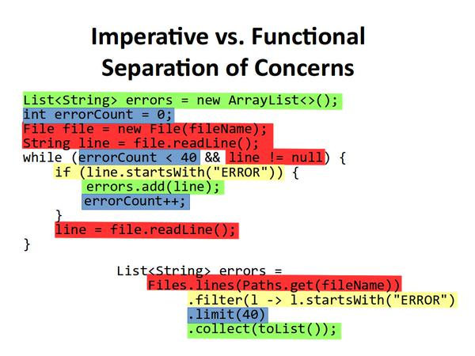

[
**Mario Fusco**
‏~~@~~**mariofusco**](https://twitter.com/mariofusco)

Imperative vs. Functional - Separation of Concerns

- Retweets **638**
- Curtiram **511**
- [[anexo ausente]](https://twitter.com/ThadeFeddersen "Thade Feddersen")
  
  
  
  
  
  
  
  

03:43 - 1 de mar de 2015

1. [
   **Luca Fornili**
   ‏~~@~~**lfornili**](https://twitter.com/lfornili)
   ·
   [1 de mar](https://twitter.com/lfornili/status/572001937513713665 "03:54 - 1 de mar de 2015")

   [~~@~~**mariofusco**](https://twitter.com/mariofusco) just beautiful. Btw, I think a closing parenthesis on the filter line is missing :)

   0 respostas

   0 retweets

   9 curtiram
2. [
   **Manuel Bernhardt**
   ‏~~@~~**elmanu**](https://twitter.com/elmanu)
   ·
   [1 de mar](https://twitter.com/elmanu/status/572003980835991552 "04:02 - 1 de mar de 2015")

   [~~@~~**mariofusco**](https://twitter.com/mariofusco) great example! Just in case the occasion presents itself, can I borrow it for a talk?

   0 respostas

   0 retweets

   0 curtiram
3. [
   **λarsw**
   ‏~~@~~**larsw**](https://twitter.com/larsw)
   ·
   [1 de mar](https://twitter.com/larsw/status/572004868476567552 "04:06 - 1 de mar de 2015")

   [~~@~~**mariofusco**](https://twitter.com/mariofusco) [~~@~~**old\_sound**](https://twitter.com/old_sound) I wonder if it would be possible to create automatic color overlays like that with Roslyn analyzers...

   0 respostas

   0 retweets

   0 curtiram
4. [
   **David Brooks**
   ‏~~@~~**junglebarry**](https://twitter.com/junglebarry)
   ·
   [1 de mar](https://twitter.com/junglebarry/status/572005066976206849 "04:06 - 1 de mar de 2015")

   [~~@~~**mariofusco**](https://twitter.com/mariofusco) that seems deliberately poorly-structured: you could check the size of your list instead of counting errors, then SoC improves.

   0 respostas

   0 retweets

   0 curtiram
5. [
   **David Brooks**
   ‏~~@~~**junglebarry**](https://twitter.com/junglebarry)
   ·
   [1 de mar](https://twitter.com/junglebarry/status/572005183833690112 "04:07 - 1 de mar de 2015")

   [~~@~~**mariofusco**](https://twitter.com/mariofusco) (although the general point about readability is solid.)

   0 respostas

   0 retweets

   0 curtiram
6. [
   **Mario Fusco**
   ‏~~@~~**mariofusco**](https://twitter.com/mariofusco)
   ·
   [1 de mar](https://twitter.com/mariofusco/status/572005959461154816 "04:10 - 1 de mar de 2015")

   Feel free :-) RT [~~@~~**elmanu**](https://twitter.com/elmanu) Just in case the occasion presents itself, can I borrow it for a talk?

   0 respostas

   1 retweet

   2 curtiram
7. [
   **Manuel Bernhardt**
   ‏~~@~~**elmanu**](https://twitter.com/elmanu)
   ·
   [1 de mar](https://twitter.com/elmanu/status/572006757620432897 "04:13 - 1 de mar de 2015")

   [~~@~~**mariofusco**](https://twitter.com/mariofusco) great, thanks!

   0 respostas

   0 retweets

   0 curtiram
8. [
   **Gleb Bahmutov**
   ‏~~@~~**bahmutov**](https://twitter.com/bahmutov)
   ·
   [1 de mar](https://twitter.com/bahmutov/status/572009504604364800 "04:24 - 1 de mar de 2015")

   [~~@~~**mariofusco**](https://twitter.com/mariofusco) [~~@~~**nicoespeon**](https://twitter.com/nicoespeon) I blogged about this a while ago, labeled lines - wish I used colors! [http://glebbahmutov.com/blog/essence-of-functional-programming/ …](http://t.co/3tIaAScou3 "http://glebbahmutov.com/blog/essence-of-functional-programming/")

   0 respostas

   1 retweet

   6 curtiram
9. [
   **Nicolas Carlo**
   ‏~~@~~**nicoespeon**](https://twitter.com/nicoespeon)
   ·
   [1 de mar](https://twitter.com/nicoespeon/status/572010430673133568 "04:28 - 1 de mar de 2015")

   [~~@~~**bahmutov**](https://twitter.com/bahmutov) [~~@~~**mariofusco**](https://twitter.com/mariofusco) yep I read this article, it illustrates the idea very well - even without colors :-)

   0 respostas

   0 retweets

   1 curtiu
10. [
    **Peter Lawrey**
    ‏~~@~~**PeterLawrey**](https://twitter.com/PeterLawrey)
    ·
    [1 de mar](https://twitter.com/PeterLawrey/status/572030605770280960 "05:48 - 1 de mar de 2015")

    [~~@~~**mariofusco**](https://twitter.com/mariofusco) note: Files.lines () needs a try - with - resource to avoid a resource leak. O\_o [http://www.rationaljava.com/2015/02/java-8-pitfall-beware-of-fileslines.html?m=1 …](http://t.co/UHz96ySBLd "http://www.rationaljava.com/2015/02/java-8-pitfall-beware-of-fileslines.html?m=1")

    0 respostas

    0 retweets

    3 curtiram
11. [
    **Mario Fusco**
    ‏~~@~~**mariofusco**](https://twitter.com/mariofusco)
    ·
    [1 de mar](https://twitter.com/mariofusco/status/572035094002700288 "06:06 - 1 de mar de 2015")

    [~~@~~**PeterLawrey**](https://twitter.com/PeterLawrey) Same for imperative version. I left out exception handling to show my point with lower verbosity

    0 respostas

    0 retweets

    0 curtiram
12. [
    **Kevin Meredith**
    ‏~~@~~**Gentmen**](https://twitter.com/Gentmen)
    ·
    [1 de mar](https://twitter.com/Gentmen/status/572052806108102656 "07:16 - 1 de mar de 2015")

    [~~@~~**junglebarry**](https://twitter.com/junglebarry) [~~@~~**mariofusco**](https://twitter.com/mariofusco) errorCount is unneeded too, I think. Could just use the list#size in the if

    0 respostas

    0 retweets

    0 curtiram
13. [
    **Jeremy Kahn**
    ‏~~@~~**jeremyckahn**](https://twitter.com/jeremyckahn)
    ·
    [1 de mar](https://twitter.com/jeremyckahn/status/572057880356114432 "07:36 - 1 de mar de 2015")

    [~~@~~**mariofusco**](https://twitter.com/mariofusco) [~~@~~**jack\_franklin**](https://twitter.com/Jack_Franklin) What if there's a billion error lines? Seems like the second approach would be a lot less efficient.

    0 respostas

    0 retweets

    0 curtiram
14. [
    **Mario Fusco**
    ‏~~@~~**mariofusco**](https://twitter.com/mariofusco)
    ·
    [1 de mar](https://twitter.com/mariofusco/status/572062110680801280 "07:53 - 1 de mar de 2015")

    [~~@~~**jeremyckahn**](https://twitter.com/jeremyckahn) [~~@~~**Jack\_Franklin**](https://twitter.com/Jack_Franklin) Java 8 Stream is lazy. They are efficient exactly in the same way

    0 respostas

    0 retweets

    0 curtiram
15. [
    **Mario Fusco**
    ‏~~@~~**mariofusco**](https://twitter.com/mariofusco)
    ·
    [1 de mar](https://twitter.com/mariofusco/status/572062700597080065 "07:55 - 1 de mar de 2015")

    [~~@~~**Gentmen**](https://twitter.com/Gentmen) [~~@~~**junglebarry**](https://twitter.com/junglebarry) Good point. So just suppose you want to read only the first 100 lines of the file and you'll need the counter

    0 respostas

    0 retweets

    0 curtiram
16. [
    **Jeremy Kahn**
    ‏~~@~~**jeremyckahn**](https://twitter.com/jeremyckahn)
    ·
    [1 de mar](https://twitter.com/jeremyckahn/status/572129118919241729 "12:19 - 1 de mar de 2015")

    [~~@~~**mariofusco**](https://twitter.com/mariofusco) [~~@~~**jack\_franklin**](https://twitter.com/Jack_Franklin) Fair enough. I don't know Java at all, hah.

    0 respostas

    0 retweets

    0 curtiram
17. [
    **Alexis Gallagher**
    ‏~~@~~**alexisgallagher**](https://twitter.com/alexisgallagher)
    ·
    [23 hHá 23 horas](https://twitter.com/alexisgallagher/status/572178819492139008 "15:37 - 1 de mar de 2015")

    [~~@~~**mariofusco**](https://twitter.com/mariofusco) brilliant.

    0 respostas

    0 retweets

    0 curtiram
18. [
    **[ɾɑɦul gomɑ pʰuloɾe]**
    ‏~~@~~**missingfaktor**](https://twitter.com/missingfaktor)
    ·
    [23 hHá 23 horas](https://twitter.com/missingfaktor/status/572180395241943041 "15:43 - 1 de mar de 2015")

    [~~@~~**mariofusco**](https://twitter.com/mariofusco) What's the source of this?

    0 respostas

    0 retweets

    0 curtiram
19. [
    **[ɾɑɦul gomɑ pʰuloɾe]**
    ‏~~@~~**missingfaktor**](https://twitter.com/missingfaktor)
    ·
    [23 hHá 23 horas](https://twitter.com/missingfaktor/status/572180688474148865 "15:44 - 1 de mar de 2015")

    [~~@~~**mariofusco**](https://twitter.com/mariofusco) This reminds me of `[~~@~~**avdi**](https://twitter.com/avdi)'s Confident Ruby talk - [http://youtu.be/T8J0j2xJFgQ?t=27m20s …](http://t.co/ujU7LzsFvS "http://youtu.be/T8J0j2xJFgQ?t=27m20s").

    0 respostas

    0 retweets

    0 curtiram
