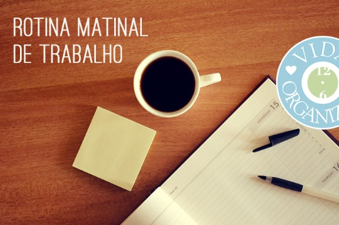

# Como organizar: Rotina matinal de trabalho

Eu sou aquela pessoa que demora naturalmente para acordar e pegar o ritmo de trabalho pela manhã, então precisei criar uma espécie de checklist de atividades que me colocam naquele estado de produtividade, pronta para enfim começar a trabalhar nas minhas tarefas do dia em questão. Esta é uma rotina que eu aplico todos os dias de trabalho e que me ajuda a entrar nesse modo mental para produzir com foco depois.

O que eu recomendo é que você tenha uma sequência de atividades que te ajudem a chegar lá também. Pode ser que, ao chegar no trabalho, já funcione para você começar a trabalhar em uma tarefa específica. Isso é ótimo! Essa pode ser a sua rotina diária: chegar, ligar o computador e fazer tal tarefa importante. Eu preciso de um tempo para despertar e focar.

Como vocês sabem, eu trabalho em casa. Porém, mesmo antes, quando eu trabalhava em um escritório externo, precisava de uma rotina para começar a trabalhar. A rotina que eu tenho hoje está em formato de checklist e é a seguinte:

- Ligar o computador
- Abrir o Spotify
- Checar meus feeds
- Processar caixa de entrada física

Vou comentar cada um dos itens.

Meu computador, como todos que existem, demora alguns minutos para entrar e estabilizar – ou seja, estar pronto para clicar em qualquer programa e abrir imediatamente. Nesses poucos minutos, acabo preparando um chá ou lendo o trecho de algum livro que eu esteja lendo no momento, que costumo deixar na minha mesa de trabalho para ler nesses momentos de demora do computador.

Quando o computador está ok, abro o [Spotify](http://spotify.com/) (um programa de streaming de músicas) e coloco para tocar a trilha sonora mais adequada ao meu mood naquele dia. No geral, acabo preferindo músicas mais calmas, porque senão fico com dor de cabeça. Invisto em um folk, MPB ou música clássica.

Na sequência, eu checo meus feeds através do [Feedly](http://feedly.com/), um agregador. Isso me ajuda a ter inspiração logo cedo, ver o que outros blogueiros postaram de um dia para o outro e tirar ideias para os meus blogs. Eu já fico com muita vontade de começar a trabalhar lendo os meus feeds!

Processar a caixa de entrada física me faz voltar a atenção para alguns aspectos da vida real que não podem esperar até o final do dia para serem levados em consideração (ao final do dia, faço um processamento bastante focado da minha caixa de entrada). Processar é uma atividade relacionada ao [método GTD](http://vidaorganizada.com/gtd/o-que-e-gtd/gtd-getting-things-done-ou-a-melhor-metodologia-de-produtividade-que-existe/ "GTD (Getting Things Done) – ou a melhor metodologia de produtividade que existe"). É aquele momento quando pego cada item que coletei e decido o que vou fazer com ele. Uma simples anotação, por exemplo, pode virar um projeto gigantesco.

Ao terminar de processar a minha caixa de entrada, eu já estou com a energia boa para trabalhar nas minhas atividades.

Essa rotina eu aplico começando a trabalhar às 6h da manhã ou às 10h. Me ajuda a “começar”. Acho importante inserir atividades que me dêem prazer, como ouvir música e ler meus feeds, porque senão vira uma rotina obrigatória e chata, que não ajuda em nada.

### Como organizar

Eu criei uma lista na seção de Outlines do Toodledo, que é a ferramenta que gosto de usar para gerenciar minhas ações. Sua checklist pode ser organizada em qualquer lugar. Pode ser uma nota no celular, uma nota no Evernote (que você pode colocar na área de atalhos), um compromisso na agenda com a checklist na descrição, ou até mesmo um pequeno post-it colado no seu monitor. Faã como funcionar melhor para você.

**Você já tem alguma espécie de rotina matinal para começar a trabalhar? Como você faz? Poste nos comentários!**
