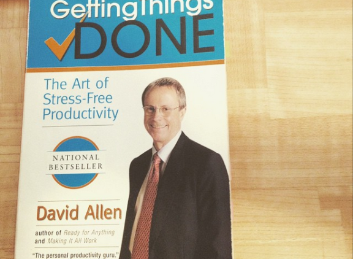

# Os erros mais comuns que as pessoas cometem quando começam a usar o GTD

*Este post foi uma sugestão da leitora Malu Ribeiro (obrigada!).*

O [GTD](http://vidaorganizada.com/gtd/o-que-e-gtd/gtd-getting-things-done-ou-a-melhor-metodologia-de-produtividade-que-existe/ "GTD (Getting Things Done) – ou a melhor metodologia de produtividade que existe") é uma metodologia simples mas, por ter tanto conteúdo no livro base (“A arte de fazer acontecer”, Ed. Campus), isso pode levar as pessoas a ficarem confusas quanto à sua implementação. Eu mesma demorei um tempo em alguns aspectos para implementar e só depois de alguns anos consegui entender de verdade algumas aplicações – não porque seja complicado, mas porque, apenas lendo o livro, falta uma orientação, um “pega na mão e me leva”, que felizmente hoje temos em maior quantidade. Na minha época (cof!), quase não se tinha material sobre o GTD em português disponível na Internet. Eu acredito que, de certa forma, o blog tenha colaborado um pouco com esse cenário. Há seis anos temos também a [Call Daniel](http://www.calldaniel.com.br/) ministrando cursos, oficialmente certificada pela [David Allen Co](http://gettingthingsdone.com/), o que encurta o caminho para quem estiver a fim de aprender sobre a metodologia.

Nesses anos todos de estudos e práticas do GTD, eu identifiquei alguns erros comuns que não só eu cometi, como vi outras pessoas cometendo. Gostaria de falar sobre eles para ajudar quem estiver passando por algum dos probleminhas citados aqui, a fim de ajudá-los da melhor maneira possível a ver o GTD como a metodologia simples que é.

### Erro nº1: Perder muito tempo organizando o seu sistema

O GTD não é uma metodologia de organização, mas de produtividade. Organizar seu sistema é apenas um dos passos, e todos os outros quatro são importantes. Se você estiver organizando demais e executando de menos, alguma coisa está errada.

Muitas pessoas caem nesse círculo vicioso da organização (é gostoso mesmo organizar, eu sei disso) e desistem do GTD dizendo **“eu perdia mais tempo organizando o meu sistema que fazendo as coisas”**. Se você passou por esse problema comum (vejam até que ele é o primeiro da lista), a culpa não foi do GTD, mas da sua aplicação. É necessário fazer alguns ajustes.

O David é catedrático no seguinte: **cuide do que estiver chamando mais a sua atenção**. Execute. Se, na execução, você perceber que gostaria de ter mais informações sobre os projetos, insira informações sobre os projetos. Se você percebe que passou metade do dia apenas organizando seu sistema, pare a vá cuidar das suas listas de execução. O que não pode fazer é usar a organização como desculpa para procrastinar e culpar o David, que está lá ensinando pessoas há mais de 20 anos a usarem uma metodologia que já foi considerada a mais eficaz de produtividade por muitos veículos consagrados.

Vou contar um exemplo pessoal para vocês entenderem como eu já fiz muito isso. Ano retrasado, quando comecei a montar todo o meu sistema no Evernote ([veja aqui o guia](http://vidaorganizada.com/gtd/guia-definitivo-vida-organizada-para-usar-o-gtd-evernote-introducao/ "Guia definitivo do Vida Organizada para usar o GTD no Evernote – Introdução")), eu parei o mundo para organizar minhas informações lá. Foi a melhor maneira de fazer? Com certeza não! As demandas não param de chegar e eu fiquei bastante estressada lidando com tudo enquanto o sistema ainda não estava organizado. E eu me pergunto o motivo, exatamente. Dava pra ter migrado aos poucos. Não preciso parar o mundo durante dois dias para me organizar. Isso é legal, com toda a certeza, mas não podemos nos dar a esse luxo no dia a dia. Se você vai sair de férias e quer fazer, ótimo! De verdade! Mas não é necessário. Dá para organizar seu sistema aos poucos, sob demanda. Ou seja: hoje vou inserir este novo projeto, amanhã passo as informações daquele outro, e por aí vai.

Outro ponto que vale a pena citar é que a organização é parte do GTD e, como os outros passos, deve ser feita diariamente. Se você sempre precisar de um ou dois dias para se organizar, não vai conseguir fazer mais nada! Não caia nessa cilada. A organização é um processo e é feita todos os dias, sempre buscando as melhorias no seu sistema. Nunca vai terminar, pois você sempre encontrará algo que pode otimizar mais e fazer de uma maneira melhor.

### Erro nº2: Buscar a ferramenta perfeita que centralize tudo

Essa é praticamente uma unanimidade: todo mundo que usa o GTD já foi mordido pelo bichinho que fica te perguntando mentalmente **“qual a melhor ferramenta para usar o GTD?”**. A melhor ferramenta não existe. Outro ponto que o David fala também é que você não precisa centralizar tudo em uma ferramenta só – **use boas ferramentas que atendam ao propósito que você precisa**. Outro ponto extremamente libertador é que você não precisa manter absolutamente tudo em um único sistema. Facilita, claro, mas não é necessário. Isso significa que você pode ter projetos em seu Evernote e outros tipos de projetos no Todoist, por exemplo. Ou checklists nos lembretes do iPhone e outras em um documento do Word que fica na sua área de trabalho no desktop. O formato não importa. O que chama a sua atenção? O que facilitaria para você? O que faz mais sentido? Isso é o GTD aplicado a qualquer ferramenta.

Um ponto que sempre costumo ouvir e ler por aí é sobre a integração entre as diversas ferramentas. A integração quem faz somos nós. Por exemplo, eu utilizo o Toodledo para gerenciar minhas próximas ações. Quando crio um projeto ali dentro, utilizo o recurso de nota dele para inserir URLs de arquivos que estejam em outros lugares, como o Evernote e o Dropbox. Essa integração é ilimitada, porque qualquer arquivo em computador pode ter uma URL vinculada (clique com o botão direito e em “Salvar link” ou “Copiar URL do arquivo”). Se o arquivo estiver na nuvem e você tiver acesso a ele através do seu celular ou outro computador, conseguirá visualizá-lo ou editá-lo de qualquer maneira. Portanto, busque as soluções que façam sentido para você.

Eu acredito que a ferramenta hoje mais completa para utilizar o GTD seja o Evernote, porque já está tudo ali. Aqui no blog você encontra um [guia completo para aplicação do GTD na ferramenta](http://vidaorganizada.com/gtd/guia-definitivo-vida-organizada-para-usar-o-gtd-evernote-introducao/ "Guia definitivo do Vida Organizada para usar o GTD no Evernote – Introdução"), mas a verdade é que o GTD pode ser aplicado em qualquer lugar que suporte listas – até mesmo papel. Aliás, o GTD original foi criado para ser usado com papel. Qualquer aplicativo, programa de e-mail e arquivo de texto pode ser usado. Tem gente que gerencia suas próximas ações em notas.txt. Outras, em planilhas do Excel, com filtros. Se você gosta de papel, use um caderninho. E por aí vai. Não fique em busca da ferramenta perfeita – identifique onde funcionam melhor para você esses recursos.

### Erro nº3: Não fazer a revisão semanal ou demorar muito tempo fazendo

Mais uma vez: todos os passos do GTD devem ser levados em conta para fazer a metodologia funcionar, se não não funcionará e abrirá falhas na sua aplicação. A revisão semanal é a cola que une tudo – é quando você analisa seus projetos, define prioridades para as próximas ações, vê se suas áreas de foco estão equilibradas e muito mais. Se você não faz sua revisão semanal toda semana, você não está usando o GTD. Ela é fundamental.

Outro erro que juntei aqui porque é relacionado é demorar muito para fazer a revisão semanal. É extremamente comum ouvir usuários do GTD falando algo como “perco muito tempo na minha revisão semanal então acabo não fazendo!”. Pela minha experiência, se você está demorando, é porque está executando. A revisão semanal é uma análise, não é para sair fazendo as coisas que estão ali. Se seu sistema está organizado, você pode ficar tranquilo/a de que aquilo que é super importante será feito – você não precisa parar tudo para fazer. Lembrou de algo importante durante a revisão semanal? Anote em um papel e lide com aquilo depois, como você faz com todo o resto das suas atividades.

Uma recomendação que pode ajudar é dividir a revisão semanal em blocos. “Ah, mas pode?” Pode! Você pode apenas revisar a agenda da sua próxima semana em um momento, depois revisar seus projetos, depois mudar as prioridades das suas próximas ações, depois revisar a lista de algum dia / talvez…. nada é engessado. O que não pode é deixar de fazer a revisão semanal porque “não tem tempo”. Se você acha que não tem tempo, mais do que nunca você está precisando dela.

### Erro nº4: Achar que não pode fazer outras revisões que não a semanal

Cuide do que está chamando a sua atenção. Se você sente que um projeto está meio “solto” entre as suas prioridades, pare e revise o projeto. Não precisa esperar até a revisão semanal para isso.

Programe revisões diferentes além da semanal, como uma revisão mensal (para analisar suas áreas de foco com mais calma), uma revisão sazonal (para verificar se seus objetivos de curto prazo estão sendo alcançados), uma revisão anual, uma revisão de e-mails e por aí vai. As revisões não precisam se resumir à revisão semanal.

Algo que tenho feito atualmente e que tem me ajudado bastante é fazer uma revisão diária das próximas ações com prazo para o dia seguinte, antes do término do meu dia de trabalho. As prioridades podem ter mudado, assim como prazos, ou podem ter havido cancelamentos. Bater o olho na lista de coisas que eu preciso fazer amanhã já me dá uma ideia de como será o meu dia e o que vou ter que priorizar caso tenha muitos imprevistos.

As revisões fazem parte do GTD e não se limitam às revisões semanais. Crie rotinas de revisões para aquilo que funciona para você.

### Erro nº5: Desistir de implementar porque não funcionou do dia para a noite

O GTD mastery é uma habilidade, como tocar violino. Assim como ninguém aprende a tocar um instrumento da noite para o dia e demora algum tempo para amadurecer, o mesmo acontece com o GTD. O estudo e prática tornam a sua aplicação cada vez mais confiável e ajustada à sua vida. Precisa insistir, corrigir os erros, buscar soluções para otimizar o que você está fazendo. O GTD não foi eleito como a melhor metodologia de produtividade do mundo por acaso. Dê uma chance.

No mais, é importante atentar para o que o próprio David fala, que é: “o GTD é para todos, mas não é para todo mundo”. Se você não tem absolutamente nada a melhorar em termos de produtividade, não conserte o que não está quebrado. Talvez o GTD te ajude, talvez não. No entanto, se você vê oportunidades para melhorias, busque saber mais. Você só tem a ganhar.

### Erro nº6: Acumular coisas na caixa de entrada e tornar o processamento chato

O processamento só fica chato se você fica postergando-o até não querer mais. Isso te prejudica porque, além de você perder um tempão quando for processar, muita coisa importante que você coletou vai se perder ali e você pode esquecer prazos. Encontre seu melhor ritmo para processar. Eu gosto de fazer isso uma hora antes do fim do meu expediente, onde me sento com uma música calma e analiso cada item da minha caixa de entrada para processar e organizar no lugar certo. Se eu fizer isso todos os dias, vou confiar no meu sistema e vou me incentivar a coletar mais (e tirar as coisas da minha cabeça).

Vale pontuar também que processar (ou esclarecer) é um passo do GTD onde você deve investir muita inteligência e foco. Se você processar algo errado, sua execução vai falhar. Logo, vale a pena ter esses minutos de concentração nas suas atividades para definir seu trabalho com significado.

### Erro nº7: Se prender ao conteúdo do livro em português

O livro “A arte de fazer acontecer” foi publicado no Brasil pela editora Campus e só. A versão em inglês já foi atualizada e tem mais conteúdo, prints de tela, depoimentos, enfim, mais coisa. A versão em português é a base e tem muito a explorar ali antes de partir para outros lugares, mas o David Allen nunca parou de atualizar o GTD. Ele tem mais dois livros, publicados por enquanto apenas em inglês (dá para baixar na Amazon), chamados “Ready for anything” e “Making it all work”, onde ele expande seus conhecimentos sobre a metodologia. Além disso, ele mantém o site GTD Connect (apenas para membros, pago), com fóruns e muitos materiais riquíssimos em conteúdo como guias, webinars e outros. Ele também promove cursos ao redor do mundo e, no Brasil, há os próprios cursos da Call Daniel. Você também pode trocar ideias com pessoas em grupos no Facebook e buscar depoimentos de quem usa o GTD em blogs pela Internet afora. Há muita coisa para fazer depois de ler o livro – inclusive relê-lo várias vezes. Tem conceitos que a gente só pega quando lê pela segunda ou terceira vez (eu que já li umas 200 vezes ainda me surpreendo com coisas que não tinha me atentado antes).

### Erro nº8: Querer subir os níveis antes de ter organizado o básico

O GTD tem níveis de horizonte de foco ([leia mais sobre isso aqui](http://vidaorganizada.com/gtd/guia-definitivo-vida-organizada-para-usar-o-gtd-evernote-parte-2-entendendo-os-niveis-gtd/ "Guia definitivo do Vida Organizada para usar o GTD no Evernote – Parte 2 – Entendendo os níveis do GTD")). Em resumo, não adianta você querer organizar seus objetivos de vida se sua caixa de entrada de e-mails estiver um caos ou se você estiver esquecendo compromissos. Comece do nível mais baixo e vá subindo, lembrando de sempre voltar se algo estiver chamando a sua atenção.

### Erro nº9: Parar de coletar e processar direto

Quando você já usa o GTD há algum tempo, pode achar bobeira coletar tudo no papel para depois processar e pode querer já processar de uma vez. O problema de fazer isso é que você vai ter sempre que parar para processar e, além de perder tempo e o foco, pode processar rápido, sem a inteligência necessária. Processar errado pode atrapalhar na execução e você pode priorizar pelo critério da urgência as suas atividades. Não precisa fazer as coisas de forma afobada: colete ao longo do dia e, ao processar, faça isso com carinho e atenção. Eu juro que compensa.

### Erro nº10: Não conseguir usar o GTD, “encontrar” o ZTD e sair falando que o GTD é muito complicado

Por favor, não seja essa pessoa. Corrija os erros acima e continue usando o GTD, se quiser. Se não quiser, por quaisquer motivos que sejam, não culpe o GTD, que é a melhor metodologia de produtividade do mundo. Nem use metodologias baseadas fracamente nele com a desculpa de que são “mais simples”, porque não é bem o caso! Se você não acredita em mim, acredite no Einstein:

**Dúvidas? Deixem comentários!**

Obrigada por tudo, pessoal.
