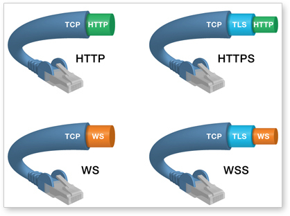

## [HTML5 WebSocket Security is Strong](http://blog.kaazing.com/2012/02/28/html5-websocket-security-is-strong/)

Posted on [February 28, 2012](http://blog.kaazing.com/2012/02/28/html5-websocket-security-is-strong/ "10:56 pm") by [Robin Zimmermann](http://blog.kaazing.com/author/robinzimmermannkaazing/ "View all posts by Robin Zimmermann")

This is a two-part blog post that discusses HTML5 WebSocket and security. In this, the first post, I will talk about the security benefits that come from being HTTP-compatible and the WebSocket standard itself. In the second post, [*Kaazing WebSocket Gateway Security is Strong*](http://blog.kaazing.com/2012/02/29/kaazing-websocket-gateway-security-is-strong/), I highlight some of the extra security capabilities that Kaazing WebSocket Gateway offers, things that real-world WebSocket applications will want to be fully secure.

A WebSocket connection starts its life as an HTTP handshake, which then upgrades in-place to speak the WebSocket wire protocol. As such, many existing HTTP security mechanisms also apply to a WebSocket connection—one of the reasons why the WebSocket standard deliberately chose the strategy of being HTTP compatible. (The other big reason was so that WebSocket could work over the standard ports 80 and 443, thus not requiring enterprises to open additional ports in their firewalls.)

#### **Unified HTTP and WebSocket Security**

Thanks to the HTTP/WebSocket unified security model, the following is a list of some standard HTTP security methods that can be applied to a WebSocket connection. Remember this is not something you get for free: each WebSocket gateway/server needs to implement any of these they consider important. (Kaazing’s Gateway supports all of them, and more.)

- #### **Same Encryption as HTTPS using TLS/SSL**

  You configure TLS (also known as SSL) encryption for WebSocket wire traffic the same way you do for HTTP, using certificates. With HTTPS, the client and server first establish a secure envelope (connection) and only then begin the HTTP protocol. In exactly the same way, WebSocket Secure (WSS) first establishes a secure envelope, then begins the HTTP handshake, and then the upgrade to the WebSocket wire protocol.

  In other words, just like HTTPS is not really a different protocol but is HTTP transported over TLS, WSS is not a different protocol but is WS (WebSocket) transported over TLS.

  The benefit of this is that if you know how to configure HTTPS for encrypted communication, then you also know how to configure WSS for encrypted WebSocket communication.

  
- #### **Origin-based Security**

  Just like HTTP, a WebSocket endpoint is defined by a URL which means origin-based security can be applied (as you would for HTTP). WebSocket always uses the origin security model, as defined by [RFC 6454](http://www.ietf.org/rfc/rfc6454.txt). If your WebSocket gateway/server can be configured for origin-based access control then you can do cross-origin WebSocket connections in a secure way.

  Cross-origin communication has traditionally been a bane of Web development because it opens the door to malicious cross-scripting attacks. But thanks to the standard origin security model it can now be done securely. This is another good example of an HTTP security capability that can also apply to WebSocket due to being HTTP-compatible.

  Be sure to pick a WebSocket gateway/server which supports origin-based security because it lets you partition your application over different hosts or even domains, giving you architectural flexibility. (Or perhaps you want a WebSocket-based service that other sites can access securely, such as for mashup applications).

  Just like existing HTTP Ajax/Comet applications, without cross-origin support you are constrained to either having your WebSocket connection forced to connect to the same origin only or you have to endure security risks when making cross-origin connections.
- #### **Cookie-based Interaction Pattern**

  It is common for applications to store session information in cookies. When connecting to a server it can validate the payload of the cookie and let users proceed without continually forcing them to enter their credentials.

  If you already use cookies for existing Web applications there’s no reason a WebSocket gateway/server can’t read the same cookies for session management.

Incidentally, given that Kaazing was a major contributor to the original WebSocket wire protocol specification, many of these security benefits derive from Kaazing’s submissions to the standard.

#### **Native WebSocket Security**

Here are some non-HTTP-related security features defined by the WebSocket standard itself.

- #### **Subprotocol Validation**

  The WebSocket protocol was designed as a transport layer for higher-level protocols (just like TCP, but for the Web). For example, you can transport existing protocols like XMPP, AMQP, Stomp, and so on over the Web, through firewalls and proxies, using the standard ports 80/443.

  The Sec-WebSocket-Protocol header specifies what subprotocol (the application-level protocol layered over the WebSocket protocol) is negotiated between the client and the WebSocket gateway/server.

  A WebSocket connection can navigate through HTTP communication ports advertising the shape of the protocol that is going to be spoken on top of WebSocket. Therefore a gateway/server, or intermediaries, can properly assess that the traffic flowing is compliant or put security policies in place.

  This protocol-level inspection allows security policies to go deeper than typical HTTP packet-level inspection. The kind of deep packet inspection usually reserved for LANs and WANs now applies equally well over the Web with WebSocket.

  This is one of the advantages of using WebSocket as a transport layer for higher-level protocols over simply sending proprietary messages directly over the WebSocket connection.
- #### **Client-to-Server Masking**

  Each WebSocket frame—think of a frame as a message—is automatically masked to prevent old or badly-implemented intermediaries from accidentally or deliberately causing issues based on bytes in the payload. Unlike HTTP, code on the client cannot successfully predict the precise bytes used to represent the payload of messages sent to the WebSocket gateway/server.

  Each frame contains the masking key so WebSocket-aware intermediaries can unmask the messages for protocol or packet inspection, or to enforce security policies, and so on.

#### **Don’t Forget Fallback**

When thinking about WebSocket and security, another important consideration is fallback. Many WebSocket gateways/servers have fallback for cases when a WebSocket connection cannot be established. This is a practical concern since you have to deal with old browsers, intermediaries that interfere, and so on. A WebSocket application can expect to have many users relying on fallback methods in the real world.

Therefore it is important that any security features you use for WebSocket also apply to the fallback when a WebSocket connection cannot be established. Moreover it should be completely transparent to your developers. They don’t want to have to write different code for those cases where fallback kicks in.

For example, many WebSocket providers will fall back to Comet or Ajax when a WebSocket connection cannot be made. But what happens if you utilize cross-origin policies? (And you should.) Will they be honored by this fallback method?

Another popular fallback strategy when a WebSocket connection isn’t possible is to use Flash Sockets. But what happens, for example, if you are using cookie-based or HTTP authentication? (And you should!) Will the Flash connectivity seamlessly and transparently respond to such a challenge? Or are your application developers going to have to code around this scenario?

Since this article is about security, it should be pointed out that using Flash Sockets as a fallback is a potential security risk. They grant the right for application code served by the source origin to open a raw TCP connection cross-origin to the HTTP port of the target origin. This makes it possible for malicious sites to dynamically load some Flash which has the ability to attack the HTTP port directly. WebSocket and HTTP preserve the security model of the Web, Flash doesn’t.

#### **Summary**

A WebSocket application can be made secure because various standards provide for that possibility. And since WebSocket is HTTP-compatible it benefits from many of the same security techniques that can be applied to HTTP. It is up to each WebSocket gateway/server to implement some or all of these standard security protections.

Just like you would pick a web server or application server with the security features you need, you need to pick a WebSocket gateway/server with the security features you need. Any WebSocket vendor that only has a few or none of them is not serious about security.

If you are building a real-world or enterprise WebSocket-based application then think about your security needs early. It’s not something you want to “bolt on” later because that will mean having to change your architecture or write a lot of extra code. An enterprise WebSocket gateway/server will have security built into the architecture that you can simply configure when you’re ready.

Because when you don’t take security seriously, your customers won’t take *you* seriously.

(Continue reading part 2: [*Kaazing WebSocket Gateway Security is Strong*](http://blog.kaazing.com/2012/02/29/kaazing-websocket-gateway-security-is-strong/).)

### Share this:

- [Twitter32](http://blog.kaazing.com/2012/02/28/html5-websocket-security-is-strong/?share=twitter&nb=1 "Click to share on Twitter")
- [Facebook12](http://blog.kaazing.com/2012/02/28/html5-websocket-security-is-strong/?share=facebook&nb=1 "Share on Facebook")
- [LinkedIn12](http://blog.kaazing.com/2012/02/28/html5-websocket-security-is-strong/?share=linkedin&nb=1 "Click to share on LinkedIn")

[
Like](http://widgets.wp.com/likes/# "2 bloggers like this.")

- 
- 

[2 bloggers](http://widgets.wp.com/likes/#) like this.

### *Related*

[Kaazing WebSocket Gateway Security is Strong](http://blog.kaazing.com/2012/02/29/kaazing-websocket-gateway-security-is-strong/ "Kaazing WebSocket Gateway Security is StrongThis is the second post of a two-part blog post that discusses HTML5 WebSocket and security. The first post, HTML5 WebSocket Security is Strong, talked about the security benefits that derive from being HTTP-compatible and the WebSocket standard itself. In this, the second post, I will highlight some of the…")In "html5"

[HTML5 WebSockets Identified as Security Risk... Really?](http://blog.kaazing.com/2012/08/06/html5-websockets-identified-as-security-risk-really/ "HTML5 WebSockets Identified as Security Risk... Really?The recently published article by eSecurity Planet, HTML5 WebSockets Identified As Security Risk raises a few interesting questions.  \"WebSockets can be used for lots of things, but they shouldn't be used for all items on a web page.\" The post makes a good point about using the WebSocket standard for what it's good at,…")In "html5"

[The Industry's Best WebSocket Emulation: Real Time Web Apps for ALL Your Customers (Even If They’re on IE6!)](http://blog.kaazing.com/2011/11/17/the-industrys-best-websocket-emulation-real-time-web-apps-for-all-your-customers-even-if-theyre-on-ie6/ "The Industry's Best WebSocket Emulation: Real Time Web Apps for ALL Your Customers (Even If They’re on IE6!)With increasing support for HTML5 and WebSocket in modern web browsers and mobile devices, cutting-edge web application developers are turning their attention to building apps that leverage true real-time communication between browsers and back-end servers. On paper, WebSockets look very promising: bandwidth overhead is a tiny fraction of that of…")In "html5"

This entry was posted in [html5](http://blog.kaazing.com/category/html5/), [Kaazing](http://blog.kaazing.com/category/kaazing/), [WebSocket](http://blog.kaazing.com/category/websocket/) and tagged [security](http://blog.kaazing.com/tag/security/). Bookmark the [permalink](http://blog.kaazing.com/2012/02/28/html5-websocket-security-is-strong/ "Permalink to HTML5 WebSocket Security is Strong").
