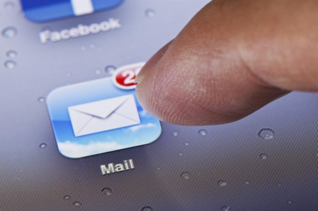
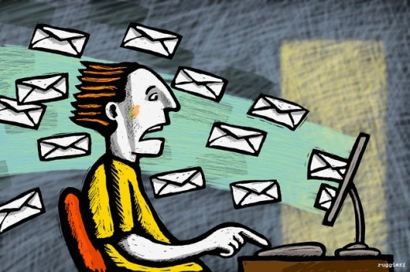
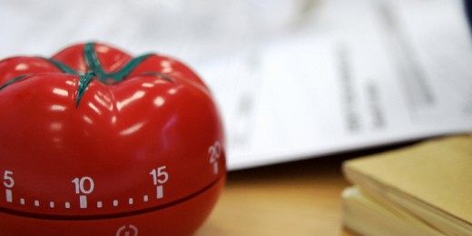

# Why multitasking is bad for our brains

[Sign up for the Growth MBA: GROW FAST or DIE SLOW.](http://thenextweb.com/conference/growth-mba/)

*Ben Slater is Sales & Marketing Director at [Seed](https://app.relateiq.com/r?c=chrome_gmail&url=https%3A%2F%2Fseed.jobs%2F&t=AFwhZf2PJ1Mc1bgQ3HrHE_EbLqtfFvYX9tgPFxY_7NaFQsFb1m0iMYTauqMp_iDcOa-0okjGauf2U3qhzEQgbYqz408ebssKqeAyPH50XyYnd7UWPr20OqONrgDOLmnQ6gFFwP69iAyv), a platform that applies marketing automation and data science to hiring. Follow [@BenJHSlater](https://app.relateiq.com/r?c=chrome_gmail&url=https%3A%2F%2Ftwitter.com%2FBenJHSlater&t=AFwhZf2PJ1Mc1bgQ3HrHE_EbLqtfFvYX9tgPFxY_7NaFQsFb1m0iMYTauqMp_iDcOa-0okjGauf2U3qhzEQgbYqz408ebssKqeAyPH50XyYnd7UWPr20OqONrgDOLmnQ6gFFwP69iAyv). This post first appeared on the [Seed Jobs blog.](http://blog.seed.jobs/2015/01/multitasking-is-bad-brains/)*

---

How many browser tabs do you have open right now?

I’m guessing it’s over 10, maybe 20. Some may be for research, some to help us stay in touch with clients and colleagues , maybe some are little guilty pleasures – whatever they are, they’re not helping.

It’s almost impossible for us to sit down and work on a single task – I’ll admit that there’s little chance of me writing this blog post without checking my email or responding to a tweet or two!

Switching between different tasks leaves us feeling breathless – we’ve had ‘one of those days’, where we’ve felt insanely busy yet have achieved little.

Even in the evening we don’t learn – we eat dinner with the television on, we listen to the radio while we read a book – why are we so bad at sitting down and focusing on one thing?

It distracts us from our main objective, but there is also evidence to suggest that multitasking is bad for our brains! Sounds serious – maybe it’s time to work out a new work routine…

### **Why do we do it?**

The simple answer? It’s so hard not to.

Technology has made everything so quick and easy. Our smartphones are Swiss army knife-like devices that let us do pretty much anything – from booking a holiday to tuning your guitar, they’ve got you covered.

With an app for everything, it’s hard not to try and squeeze value from every second of the day. Walking to the supermarket? Why not write up your shopping list while listening to podcast sensation ‘[Serial](http://serialpodcast.org/)‘. Having lunch with a friend? Make sure you check Facebook to see what your other friends are up to!

### **The science behind it**

So what’s the science behind our obsession with not wasting a second in the day?

### **Why it feels good**

Our brain is excellent at tricking us into thinking we’re being efficient. Studies show that multitasking tends to lead to the [release of dopamine](http://www.psychologytoday.com/blog/the-path-passionate-happiness/201405/why-do-you-find-it-so-hard-not-multitask) – ‘the happy hormone’. We’re eager to reward ourselves for getting so much done at once!

Our attention can be easily captured by something shiny and new – almost akin to a magpie! Ironically it’s the section of the brain that we need the most to help us stay focused that suffers the most.

The reward-seeking centres of the brain are delighted when we switch between tasks – every time we take a look at a shiny new email, tweet or text message we’re releasing small pleasure impulses. No wonder it’s so easy to get distracted.

### **Why it’s actually bad**

It makes us stressed. Multitasking has been proven to trigger the release of stress-hormone [cortisol](http://stress.about.com/od/stresshealth/a/cortisol.htm) which affects everything from your mental capacity to your muscle density – say goodbye to that hard-earned six-pack!

Want to avoid that? It must be as easy as ignoring those new emails right?

Wrong. Recent research suggests that even having the opportunity to multitask [lowers our ability to solve problems](http://www.theguardian.com/money/2009/oct/05/avoid-multitasking) and effectively manage tasks by roughly 10 IQ points. Merely having an email sitting unread in your inbox might be ruining your productivity!

Here’s a quick example to show how serious this loss of mental capacity is:

We sometimes discuss the effect of marijuana on our ability to think clearly – the same study showed that multitasking may have an [even more negative cognitive effect](http://www.forbes.com/sites/vanessaloder/2014/06/11/why-multi-tasking-is-worse-than-marijuana-for-your-iq/).

### **Is anyone good at multitasking?**

You would think that constant exposure to a number of things at once would make some people experts in switching between different tasks. You would think that some people would become adept at filtering information and would become even more productive.

That would be logical right?

Well, logical or not, that doesn’t happen. Research suggests that multi-taskers are actually far worse at switching between different tasks and tuning out irrelevant information.

There are a couple of isolated examples of ‘[supertaskers](http://www.newyorker.com/science/maria-konnikova/multitask-masters)‘ who seem to be able to handle the workload but, as a rule, it seems that multitasking is something to avoid.

### **What’s our main distraction?**

What’s the number one distraction you face at work?

The seemingly unstoppable flood of **emails** is mine, (I’m sure many of you face a similar problem). Friends and colleagues report the same problem. We feel like we’re obliged to respond, but doing so makes it impossible to get anything else done.

It’s become such a dominant part of our workflow that we now obsess over getting to Inbox 0. The moment when we are finally back on top – Mashable even describes it as the ‘[holy grail](http://mashable.com/2013/10/10/inbox-zero/)‘ of the digital lifestyle.

Whether you’ve hit Inbox 0 or not, I have several problems with email:

### **1 – People expect an instant reply**

The steps that it takes to write and deliver a letter buy you some time. People understand that you’re not going to get back to them straight away – you can put a letter to one side and deal with it when you’re ready.

In today’s digital world, we’re always available. Out of the office? That’s fine, you can pick up your new messages on your shiny new iPhone or tablet. There’s no excuse to postpone your reply!

Social expectation also dictates that we respond – we don’t want to upset the sender. I use a Gmail plugin from [RelateIQ](https://www.relateiq.com/) that lets me see when someone has opened my email – despite my feelings on email I find it difficult not to get slightly annoyed when I see someone has opened my message but has chosen not to reply.

### **2 – Anyone can email you**

We tend to be pretty selective with ‘[snail mail](http://en.wikipedia.org/wiki/Snail_mail)‘ – it’s rare that you would write to someone you don’t know.

Our approach to email is totally different. We’re prepared to use any trick in the book to get someone’s email address, I’m no different – I use a great tool from [Spokepoint](http://www.spokepoint.com/). Once we’ve verified that it’s correct it’s open season – email is sufficiently impersonal that we don’t mind sending hundreds of messages to people we’ve never met.

These ‘cold’ emails flood our inbox. We waste valuable time filtering through them, archiving and deleting as we go. My main frustration is the lack of effort that people make with their messages. There is little inclination to write emails that seem even vaguely personal – hundreds of other people are deleting the same email!

### **3 – Every email requires an instant decision**

The constant decision making that trawling through email takes a toll on the brain. Continually shifting our concentration forces the brain to rapidly burn through fuel leaving us exhausted and disorientated.

Even popular inbox management apps like Mailbox, (designed to stop email wasting your time), want you to make a choice – is this email a ‘must respond’ or can you defer it until tomorrow.

### **How do you become more productive and stop wasting time?**

If you’re looking for a golden solution that’s going to help you get back on top of things then you’re going to be disappointed. There isn’t a perfect fix, but there are tactics that you can use to stop multitasking as much and become more productive:

### **1 – Evening planning**

This one isn’t rocket science but it really works. Spending just 10 minutes every evening jotting down the main things you want to achieve the next day allows you to be much more focused at work.

These are the tasks you need to build your day around – make sure you get them done before you start responding to messages and scouring Twitter for interesting tweets.

### **2 – Pomodoro technique**

I’m trying this out at the moment and I’m really enjoying it. It’s a [time management technique](http://pomodorotechnique.com/) devised by Francesco Cirillo in the late 1980′s.

You split your workday into 25 minute periods of intense, focused work, that are followed by 5 minute breaks. The method is based on the idea that frequent breaks can improve mental agility.

I use the 25 minute stretches of focus to tackle my major tasks for the day, (usually the ones I have planned the evening before), and the 5 minute breaks to ‘switch off’ and respond to emails and tweets.

I’d definitely recommend giving it a go. You can even buy your very own tomato shaped timer to keep track of your work schedule if you fancy! (Below)

### **3 – Schedule ‘email’ into your day**

I haven’t tried this myself but some productivity experts recommend scheduling a time every day where you deal with your emails and other correspondence.

Try putting a slot into your calendar every day that you devote to reading and replying to tweets, messages and emails – this is the only time that you should have your Gmail or Outlook open.

You may even want to experiment with turning notifications on your phone and browser off to make sure you stick to this – although that could mean you miss the occasional ‘urgent’ message.

### **Final word**

We’re not really to blame for multitasking. It’s hard to force ourselves to ignore incoming messages that we feel like we have to answer and stop ourselves flitting between different tasks when we’re so busy.

Each email we send gives us a sense of accomplishment (and a large spoonful of reward hormones) – it feels like we’re getting on top of our work, becoming more organised.

The truth may be the opposite. We’re distracting ourselves from the things we really need to get done.

It’s pretty hard to stop multitasking, but I’ve enjoyed becoming more focused with my day. I’d really recommend trying some of the methods I mentioned above and seeing if it makes a difference to your productivity.

### **Final fact – music isn’t multitasking**

Don’t worry, you don’t have to shut iTunes down! Listening to music [occupies a separate part of the brain](https://blog.bufferapp.com/music-and-the-brain) that doesn’t interfere with your work – it doesn’t interfere with your productivity.

How do you avoid distractions? If there are other methods that you use to focus and avoid the negative effects of multitasking we would love to hear about them!

**Read Next:**[How to do your PR in the age of information overload](http://thenextweb.com/entrepreneur/2014/10/08/pr-age-information-overload/)

[Show 3 comments](http://thenextweb.com/insider/2015/04/12/why-multitasking-is-bad-for-our-brains/#comments)
