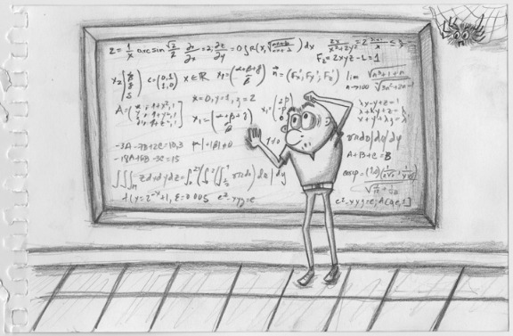

# The thing with code clarity: you can't be proud of something I can't read

Einstein once said:

> Any intelligent fool can make things bigger, more complex, and more violent. It takes a touch of genius - and a lot of courage - to move in the opposite direction.

I'm pretty sure Mr. Einstein didn't write code for a living, but for someone like me (and probably you), who has written and seen a lot of code, these words resonate like they were meant for software developers.

There are many + 1 books out there talking about the importance of code clarity. There are even more articles, videos, blog posts, conferences, and people talking about this same topic, but somehow it feels that is not enough.

I read code every day, and it still looks complicated, convoluted, disorganized, and stitched together with disdain. I keep talking to people that don't get it, or don't care, or that just don't understand how to make it better.

And I know I won't fix it by adding another blog post to the pile, but I can't just shut up. Instead, I hope somebody reads this and decides to do better. At least for some time, or maybe for just a day. Who knows; it might change something for good.

## Why people wouldn't shut up about code clarity?

Coding is not only about telling a computer what to do, but about telling people what you are trying to get done with a computer.

Remember, developers will come and go. Bugs will show up. New features will be added. Hours and hours will be spent working with the same code, growing and stretching it. You better feel comfortable with it now. You better make it easy for those who will help you later.

If your code is hard to understand, it will be easier for people to make mistakes when changing it. Others will be scared of it. They won't like to change it and make it better, so it will rot and get worse with the time. Something that started as a single complicated line will eat your system from the inside out, one line at the time.

Clarity prevents bad stuff like this from happening.

## My code is as bad as my neighbor's

Personally, I don't think my code is as clear or simple as I would want it to be. I've written really scary software all my life, and I don't feel proud about it.

Years have gone by and I'm definitively getting better. Every time I'm sitting in front of an editor, I make an active and conscious decision of using my code to tell a story.

I want people to read it and enjoy it as much as I do. I can't get there if they don't get it, so I try hard, very hard, to make it easy for them.

And just like you, I can do better. I must if I want to keep growing as a developer. At one point it stops being about *how much you know* and it starts being about *how well you do what you know*.

I believe I'm right there.

## For those who don't care

Have you ever seen this quote?

> Any fool can write code that a computer can understand. Good programmers write code that humans can understand.

It was [Martin Fowler](http://www.martinfowler.com/) who said it. And he is a very smart fellow, so you should take note.

Imagine talking to an architect that wouldn't shut up about the looks of her building, totally neglecting the fact it was built on a shaky foundation that will collapse sooner rather than later.

What's in the inside is usually as important as what you see. Developers first and foremost write code. They should love it and all the process that goes into creating it. If you can't feel proud about your code when showing somebody else, how can you call yourself a developer without blushing of disgust?

Remember that complicating your code doesn't make you smarter. Instead it shows how immature you are as a software developer, and puts a huge red expiration date in front of it for everyone to see.

## For those who don't know how to do better

I've noticed that a lot of people struggle with making their code legible for others. It's a hard thing to do, and it requires time and a lot of practice:

> I would have written a shorter letter, but I did not have the time.

The above quote is attributed to Blaise Pascal, who wrote it in 1656. Being concise when writing takes time. It's also difficult to write short, clear, and easy to understand code.

But all the effort you put into it is so worth it!

As I mentioned before, I always try to make my code tell a story. I want people to read it and completely understand *what*, *why*, *when*, and *how* things are happening. Every time I look back and see something I can't read, I refactor it.

I use comments when necessary, only to explain things that I can't or don't know how to make clear enough, but I'd rather make my code reveal its intention through the use of better naming conventions, proper structure, and correct spacing and indentation. Every bit helps, and I use whatever I have to make it easy on the eyes.

I pay special attention to what I call *tiers of complexity*. People reading my code for the first time are usually looking for the 10,000 ft view version of what my code does. This is my first tier, where I try to be as humane as possible with my narrative. When people want more, they can start digging deeper into subsequent tiers, where more details are revealed by the code. The further you go, the more complexity you'll uncover, one tier at the time.

I can't finish this post without recommending [Refactoring: Improving the Design of Existing Code](http://www.amazon.com/gp/product/0201485672/ref=as_li_tl?ie=UTF8&camp=1789&creative=9325&creativeASIN=0201485672&linkCode=as2&tag=blogsvpinocom-20&linkId=F64I7N2N6N6SGRZH). Read it. Over and over again. It will help make your code so much better!

## I hope this inspires you

If this post helps or inspires at least one developer to take a second look at a pice of code and make it better, I'd be extremely happy.

I'm zealous with my code. I nurture it from the very first line until I'm done. I want it to be my résumé, to speak for me in front of anyone trying to decide whether I'm a good developer. And I want you to feel the same way.

From all the great stuff out there available to us, learning how to write clear and maintainable code is something that will last with you forever, and it will make you so more valuable.

So please, look into it. One single line at the time.
