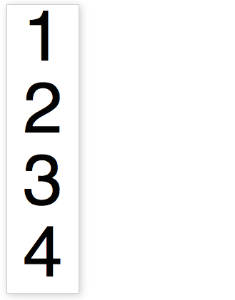
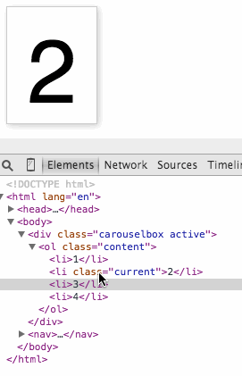
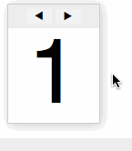
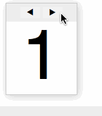

# Keeping it simple: coding a carousel

Wednesday, April 8th, 2015 at 10:23 pm

One of the things that drives me crazy in our “modern development” world is our fetish of over-complicating things. We build solutions, and then we add layers and layers of complexity for the sake of “making them easier to maintain”. In many cases, this is a fool’s errand as the layers of complexity and with them the necessary documentation make people not use our solutions. Instead, in many cases, people build their own, simpler, versions of the same thing and call it superior. Until this solution gets disputed and the whole dance happens once again.

In this article I want to approach the creation of a carousel differently: by keeping it as simple as possible whilst not breaking backwards compatibility or have any dependencies. Things break on the web. JavaScript might not be loaded, capabilities vary from browser to browser. It is not up to us to tell the visitor what browser to use. And as good developers we shouldn’t create interfaces that look interactive but do nothing when you click them.

So, let’s have a go at building a very simple carousel that works across browsers without going overboard. [You can see the result](https://codepo8.github.io/simple-carousel/carousel-pointer-events.html) and [get the code on GitHub](https://github.com/codepo8/simple-carousel).

## The structure of a carousel

Let’s start very simple: a carousel in essence is an ordered list in . Thus, the basic is something like this:

|  |
| --- |
| ``` <div class="carouselbox"   <ol class="content"     <li1</li     <li2</li     <li3</li     <li4</li   </ol </div ``` |

Using this, and a bit of [we have something that works and looks good](https://codepo8.github.io/simple-carousel/carousel-noscript.html). This is the base we are starting from.

## The basic

The used here is simple, but hints at some of the functionality we rely on later:

|  |
| --- |
| ``` .carouselbox    font-family helveticasans-serif   font-size    width 100px   position relative   margin    border  solid    box-shadow       overflow hidden  .content    margin    padding   .content li    font-size 100px   margin    padding    width    list-style    text-align center ``` |

The main thing here is to position the carousel box relatively, allowing us to position the list items absolutely inside it. This is how we’ll achieve the effect. The hidden overflow ensures that later on only the current item of the carousel will be shown. As there is no height set on the carousel and the items aren’t positioned yet, we now see all the items.



## The carousel visuals in

A lot of carousel scripts you can find will loop through all the items, or expect classes on each of them. They then hide all and show the current one on every interaction. This seems overkill, if you think about it. All we need is two classes:

- We need a class on the container element that triggers the functional display of our carousel. This one gets applied with JavaScript as this means the look and feel only changes when the browser is capable of showing the effect.
- We need a class on the currently visible carousel element. This is the odd one out. All the others don’t need any classes.

We can hard-code these for now:

|  |
| --- |
| ``` <div class="carouselbox active">   <ol class="content">     <li>1</li>     <li class="current">2</li>     <li>3</li>     <li>4</li>   </ol> </div> ``` |

All we need to show and hide the different carousel items is to change the height of the carousel container and position all but the current one outside this height:

|  |
| --- |
| ``` .active    height 130px  .active li    position absolute    200px  .active li.current ``` |

[You can see this in action here](https://codepo8.github.io/simple-carousel/carousel-css-only.html). Use your browser developer tools to move the “current” class from item to item to show a different one.



## Interaction with JavaScript

To make the carousel work, we need controls. And we also need some JavaScript. Whenever you need a control that triggers functionality that only works when JavaScript is executed, a button is the thing to use. These magical things were meant for exactly this use case and they are keyboard, mouse, touch and pen accessible. Everybody wins.

In this case, I added the following controls in our :

|  |
| --- |
| ``` <div class="carouselbox"   <div class="buttons"     <button class="prev"       ◀ <span class="offscreen"Previous</span     </button     <button class="next"       <span class="offscreen"Next</span ▶      </button   </div   <ol class="content"     <li1</li     <li2</li     <li3</li     <li4</li   </ol </div ``` |

Now, here is where the hard-liners of semantic markup could chime in and chide me for writing that is dependent on JavaScript instead of creating the using JavaScript. And they’d be correct to do so. There is nothing that stops me from wrapping this chunk of in a call or innerHTML write-out. However, as buttons are meant to trigger JS functionality, I think it is easier to just keep that in the and allow us thus to style them with much less hassle. As a security precaution, we hide them in the non-active state and show them when the “active” class has been applied:

|  |
| --- |
| ``` .active .buttons    padding     background    text-align center   z-index    position relative  .carouselbox button    border    display   .active button    display block   .offscreen    position absolute    -2000px ``` |

The offscreen parts are there to explain what these buttons really mean as the triangle is not enough for some people.

All that is left to make the carousel work is the JavaScript. And here it is:

|  |
| --- |
| ``` carousel  function    box  document.querySelector'.carouselbox'    next  box.querySelector'.next'    prev  box.querySelector'.prev'    items  box.querySelectorAll'.content li'    counter      amount  items.length    current  items   box.classList.'active'   function navigatedirection      current.classList.remove'current'     counter  counter  direction      direction             counter           counter  amount              direction             itemscounter         counter            current  itemscounter     current.classList.'current'      next.addEventListener'click' functionev      navigate      prev.addEventListener'click' functionev      navigate      navigate ``` |

As you can see, by relying on and its built-in crawling of the , there is no need for any loop whatsover. Here’s what’s going on in this script:

- We grab all the elements we need with querySelector.
- We set the counter to 0 – this is the variable that keeps track of which item of the carousel is currently shown
- We read the amount of items in the carousel and store them in a variable – this allows us to loop the carousel
- We set the current item as the first one in the carousel. The current variable will contain a reference to the element currently visible. All we do when the carousel state changes is remove the class from it and shift it to the other one
- We add the class of “active” to the container element to change its styling and trigger the functionality explained earlier.
- The navigate method takes a parameter called direction which defines if we should go backwards (negative values) or forwards in the carousel. It starts by removing the “current” class from the current carousel item, thus hiding it. We then modify the counter and make sure it doesn’t go beyond the amount of items available or below 0. In each case we move to the other extreme, thus making the carousel an endless rotating one. We define the new current item and add the class to show it.
- We apply event handlers to the buttons to navigate forwards and backwards
- We show the first carousel item by calling navigate with 0 as the value.

Pretty simple, isn’t it? By allowing to do what it is good at, our JavaScript more or less is only about keeping state and shifting classes around.

[You can see the basic carousel in action here](https://codepo8.github.io/simple-carousel/carousel-simplest.html). It’s nothing fancy, but it does the job.



## Getting fancy

The showing and hiding of the items by positioning them in a container with overflow hidden should work in any browser in use these days – even the ones who should be retired. And as all we do is add and remove classes, we can now tap into the beautiful features browsers have these days. Using transition, opacity and transformation, [we can add a pretty effect](https://codepo8.github.io/simple-carousel/carousel-fancy.html) with a few lines of :



|  |
| --- |
| ``` .active li    position absolute    130px     opacity    transform scale   transition 1s  .active li.current          opacity    transform scale   transition 1s ``` |

The beauty of this is that the performance handling, the timing (in case you click too fast) is handled by the browser for us. No need to count or juggle timeouts. As is a one-off state, this also means that browsers that do not support these features simply don’t show them instead of throwing an error.

## Bullet-proofing our JavaScript

When a browser in use doesn’t support some JavaScript feature we use, things get trickier. We get an error and things break. Thus, it makes sense to test for the things we use and move on only when there is support for them. In this code, we rely on classList and querySelector, so let’s just check for this:

|  |
| --- |
| ```  document.querySelector     'classList'  document.  return false ``` |

We could get much more paranoid and ensure that all the elements are available before proceeding but this is overkill. If a maintainer forgets to add the “carouselbox” class to the main element, the error thrown is pretty obvious.

## Bonus round: Stacking with

One last trick to mention is that if you were to stack all the elements of the carousel visually and only use opacity to blend them then there is a problem with links. You’d always get the link of the first item, no matter which one is shown.

The trick to work around that is user “pointer-events: none” in your :

|  |
| --- |
| ``` .active li {   position: absolute;   top: 130px;     pointer-events: none;   opacity: 0;   transform: scale(0);   transition: 1s; } .active li.current {   top: 30px;     pointer-events: auto;   opacity: 1;   transform: scale(1);   transition: 1s; } ``` |

[You can see this workaround in action here](https://codepo8.github.io/simple-carousel/carousel-pointer-events.html).

## Where to go now?

The natural drive as a developer now is to enhance this to allow users to define a different starting element to show, to define lots of preset effects that can be chosen with the data attribute, to allow for non-looping carousels and to define an to allow other components on the page to interact with the carousel. And an to create and remove and shuffle items of the carousel. And, and and… All of these are great exercises, but let’s ask ourselves: who do we do that for?

We have such amazing functionality built into the platform of the web now. Maybe it is time to stop writing the perfect generic re-usable widget and just stick with simple things and let people extend them when they need to? Who knows, by not doing the work for them, people might learn to be better coders themselves.
