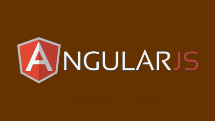

# Define multiple Angular apps in one page

Learn different ways on how to define multiple angular apps on single page.

Recently in my previous post, I have posted about [**Different ways of bootstrapping AngularJS app**](http://www.jquerybyexample.net/2014/12/bootstrapping-angularjs-ways.html), where you can either auto-bootstrap using ng-app attribute or manually bootstrap using angular.bootstrap function. And also mentioned in [**angular interview questions**](http://www.jquerybyexample.net/2014/12/latest-angularjs-interview-question-2.html) that "**Only one AngularJS application can be auto-bootstrapped per HTML document.**" Which means that your page can only have single ng-app attribute. If you put multiple ng-app attribute, only first will be considered and the rest will be ignored.

[](http://4.bp.blogspot.com/-do7XvBHGtHU/VK0mFOdTzcI/AAAAAAAAIeo/JYr8qzbX5ok/s1600/Angular.png)

**You may also like:**

- [**AngularJS interview questions**](http://www.jquerybyexample.net/search/label/AngularJS%20Interview%20Questions)

Let's see with an example. In the below code, there are 2 ng-app present on the page.

Copy Code

```
 ng-appfirstApp"
   ng-controllerFirstController"
    1: {{ desc }}
  

 ng-appsecondApp"
   ng-controllerSecondController"
    2: {{ desc }}
  

script https://cdnjs.cloudflare.com/ajax/libs/angular.js/1.3.7/angular.js"</script
script text/javascript"
 firstApp = angular.module(firstApp', []);
firstApp.controller(FirstController', function($scope) {
    $scope.desc = First app.";
});

 secondApp = angular.module(secondApp', []);
secondApp.controller(SecondController', function($scope) {
    $scope.desc = Second app.";
});
</script
```

And below is the output. Out of 2 ng-app present on the page, the first one gets initialized and works as expected. Output also shows the same.

Copy Code

```
: First app.
: {{ desc }}
```

[Demo](http://plnkr.co/edit/XRed4HJaV3dzrnaLGQX6?p=preview)

Then how can you define 2 different angular apps on the same page? Well, there are a couple of ways to implement this.  
  
**Manually bootstrapping each app**  
  
You can manually bootstrap both the application using angular.bootstrap() as we have seen in [**Different ways of bootstrapping AngularJS app**](http://www.jquerybyexample.net/2014/12/bootstrapping-angularjs-ways.html).

Copy Code

```
var firstApp = angular.module(firstApp', []);
firstApp.controller(FirstController', function($scope) {
   $scope.desc = First app. ";
});

var secondApp = angular.module(secondApp', []);
secondApp.controller(SecondController', function($scope) {
  $scope.desc = Second app. ";
});

var dvFirst = document.getElementById(dvFirst');
var dvSecond = document.getElementById(dvSecond');

angular.element(document).ready(function() {
   angular.bootstrap(dvFirst, [firstApp']);
   angular.bootstrap(dvSecond, [secondApp']);
});
```

Since we are bootstrapping them manually, make sure to remove ng-app attribute from the HTML page.

[Demo](http://plnkr.co/edit/1SdZ4QpPfuHtdBjTKJIu?p=preview)

**Manually bootstrapping second app**  
  
You can also manually bootstrap the second app, where the first app gets initialized via ng-app

Copy Code

```
var firstApp = angular.module(firstApp', []);
firstApp.controller(FirstController', function($scope) {
   $scope.desc = First app. ";
});

var secondApp = angular.module(secondApp', []);
secondApp.controller(SecondController', function($scope) {
  $scope.desc = Second app. ";
});

var dvSecond = document.getElementById(dvSecond');

angular.element(document).ready(function() {
   angular.bootstrap(dvSecond, [secondApp']);
});
```

So make sure that there is ng-app present on the page for first app.

[Demo](http://plnkr.co/edit/KcAipMgezStTDgTN0Ebt?p=preview)

**Using dependency injection to inject both in root app**  
  
You can define a root level app using ng-app and then inject both the apps as module in root app.

Copy Code

```
var rootApp = angular.module(rootApp', [firstApp',secondApp']);
var firstApp = angular.module(firstApp', []);
firstApp.controller(FirstController', function($scope) {
   $scope.desc = First app. ";
});

var secondApp = angular.module(secondApp', []);
secondApp.controller(SecondController', function($scope) {
  $scope.desc = Second app. ";
});
```

And make sure any parent node (body/Parent div) is assigned with ng-app=rootApp".

[Demo](http://plnkr.co/edit/xXQfdtc8RhaYncBw0NVK?p=preview)

Hope you find this useful!!!!
