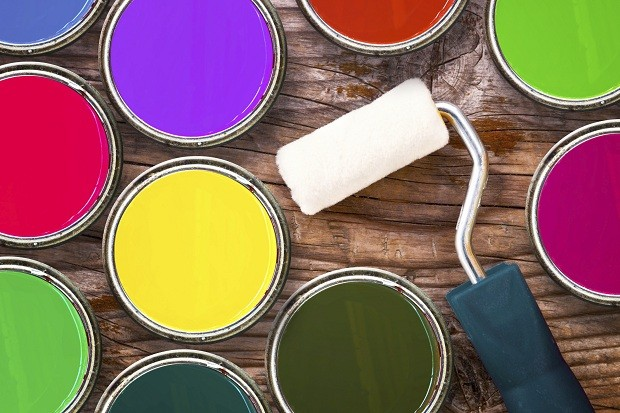

# Por que você não deve pintar as paredes do escritório de branco

## As cores que você pode usar como alternativa e como cada uma delas influencia a maioria das pessoas

[inShare.](#)60

Colocar uma cor na parede do escritório pode melhorar a produtividade dos funcionários (Foto: Thinkstock)

Paredes brancas podem dar a aparência de um ambiente limpo e sem frescura. Mas no caso de escritórios, variar a cor pode ser uma boa ideia, não só para deixar o lugar mais estiloso, mas também para melhorar a produtividade dos funcionários.

Segundo um estudo feiro pela pesquisadora Nancy Kwallek, da Universidade do Texas, as cores podem afetar o trabalho. Para chegar a essa conclusão, ela convidou voluntários para trabalhar em três ambientes diferentes. Um deles tinha paredes vermelhas, o outro branca e, o terceiro, um tom próximo de verde água. Segundo a [Fast Company](http://www.fastcompany.com/3044601/work-smart/why-you-should-never-paint-office-walls-white), ela identificou dois grupos de pessoas: um mais e outro menos afetado pelas colres. O primeiro grupo teve dificuldade de trabalhar no ambiente vermelho, ao contrário do segundo. Mas ambos cometeram mais erros quando estavam no ambiente branco.

**saiba mais**

- [O futuro do trabalho: tudo o que você precisa saber para desenvolver sua carreira](http://epocanegocios.globo.com/busca/click?q=carreira&p=0&r=1429037168720&u=http%3A%2F%2Fepocanegocios.globo.com%2FCaminhos-para-o-futuro%2FDesenvolvimento%2Fnoticia%2F2015%2F04%2Fo-futuro-do-trabalho-tudo-o-que-voce-precisa-saber.html&t=informacional&d=false&f=false&ss=&o=&cat=)
- [Como se dar conta de que você está sabotando sua carreira](http://epocanegocios.globo.com/busca/click?q=carreira&p=4&r=1429037218762&u=http%3A%2F%2Fepocanegocios.globo.com%2FInspiracao%2FCarreira%2Fnoticia%2F2015%2F03%2Fcomo-se-dar-conta-de-que-voce-esta-sabotando-sua-carreira.html&t=informacional&d=false&f=false&ss=&o=&cat=)

"O branco não nos ajuda a ser produtivos, e a maioria dos ambientes de trabalho é branco, gelo ou cinza", afirmou Nancy ao site americano. O verde água, segundo ela, é uma boa escolha. "Pesquisas mostraram que os funcionários preferem trabalhar em ambientes com tons de azul ou verde".

A pesquisadora afirma que nem sempre uma generalização de cores pode ser válida, porque enxergamos milhares de variações de tons. Segundo ela, o importante é observar como as pessoas respondem a uma determinada cor. A seguir, confira cores que costumam ser usadas como alternativa em escritórios e como elas afetam as pessoas.

**Vermelho - para quem trabalha com detalhes**  
Uma cor forte, o vermelho estimula o batimento cardíaco e pode aumentar a pressão sanguínea. Um estudo da Universidade de British Columbia (UBC) concluiu que o vermelho pode melhorar a performance de quem executa tarefas nas quais é preciso prestar atenção a detalhes.

**Azul - para os criativos**  
O azul acalma, promove a comunicação, o vínculo e a eficiência. Também ajuda a aumentar a criatividade. Pode ser uma boa cor para usar, por exemplo, em uma sala onde acontecem reuniões de brainstorming.

**Amarelo - proibido para reuniões**  
O amarelo é uma cor estimulante e que atrai otimismo. Porém, uma dose em excesso pode causar ansiedade e estudos mostram que a chance de as pessoas perderem a paciência é maior em salas amarelas. Portanto, mantenha o amarelo longe das salas de reunião.

**Verde - para inspirar inovação**  
Assim como o azul, verde é uma cor que acalma, promove harmonia e equilíbrio. Também pode aumentar a performance criativa. É uma boa escolha para escritórios onde a inovação é parte fundamental do trabalho.

**Cinza - evite**  
Apesar do cinza ser neutro psicologicamente falando, falta energia. Pode ser inibidora é preparar as pessoas para um "período de hibernação", segundo a consultoria londrina Colour Affects. Muito cinza pode gerar falta de confiança e até mesmo um ambiente mais triste. Pode ser usado em pequenas quantidades para quebrar cores mais fortes, como vermelho ou amarelo.

- O que você achou?
- [Adorei](#)
- [Aprendi algo](#)
- [Gostei](#)
- [Perdi meu tempo](#)
