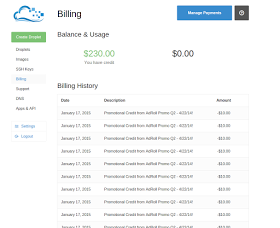

### Race conditions on Facebook, DigitalOcean and others (fixed)

Hello,  
  
Lately I have been looking into race condition bugs affecting websites/web-applications. Here is a good resource to learn about them - includes theory, vulnerable code, proof of concept code and ways to fix. I highly recommend you read it:  
[**https://defuse.ca/race-conditions-in-web-applications.htm**](https://defuse.ca/race-conditions-in-web-applications.htm)  
  
Below are couple of my reports ranging from benign to pretty high severity.  
  

### Facebook bug 1: inflating page reviews using a single account.

Some Facebook pages have a review system, where you can rate the page 1-5 stars and add textual description. Each user is allowed to rate only once, and you can edit or delete your review later. Using race conditions you could rate a page multiple times, then delete **one** of your reviews, and then rate again. This allowed me to inflate or deflate ratings of any page. Here is my report to Facebook, slightly edited:  

1. Using your account go to Page URL and add a review with 5 stars, but intercept the /ajax/pages/review/add request
2. **Send out as many /ajax/pages/review/add requests as you can in shortest possible time frame.**
3. The reviews will jump to some number > 1 (depending on luck and how much requests you sent), lets say it is 5 reviews.
4. Go to Page once again, and go to All reviews.
5. Delete the one review by you (only one rating will be deleted). Now page has 4 reviews
6. Create a new review with same user, and repeat steps 1-6.
7. You now have a really well-rated Page.

  
Report timeline:  
April 14, 2014 - **Bug reported to Facebook**  
April 15, 2014 - Confirmation from Facebook's security team  
April 27, 2014 - Pinged Facebook team thinking this was fixed, but it was not :-)  
June 15, 2014 - **Bug is now fixed**  
June 25, 2014 - Bounty of **$3000** awarded  
  
I believe this was one of first race condition bugs reported to Facebook, as I found no other write-ups online, and this is what Facebook's team told me:  
> "Out of curiosity, has anyone reported any similar bugs to this one - some kind of race condition? " - not recently. In the past they may have, but I cannot tell for sure.

  

### Facebook bug 2: creating multiple usernames for a single account

The principle behind this bug is same as previous one; send as many requests to an endpoint with a list of wanted usernames. Some will go through, others will not.  
Here is my test account with two usernames:  
<https://graph.facebook.com/rpert.grint.6>  
<https://graph.facebook.com/rpert.grint.7>  
  
This bug was fixed, but a bounty was not awarded. Here is the original reply from Facebook:  
> The issue you describe is not a security issue. Reporting this issue is not eligible for a bug-bounty. However, we have made changes to the codebase and the issue should no longer be present.

Report timeline:   
April 14, 2014 - **Bug reported to Facebook**  
October 16, 2014 - **Confirmation of fix**  
  
There are some more minor bugs that I have found, but none of them have a real security impact, so I did not report them.  
  
I have one more race condition bug reported to Facebook, but Facebook team had trouble reproducing it. **I will edit the write-up when/if it gets fixed.**  
  

### DigitalOcean bug: making money out of thin air

This was a fun one. Basically, I reused one promo code multiple times using race conditions.  
Here is the report:  

1. Create an account and find a working promo code
2. Go to your billing management page
3. Paste your promo code into input field
4. A POST request to https://cloud.digitalocean.com/promos will be made.
5. **Send this POST request many times in short time frame - best to multithread it.**
6. **Money will be added multiple times to your account.**

Report timeline:

January 11, 2015 - **DigitalOcean security contacted with a report**

January 13, 2015 - Confirmation from DigitalOcean team

January 21, 2015 - **Bug is fixed.**

At the time of report I did not have a $100 promo code from GitHub's education pack, but I believe it would get redeemed multiple times, too.

I did not get a separate bounty for this report, but DigitalOcean team let me keep my test accounts with ~550$ total. Here is a screenshot from one of accounts where codes have been redeemed multiple times. Unfortunately, I lost email for this account...

Similar promo code race conditions were reported to many other companies, with **LastPass team being fastest to fix the issue - it only took them 3 days.** They have also let me keep the premium time on my account, and confirmed no-one abused the bug prior to my report.

I'd like to thank Facebook, DigitalOcean and LastPass security teams for being responsive to my reports, and rewarding me for them!

Giant thanks to Team Tasteless, too. Check out their [web hacking challenges](http://chall.tasteless.eu/), you might learn a lot there. I sure did :-)  
  
**Join the discussion on [/r/netsec](https://www.reddit.com/r/netsec/comments/33z3wo/race_conditions_on_facebook_digitalocean_and/) or [HackerNews](https://news.ycombinator.com/item?id=9443867)!**

[Josip Franjković](http://www.blogger.com/profile/09250128418047776842 "author profile")

at
[02:11](http://josipfranjkovic.blogspot.com.br/2015/04/race-conditions-on-facebook.html?m=1 "permanent link")

[Share](#)
