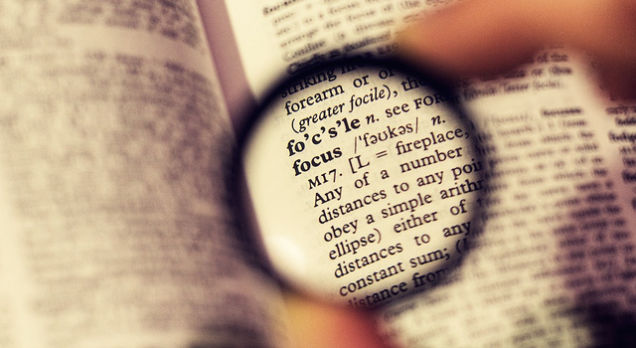

# [How to Recover From an Unproductive Day Like It Never Happened](http://lifehacker.com/how-to-recover-from-an-unproductive-day-like-it-never-h-1698124672)

We all have unproductive days. Maybe an unexpected event throws your schedule for a loop. Maybe you’re not feeling well. Whatever the reason, it can be tough to get back on track. Here’s how to get past the dip in productivity and back into gear.

Of course, there are different reasons for being unproductive, and if productivity in general is an issue for you, you’ll want to [focus your efforts on a long-term solution](http://lifehacker.com/5969129/hack-your-life-in-one-day-a-beginners-guide-to-enhanced-productivity). Here, we’re assuming you have a solid work system in place, but a short-term setback threw you off. Here are some simple ways to get back to your normal routine after a less-than-productive slump.

### Get an Early Start

So your binge of unproductivity is over and you’re now on the mend. Great! The first thing you can do is resolve to wake up earlier the following day.

Let’s say you got jack done Monday. Once you realize the day has been a waste, make it a point to get to bed earlier that night, so you can get a head start on Tuesday (getting up early is hard, but lucky for you, we’ve [got a whole list of ways to make it happen](http://lifehacker.com/5934145/how-to-stop-snoozing-and-get-yourself-out-of-bed)).

When you get up that morning, don’t dive straight into work, though. [Indulge in something you love](http://lifehacker.com/start-your-day-off-right-by-indulging-in-something-you-1696585725). This starts your morning on an optimistic note, putting you in the right frame of mind for tackling the day. Instead of approaching it with the stress of having to catch up, stay calm and approach it optimistically and methodically.

### Use a “Productive Mood Anchor”

Its important to start your day stress-free, but let’s face it: you *do* need to catch up. Get yourself in a productive mood by finding your “productive mood anchor.” The folks at Asian Efficiency coined this term, and [here’s how they explain it](http://www.asianefficiency.com/productivity/how-to-handle-unproductive-days/):

> Most people have something that serves as a good “anchor” for their productive moods. We’ve found that it is usually something like coffee or green tea. Personally, I only drink English Breakfast Tea when I’m really focused on a creative task, so for me it serves as an anchor for being in a productive flow.

Of course, your anchor doesn’t have to be a beverage. It’s simply a trigger that makes you feel back at home in your work-life routine. For me, it’s watching the morning news. I never do this on my days off. But it’s part of my [workweek ritual](http://lifehacker.com/how-your-personal-rituals-impact-your-health-and-how-t-974317914), and it always makes me feel like it’s time to start a productive day.

You probably have a good idea of what your productive mood anchor is. Whenever you start your first morning back to the grindstone, use this mood anchor to get the productivity flowing.

### Take Time to Refocus

It seems counterproductive, but when you’ve been unproductive, it helps to take a short break to refocus. This can shift you into a more productive mode. The Wall Street Journal [suggests taking just twenty minutes](http://www.wsj.com/articles/SB10001424052970204770404577082532864410386):

> If possible, move something off your schedule for the remainder of the day, protecting just 20 minutes to focus – uninterrupted – on that meaningful project. More time is better if you can manage it, but 20 minutes can still make a difference. If you have to, leave a non-essential meeting 20 minutes early, or stay at the office 20 minutes later. (You would use tactics like this if you had an urgent business call, right? Well, getting to your most important work is an urgent business issue.) Turn off your email and phone. Find an unoccupied conference room or cubicle where no one can find you.

We’ve talked about [the importance of focus](http://lifehacker.com/5596964/how-to-rebuild-your-attention-span-and-focus), so this tip should make sense. During your twenty minutes, you can think about what you need to work on, get rid of any guilt associated with your unproductivity, and rebalance your mindset. This will put you in a better frame of mind for getting back on track.

### Come Up With a Recovery Plan

During your unproductive time, you probably racked up a number of unfinished tasks. After recovering from your unproductive days, you might feel like jumping straight back into these tasks. But plotting out a recovery schedule will have a bigger impact.

Once you’re focused and in the right frame of mind, it’s time to come up with a plan for rebuilding and catching up on all the stuff you didn’t do.

Make a list of everything you need to catch up on, then spread out the tasks from that list over the course of a week or so. You may need to work a bit longer some days, but don’t spread yourself too thin. It’s tempting to try to catch up on everything as quickly as possible. But biting off more than you can chew could just set you back even more. If you don’t get it all done in a short amount of time, you risk throwing off your schedule again. Plus, you may feel like you failed, and that could put you back in an unproductive mood.

Rather than try to rebuild everything in a day, spread your tasks out over time. If you catch-up earlier than expected, great. But this way, there’s no pressure.

### Start Your Plan Strategically

Also, put some thought into which tasks you want to start first.

Tech site Gigaom [suggests you start small](https://gigaom.com/2008/07/18/5-ways-to-rescue-unproductive-day/). Look at your task list and picking something that can be done in about 15-30 minutes. When you’re able to cross something off your list, you’ll feel a sense of accomplishment. You can work from that momentum and move on to bigger tasks.

On the other hand, there’s something to be said for [slaying your most unpleasant task first](http://lifehacker.com/5504649/start-work-fresh-tomorrow-by-slaying-your-most-unpleasant-task-first). Big or small, getting this task off your list first thing can make you feel immensely productive, and you can work from that momentum, too.

Whichever method you choose, start strategically. Organize your task list according to what will make you most productive.

### Keep Your Nose to the Grindstone

With a plan in place, it’s time to get to work and stay focused. This means blocking out distractions and optimizing your time. Of course, we’ve covered plenty of options for this, but if you’re on the mend, these might be most helpful.

- [**The Pomodoro Technique**](http://lifehacker.com/productivity-101-a-primer-to-the-pomodoro-technique-1598992730): By scheduling 25 minutes of nose-to-the-grindstone work and 5-minute breaks, you can pace yourself. You’ll get a lot done, but you won’t completely burn yourself out, either.
- **Silence your notifications**: If you’ve been unproductive, you probably have a lot of emails and messages to catch up on. You’ll have to get to them, of course, but the notifications can be distracting. Consider shutting them off while you’re working.
- **Block distracting sites**: Similarly, you might be tempted to check certain sites and catch up on your social media, entertainment, or whatever. You can get to these later, but while you’re working you should stay focused. Used a tool like [Cold Turkey](http://lifehacker.com/cold-turkey-blocks-distracting-websites-and-apps-on-you-1482524854) to block those sites. Also, consider working in full-screen mode to keep your eye on the prize.

Depending on how much time was lost, it might take you a few days to get back on track. But by shifting your mindset, coming up with a plan, and staying focused, you’ll be back to your usual, productive schedule in no time.

*Images by [Steren](https://openclipart.org/detail/22099/bored-avatar), [bogdanco](https://openclipart.org/image/300px/svg_to_png/204424/pages-paper-stacked-640.png), [cyberscooty](https://openclipart.org/detail/171417/laptop), [hypocore](https://openclipart.org/detail/215728/pencil),* *[Antonio Mantero](https://www.flickr.com/photos/elrogos/4825998897/in/photolist-8msvkx-4T6Yfi-a9V8G2-itMVy-7hpHND-rmDcx6-4rDPtb-bXiWfG-c3P7es-7NCyLZ-9kfGj8-H1bAg-aFeJYd-6ZBYLF-4eUs5i-pPvee-eTxVEr-bXibmQ-5cRAAE-6iWZVX-dfEuED-7e47Jo-7wQfbw-NnvLE-3BYENt-aCJzNe-g1saQV-5N5ayZ-eVpaoS-cUiDgj-bF1fu9-bTUZMr-8kGrWN-9PNHqh-Pis2h-5SerDg-a4eCPr-8warK4-4eBd6J-63sdeM-e1SgEW-4Z3Ru-5LZPUp-5LZ3rG-bm7bmP-5SzNht-4pTpda-gsUCmG-jyuFL-8exiuK), [A](https://www.flickr.com/photos/zbellink/5939433374/in/photolist-a3R9BG-747P1t-747NKD-bAybyC-bAybPo-bPsQrk-74bJL9-bPsQ8p-83C9E-9Q8ip7-mwtiw-iMWRaW-8jqcxZ-zV4Mb-6Dp8NB-rRpmAh-6fSNKq-7Cy7jP-6fNCyF-bBmd4y-6fSXcE-m5gvfz-6fNCrV-m5gsf6-6fSSyE-6fSNBA-6fNDGX-8MmJkq-6fNEpF-6fSNzy-6fSWMq-6fNFPt-6fNEPP-dcaAXA-ajtLRr-4V57er-6fNEGM-mp7sDe-82633F-dGdef6-9rVAzb-98GH3z-8Aqp48-6RwoDN-6ZHimY-4eVJPB-683LpU-8Atq7C-7iuZ64-azzGWT)[lex Bellink](https://www.flickr.com/photos/zbellink/5939433374/in/photolist-a3R9BG-747P1t-747NKD-bAybyC-bAybPo-bPsQrk-74bJL9-bPsQ8p-83C9E-9Q8ip7-mwtiw-iMWRaW-8jqcxZ-zV4Mb-6Dp8NB-rRpmAh-6fSNKq-7Cy7jP-6fNCyF-bBmd4y-6fSXcE-m5gvfz-6fNCrV-m5gsf6-6fSSyE-6fSNBA-6fNDGX-8MmJkq-6fNEpF-6fSNzy-6fSWMq-6fNFPt-6fNEPP-dcaAXA-ajtLRr-4V57er-6fNEGM-mp7sDe-82633F-dGdef6-9rVAzb-98GH3z-8Aqp48-6RwoDN-6ZHimY-4eVJPB-683LpU-8Atq7C-7iuZ64-azzGWT), [Michael Dales](https://www.flickr.com/photos/mdales/6602332085/in/photolist-b4qFiP-7T3sBx-9toDhA-oeAHh4-65Gt28-rhRZNN-4C3pLm-7Vhida-67dafH-esNSPm-96JuuL-6V4Qn7-5NYkyp-ka5mCT-9PC1d7-3NNaDA-8dvdc2-dcSjpJ-XqGwP-7VHwy6-q57jvW-8t7DDN-egrsJP-fjragD-bgLLbT-7oLaBF-6JupD8-9ohMFt-88GLgL-55NzLv-5JxcRZ-cLeDj9-hSzk65-otYdim-6rFnbR-boAXA2-7gnfzF-qaWHu5-bDSBoG-8HsGHq-aabarY-cH43oQ-9zjjJX-6P7aT7-7V7Gfj-9dzzW-61yGTp-2WJprt-71nhzJ-bqVgYL), [Alec Couros](https://www.flickr.com/photos/courosa/ "Go to Alec Couros's photostream"), [Freddie Alequin](https://www.flickr.com/photos/falequin/ "Go to Freddie Alequin's photostream"), and [Richard Urban](https://www.flickr.com/photos/musebrarian/ "Go to Richard Urban's photostream").*
