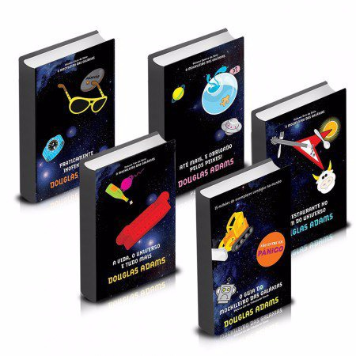
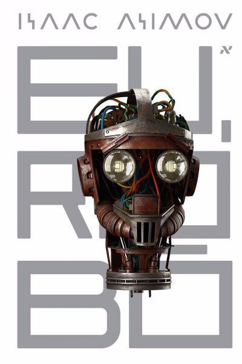
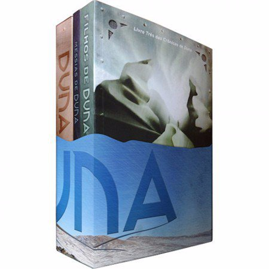
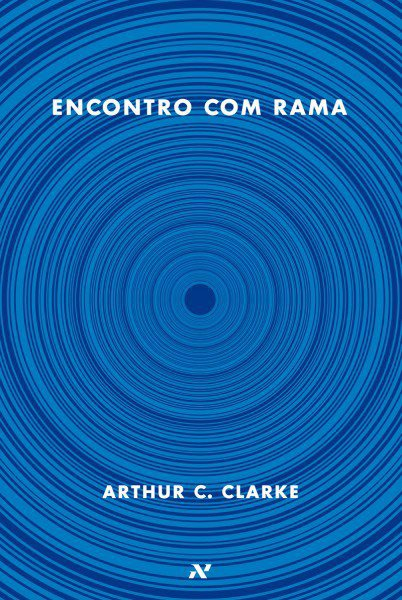
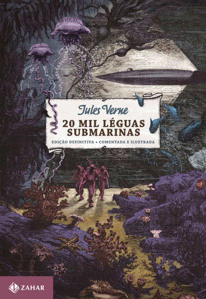
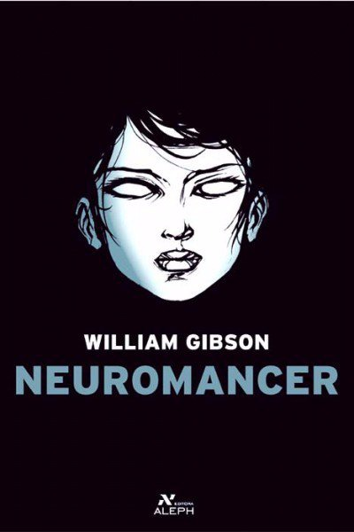
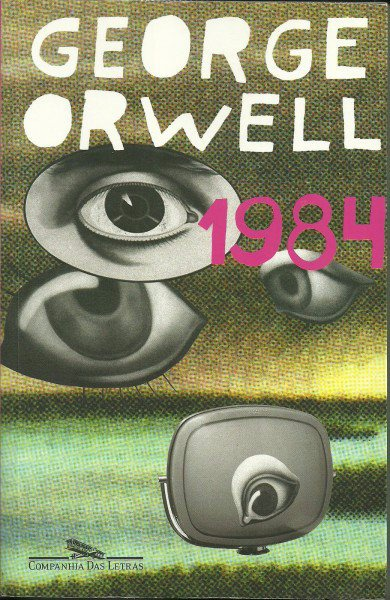

# 10 clássicos da ficção científica para ativar sua imaginação

Publicado no [Catraca Livre](https://catracalivre.com.br/geral/livro/indicacao/10-classicos-da-ficcao-cientifica-para-ativar-sua-imaginacao/)

Todos sabem que ler é um ótimo hábito e que as leituras são muito mais ricas em detalhes do que os filmes, por exemplo. Além disso, ler exercita sua imaginação e é um ótimo passatempo.

Nos livros de ficção científica, a arte e a ciência se unem e fazem do gênero, um dos mais populares do mundo.

Separamos uma lista com dez clássicos do gênero para mergulhar em novos universos e fazer sua mente trabalhar.

**1 – Trilogia “Fundação”, de Isaac Asimov**

**2 – Coleção “O Guia do Mochileiro das Galáxias”, de Douglas Adams**

**3 – “Eu, robô”, de Isaac Asimov**

**4 – Box “Crônicas de Duna”, de Frank Herbert**

**5 – “Encontro com Rama”, de Arthur C. Clarke**

**6 – “Vinte Mil Léguas Submarinas”, de Julio Verne**

**7 – “Admirável Mundo Novo”, de Aldous Huxley**

**8 – “Fahrenheit 451″, de Ray Bradbury**

**9 – “Neuromancer”, de William Gibson**

**10 – “1984”, de George Orwell**

### Comments

comentários

Powered by [Facebook Comments](http://peadig.com/wordpress-plugins/facebook-comments/)
