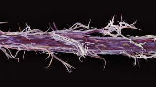

# [Gizmodo](http://m.gizmodo.uol.com.br/)

### Saúde

# [É possível que pintar o cabelo não seja algo exatamente inofensivo](http://m.gizmodo.uol.com.br/e-possivel-que-pintar-o-cabelo-nao-seja-algo-exatamente-inofensivo/)

Por: [Rebecca Guenard - Mosaic](http://m.gizmodo.uol.com.br/author/rebecca-guenard/ "Posts de Rebecca Guenard - Mosaic")

27 de abril de 2015 às 8:49

COMPARTILHE 

 78 

 0

A composição básica das tintas de cabelo mudou muito pouco no último século. Isso levanta duas questões: quais são os riscos de pintar o cabelo, e porque nós o fazemos?

A cada dois meses Barclay Cunningham passa por um processo que começa com um anti-histamínico. Depois de algumas horas, ela espalha uma densa camada de creme anti-alérgico ao redor da sua testa, orelhas e pescoço. Por fim, ela protege a área com pedaços de sacolas plásticas.

Tudo isso para que ela possa pintar seu cabelo.

O processo nem sempre foi tão trabalhoso. Cunningham pintou seu cabelo sem problemas por uma década. Certo dia, ela notou que a tinta havia inflamado a pele de suas orelhas. Ela fez pequenos protetores de orelha com pedaços de sacos plásticos e continuou a pintar o cabelo. Mas a reação alérgica persistia, e suas medidas de segurança se tornaram cada vez mais elaboradas. Hoje, se ela pinta o cabelo sem nenhuma proteção, sua pele se enche de erupções cutâneas e bolhas que ficam cheias de pus por semanas.

Sofrer para colorir as madeixas não é um fenômeno moderno.  Os humanos pintam seus cabelos há milhares de anos, durante os quais inúmeras fórmulas, algumas delas perigosas, foram utilizadas para mudar a cor dos fios.

A história química das tinturas modernas revela que, embora elas já tenham sido o estandarte de uma indústria inovadora, o progresso ficou no passado. Hoje o mercado depende de métodos antiquados. Mas isso não quer dizer que os consumidores estão pressionando a indústria: existem pessoas tão desesperadas para mudar a cor do cabelo que elas se dispõem a retirar pequenas cascas de feridas de suas cabeças, como é o caso de Cunningham, pelas semanas que seguem a tintura.

As tendências estéticas seguem o ritmo da cultura e da publicidade, mas nosso desejo de mudança é uma constante. Como escreveu o antropólogo Harry Shapiro: “Este impulso de melhorar nossa natureza é tão universal… que somos tentados a defini-lo como instintivo.”

Centenas de cabeças de manequins, com lábios congelados em meio-sorrisos de modelos, são carregadas pelo *Energizing Summit*, um evento organizado anualmente pelo Conselho Americano de Coloristas. É difícil se acostumar com essas cabeças, estejam elas de cabeça para baixo em sacolas plásticas (a alça em volta do pescoço para facilitar o transporte), observando o mundo dentro de caixas no lobby do hotel, ou empoleiradas em pedestais, remetendo a uma punição da Inglaterra medieval.

Cabeleireiros de todos os cantos dos Estados Unidos, com suas cores de cabelos deslumbrantes e raízes impecavelmente retocadas, caminham pelo mal-iluminado subsolo do Hotel Marriott do Aeroporto de Los Angeles. Eles estão aqui para passar dois dias discutindo a ciência de pintar cabelos.

Logo percebo que tenho muito a aprender. Os coloristas capilares falam uma língua diferente da nossa. Eles usam termos como “volume” (concentração) e “levante” (clareamento). Em certo momento, descubro que cometi uma gafe. “Nós tingimos tecidos”, um instrutor do evento me informou gentilmente. “Nós *pintamos* o cabelo.”

Mas depois de um dia e meio no evento, eu ainda estava esperando por um pouco de ciência. Foi aí que encontrei Tom Despenza. Ele trabalhou durante anos na área de pesquisa e desenvolvimento da Clairol — uma carreira que começou quando Despenza, na época um estudante de microbiologia, se viu com um carro quebrado na frente de uma escola de cosmetologia. Hoje ele é aposentado e dono de uma empresa de tinturas chamada Chromatics

Quando consegui falar com Tom, ele estava no meio de sua famosa palestra intitulada “Esqueça a moda! Caia na real”, que desmistifica os conhecimentos sem fundamento científico que fazem parte do currículo dos cursos de colorimetria capilar.

Entender as tinturas capilares não é tão simples quanto compreender o círculo cromático. Como todos aprendemos nas aulas de artes, é possível obter qualquer cor a partir das três cores primárias:  vermelho, amarelo e azul. Se você quiser laranja, é só misturar amarelo e vermelho; se o objetivo for criar o roxo, é preciso combinar o vermelho e o azul; se seu desejo for a cor marrom, é preciso misturar as três cores.

Esteticistas aprendem a mesma coisa quando estudam os pigmentos capilares — que a tintura marrom é uma combinação de três diferentes pigmentos. “Essa informação é fictícia”, disse Despenza. “O marrom do cabelo é composto de duas substâncias químicas”. Ambas substâncias são incolores, ele explica, mas produzem a cor marrom devido a uma reação química.

Existe uma grande diferença entre cor e tintura. Os cabeleireiros não utilizam pigmentos (pelo menos não em tintas permanentes), mas sim uma mistura de substâncias químicas que iniciam a formação dessas tintas. As moléculas de tinta têm que se unir para emitir cores, e é por isso que uma tintura de cabelo demora meia hora para fazer efeito.

Na metade do século XIX, o químico inglês William Henry Perkin sintetizou, por acaso, a primeira tintura química: começando com alcatrão de carvão, ele esperava produzir quinina, um remédio utilizado no tratamento da malária, mas em vez disso criou um corante de cor malva. Essa descoberta revolucionou a indústria têxtil, mas as tintas naturais não tinham a mesma durabilidade e cores vívidas das tinturas criadas por Perkin. Nunca havia existido um corante tão confiável.

Pouco tempo depois, August Hofmann (o professor de química de Perkin) notou que o corante derivado do carvão criava uma outra cor quando exposto ao ar. A molécula responsável por isso era o para-fenilenodiamina, ou PPD, composto que hoje é utilizado como base das tintas de cabelo permanentes.

Embora o cabelo seja uma fibra, assim como a lã, o processo de tingimento de materiais têxteis não pode ser reproduzido nas madeixas. Para tingir a lã, é preciso ferve-la em uma solução ácida por uma hora. O equivalente para cabelos seria banhá-los em amônia. A amônia separa as camadas de proteína do cabelo, permitindo que os compostos da tintura penetrem na base do fio e alcancem o pigmento natural, a melanina.

A melanina é o que produz a cor da pele, dos olhos e dos cabelos humanos. É a proporção desses dois tipos de melanina — a eumelanina e a feomelanina — que determina a cor de seus cabelos. E é o tamanho e o formato que as moléculas de melanina formam quando se agrupam no folículo do fio que criam os tons únicos de cada cabelo. Por exemplo, pessoas loiras e morenas têm mais ou mesmo a mesma proporção de moléculas de eumelanina e de feomelanina, mas loiros têm menos moléculas no total. Cabelos loiros naturais contêm aglomerados de melanina menores, que refletem mais luz do que os grande aglomerados encontrados em cabelos escuros

Além da amônia, a fórmula das tinturas capilares contêm água oxigenada, um alvejante. A água oxigenada serve para duas coisas: ela reage com a melanina do cabelo, destruindo sua cor natural, e provoca uma reação entre as moléculas PPD. A molécula que gera a cor do cabelo, que é grande demais para reagir com a água oxigenada, permanece no folículo do pelo, e a cor natural do cabelo aparece conforme o cabelo cresce.

Os químicos logo descobriram que se eles adicionassem uma molécula secundária, conhecida como acopladora, eles poderiam manipular essas substâncias — um carbono aqui, alguns nitrogênios lá — e multiplicar as opções de cor disponíveis apenas com o uso do PPD. Diferentes métodos foram propostos, mas a indústria de cosméticos ainda não aceitou nenhum tinta de cabelo permanente sem PPD, ou sem seu composto associado, o p-aminofenol, na fórmula.

Há 125 anos a tecnologia das tintas de cabelo se limita à reação oxidante do PPD. Dr. David Lewis, um professor na Universidade de Leeds no Reino Unido, acha que isso é “loucura”. “Bem, eu sei bastante sobre tintas e afins utilizados na indústria têxtil. Nós sequer sonharíamos em usar isso em nossos tecidos”, ele diz. “Primitivo, arcaico, são palavras que vem à mente. Por que eles insistem em colocar isso em cabeças humanas?”

Em sua carreira como professor e pesquisador, Lewis ofereceu consultorias para várias empresas de cosméticos, mas ele afirma que sempre se sentiu desconfortável com a insistência em usar as mesmas fórmulas oxidantes. Lewis se aposentou da vida acadêmica há 10 anos para abrir a [Green Chemicals](http://www.greenchemicalsplc.com/), uma empresa que busca desenvolver produtos mais seguros. Sua empresa lançou uma substância antichamas mais sustentável, e agora Lewis quer revolucionar as tintas capilares

Um dos problemas é a forma como elas funcionam: Lewis diz que as moléculas de cor começam a acumular elétrons antes de criar belas madeixas pintadas. Essa necessidade de elétrons não é saciada exclusivamente por outras moléculas de tinta, então os acumuladores de elétrons vão atrás da pele — o que causa reações alérgicas e até danos ao DNA.

Lewis também se preocupa com o fato da indústria de cosméticos exercer um poder despótico sobre a segurança de seus consumidores. A fase moderna da Administração de Comida e Drogas (o FDA) começou em 1906, quando ela ainda era conhecida como o o Gabinete de Química. Em 1930, a instituição adotou o nome que hoje conhecemos. Desde então, o FDA já baniu vários tipos de tintas de cabelo, mas sempre classificando as tinturas de alcatrão mineral como seguras, em especial para pintar cabelos, desde que os consumidores saibam da possibilidade de irritações cutâneas. Até os dias de hoje, as tinturas de alcatrão mineral (hoje derivadas do petróleo) não precisam de certificação do FDA.

Em 1979 o FDA tentou obrigar os produtores de tintas de cabelo a inserir o seguinte aviso na embalagem de seus produtos: “Cuidado — Contém um ingrediente que pode penetrar na pele e cujo efeito cancerígeno foi observado em animais de laboratório”. O ingrediente é, no caso, o 4-MMPD, ou 4-metoxi-m-fenilenediamina, um corante com uma estrutura muito semelhante à do PPD que, de acordo com o FDA, já deus sinais suficientes de seu poder cancerígeno. Os produtores discordaram e ameaçaram processar o FDA caso ele continuasse a defender essa medida. O FDA desistiu. Alguns anos depois, os produtores removeram o composto cancerígeno de suas fórmulas, mas ainda continuaram a afirmar que o 4-MMPD era perfeitamente seguro.

Existem algumas pesquisas sobre os possíveis riscos das tinturas. Em 2001, pesquisadores da Universidade da Califórnia do Sul publicaram [um artigo na *Revista Internacional do Câncer*](http://onlinelibrary.wiley.com/doi/10.1002/1097-0215%28200002%299999:9999%3C::AID-IJC1092%3E3.0.CO;2-S/abstract) concluindo que mulheres que pintam seus cabelos são duas vezes mais propensas a desenvolver um câncer de bexiga do que aquelas que não pintam. A Comissão Europeia de Segurança do Consumidor tomou nota. Um grupo de cientistas avaliou o artigo, [o classificou como cientificamente crível](http://ec.europa.eu/health/scientific_committees/consumer_safety/opinions/sccnfp_opinions_97_04/sccp_out143_en.htm) e recomendou que a União Europeia reavaliasse seus regulamentos sobre as tinturas capilares.

Ao longo da última década o Comitê de Ciência e Bens de Consumo (SCCP) — um comitê da Comissão Europeia criado para avaliar e documentar a segurança dos produtos — já coletou e avaliou os dados de vários produtores, chegando até a [publicar opiniões](http://ec.europa.eu/health/scientific_committees/consumer_safety/opinions/index_en.htm) sobre uma série de ingredientes de tintas de cabelo. Essa avaliação dos vários componentes de tintas de cabelo trouxeram dois problemas à luz.

O primeiro é que a sensibilidade às substâncias químicas cresceu consideravelmente. A União Europeia categorizou 27 cores de tinturas como sensibilizantes, listando outras 10 como extremas e 13 como fortes. Embora a primeira exposição à um sensibilizante possa ter um efeito notável, uma segunda exposição — à mesma tintura ou à substâncias químicas semelhantes utilizadas em tatuagens temporárias ou tecidos, por exemplo — pode desencadear uma reação alérgica. No pior dos casos, essa exposição pode terminar em um choque anafilático, uma reação alérgica potencialmente fatal.

O segundo problema é a ausência de dados sobre o que essas tinturas químicas fazem com nosso corpo. Quando há alguma dúvida sobre seus efeitos, a Comissão Europeia bane o uso de uma substância química. Em 2006, o Vice-Presidente da Comissão, Gunter Verheugen, disse em um comunicado oficial: “Substâncias que não possuem provas de sua segurança irão desaparecer do mercado. Nossos altos padrões de segurança não apenas protegem os consumidores da União Europeia, mas também dão uma segurança legal à indústria de cosméticos europeia”. A Comissão já proibiu 22 substâncias químicas encontradas em tintas de cabelo — e outras devem se juntar à lista, que cresce anualmente. Mais recentemente, o SCCP classificou o o2-cloro-p-fenilenediamina, utilizado para colorir sobrancelhas e cílios, como um material perigoso em razão de dados toxicológicos insuficientes.

Quando o SCCP publicou sua pesquisa sobre sensibilidade, no início de 2007, a Colipa (a associação de comércio de cosméticos da Europa, hoje conhecida como Cosméticos Europa) [publicou uma declaração](https://www.cosmeticseurope.eu/news-a-events/statements/1-ec-press-release-hair-dyes-and-allergies.html) que “reafirmava a segurança das tinturas capilares”. Apesar de deixar claro seu apoio ao trabalho da Comissão Europeia, eles argumentaram que as substâncias químicas estavam sendo testadas isoladamente e que essas descobertas não indicavam os riscos dessas substâncias quando utilizadas segundo as instruções dos produtos.

Os cientistas empregados pela indústria continuam a apontar que nenhum estudo epidemiológico liga a incidência de câncer ao ato de pintar os cabelos. A menos que o foco dessa pesquisa seja o grupo que se expõe à essas tintas diariamente: os cabeleireiros. Cabeleireiros tem uma chance 5% maior de contrair um câncer de bexiga do que o resto da população.

Percebi que não havia ouvido nenhuma menção à segurança dessas substâncias químicas durante minha aulas educativas no *Energizing Summit*. Quando eu ouvi uma estudante sendo lembrada dos riscos da profissão, resolvi pesquisar para ver se  esses riscos estavam relacionados ao contato com as tintas (estudos mostram que usar luvas reduz a quantidade de compostos absorvidos pelo corpo). Mas no final a estudante estava ouvindo um conselho sobre a posição de seu pulso, não sobre o uso de luvas.

Nos anos 70, a antropóloga Justine Cordwell escreveu um artigo intitulado “[A muito humana arte da transformação](http://books.google.co.uk/books?id=ckZhe0fdmaMC&pg=PA47&lpg=PA47&dq=The+Very+Human+Arts+of+Transformation&source=bl&ots=J9K_e-ON6q&sig=uTHdwZ5Jcw23e1EzJnqvlf8KtY8&hl=en&sa=X&ei=Csd9VNKELquu7gbc34DABg&ved=0CC0Q6AEwAg#v=onepage&q=The%20Very%20Human%20Arts%20of%20Transformation&f=false)“. Nele, ela escreve: “A análise antropológica das vestimentas e dos adornos deveria ser baseada na premissa de que a humanidade, desde os períodos mais tenros, tende a considerar o corpo humano como a escultura primordial — e nós não gostamos muito do que vemos.”

De fato, as evidências arqueológicas mostram que o uso de tintas data do período Paleolítico. Os humanos primitivos utilizavam o óxido de ferro presente na terra para decorar suas moradias, tecidos e corpos com a cor vermelha. Não demorou muito para que eles usassem essas tintas na cabeça.

Os egípcios antigos pintavam seus cabelos, mas bem longe de suas cabeças. Eles raspavam todo o cabelo, depois o enrolavam e trançavam segundo a moda para proteger suas cabeças carecas do sol. O preto era a cor mais popular até o século 12 AC, quando materiais vegetais começaram a ser utilizados para pintar essas perucas de vermelho, azul e verde, e o pó de ouro começou a ser utilizado como corante amarelo.

Dos corantes naturais, só a henna ainda é utilizada. Os antigos utilizavam o açafrão e a alfalfa. Mas tinturas naturais cobriam o cabelo apenas temporariamente, e as pessoas sonhavam com madeixas quimicamente alteradas. A análise de amostras de cabelo revelou que os gregos e os romanos usavam tintas de cabelo pretas e permanentes há milhares de anos atrás. Eles misturavam substâncias que conhecemos hoje como óxido de chumbo e hidróxido de cálcio para criar uma nanopartícula de sulfeto de chumbo, que se forma quando ocorre uma interação entre as ligações sulfúricas da queratina, uma proteína do cabelo. Quando a aplicação direta de chumbo se revelou tóxica demais, os romanos trocaram essa tintura preta por uma mistura feita de sanguessugas fermentadas durante dois meses em um recipiente de chumbo.

No início do Império Romano, as prostitutas eram obrigadas a ter cabelos amarelos para indicar sua profissão. A maioria usava perucas, mas algumas mergulhavam seus cabelos em uma solução de cinzas de plantas queimadas e nozes para conseguir a cor quimicamente. Enquanto isso, os alemães pintavam seus cabelos de vermelho com uma mistura de madeira de faia, cinzas e gordura de bode.

Com o desenvolvimento do método científico no início do período moderno, os coloristas aplicaram uma abordagem mais analítica à prática de pintar cabelos, testando a eficácia e seguranças de novas fórmulas. *Delights for Ladies*, um livro de receitas e dicas para donas de casa publicado no início dos anos 1600, recomenda o uso de óleo de vitríolo para transformar cabelos negros em castanhos. O livro aconselha a leitora e evitar o contato com a pele — um bom conselho, considerando que hoje conhecemos o óleo de vitríolo como ácido sulfúrico.

A moda do cabelo loiro na Itália se repetiria — como é comum entre as tendências de cor de cabelo — quando centenas de anos depois, no século XVIII, as mulheres de Veneza passaram a encharcar os cabelos com uma solução corrosiva de lixívia para em seguida deitar ao sol em terraços especialmente construídos. O cabelo loiro não estava mais limitado às prostitutas.

Além disso, o uso das tintas ia além da moda e do status social. Cordwell aponta várias outras ocasiões nas quais a cor dos cabelos cumpria outra função; por exemplo, os afegãos acreditam que pintar o cabelo de vermelho com henna pode curar uma dor de cabeça mais forte.

A indústria da beleza é uma potência bilionária — e que não para de crescer. De acordo com um [relatório da indústria](http://www.ibisworld.com/industry/global/global-cosmetics-manufacturing.html), a manufatura de cosméticos gerou US$225 bilhões em todo o mundo em 2014. A indústria permaneceu estável durante a crise e, conforme a renda mundial se eleva, a crescente demanda por produtos de beleza de luxo poderá aumentar esse número para US$316 bilhões em 2019.

Globalmente, os produtos de cabelo são o maior ramo da indústria de beleza, representando quase um quarto do lucro da indústria. Nos EUA, dentro de salões de beleza, os serviços de tintura representam 18% dos ganhos. Estima-se que 70% das mulheres americanas utilizam produtos de coloração.

Ao refletir sobre a história das tintas de cabelo, não podemos evitar uma pergunta: por que tanta pessoas ainda pintam seus cabelos? Por que alguém iria passar por esse processo cansativo e tolerar o preço, a coceira e o cheiro? Qualquer que seja o impulso que nos leva a pintar nossos cabelos, uma coisa é certa: as pessoas tem fortes laços emotivos com aquilo que cobre seus escalpos.

Esse é o caso de Barclay Cunningham. Ela começou a fazer experiências com seu cabelo com apenas 12 anos, utilizando um spray clareador. Barclay passou anos de sua idade adulta procurando a cor ideal. “Eu nunca considerei a opção de não pintar meu cabelo”, diz Barclay. “A cor de cabelo que me representa vem em uma caixinha. A cor que nascia da minha cabeça não estava certa.”

***Esse* [*artigo foi publicado*](http://mosaicscience.com/story/saved-how-addicts-gained-power-reverse-overdoses) *pela primeira vez no Mosaic, e está sendo republicado aqui segundo a licença da Creative Commons. Imagem por* [*Wellcome Images*](https://www.flickr.com/photos/wellcomeimages/) *segundo a licença da Creative Commons.***

  
VOLTAR AO TOPO

[VISITE A VERSÃO COMPLETA](http://www.gizmodo.com.br/e-possivel-que-pintar-o-cabelo-nao-seja-algo-exatamente-inofensivo/?modeview=full "Versão completa")
