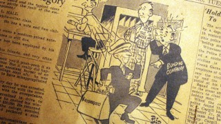

# [Gizmodo](http://m.gizmodo.uol.com.br/)

### ciência

# [Por que papéis amarelam?](http://m.gizmodo.uol.com.br/por-que-papeis-amarelam/)

Por: [Matt Blitz - TodayIFoundOut.com](http://m.gizmodo.uol.com.br/author/matt-blitz/ "Posts de Matt Blitz - TodayIFoundOut.com")

5 de abril de 2015 às 13:33

COMPARTILHE 

 905 

 0

Quando eu era criança, meus pais tinham uma coleção de jornais históricos e amarelados. Me lembro perfeitamente de um velho *Washington Post* em uma estante, datado em 21 de julho de 1969, com a manchete *“A Águia Pousou — Dois Homens Andam Sobre a Lua”*. Ou um desbotado, meio amarelado, de 8 de agosto de 1974, com a grande manchete *“Nixon Renuncia”*. Estes jornais são fascinantes artefatos de documentação histórica, mostram de momentos marcantes aos mais relativamente mundanos. Infelizmente, eles também eram bem difíceis de ler, devido à coloração amarelada, meio marrom e às letras desbotadas. Então por que jornais antigos — e livros — amarelam? E existe alguma maneira de prevenir isso?

O papel foi inventado por volta do ano 100 antes de Cristo, na China. Originalmente feito de cânhamo molhado que era, então, reduzido a uma polpa — casca de árvore, bambu e outras fibras de planta foram eventualmente usados. O papel se espalhou por toda a Ásia, primeiramente sendo usado apenas em documentos oficiais e importantes, mas assim que o processo se tornou mais eficiente e barato, ele se tornou muito comum.

O papel chegou pela primeira vez à Europa por volta do século XI. Historiadores acreditam que o documento de papel mais antigo do “Ocidente Cristão” é o *Missal of Silos* da Espanha, que é essencialmente um livro que contêm textos para serem lidos durante a missa. Este papel foi feito de um tipo de linho. Enquanto papel, livros e a impressão evoluiriam pelos próximos 800 anos, com a impressa de Gutenberg chegando em meados do século XV, o papel era normalmente feito de linho, trapos, algodão e outras fibras de plantas. Foi na metade do século XIX que o papel feito de fibra de madeira passou a imperar.

Então o que mudou? Em 1844, dois indivíduos inventaram o processo para fazer papel com madeira. De uma lado do Oceano Atlântico estava o inventor canadense Charles Fenerty. Sua família era dona de uma série de serrarias na Nova Escócia. Conhecendo a durabilidade, baixo custo e disponibilidade da madeira, ele percebeu que ela seria uma boa substituta para a o algodão usado para fazer papel. Ele experimentou com a polpa de madeira e em 25 de outubro de 1844, enviou o papel de polpa de madeira para o principal jornal da cidade de Halifax, o *Acadian Recorder*, junto de uma nota que explicava a durabilidade e custo-benefício deste papel. Dentro de algumas semanas, o Recorder usava o papel de polpa de madeira de Fenerty.

No mesmo período, o encadernador e tecelão alemão Friedrich Gottlob Jeller trabalhava em uma cortadora de madeira quando descobriu o mesmo que Fenerty — que a polpa da madeira funcionava como um tipo barato de algodão para fazer papel. Ele produziu um exemplo e, em 1845, recebeu uma patente alemã para o processo. De fato, alguns historiadores dão mais crédito a Keller pela invenção do que a Fenerty pelo simples fato dele ter recebido uma patente e o canadense não.

Trinta anos depois, papel de polpa de madeira estava no auge. Mas enquanto a polpa era mais barata e tão durável quanto o algodão ou outros papéis de linho, havia alguns inconvenientes. O mais significante: papel de polpa de madeira é muito mais inclinado a reagir aos efeitos do oxigênio e da luz do Sol.

Madeira é feita primariamente de duas substâncias polímeras — celulose e lignina. Celulose é o material orgânico mais abundante na natureza. É também tecnicamente sem cor e reflete luz muito bem, ao invés de absorvê-la (o que resultaria em opacidade); por causa disso, humanos veem celulose na cor branca. Entretanto, celulose também é suscetível à oxidação, apesar de não tanto quanto a lignina. Oxidação causa a perda de elétron(s) e enfraquece o material. No caso da celulose, isso pode resultar na absorção de um pouco da luz, fazendo o material (neste caso a polpa da madeira) parecer mais embotada e menos branca (alguns as descrevem como “mais quente”), mas não é isso que causa a maior parte do amarelamento de papéis antigos.

Lignina é a outra substância encontrada em abundância no papel, em particular nos jornais. Ela é o composto que faz com que a madeira seja forte e dura. Inclusive, de acordo com o Dr. Hou-Min Chang da Universidade Estadual da Carolina do Norte, em Raleigh, EUA: “Sem a lignina, uma árvore poderia atingir somente uns 2m de altura”. Essencialmente, a lignina funciona como uma forma de cola, ligando com mais firmeza as fibras de celulose, ajudando a manter a árvore muito mais firme, o que faz com que fique mais alta, além de ajudar a resistir à pressões externas, como o vento.

A lignina possui uma cor mais escura por natureza (pense em sacos de papel de pão ou caixas de papelão, nos quais é deixada uma quantidade maior de lignina para fortalecer o papel; isso diminui o valor desse tipo de papel, já que o processo para produzi-lo é menos complexo). A lignina também é altamente suscetível à oxidação. A exposição ao oxigênio (especialmente quando combinada com a luz do Sol) altera a estrutura molecular da lignina, ocasionando uma mudança na forma como o composto absorve e reflete a luz, resultando em uma cor amarelo-amarronzada ao olho humano.

Como o papel de jornais tende a ser feito com processos mais baratos e eficientes (muita polpa de madeira é necessária), é comum os níveis de lignina sejam altos e que ela esteja mais presente em jornais do que em, digamos, papéis para livros, no qual um processo de clareamento é usado para remover um pouco da substância. Assim, conforme o papel jornal vai ficando velho, ele é exposto a mais oxigênio, tornando-se, assim, amarelado mais rapidamente do que os outros tipos de papel.

No entanto, os papeis usados em livros tendem a ter maior qualidade, pois têm boa parte da lignina removida durante um processo de clareamento. É por isso que eles demoram mais a amarelar. Entretanto, os químicos usados no processo para tornar o papel mais branco deixam a celulose ainda mais suscetível à oxidação do que antes, o que faz com que os livros acabem amarelando — mas só depois de longos períodos.

Hoje, para combater o amarelamento, muito documentos importantes são escritos e papéis livres de ácidos e com uma quantidade reduzida de lignina para prevenir a rápida deterioração.

Já para documentos históricos — ou os jornais na casa dos meus pais — não existe uma maneira de reverter o dano causado, mas podemos impedir que a situação piore. É importe armazenar estes documentos ou jornais em ambientes frescos, secos e escuros, da mesma forma que os museus fazem com documentos: armazenando-os em quartos de temperatura controlada com baixa luminosidade. Além disso, prefira não guardá-los em no sótão ou no porão, lugares geralmente mais úmidos e com temperaturas muito variáveis. Caso queira expor estes documentos, coloque-os dentro de vidros com proteção a raios ultravioleta. E mais importante: limite a quantidade de vezes que você manuseia dito jornal ou documento — nada destrói mais uma valiosa peça de papel do que ficar mexendo nela com frequência.

*Matt Blitz escreve no popular site de fatos interessantes [TodayIFoundOut.com](http://todayifoundout.com/). Inscreva-se no mailing do Today I Found Out’s “Daily Knowledge”[clicando aqui](http://todayifoundout.us5.list-manage.com/subscribe?u=1b41057449af09fd2f4481595&id=cfe94f6138) or curta eles no Facebook [aqui](https://www.facebook.com/pages/Today-I-Found-Out/137101549641111). Este post foi reproduzido com permissão do [TodayIFoundOut.com](http://www.todayifoundout.com/index.php/2013/09/the-evolution-of-the-modern-day-calendar/). Imagem de capa [Lindsey Turner](https://www.flickr.com/photos/theogeo/) sob licença Creative Commons.*

  
VOLTAR AO TOPO

[VISITE A VERSÃO COMPLETA](http://www.gizmodo.com.br/por-que-papeis-amarelam/?modeview=full "Versão completa")
