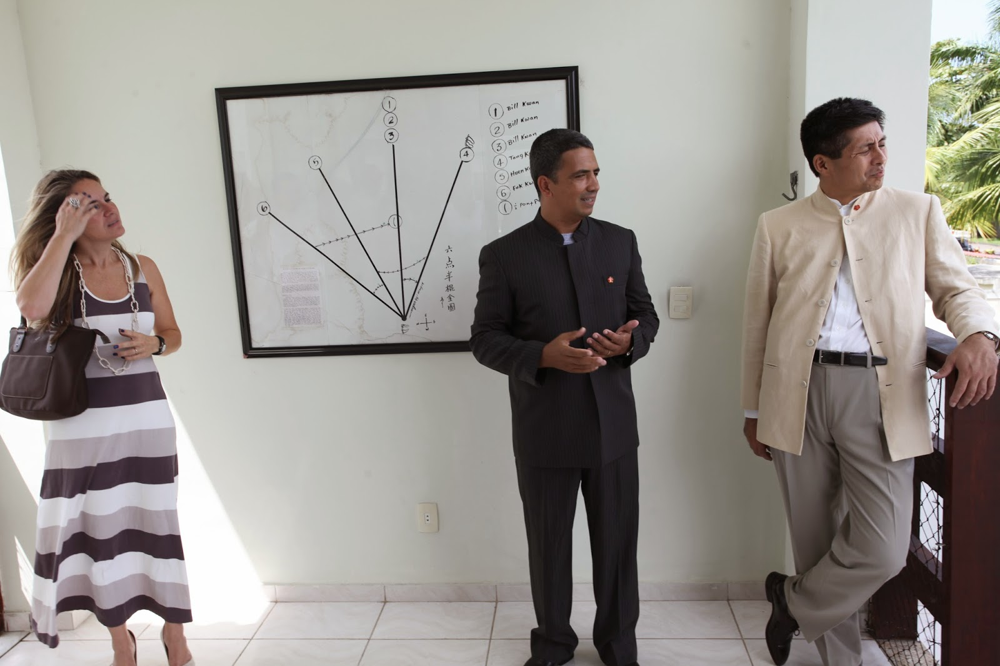
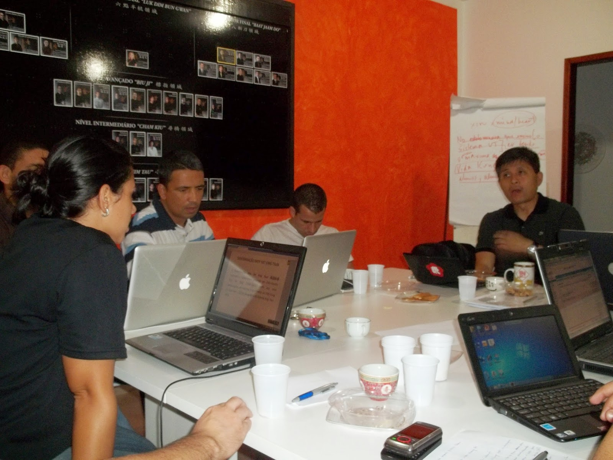
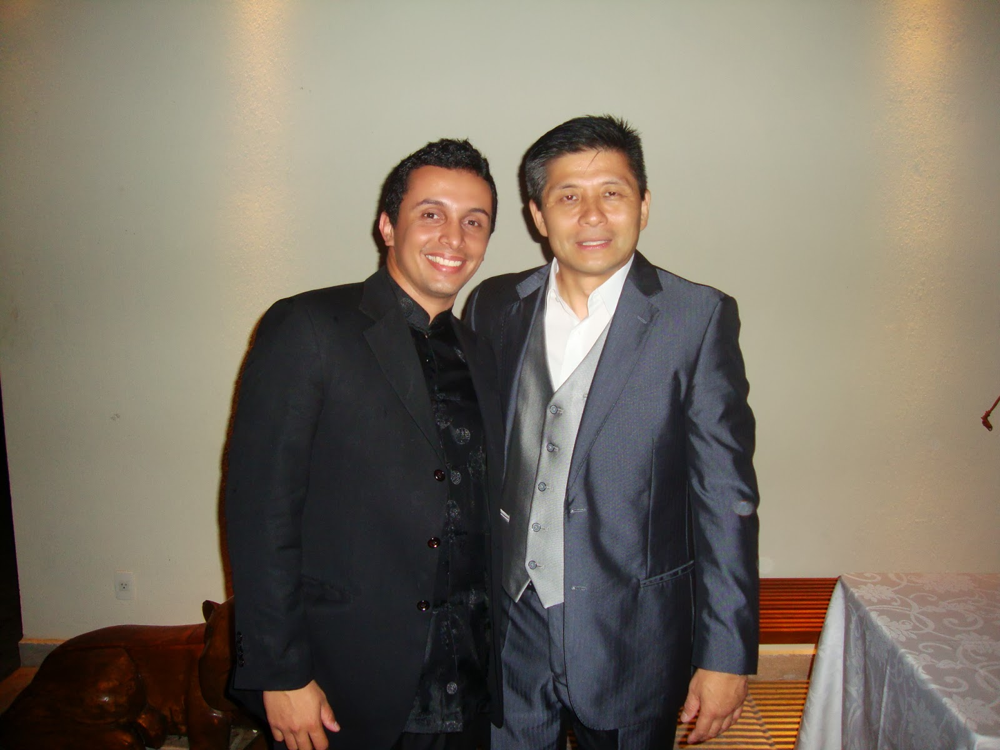
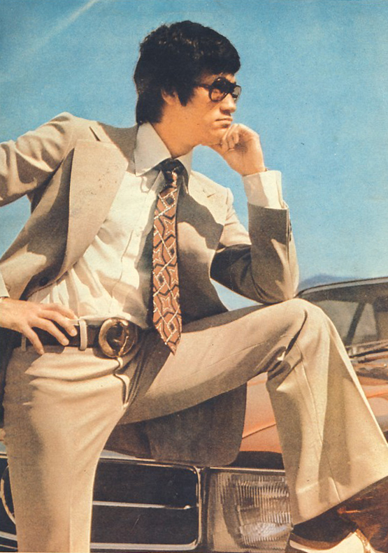
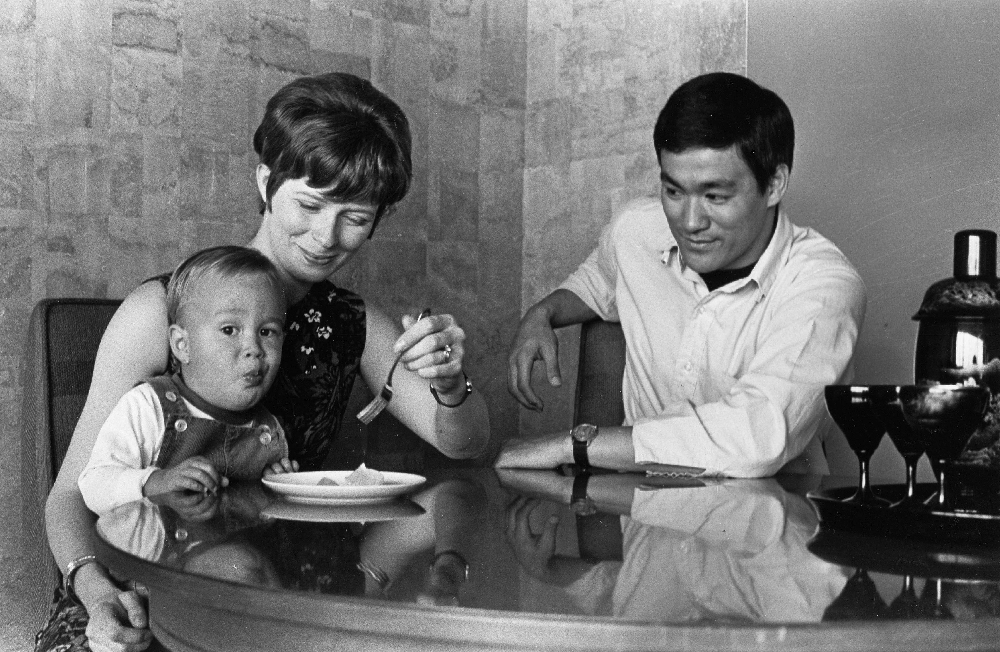
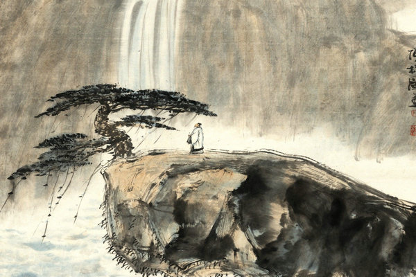
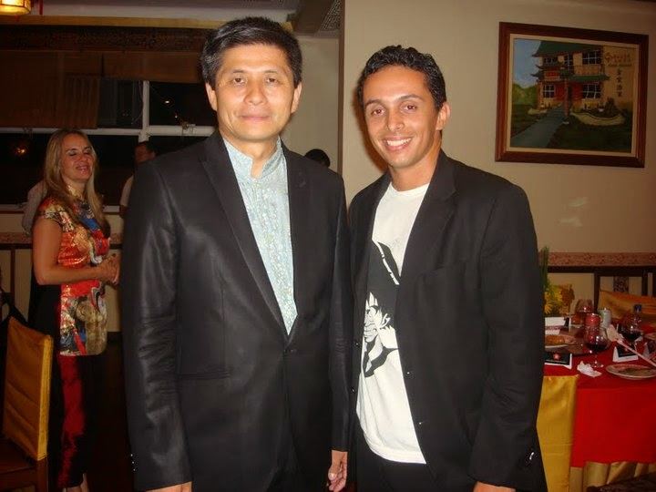
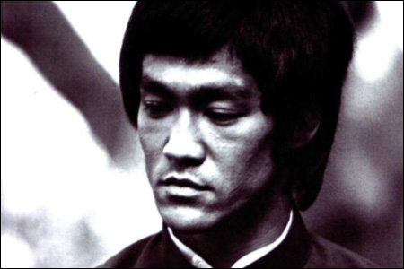

# [BLOG DO PEREIRA (the peartree´s blog)](http://moyfatlei.blogspot.com.br/)

## Tuesday, 31 March 2015

### Love in Chinese Culture Part 5: "Attack with Fire"

O AMOR NA CULTURA CHINESA PARTE 5:

"ATAQUE COM FOGO"

**Love in Chinese Culture Part 5: "Attack with Fire"**

(Si Fu apresenta em Março de 2011 para Si Gung e Si Taai o Novo Nucleo da Moy Yat Ving Tsun sob sua direção na época)

(Si Fu shows in March 2011 for Si Gung and Si Taai the New School of Moy Yat Ving Tsun under his direction at the time)

Num dos Mo Gun que Si Fu dirigiu, tivemos um problema grave, que honestamente na época, eu não contemplei a sua dimensão. Pois quando tudo estava se encaminhando naquele local, e fizemos a sua inauguração(foto), o proprietário decidiu por bem pedir a casa de volta no mesmo dia.  
  
In one of Mo Gun that Si Fu was the director, we had a serious problem, which honestly at the time, I did not beheld its size. Because when it was heading in that place, and made its opening (photo), the owner decided to ask back the house at the same day.

Fiquei sabendo disso no dia seguinte, quando Si Sok Ursula me ligou num Domingo a tarde me chamando para um reunião com Si Gung(foto) , Si Fu e outros Mestres sobre o acontecido.  
Dentro do possível, não era mostrada tensão nos rostos do Si Fu e dos demais, mas ainda assim, o clima estava pesado. Então, em meio ao silêncio, Si Gung com um sorriso no rosto, como de quem acha graça de algo comentou enquanto segurava um copo com chá , sobre a ameaça do proprietário de querer reaver o imóvel mesmo pagando a multa:  "*Isso é o Capítulo 12 de Arte da Guerra: Ataque com fogo*"  
  
I learned it the next day, when Si Sok Ursula called me on a Sunday afternoon for a meeting with Si Gung (photo), Si Fu and other Masters of the event.  
As far as possible, was not shown tension on the faces of Si Fu and the rest, but still, the air was heavy. Then, in the silence, Si Gung with a smile on his face, as though he amused something said while holding a cup of tea on the owner threatens to want to repossess the property even paying the fine, Si Gung said:  "*This is Chapter 12  of Art of War: Attack with fire* "

Honestamente, não entendi o que aquilo queria dizer, e assim sendo, por outras vezes que ouvi Si Gung citar esse capítulo em especial para outras situações de adversidade também fiquei me perguntando a razão. Finalmente, resolvi ler com calma, e pude compreender um pouco sobre este capítulo. E para expressar , escolhi a Quinta parte do Especial sobre "Amor na Cultura Chinesa":  
  
I honestly do not understand what he wanted to say, and therefore, other times I heard Si Gung cite this chapter especially for other adverse situations also I was wondering why. Finally, I decided to read calmly, and I could understand a little about this chapter. And to express, I chose to talk about "Love in Chinese Culture" as example.

Sobre o "amor", Bruce Lee diz em uma compilação de seus pensamentos entitulada "*Bruce Lee Striking Toughts*"(2000):  
"*Honestidade e amor: Franqueza e sinceridade para mim e para a pessoa que amo. Sinceridade entre duas pessoas que são uma só. Você é parte da minha vida, sem lugar para orgulho, vaidade ou raiva...Eu amei como um louco, mas tive bom senso para não amar como um tolo. Não é fácil amar bem, e é muito difícil amar com sabedoria*"

About "love," Bruce Lee says in a compilation of his thoughts titled "Bruce Lee Striking toughts" (2000):

"*Honesty and love:.. Honesty and sincerity for me and my loved one.  Sincerity between two people who are one You're part of my life, no place for pride, vanity and anger ... I used to love like a crazy man, but I had good sense to not love like a fool. it is not easy to love well, and is very difficult to love wisely* "

(Bruce Lee observa seu filho Brandon comendo no colo de sua mãe Linda Lee)

(Bruce watches his son Brandon eating with the help of his mother)

Quem nunca se desentendeu com seu parceiro não é mesmo? Podemos vivenciar essa experiência de várias formas, inclusive numa "Perspectiva Kung Fu". Porém, quando nos envolvemos emocionalmente numa discussão, acabamos por nos ver ou o parceiro, querendo ganhar a discussão. E o objetivo incial da discussão muitas vezes se perde.

Who never fell out with your partner is not it? We can live this experience in several ways, including trough a "Perspective Kung Fu". However, when we get involved emotionally in a discussion, just to see us or partner, wanting to win the argument. And the initial purpose of the discussion is often lost.

O livro publicado em 1965, "The Way of Chang Tzu", com escritos desse pensador clássico chinês(pintura acima) diz:

"*Quando um arqueiro atira sem alvo nem mira*

*Está com toda a sua habilidade.*

*Se atira para ganhar uma fivela de metal,*

*Já fica nervoso.*

*Se atira por um prêmio em ouro*

*Fica cego*

*Ou vê dois alvos-*

*Está louco!*

*Sua habilidade não mudou, mas o prêmio*

*Cria nele visões.*

*Pensa mais em ganhar do que atirar,*

*E a necessidade de vencer,*

*Esgota-lhe a força*."

The book published in 1965, "*The Way of Chuang Tzu,*" written by this classic Chinese thinker (painting above) we read:

"*When an archer shoots without aim or sight*

*Is with all his skill.*

*If shoots to win a metal buckle,*

*Already gets nervous.*

*If shoots for a prize in gold*

*is blinded*

*Or sees two targets-*

*He is crazy!*

*His skill has not changed, but the prize*

*It creates visions.*

*Thinks more of winning than shoot,*

*And the need to win,*

*Exhausted his strength.* "

Voltando a Si Gung(foto), ouvi dele certa vez que Si Taai Gung Moy Yat lhe orientou a ler os Clássicos Chineses. E pensando no exemplo acima , sobre discussões em relacionamentos, quando nosso emocional nos cega como o arqueiro que perde o alvo de vista por conta do prêmio. O tal Capítulo sobre ataque com fogo diz o seguinte:

"*Um soberano não pode formar um exército porque está enfurecido, nem um general pode lutar porque está ressentido. Pois enquanto um homem zangado pode novamente ficar contente, e um homem ressentido pode ficar novamente satisfeito, um Estado que sucumbiu não pode ser restaurado, nem os mortos trazidos a vida. Portanto, o governante esclarecido é prudente e o bom general é cauteloso contra ação precipitada. Assim o Estado é mantido em segurança e o exército é preservado*."

Returning to Si Gung (photo), I heard from him once that Si Taai Gung Moy Yat  advised him to read the Chinese Classics. And thinking in the above example, discussions on relationships, when our emotional blinds us as the archer who loses sight of the target because of the prize. The Chapter on such "Attack with fire" says the following:

"*A sovereign can not form an army because he is enraged, a general can not fight because he is resentful. For while an angry man can be happy again, and resentful man can be satisfied again, a state that collapsed can not be restored, nor the dead brought to life. Therefore, the enlightened ruler is wise and the good general is cautious against hasty action. So the state is kept safe and the army is preserved.* "

Portanto, acredito que mesmo num relacionamento, devemos reconhecer os "Ataques com Fogo" e observar a cautela e o controle emocional, porque afinal: "...*Senão for do interesse do Estado , não devemos agir. Se não pudermos ser bem sucedidos, não devemos utilizar as tropas. Se não estivermos em perigo, não lutamos*..." (SZ Cap. 12 - The Art of War, Oxford University Press, 1963)

Therefore, I believe that even in a relationship, we must recognize the "Attacks with Fire" and observe the caution and emotional control, because after all: "... *If it is not for the State's interest, we should not act; If we can not be successful,. we should not use the troops. If we are not in danger,we should fight* ... "(SZ Cap. 12 - the Art of War, Oxford University Press, 1963).

**A DISCIPLE OF MASTER JULIO CAMACHO**

**Thiago Pereira "Moy Fat Lei"**

**moyfatlei.myvt@Gmail.com**
