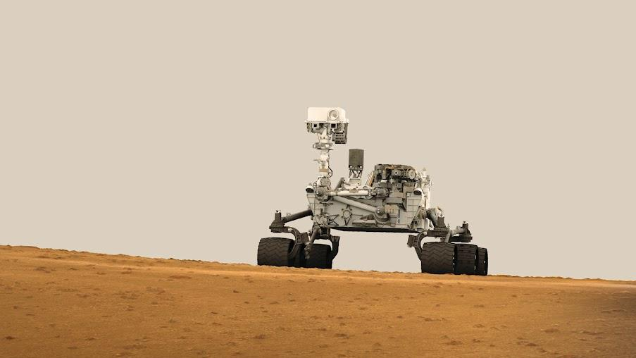

# 21 ideias de ficção científica que viraram realidade

A ficção imagina futuros que muitas vezes estão mais próximos do que pensamos

> “As histórias de ficção cientifica podem parecer mais triviais que nunca para críticos cegos e filósofos modernos - mas o núcleo da ficção cientifica, sua essência, o conceito no qual gira entorno, se tornou crucial para nossa salvação, se quisermos ser salvos.”  –Isaac Asimov

Não lembro muito bem quando a tecnologia e eu nos cruzamos. Em minhas lembranças mais remotas, estou com uns 8 anos sentado num computador MSX, digitando comandos de um livro que peguei do meu avô. A ideia era simples, fazer o computador falar utilizando apenas os beeps de alerta que o computador emitia. Hoje, mais de 20 anos depois, eu seguro um botão e meu celular fala comigo com a naturalidade de ser humano, respondendo com bastante precisão as perguntas que faço.

O salto tecnológico que o mundo presenciou nas últimas cinco décadas nos coloca numa velocidade de desenvolvimento que não vemos desde a prensa de Gutemberg. O [ENIAC](http://pt.wikipedia.org/wiki/ENIAC), por exemplo, foi um computador concebido em 1945, ocupando assustadores 167 metros quadrados e consumindo energia o suficiente para abastecer centenas de casas. Hoje, não muito tempo depois, todos carregamos computadores em nossos bolsos, aparelhos com mais capacidade de processamento que o foguete responsável por levar o homem à lua. Não para por aí, a [lei de Moore](http://pt.wikipedia.org/wiki/Lei_de_Moore) observa que a capacidade computacional dobra a cada 2 anos, nos fazendo imaginar o que nos espera no futuro.

Toda essa evolução tecnológica parece óbvia quando observamos tudo numa linha do tempo; as coisas tendem a melhorar, certo? No entanto, a direção dessa melhora exige imaginação e criatividade, uma mistura de sonho e inspiração. A ficção cientifica, sempre alvo de críticas quando o assunto é a veracidade dos fatos, nos ajuda a quebrar as barreiras da realidade, imaginar possibilidades ainda remotas ou cientificamente inconcebíveis até o momento. Basta observar o número de pesquisadores que escolheram sua profissão inspirados por filmes ou livros de ficção. A ficção é a expressão criativa da ciência, dando vida a ideias que podem se tornar – ou não – reais no futuro.

Abaixo organizei algumas invenções que só existiam na literatura fictícia, mas hoje são ferramentas comuns no cotidiano. Alguns dos itens também estão em sua fase inicial, mas já com bons indicativos de que devem mudar o futuro.

### Piloto Automático – Carro que se dirige sozinho

É bem comum encontrar em carros de categorias mais altas a opção de piloto automático. O motorista define uma velocidade constante e trava o carro naquele ponto, precisando apenas guiar o volante. Não é disso que estamos falando.

O piloto automático agora se parece mais como nos antigos filmes futuristas. O motorista define um trajeto no GPS e o automóvel traça todo o percurso sozinho até lá. Os testes são tão promissores que [o estado da Califórnia, nos EUA, já legalizou o uso de carros autônomos](http://www.theverge.com/2014/9/22/6828161/california-permits-self-driving-cars-google-audi-mercedes-benz).

A repercussão em cima de do assunto é grande, e alguns empresários como Elon Musk, da Space X, acreditam que no futuro [carros dirigidos por seres humanos serão proibidos](http://www.examiner.com/article/musk-foresees-a-time-when-future-humans-may-be-forbidden-to-drive-themselves), já que robôs não dormem, não ficam cansados e tendem a cometer menos erros.

Eu, Robô

### Teletransporte Quântico

Viajar entre dois pontos sem a necessidade de utilizar carro ou outro meio de transporte é um sonho de muita gente. O teletransporte é uma daquelas ideias que soa impossível de ser concebida, mas alguns cientistas resolveram tentar.

Um [estudo recente](http://www.nature.com/nphoton/journal/v8/n10/full/nphoton.2014.215.html) publicado na respeitada revista nature relata um novo patamar nas pesquisas de teletransporte quântico. Segundo o trabalho, cientistas foram capazes de teletransportar uma partícula de fóton de um ponto ao outro, com [25 quilômetros de distância entre eles](http://phys.org/news/2014-09-quantum-teleportation.html).

Ainda sabendo que são estudos em estágio inicial, trabalhando apenas com partículas, nos resta apenas esperança sobre onde pesquisas como essa podem nos levar. Quem sabe no futuro a entrega de produtos comprados na internet não ocorram imediatamente? Sendo teletransportado da loja para sua casa? Existe toda uma evolução para a ideia antes mesmo de pensarmos em teletransportar humanos, pequenos passos que podem ir mudando tudo o que conhecemos como transporte e deslocamento.

### Interação Mente-Máquina

Imagine sofrer um acidente e perder um membro do seu corpo. Sem dúvida seria um momento delicado, certamente impactando totalmente sua vida para sempre. No entanto, com atual desenvolvimento da robótica em conjunto com a neurociência, já é possível substituir seu membro por um novo, inteiramente funcional e controlado por impulsos cerebrais. Algumas pessoas já estão utilizando e o funcionamento é de impressionar.

[Link Youtube](https://youtu.be/9NOncx2jU0Q)

Particularmente, acredito que a ciência chegará ao ponto de criar membros inteiramente orgânicos, devolvendo o membro para a pessoa. Enquanto isso, braços robóticos controlados pelo cérebro parecem resolver boa parte do problema.

### Impressão 3D

Impressoras 3D [já são comercialmente reais](http://www.papodehomem.com.br/impressora-3d-atomos-sao-os-novos-bits-ou-quase/). Qualquer pessoa pode comprar uma e começar a criar objetos em sua casa, sem muita dificuldade. O que ainda não entendemos bem ainda, é o futuro dessa tecnologia.

Atualmente já podemos fazer download e imprimir vestidos, sapatos, peças pequenas, brinquedos e, por mais controverso que seja, até armas de fogo. Indo além, já somos capazes de produzir casas inteiras, apenas utilizando enormes impressoras. Não satisfeita, [uma empresa diz ter criado 10 casas em 24 horas](http://www.cnet.com/news/worlds-first-3d-printed-apartment-building-constructed-in-china/), um número bem surpreendente.

Todo material utilizado na construção é reciclado, reduzindo o custo e abrindo uma nova janela na reutilização de recursos. Imagine como ficaria o problema da moradia se o governo pudesse criar dezenas de casas por dia?

Deste ponto de vista, o futuro parece um lugar promissor, com mais possibilidades e menos custos.

### Casas inteligentes

Nossa percepção de computadores é extremamente limitada, mas já vivemos um período curioso, onde praticamente tudo é um computador. O elevador do seu prédio provavelmente é um computador, seu carro, relógio, televisão, geladeira, microondas, fogão e uma longa lista de outros itens que fazem do cotidiano também.

Controlar tudo o que acontece em casa utilizando apenas um telefone celular é algo bastante simples. Em 2009, apresentei minha tese de conclusão de curso, um projeto que visava controlar as luzes e dispositivos eletrônicos através de um computador conectado à internet, uma casa inteligente.

Hoje, não tantos anos depois, tudo o que levou meses de desenvolvimento pode ser feito por qualquer leigo com um pouco de pesquisa, sem muita dificuldade. Os próprios eletrodomésticos já são feitos para se conectarem e operarem remotamente, e [até lampadas já vem preparadas para serem gerenciadas através de aparelhos celulares](https://www.kickstarter.com/projects/limemouse/lifx-the-light-bulb-reinvented).

Este ano a CES, feira internacional de inovação, apresentou grande foco em aparelhos inteligentes para gerenciar casas, com inúmeros sensores e controles que agora podem ser gerenciados pelo dono, assista ao video:

[Link Youtube](https://youtu.be/yDiCEEtfEG8)

### Óculos de realidade virtual

Não é a primeira vez que o mercado tenta atacar a ideia de óculos de imersão virtual, mas parece que conseguimos dessa vez. Tudo começou com o [Oculus Rift](http://pt.wikipedia.org/wiki/Oculus_Rift), trazendo um conceito nunca visto antes, utilizando duas telas internas de altíssima resolução e sistemas de som tridimensional. Depois que a ideia tomou corpo, não demorou muito para outros fabricantes entrarem na briga, como por exemplo a gigante Sony.

No livro [Jogador Número 1](http://www.skoob.com.br/jogador-n-1-218858ed244896.html), de Ernest Cline, o autor apresenta um futuro distópico onde praticamente todas as interações sociais foram reduzidas ao Oásis, um popular console de realidade virtual. A ideia começou como um jogo de imersão, mas não demorou muito para quase tudo ser transferido para o sistema. Crianças, por exemplo, não precisavam mais ir à escola, bastava acessar o aplicativo “escola” e assistir aula. O mesmo acontecia para muitas outras coisas, o sistema se tornou uma grande rede social em realidade virtual.

A Oculus VR representa um salto na tecnologia de realidade virtual, capaz de deixar até os maiores especialistas impressionados com a qualidade da imersão. O Facebook é a maior rede social que existe, conectando milhões de pessoas. Agora imagine o que aconteceria se a maior rede social do mundo se juntasse com o que existe de mais avançado em termos de rede social? Bem, já está acontecendo. A empresa de Mark Zuckeberg adquiriu a Oculus Rift por 2 bilhões de dólares.

Agora é só esperar.

[Link Youtube](https://www.youtube.com/watch?v=SM9s5cOKe8c)

### Diagnóstico médico instantâneo

Uma das certezas que podemos ter, é que o futuro mudará bastante a forma como vemos as profissões. Assim como os motoristas que devem desaparecer com a chegada dos carros autônomos, aplicativos já conseguem instruir pessoas em exercícios e dieta, tornando os profissionais de saúde cada vez mais especialistas, sendo requisitado para problemas maiores, situações que exigem algo além do que a tecnologia já pode fazer. Empresas como a [Scanadu](https://www.scanadu.com/scout) já investem milhões em dispositivos portáteis capazes de diagnosticar doenças.

Imagine quanto esforço não seria eliminado, precisando apenas de alguns segundos com o aparelho para ter um diagnóstico? O processo de triagem de pacientes seria incrivelmente rápido, podendo ser executado por assistentes-não-médicos treinados, encaminhando casos mais graves para um médico responsável. As filas seriam bastante reduzidas e o problema de falta de médicos poderia deixar de ser tão grave.

Tricoder no Star Trek

Exoesqueleto Robótico

A festa de abertura da Copa do Mundo representou um grande salto para a ciência. Um paraplégico foi capaz de entrar em campo e chutar uma bola de futebol. Polêmicas a parte, o uso de exoesqueletos robóticos representa uma grande esperança para pessoas com dificuldade motora, devolvendo autonomia para os que antes estavam presos em cadeiras de roda.

Não apenas na área da saúde, estas estruturas robóticas também poderão simplificar trabalhos que exigem força extrema, e também atividades militares.

[Link Youtube](https://www.youtube.com/watch?v=VSzvVXiWkSg)

### Robôs domésticos

Outro ponto que se tornará cada vez mais comum é o uso de robôs nas tarefas cotidianas. Hoje já podemos comprar robôs aspiradores de pó e até assistentes inteligentes, capazes de facilitar tarefas diárias.

Um dos mais revolucionários é o pequeno Jibo, um assistente pessoal que controla suas tarefas e interage em diversos aspectos da vida cotidiana. O vídeo de apresentação é bastante convincente, sendo impossível assistir sem querer um desses para você.

[Link Youtube](https://youtu.be/3N1Q8oFpX1Y)

### Ligações em Vídeo

Poucas coisas me fazem sentir como num filme de ficção cientifica como utilizar o celular para fazer chamadas em vídeo. Pode parecer bobo, mas conversar com alguém do outro lado do mundo e ver a pessoa através da tela é algo que sempre sonhamos.

Se você não é muito novo, deve se lembrar dos [Jetsons](http://pt.wikipedia.org/wiki/The_Jetsons), aquele desenho animado futurista. Bem, muitas coisas que eram apenas sonho de desenhista já são parte da nossa realidade. Pouco dá para saber o quanto somos influenciados por estas obras na realização de invenções, mas que é muito legal estar vivo numa época como essa, não tenho dúvida.

### Robôs exploradores

Imagine uma nave chegando do céu. Quando menos se espera, um robô aparece e começa a soltar um laser super potente, capturando pedaços de pedras e tirando fotos de tudo. Anos atrás este seria enredo de um filme de invasão marciana na terra, hoje, somos nós invadindo marte.

Sondas espaciais com robôs exploradores estão nos ajudando a identificar planetas que possam servir de nova casa para nós. Ainda é um plano ousado, mas buscar um novo lar capaz de nos hospedar é o plano de muita gente.

Dispositivos sem fio

Controle remoto e telefones sem fio já são parte de nossas vidas há décadas e, ao longo dos anos, outros aparelhos foram perdendo seus fios, como computadores, impressoras e por aí vai. Hoje possuímos muitos aparelhos independentes, mas todos acabam precisando de fio em algum momento, normalmente para carregar suas baterias.

Felizmente, alguém também pensou nisso. Utilizando um [sistema de indução](http://[http//www.wired.com/2014/09/the-physics-of-wireless-charging/), novos aparelhos agora podem ser carregados sem a necessidade de cabos, o que é bem interessante de acompanhar. Ainda que distância seja limitada, alguns estudos mostram que carregadores sem fios podem ser amplificados, alcançando até alguns metros. A evolução disso seria curiosa de ver, casas com enormes carregadores sem fio capazes de alimentar todos os aparelhos eletrônicos. Alguns desafios ainda existem, já que uma grande quantidade de energia se perde no processo e a quantidade de ondas eletromagnéticas pode ser prejudicial para nós.

### Tradução instantânea

Aprender um novo idioma não é apenas algo funcional, mas também [ajuda a manter seu cérebro jovem e afiado](http://www.medicaldaily.com/bilingual-benefits-how-learning-another-language-keeps-your-mind-sharp-no-matter-your-310308). Infelizmente não podemos aprender todos os idiomas, mesmo que muitas vezes seja necessário saber o que algo significa durante uma viagem para o exterior.

Com os [novos aplicativos de tradução instantânea](http://www.techlicious.com/blog/google-translate-update-with-word-lens/), podemos apontar a câmera do celular para uma placa e saber o que significa e até conversar com pessoas de várias nacionalidades, sem precisar saber uma palavra.

A ideia é que este modelo de tradução se torne cada vez mais precisa e rápida, permitindo qualquer pessoa utilizando um fone de ouvido viajar e conversar com um estrangeiro sem muita dificuldade.

### Hologramas interativos

Este momento chegou. Uma das visões mais clichês dos filmes de ficção cientifica é a de alguém trabalhando com imagens no ar, hologramas interativos capazes de reproduzir elementos com alta precisão, facilitando a abstração de ideias e tornando tudo mais fácil. Este é um dos pontos que parecia mais distante de se tornar realidade, mas aí [chegou a Microsoft e anunciou o Holo Lens](https://www.youtube.com/watch?v=qym11JnFQBM).

[Link Youtube](https://www.youtube.com/watch?v=qym11JnFQBM)

### Carros voadores

Eles não se parecem muito como nos filmes de ficção cientifica, mas de fato já estão sendo produzidos e testados aos montes. A maioria deles é como um avião com asas retráteis, mas que fazem bem seu trabalho de voar e andar pelas ruas.

Por algum tempo os carros voadores serão apenas isso, carros que podem virar pequenos aviões. Apesar da ansiedade para ver máquinas voadoras por todos os lados, é impossível prever os impactos que uma revolução como essa teria na organização do transito.

[Link Youtube](https://youtu.be/0Yn2uyQJ1jc)

### Reconhecimento Facial

Seu celular certamente já possui a capacidade de reconhecer o rosto das pessoas nas fotos, provavelmente identificá-los e organizar tudo por nome. Isso é o que você provavelmente pensa quando lembra de reconhecimento facial.

Agora, lembrando que computadores nos rodeiam o tempo todo, e que todos podem ser equipados com sistemas de reconhecimento facial. Pense na segurança pública, câmeras buscando num banco de dados de procurados, policiais da imigração rapidamente sabendo se um imigrante representa risco para o país e, não menos importante, todas as câmeras da cidade procurando por desaparecidos ao mesmo tempo.

É assim que as coisas vão começar a funcionar agora.

[Link Youtube](https://www.youtube.com/watch?v=mdhvRNYX0PI)

### Viagens espaciais comerciais

Algumas pessoas estão realmente decididas a nos tirar deste planeta, entre eles estão [Elon Musk, da Space X](http://en.wikipedia.org/wiki/Elon_Musk), e o excêntrico bilionário, dono do [Grupo Virgin, Richard Branson](http://pt.wikipedia.org/wiki/Richard_Branson).

A missão das duas empresas é um pouco diferente, mas a ideia por trás é basicamente a mesma: Musk e Branson querem transformar as viagens especiais em algo simples e acessível.

A [Virgin Galactic](http://www.virgingalactic.com/) é responsável pelo maior projeto até o momento, visando levar passageiros civis para viagens espaciais. O custo ainda é restritivo, 250mil dólares por uma vaga no voo espacial, mas a tendência é que com a popularização os custos caiam.

[Link Youtube](https://www.youtube.com/watch?v=UICK6CI1hTA)

### Exploração de Marte

A Space X tem planos mais audaciosos que a Virgin Galactic, como a colonização de marte, programada para começar em 2023. No começo todos levavam com certa descrença os planos de Musk, mas agora ninguém mais ri quando se fala na colonização de marte.

Elon Musk já construiu os foguetes mais poderosos do mundo e enviou a primeira aeronave privada para a [Estação Espacial Internacional](http://www.space.com/18852-spacex-dragon.html), além de responder diretamente por alguns contratos com a NASA.

A Space X e a Virgin Galactic estão empenhadas em nos levar para o espaço, numa investida que já passou dos sonhos. É realidade pura.

Muita coisa ainda deve acontecer nos próximos 10 anos, mas uma coisa é certa: toda essa exploração trará benefícios que nem imaginamos para a vida na Terra.

[Link Youtube](https://www.youtube.com/watch?v=P79E0-3LeW8)

### Armas laser

Lasers são utilizados para muitas coisas há muitos anos. Quem já fez cirurgia de miopia, por exemplo, sabe que em muitos casos a tecnologia deles é utilizada para melhorar as coisas, para ajudar os humanos. Em outros casos, lasers podem ser armas poderosas, capazes de interceptar e neutralizar mísseis e aeronaves.

O vídeo é impressionante e mostra como o armamento é bem mais eficiente do que podemos imaginar.

[Link Youtube](https://www.youtube.com/watch?v=3bEs7IvBToM&spfreload=10)

Pagamentos com biometria

Estava assistindo à série de ficção científica [Paralells](http://en.wikipedia.org/wiki/Parallels_%282015_film%29) quando me peguei pensando sobre pagamentos com dados biométricos. Na série, os personagens atravessam para uma dimensão paralela onde a tecnologia é mais evoluída e todos os pagamentos são feitos com a impressão palmar. Num lapso rápido pensei comigo mesmo, “nossa, como seria prático!”. Enquanto pensava sobre isso, peguei meu celular e desbloqueei utilizando minha impressão digital. Foi aí que o estalo veio.

Telefones modernos já são equipados com leitores biométricos, os mesmos aparelhos que também armazenam dados de pagamento, como conta bancária e número de cartão de crédito. Todas as compras feitas na loja da fabricante já são autenticadas por biometria, e mais, aparelhos possuem uma interface que permite fazer pagamentos em máquinas e estabelecimentos do mundo físico, normalmente.

Muitas vezes não nos damos conta, mas muitas das maravilhas que sonhamos ter estão mais perto do que imaginamos. Aquela frase “o futuro é agora” nunca foi tão verdadeira.

[Link Youtube](https://www.youtube.com/watch?v=1XpAEH7ENXI)

### Drones – Aeronaves não tripuladas

Ao mesmo tempo que todas as invenções parecem promissoras, capazes de ajudar pessoas a viverem vidas melhores, nem todas caminham nesta direção. Grande parte da tecnologia desenvolvida também tem como foco a proteção e ataque de nações em guerra.

Drones ou veículos aéreos não tripulados já são extremamente populares, possuindo custos muito acessíveis. Qualquer pessoa pode comprar um drone e pilotá-lo por aí. A legislação ainda é confusa, não conseguindo acompanhar a velocidade da inovação.

Drones tem sido utilizado em guerras para lançar ataques, mapear terrenos e até [executar investidas diretas, com armas acopladas](https://www.youtube.com/watch?v=SNPJMk2fgJU). Recentemente uma pequena aeronave não tripulada [caiu no terreno da Casa Branca](http://www.nytimes.com/2015/01/28/us/white-house-drone.html?_r=0), levantando o debate sobre a seriedade e risco desses novos “brinquedos”.

Os aparentes riscos atrapalham o que pode surgir de bom nisso, como a utilização das aeronaves para entrega de produtos. Imagine quantas vidas de motoqueiros seriam salvas ao substituir o clássico motoboy por pequenas aeronaves? Muito debate surgiria disso, mas as vidas que seriam poupadas talvez justificassem o uso.

[A Amazon já está testando a entrega com drones no Canadá](http://www.theguardian.com/technology/2015/mar/30/amazon-tests-drones-secret-site-canada-us-faa), e no Brasil, uma [pizzaria de São Paulo está se movimentando para utilizar o serviço de entrega através de drones](http://g1.globo.com/tecnologia/noticia/2014/12/pizzaria-de-sp-faz-delivery-com-drone-e-entra-na-mira-de-anac-e-fab.html) .

[Link Youtube](https://youtu.be/rBtPxav1Zi0)

Com a velocidade do desenvolvimento tecnológico, fica cada vez mais difícil imaginar como será daqui 50 ou 100 anos. Os escritores de ficção científica agora precisam se esforçar muito se quiserem nos impressionar com alguma possibilidade distante. Tudo o que sempre imaginamos já é ou está se tornando real.

E você? Como imagina que será o futuro? O que será possível inventar agora? No que acha que precisamos focar? Na exploração de outros mundos ou em facilitar a vida de pessoas com necessidades especiais? São muitos os caminhos e possibilidades. Compartilhe suas ideias conosco nos comentários.

---

*publicado em 04 de Abril de 2015, 14:12*
