# 29 coisas a se saber sobre suas roupas e seu estilo: dicas ilustradas

Chapéu, camisa e jaquetas, tipos de calça, qual sapato e tênis, relógio e tecidos, caimento e tudo o mais

O Jader Pires, o editor da casa que vocês tanto amam, pediu que eu fizesse uma lista mais prática e ilustrativa nessa pegada de estilo.

Pois bem, então a intenção não é passear tanto pela história de cada peça nem se estender muito no assunto. É ir direto ao ponto, rápido, liso e certeiro como uma arrancada de Lionel Messi em seus melhores dias.

Então, bora lá.

### 1. A camiseta branca é o começo de tudo

Não há peça mais icônica em toda histórica. Nada de gola V, nada de microfibra. Apenas uma peça no tamanho correto para seu corpo feita de um bom algodão. O caimento é simples de observar: combo de ombro, mangas (se não estão apertadas ou sobradas, com aquela "ponta" pra fora, sabe?) e cintura.

Coringa total. Serve para trabalhar, para jantar em um lugar bacana, vai bem com jeans, com tênis ou bota. Essencial.

### 2. Calça jeans matadora

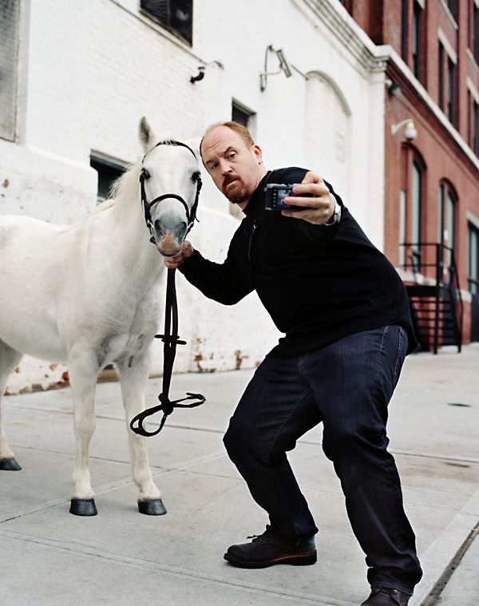

[Jeans](http://www.papodehomem.com.br/qual-o-melhor-jeans-para-o-meu-tipo-de-corpo-ou-o-pequeno-guia-da-calca-jeans/) servem para absolutamente qualquer ocasião - excetuando casamentos e bailes de debutantes. A onda é respeitar seu corpo. Se for mais gordinho, como o Louis C.K., modelos de corte reto é o esquema. Magrelos vão de *skinny*.

A única regra universal é: **faça a barra da calça**.

### 3. Você precisa de uma bota

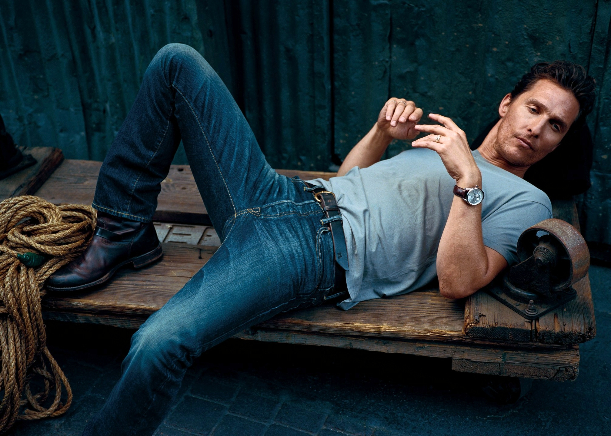

É incrível ver [como as botas](http://www.papodehomem.com.br/ei-machao-voce-usa-botas-guia-ilustrado/) são versáteis. Vai bem com jeans, chino ou até calça social. Só não vale pagar o botinudo aos 40 graus do verão que levou a Cantereira embora.

### 4. Cuidado com o tênis

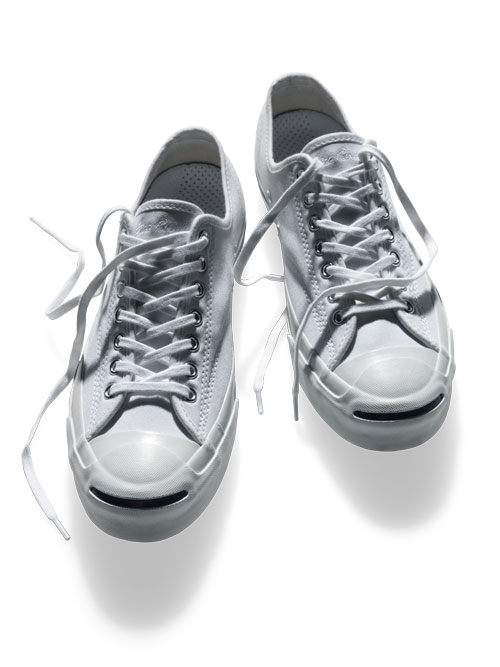

Menos é mais. Esqueça molas, modernices, enormes logotipos de marcas nos seus pés. Modelos vintage com poucas cores serão sempre uma opção segura, dos New Balance ao Vans, passando pelo Converse All-Star.

### 5. Um terno para o seu tamanho

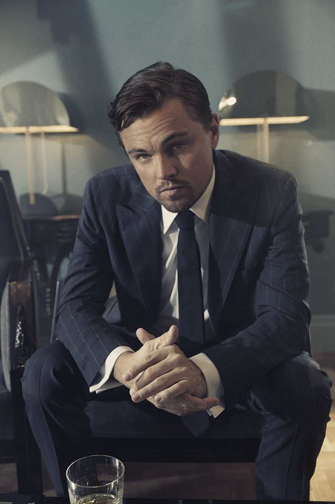

2015 tá aí, caminhando, mas ainda tem homem que rejeite a ideia de ter um belo terno no guarda-roupa. Esse costume de alugar a peça é sempre a pior - financeiramente e, claro, para seu estilo. Vá até uma loja de confiança, escolha com calma e saiba que a peça vai durar bons anos. A regra central aqui é: dê um abraço em torno de si mesmo. Se sobrar muito pano, pegue um modelo menor. Se faltar pano, pegue um menor.

Se rolar, segura mais umas semanas, guarda mais umas moedinhas e arrume todo o caimento com um bom alfaiate.

### 6. Não ignore a camurça

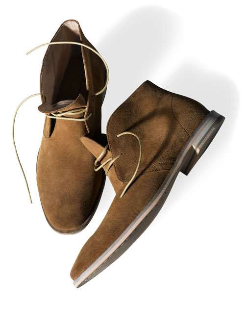

Usual demais. Há modelos mais leves e a preferência é o marrom. Preto e, principalmente, o azul não me agradam. [Desculpa, Elvis](https://www.youtube.com/watch?v=Bm5HKlQ6nGM).

### 7. Não tem nada de errado com a camisa de manga curta

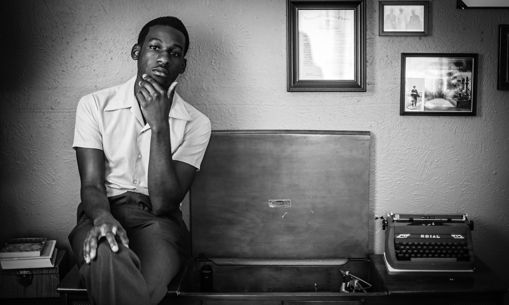

Entendo seu medo em parecer um funcionário do McDonald’s. Mas num país tropical, não há nada de errado em usar camisas de manga curta.

São usuais, dão um toque menos formal e servem para trabalhar, sim (desde que sem gravata, claro).

### 8. Óculos escuros é muito mais que estilo

Ser sóbrio na escolha vai fazer com que erremos menos. Modelos clássicos não estão aí à toa.

### 9. Minha gravata magnifíca

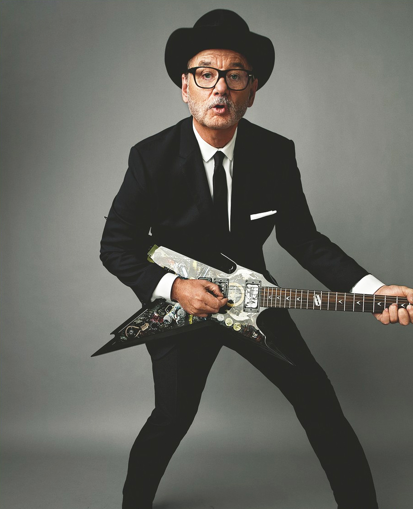

Não precisa ter estampa nem precisa ser skinny. Aliás, se você não precisa dela usualmente para o trabalho, a melhor escolha é uma peça preta que não brilhe tanto nem seja completamente opaca. O material vai do seu gosto.

### 10. Todo mundo fica bem de suéter

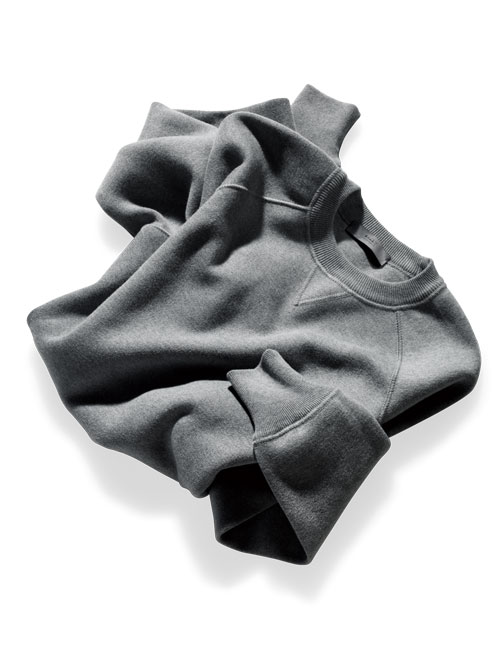

Peça-chave e mais que adequada à temperatura brasileira. Você sabe que aquele bando de casacos de mil camadas são exagerados para o outono e lhe são necessários para dias bem específicos.

Com o suéter é justamente o contrário. Vale listras, vale estampas e vale sobriedade. Fortão, [não deixa apertar muito nos músculos](http://static.socialitelife.com/uploads/2012/02/10/Kellan-Lutz-Front-Row-General-Idea-New-York-Fashion-Week-02102012-8-400x470.jpg) não.

### 11. O truque da camisa sem estampas

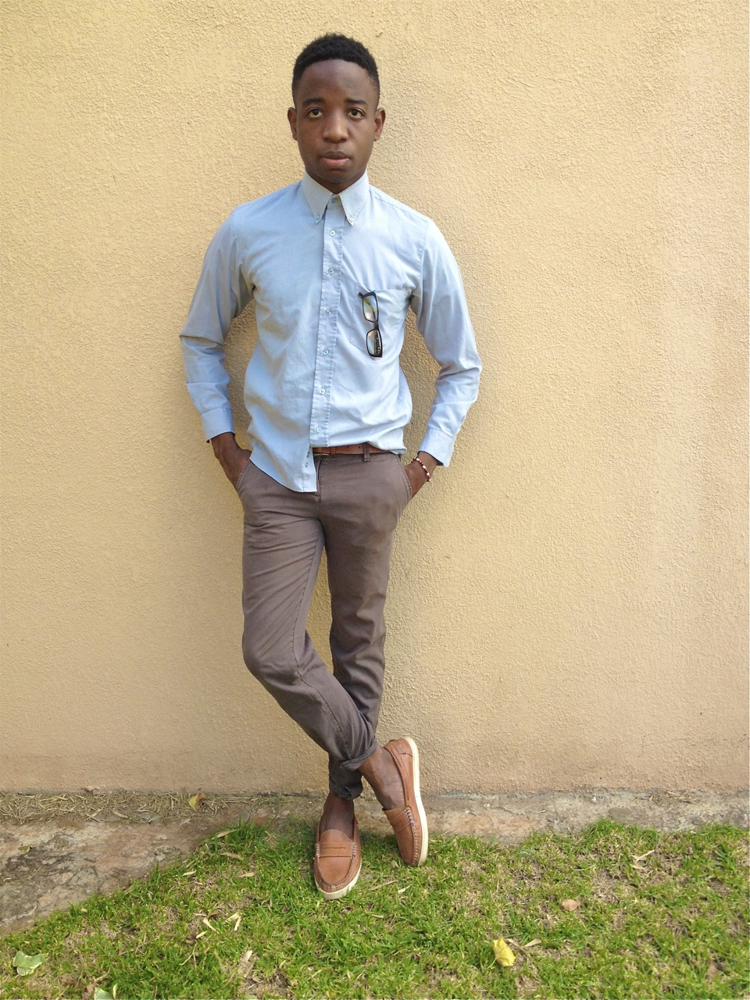

Serve como peça do dia a dia, mas pode muito bem brilhar num conjunto mais formal. Aceita mangas dobradas ou completamente abotoadas.

Apenas tenha uma sempre disponível.

### 12. Cinto preto

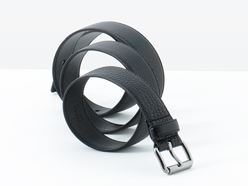

Lembra aquela onda de cintos de listras e coisa e tal? Pois, pelo bem da humanidade, isso já era. Compre um preto - que não necessariamente seja de couro - e bola para frente.

### 13. Tem algo com os seus sapatos

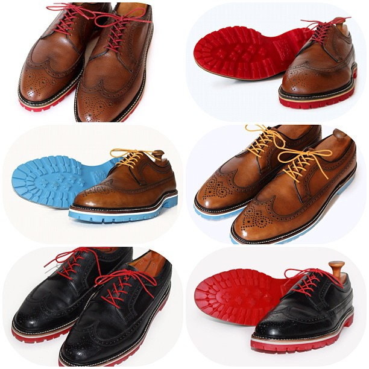

Caso você não precise deles todos os dias, o jeito é optar pelo clássico: o bom e velho brogue preto. Se o uso é mais frequente, vale ousar alterar os modelos e as cores. Marrom, cinza e até o azul vão se destacar. E, por favor, [cuide bem deles](http://www.papodehomem.com.br/sapatos-dicas-de-como-cuidar-e-conservar-o-seu-calcado/).

### 14. Outras texturas da calça

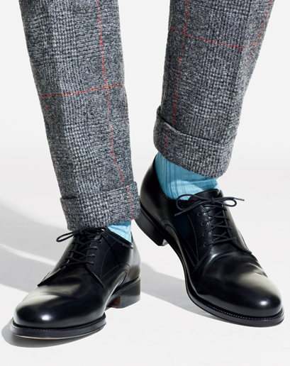

Ok, vá com calma. Mas não tem nada de errado em optar por fazer das suas pernas o centro das atenções. Vale veludo e tecidos com padronagem xadrez.

### 15. Carteira de couro

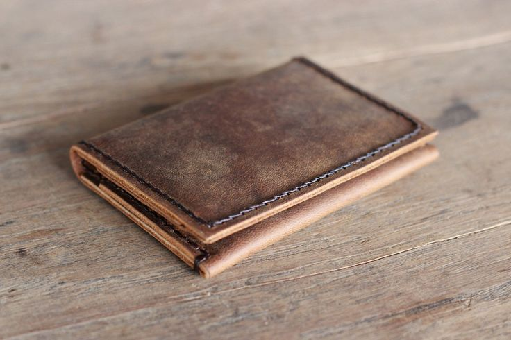

Ainda que tenham surgido vários outros materiais - [do vinil ao papel](https://catracalivre.com.br/wp-content/uploads/2013/09/12952_carteira-de-papel-drei_b.jpg) -, o couro segue como a melhor opção para os casos daqueles que só precisam de uma peça. As outras carteiras são ótimas opções, claro.

Mas o essencial ainda é o antigo. Pela durabilidade e por se adequar a qualquer momento ou evento.

### 16. Relógio

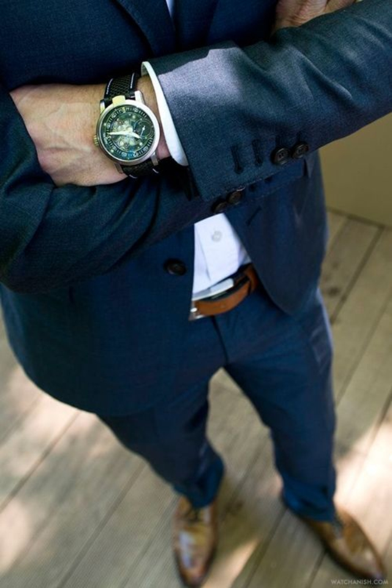

Preciso dizer que não uso um há uns 10 anos pelo menos. O que não quer dizer que ele não seja um baita golaço. Não só continua atual, como também ressalta a personalidade de cara.

### 17. Casaco esportivo classudo

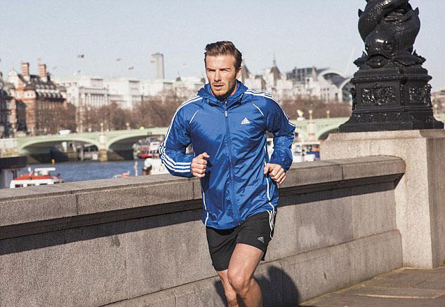

De fato, um casaco esportivo pode ser um diferencial favorável para quem trabalha em ambientes mais despojados ou uma erro primário. Na dúvida, os modelos vintage caem melhor, tanto pelos tecidos quanto pelo corte.

O exagero nas cores vai depender bastante do ambiente.

### 18. O segredo da jaqueta de lã

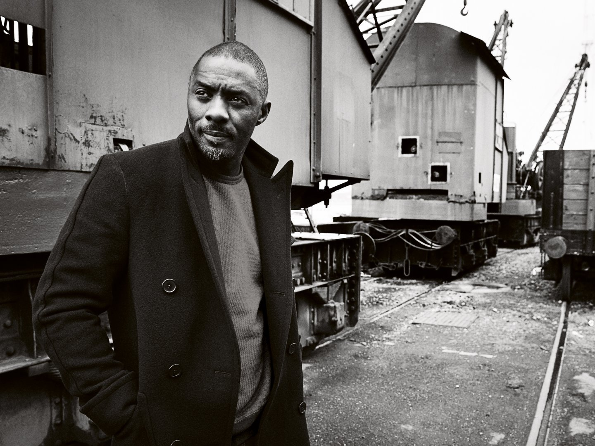

Uma bela jaqueta de lã incrementada com botões pode resolver sua vida. Elimina as chances de precisar de várias camadas de roupas nos dias mais frios.

Vão bem com um visual mais social ou tornam seu estilo mais largado em algo elaborado.

### 19. Tenha uma calça cáqui

Eis uma saída sempre honrosa para seu armário. Só o fato de suas pernas estarem cobertas com um tom mais claro que o usual (pensando no jeans, por exemplo) já vai render uma nova leva imensa de combinações.

De repente, aquela camiseta largada no fundo do guarda-roupa passa a brilhar novamente.

### 20. Uma blusa de capuz simples e sem frescura

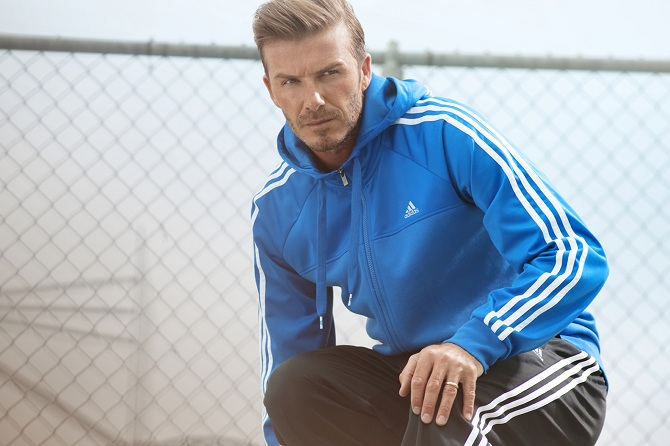

O bom, o velho, o inigualável moletom. Pode ser canguru, pode ser com zíper, pode ter estampa ou pode ser liso. Usual feito calça jeans velha e desbotada.

### 21. Um guarda-chuva preto

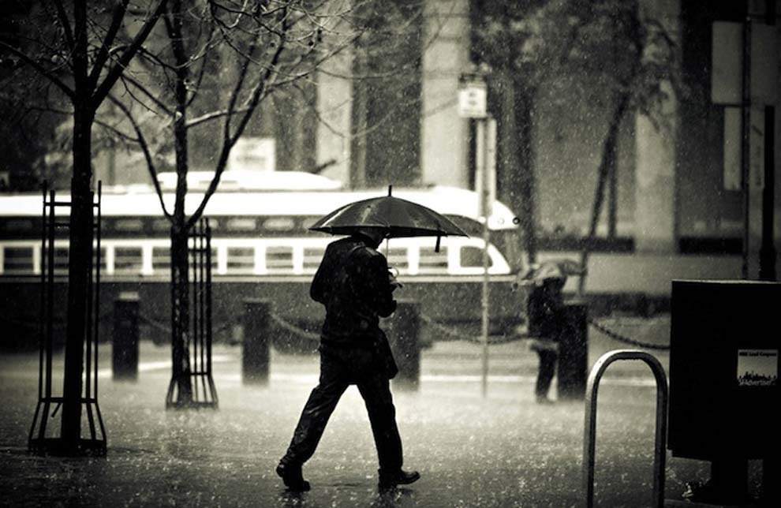

### 22. Camisa de algodão simplona e genial

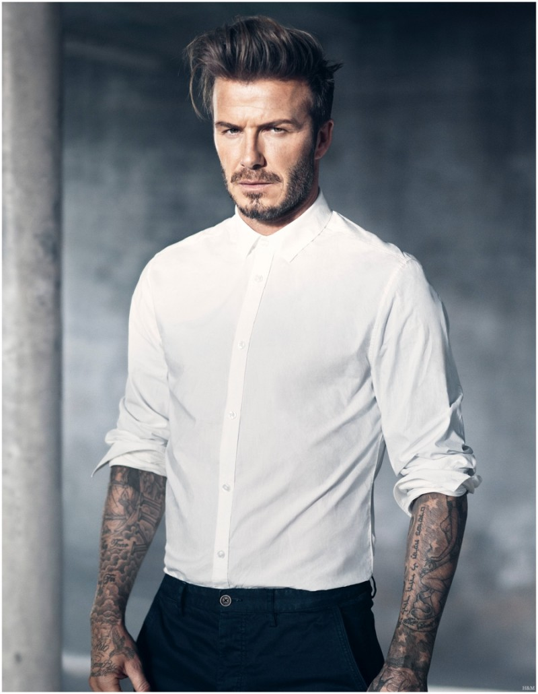

Azul celeste, cinza, branca ou preta. Não importa sua preferência, importa que alguma delas viva com você.

Invista bem no corte e se atente aos detalhes do modelo.

### 23. Tênis clássicos

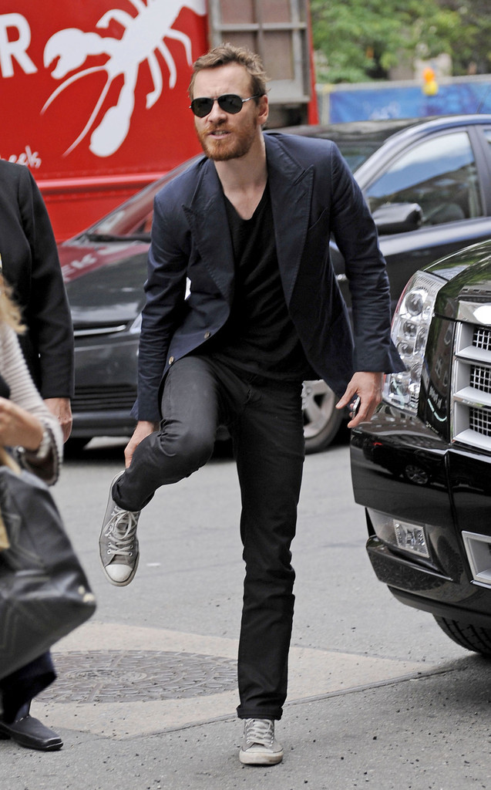

Porque os Strokes já foram embora, mas o Converse segue vivão e vivendo. Modelo iate é sempre esqueminha.

### 24. Camisetas clássicas coloridas

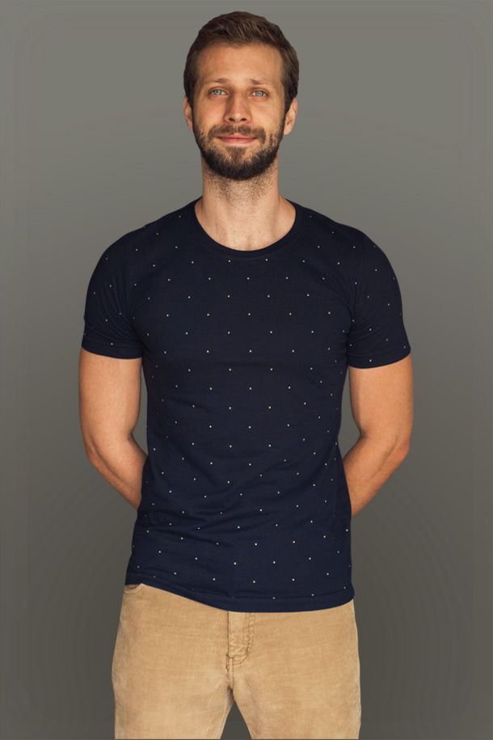

Lembra da primeira dica? Essa aqui é tão essencial quanto. Completam ou formam sozinhas o seu visual.

Experimente brincar com elas e sua calça cáqui.

### 25. Jeans, sempre jeans

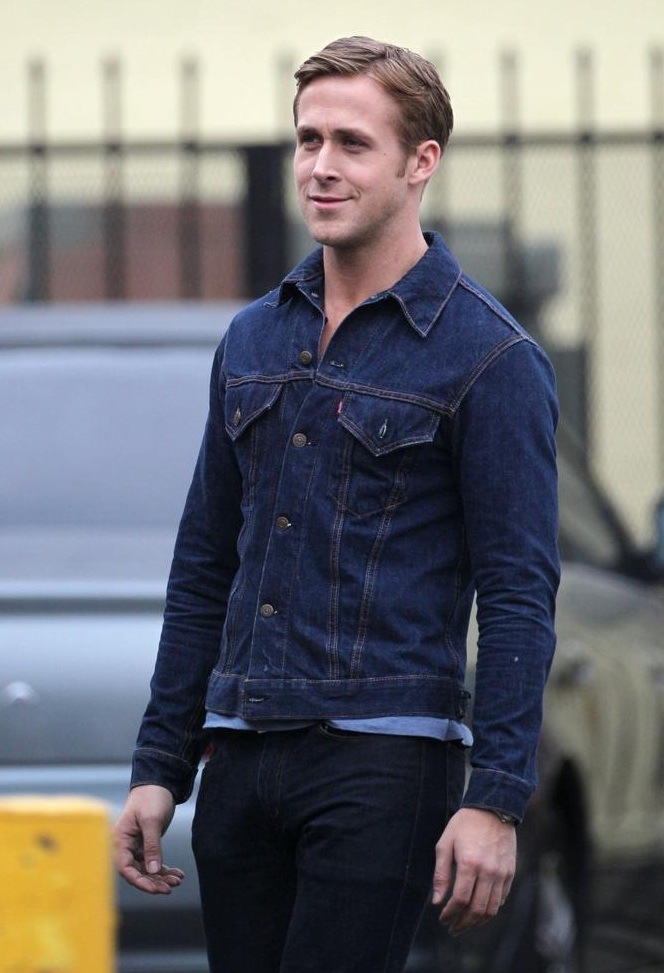

Não precisa se preocupar em sobrepor peças de jeans. Vale combinar camisa e calça do mesmo tecido, sim. Vale calça e jaqueta, vale camisa e calça. O segredo é saber contrapor os tons ou vai acabar [parecido com o Justin Timberlake](http://www.thefashionsection.com/wp-content/uploads/Britney-Spears-Justin-Timberlake-Red-Carpet.jpg).

### 26. Faça sua cabeça

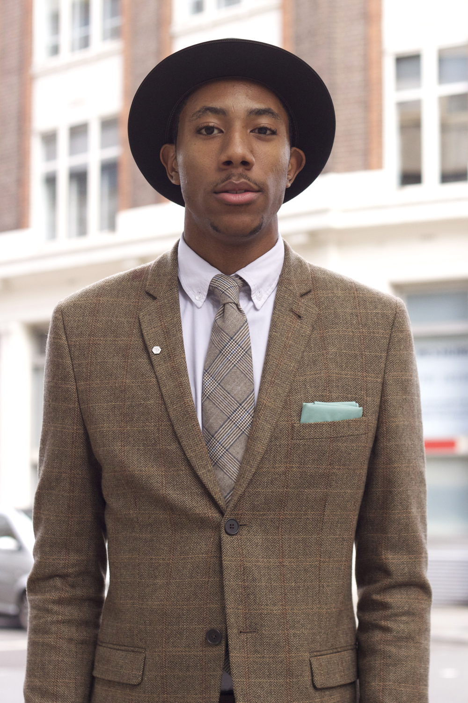

Da mesma maneira que os tênis esportivos casam com seu esporte favorito, o que vai na sua cabeça precisa combinar com o que vem de dentro, com sua personalidade. Coco, fedora e boina italiana estão aí.

O grande lance é saber escolher o tamanho correto. Converse com os vendedores e leia sobre o assunto. Mas sem grilo. Vai dar tudo certo.

### 27. Jaqueta de couro

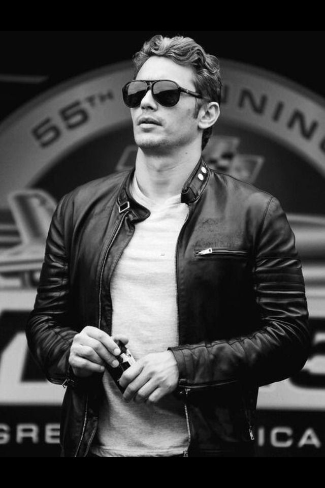

Taí outra eterna peça bem vinda. Para evitar erros, faça sempre as escolhas mais simples. Uma peça que não brilhe tanto é mais certeira do que modelos com milhares de bolsos ou detalhes metálicos também é um bom caminho para não parecer o [Edward Mãos de Tesoura](https://www.stanwinstonschool.com/uploads/attachments/17/edward-final-blog-post.jpg?1337098664).

### 28. Lenhador é amor

Por trás da camisa xadrez de um lumbersexual mora um facilidade primorosa para cidades como São Paulo. Tecidos aveludados, de flanela ou de lã são ideias para as temperaturas de outono. E não há mais limites. O xadrez vai com calça jeans, social, cáqui ou texturizada.

### 29. Um par de meias massa

Belo truque para parecer descolado. Você pode estar vestindo terno e gravata, mas se nos seus pés mora uma meia listrada ou colorida - que tal combinar com a gravata? -, as pessoas vão admirá-lo por seu estilo insuperável.

Manda bala agora, fera.

### Mecenas: [Malbec Absoluto](http://www.confrariamalbec.com.br/repertorio-absoluto)

*O estilo e a coerência estão nos pequenos detalhes, eles são parte do repertório que separa homens comuns de homens marcantes.*

*Conheça o [Repertório Absoluto](http://www.confrariamalbec.com.br/repertorio-absoluto) e descubra o que do seu repertório te faz um homem marcante.*

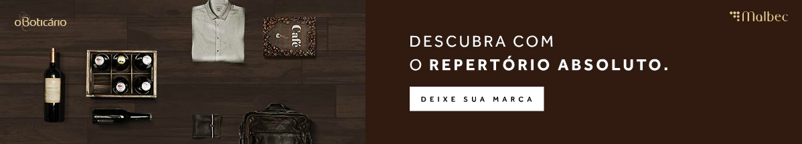

---

*publicado em 07 de Abril de 2015, 00:00*
