# 3 experiências para enxergar Las Vegas com outros olhos | Na estrada #29

Las Vegas também tem atrativos para quem quer curtir uma viagem para além dos cassinos

Em meados de janeiro recebemos um convite: fomos convocados pelo órgão oficial de turismo de Las Vegas, [LVCVA](http://www.lvcva.com/), para explorar a cidade. O desafio – explícito e complexo – era apresentar uma versão da cidade que extrapola as roletas, caça-níqueis e mesas de poker. A maior concentração de luz neon do planeta almeja adicionar “versátil” à lista de palavras que a descreve.

Para atingir o objetivo, sobram opções. Tem espaço para quem quer realizar um remake-vida-real do “[Se beber, não case](http://www.imdb.com/title/tt1119646/)”, claro, mas também tem espaço para quem quer assistir espetáculos absurdamente bem produzidos, prestigiar os melhores *chefs*, dirigir Ferraris, se perder em baladas com os DJ’s mais famosos do mundo ou encarar de frente toda nossa pequenice ao sentar na beira de um canyon de quase 30 km de largura e 1,6 km de profundidade.

### A cidade, o hotel e a trupe

A cidade é pequena e a gigantesca maioria dos turistas se concentra nos 7 Km de extensão da [Strip](http://pt.wikipedia.org/wiki/Las_Vegas_Strip) (avenida onde ficam os hotéis e, consequentemente, os cassinos). Nos arredores da cidade, deserto.

Chegamos de avião, desembarcando no McCarran Airport, mas é totalmente viável chegar por lá de carro, o visual da pista é incrível.

Ficamos no [Delano Hotel](http://en.wikipedia.org/wiki/Delano_Hotel). No quesito tamanho, o quarto bate de frente com a maioria dos apartamentos de São Paulo. No quesito luxo, nem se fala.

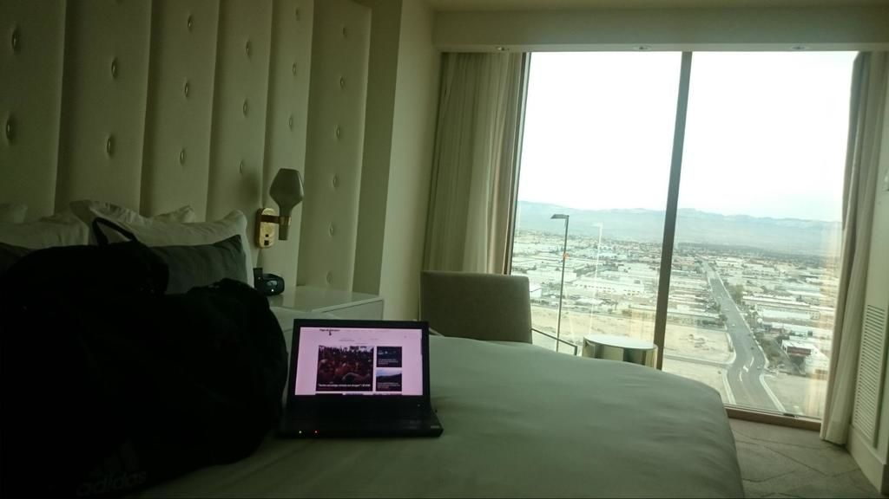

Vista linda na janela do quarto, e nosso recém-nascido site na tela do computador

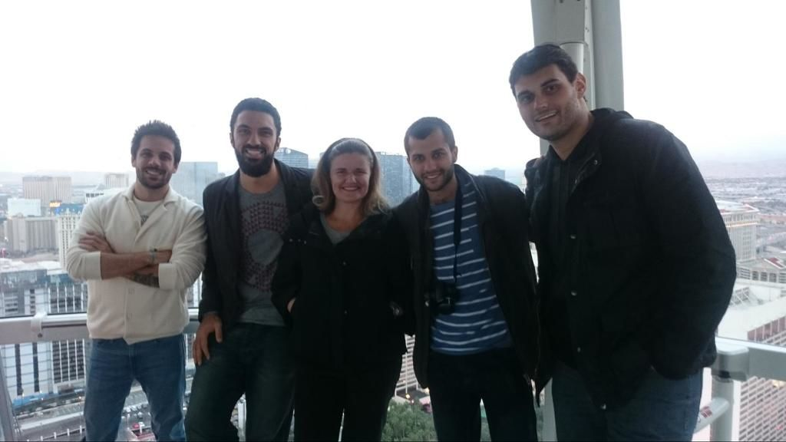

Na ordem, Bruno (Men’s Health), eu, Flávia (Interamerican), Felipe (Estadão) e Fernando (Gazeta do Povo)

Nos 4 dias que se seguiram, fomos apresentados a muitas atrações. De restaurantes a voo de helicóptero, passando por shows, baladas e parques.

Sem mais delongas (e sem a pretensão de ser um guia turístico), vamos ao que encheu os olhos e surpreendeu.

### A melhor experiência gastronômica da minha vida

Quando eu penso em comida americana, eu penso em hamburguers. Muitos hamburguers, com uma quantidade de batata frita capaz de abastecer um time de rugby. Minha imagem preconceituosa, porém, foi destruída, garfada por garfada.

Almoçamos no [The Pub](http://www.lasvegas.com/listing/the-pub/21656/). Consigo me planejar bem com as planilhas, mas não sou dos melhores em provisionar espaço no estômago. Saímos de lá excessivamente satisfeitos, porções imensas, variadas e que não dariam muito orgulho aos nutricionistas.

Pensamos que o dia alimentar terminaria ali. Mas erramos. Inocentes. Tínhamos um compromisso à noite, íamos conhecer o famoso [Nobu](http://www.noburestaurants.com/las-vegas-caesars-palace/experience/), considerado um dos melhores restaurantes de culinária japonesa do mundo. Decoração, organização, espaço, tudo impecável. Nem o almoço generoso foi capaz de prejudicar nossa performance.

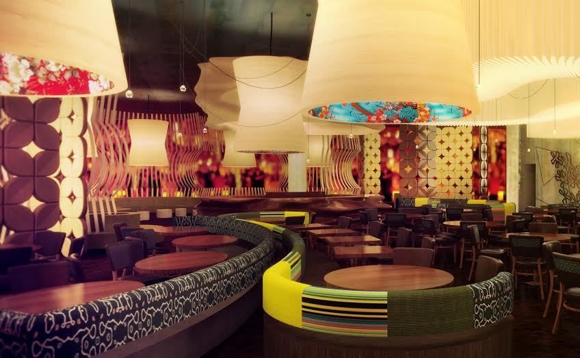

A comida foi preparada em nossa mesa, pelo chef Bruce. O cardápio oferecia 4 percursos, com cerca de 10 “pequenos” pratos cada. Escolhemos um deles e a partir daí, fomos conduzidos.

Nascido no Camboja, morador de Las Vegas já há alguns anos, Bruce sabia como garantir que sua presença fosse extremamente agradável. Explicava cada prato, se mostrava interessado por nossas muitas perguntas, tudo na medida. Opções de bebida para harmonizar com cada prato, porções cuidadosamente preparadas.

Durante o jantar, fomos acompanhados pelo pessoal do Caesars, hotel onde o restaurante foi caprichosamente instalado. Há tempos eu não saia de um lugar tão impressionado.

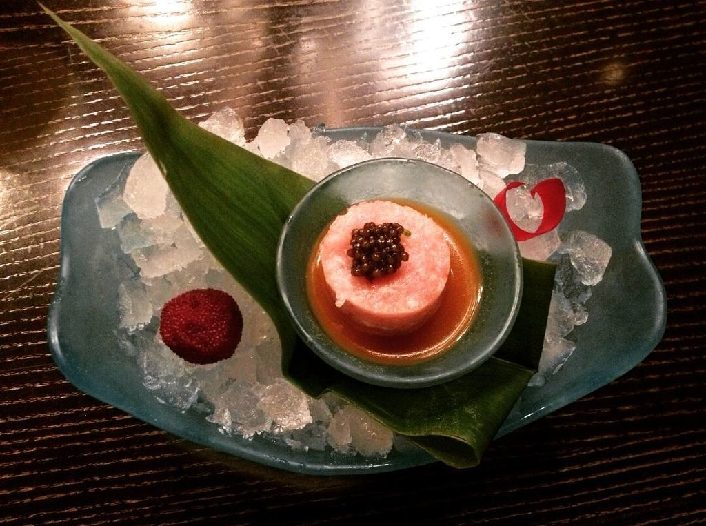

Meu preferido: tartar de salmão no molho de wasabi.

### The Downtown Container Park: Las Vegas empreendedora

A The Strip, avenida principal, é linda, iluminada, vibrante. O centro de Las Vegas não. O centro de Las Vegas é decadente. Muitos prédios abandonados, comércio fechado, poucas pessoas na ruas. Fui sem muita empolgação, e a fórmula da expectativa no chão fez a mágica.

Fomos conhecer o [Container Park](http://www.lasvegas.com/listing/downtown-container-park/33202/). O espaço é mais do que um conjunto de *containers*, é um experimento social com foco em revitalização. A ideia é fomentar o desenvolvimento de negócios sustentáveis, além de oferecer à população opções de lazer que fujam do tradicional. É um lugar para se estar.

Durante a visita, a responsável pelo tour falava sobre Vegas com a mesma paixão com que o [Ismael](http://www.papodehomem.com.br/autores/ismael-dos-anjos#artigos), autor da casa, fala sobre Belo Horizonte.

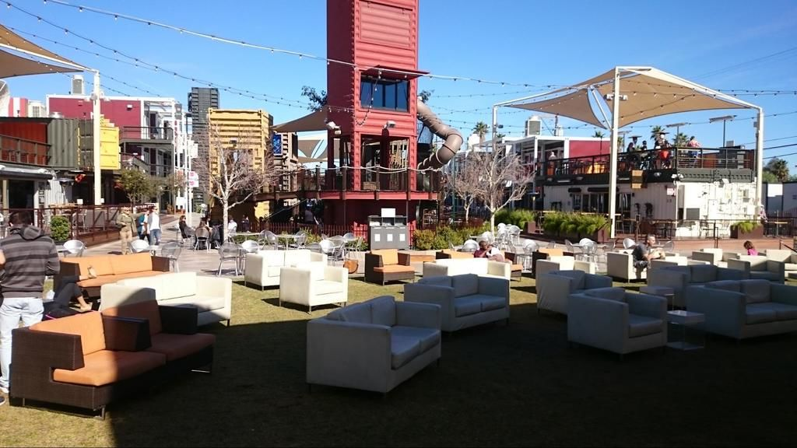

São mais de 30 *containers* extremamente bem acabados, climatizados e baratos, onde funcionam lojas e restaurantes que provavelmente não existiriam em outro lugar. É uma opção viável para testar a aceitação do produto que está sendo oferecido, antes de colocar na roda algumas dezenas de milhares de dólares.

Dentre as várias iniciativas, conhecemos a sorveteria [ChillSpot](http://www.chillspotlv.com/), que, além de operar por lá, já distribui para vários outros hotéis da cidade.

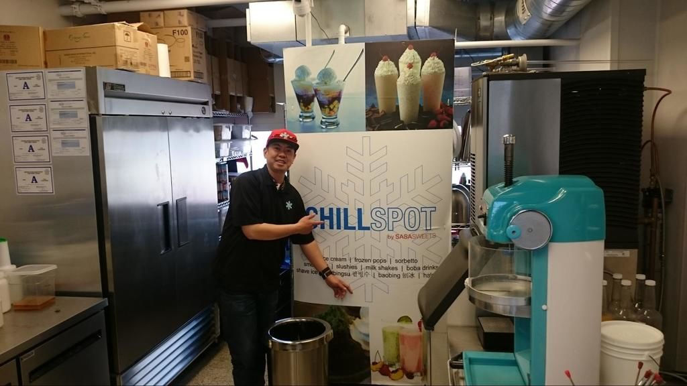

Joe, o orgulhoso fundador do negócio, contou um pouco da sua história, do surgimento da receita, dos prêmios que já ganhou e do quão importante é ter um espaço controlado e amigável para testar se as coisas estão indo no caminho certo ou não.

O parque também conta com espaço para lazer e trabalho, com brinquedos para crianças, mesas confortáveis e wi-fi gratuito.

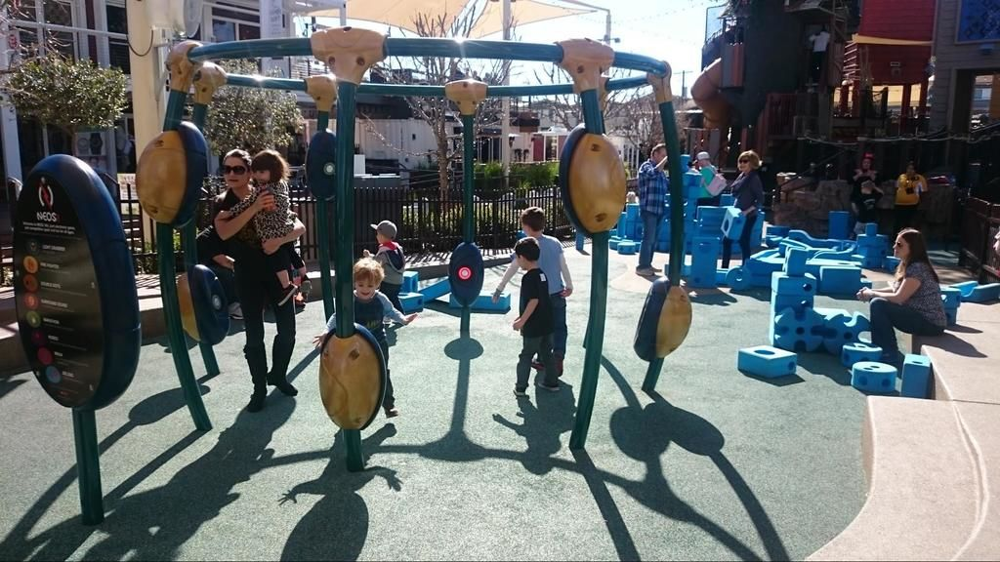

Infelizmente não estava rolando nenhum show durante o tempo que passamos por lá. [No site é possível visualizar a agenda completa](http://downtowncontainerpark.com/).

### Grand Canyon

Uma lista infinita de clichês poderia ilustrar o fato de que, sim, somos bem pequenos, que nossa passagem por aqui é curta e bem insignificante, mas poucas seriam tão eficientes quanto estar a bordo de um helicóptero sobrevoando um imenso e absurdamente bonito buraco de 30 Km de largura.

O parque que abriga o Canyon é gigante e são necessários alguns dias para explorá-lo por completo, mas tivemos a oportunidade de sobrevoar um bom pedaço. O tour foi oferecido pela Maverick.

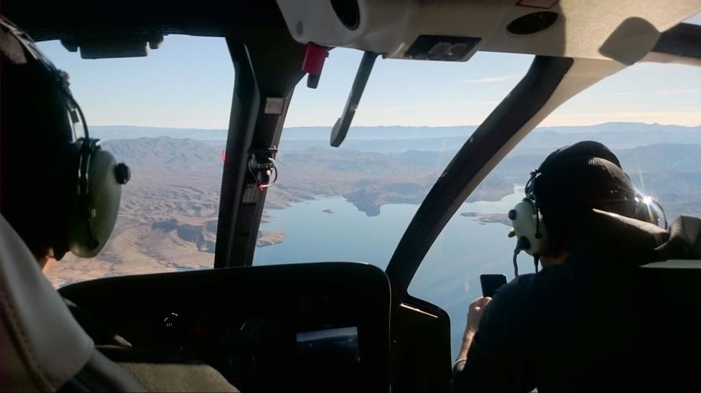

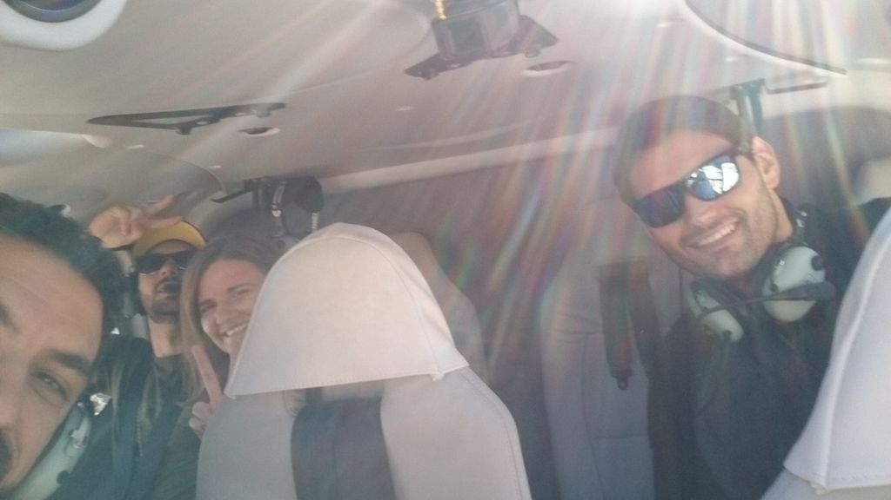

Inevitáveis e infames piadas envolvendo o comandante Hamilton. Todo mundo tem 14 anos quando está dentro de um helicóptero

Sobrevoamos a Hoover Dam, represa que abastece o estado de Nevada. É considerada o maior projeto já realizado pelos Estados Unidos.

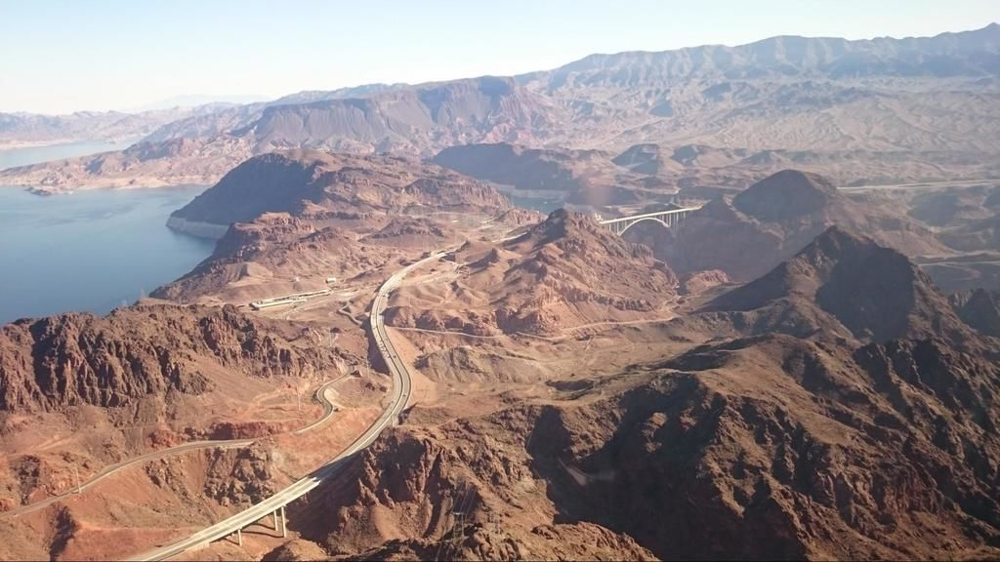

2,6 milhões de metros cúbicos de concreto

Por incompetência do fotógrafo, que estava tão abismado com os 2,6 milhões de metros cúbicos de concreto e perdeu o momento do click, a foto abaixo foi retirada do site [nosnomundo.com.br](http://www.nosnomundo.com.br/)

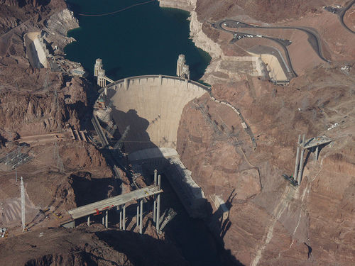

Após sobrevoar a represa, encaramos mais alguns minutos de voo até chegar ao local do pouso.

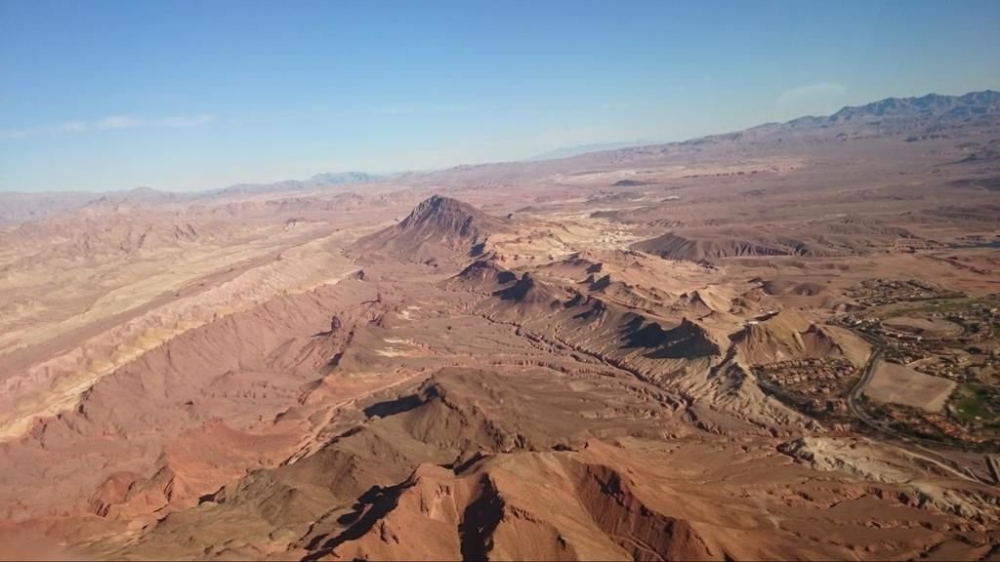

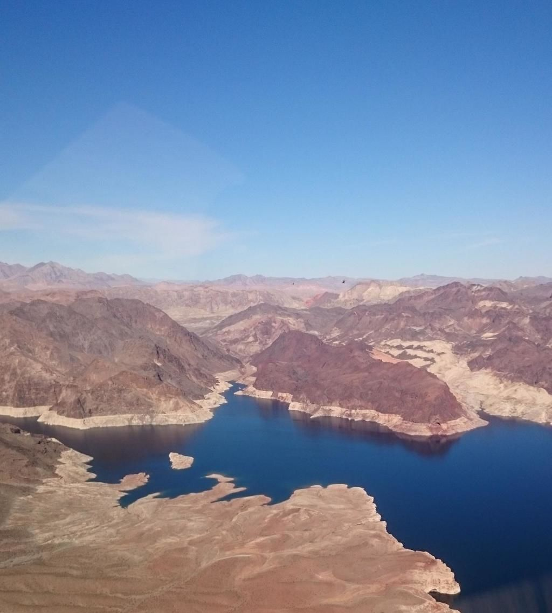

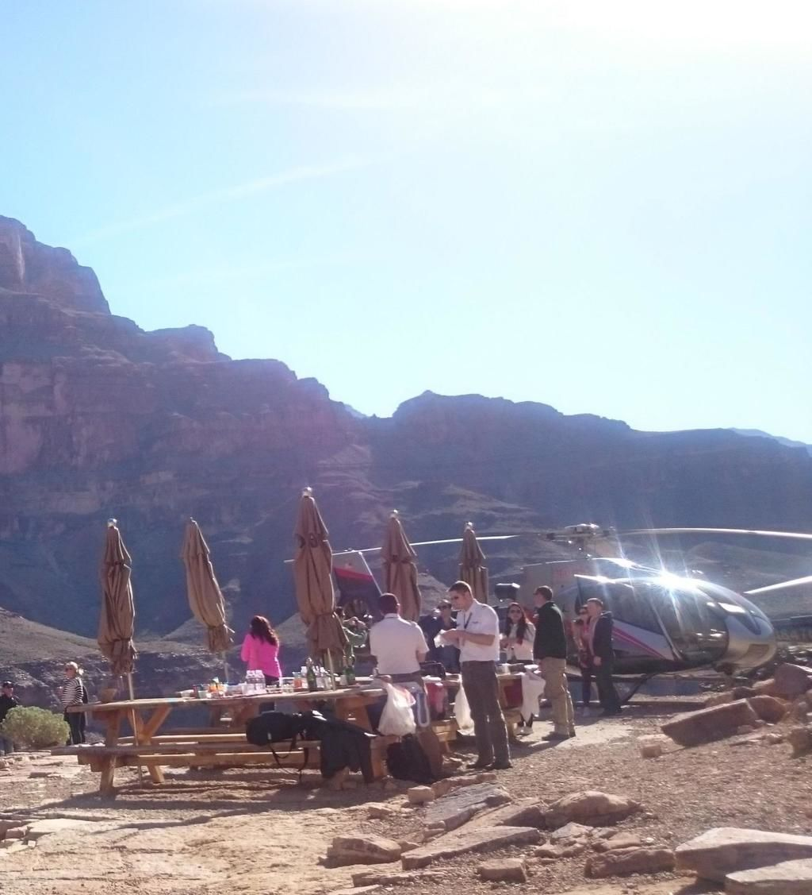

Junto com os [Cliffs of Moher](http://www.cliffsofmoher.ie/), na Irlanda, o Grand Canyon é o lugar mais incrível em que eu já estive. O caminho de volta nos garantiu uma bela vista aérea da cidade, inédita até então.

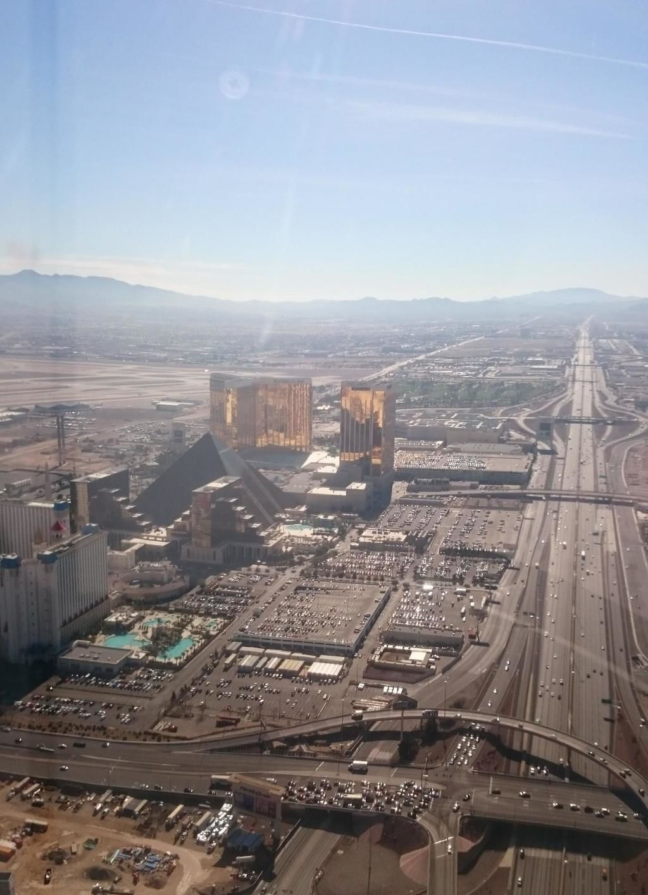

Incrível perceber quantas cidades cabem dentro de uma só, e como a experiência que temos ao interagir com o espaço é influenciada pelas pessoas que nos acompanham e nos introduzem. Foi uma Las Vegas totalmente diferente da que eu tive a oportunidade de conhecer há dois anos atrás.

Agradecimentos imensos à [LVCVA](http://www.lvcva.com/) pelo itinerário caprichado, e a Flávia Perin, da [Interamerican Network](http://www.interamericanetwork.com/), empresa que representa a LVCVA na América do Sul.

Que venham as próximas!

---

*publicado em 06 de Abril de 2015, 17:21*
