# A ONU listou os 49 melhores lugares para se viver

  
  

Isso de acordo com o [IDH](http://pt.wikipedia.org/wiki/%C3%8Dndice_de_Desenvolvimento_Humano), o Índice de Desenvolvimento Humano, que tem como pilar saúde, educação e economia. A lista [foi publicada na revista Exame](http://exame.abril.com.br/mundo/noticias/os-49-melhores-lugares-para-viver-segundo-a-onu/):

> A **ONU**avalia a expectativa de vida no nascimento, o tempo que uma pessoa passa na escola e o padrão de vida a partir do Produto Interno Bruto (**PIB**) per capita. Com estes resultados, O IDH é calculado. Quanto mais próximo de 1, mais desenvolvido é o país.

A própria ONU explica que um dos objetivos é apontar o crescimento econômico, e que isso apenas não reflete a realidade local, como o exemplo do Qatar, que possui o PIB per capita maior que o da Noruega (119 mil dólares contra 64 mil do país europeu), mas tem uma média escolar inferior (crianças passam uma média de 9 anos na escola contra 12,6 das crianças norueguesas).

Da lista, faltaria aprofundar informações e questionamentos.

Sua liberdade em lugares como Qatar não são lá muito bem vistos, [já que é tido como atitude obscena](http://g1.globo.com/turismo-e-viagem/noticia/2014/05/qatar-cria-campanha-para-turistas-vestirem-roupas-discretas-nas-ruas.html) abraçar sua mulher ou usar uma simples bermuda ou regata. Na Arábia Saudita, [o governo proíbe o casamento](http://www.bbc.co.uk/portuguese/noticias/2014/08/140806_arabia_saudita_proibicao_casamento_estrangeiras_lgb) com mulheres de alguns países e permite a poligamia. Para homens, claro.

Ser mulher e latina nos Estados Unidos também não é das maiores vantagens, [já que elas ganham quase metade](http://g1.globo.com/mundo/noticia/2014/04/mulheres-latinas-sao-mais-mal-pagas-dos-eua-aponta-pesquisa.html) do que uma mulher branca (que ainda recebem menos que as orientais). [Ser gay em Cingapura dá cadeia](http://www.brasilpost.com.br/2014/06/28/gays-cingapura_n_5540109.html). "[...] sexo entre dois homens é ilegal e pode ser punido com até dois anos de prisão. A lei, baseada em textos ingleses do período colonial da ilha, não faz menção ao sexo entre mulheres".

Londres [é a cidade mais cara do mundo](http://exame.abril.com.br/economia/noticias/londres-e-a-cidade-mais-cara-do-mundo) para se viver, depois de ter superado Hong Kong (que também está na lista), que estava no topo nos últimos cinco anos. [Ser estrangeiro na Espanha](http://www.bbc.co.uk/portuguese/reporterbbc/story/2007/11/071116_xenofobia_europarg.shtml) -- mesmo em crise -- nunca foi lá uma ótima ideia e a Grécia, berço da democracia, ainda se encontra afundada [na crise econômica](http://exame.abril.com.br/economia/noticias/entenda-a-crise-grega-em-5-minutos).

Abaixo, a lista:

### 1º Noruega

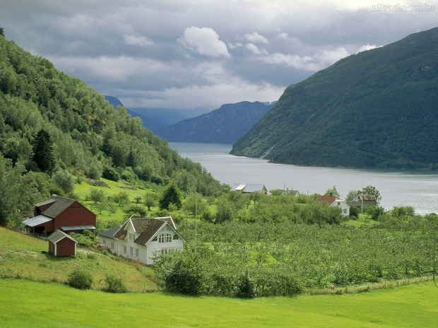

IDH: 0,944

Expectativa de vida no nascimento: 81,5 anos

Anos de escolaridade: 12,6

Expectativa de anos de escolaridade: 17,6

PIB per capita: 63.909 dólares

### 2º Austrália

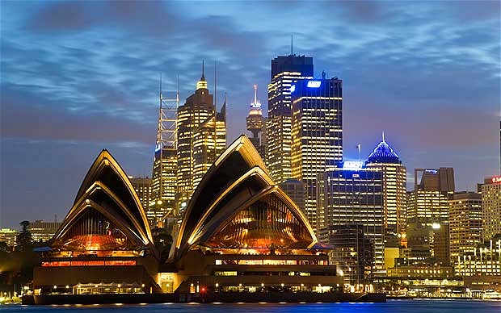

IDH: 0,933

Expectativa de vida no nascimento: 82,5

Anos de escolaridade: 12,8

Expectativa de anos de escolaridade: 19,9

PIB per capita: 41.524 dólares

### 3º Suíça

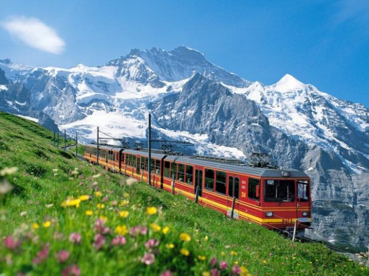

IDH: 0,917

Expectativa de vida no nascimento: 82,6

Anos de escolaridade: 12,2

Expectativa de anos de escolaridade:15,7

PIB per capita: 53.762 dólares

### 4º Holanda

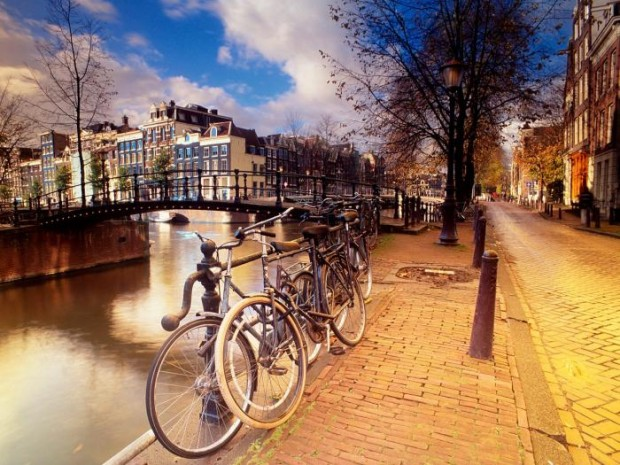

IDH: 0,915

Expectativa de vida no nascimento: 81,0

Anos de escolaridade: 11,9

Expectativa de anos de escolaridade: 17,9

PIB per capita: 42.397 dólares

### 5º Estados Unidos

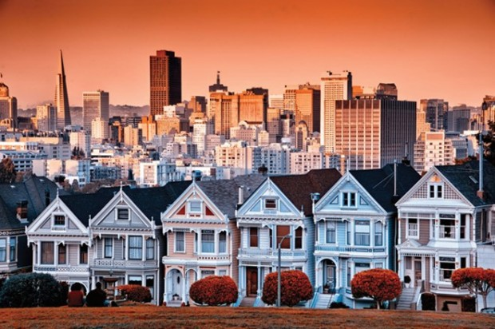

IDH: 0,914

Expectativa de vida no nascimento: 78,9

Anos de escolaridade: 12,9

Expectativa de anos de escolaridade: 16,5

PIB per capita: 52.308 dólares

### 6º Alemanha

IDH: 0,911

Expectativa de vida no nascimento: 80,7

Anos de escolaridade: 12,9

Expectativa de anos de escolaridade: 16,3

PIB per capita: 43.049 dólares

### 7º Nova Zelândia

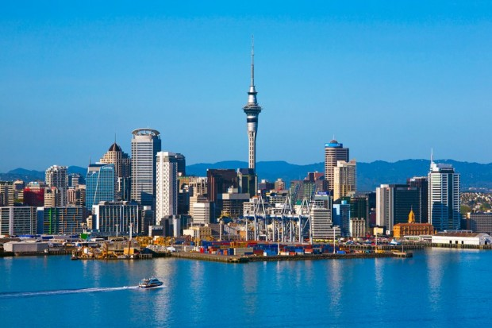

IDH: 0,910

Expectativa de vida no nascimento: 81,1

Anos de escolaridade: 12,5

Expectativa de anos de escolaridade: 19,4

PIB per capita: 32.569 dólares

### 8º Canadá

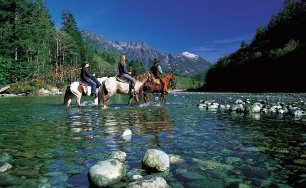

IDH: 0,902

Expectativa de vida no nascimento: 81,5

Anos de escolaridade: 12,3

Expectativa de anos de escolaridade :15,9

PIB per capita: 41.887 dólares

### 9º Singapura

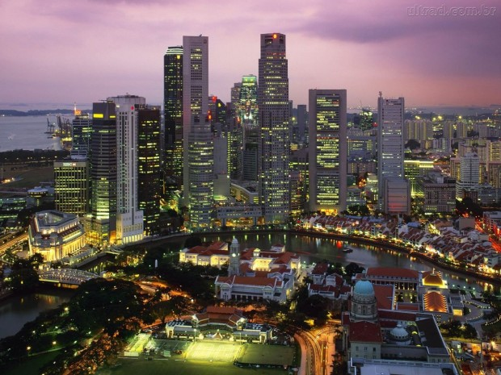

IDH: 0,901

Expectativa de vida no nascimento: 82,3

Anos de escolaridade: 10,2

Expectativa de anos de escolaridade: 15,4

PIB per capita: 72.371 dólares

### 10º Dinamarca

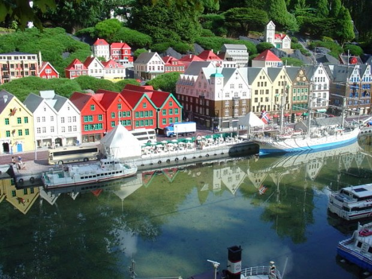

IDH: 0,900

Expectativa de vida no nascimento: 79,4

Anos de escolaridade: 12,1

Expectativa de anos de escolaridade: 16,9

PIB per capita: 42.880 dólares

### 11º Irlanda

IDH: 0,899

Expectativa de vida no nascimento: 80,7

Anos de escolaridade: 11,6

Expectativa de anos de escolaridade: 18,6

PIB per capita: 33.414 dólares

### 12º Suécia

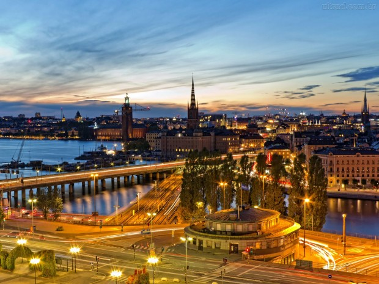

IDH: 0,898

Expectativa de vida no nascimento: 81,8

Anos de escolaridade: 11,7

Expectativa de anos de escolaridade: 15,8

PIB per capita: 43.201 dólares

### 13º Islândia

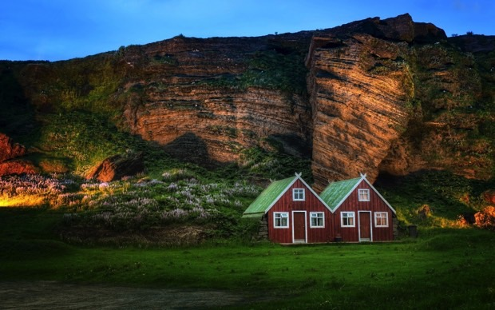

IDH: 0,895

Expectativa de vida no nascimento: 82,1

Anos de escolaridade: 10,4

Expectativa de anos de escolaridade: 18,7

PIB per capita: 35.116 dólares

### 14º Reino Unido

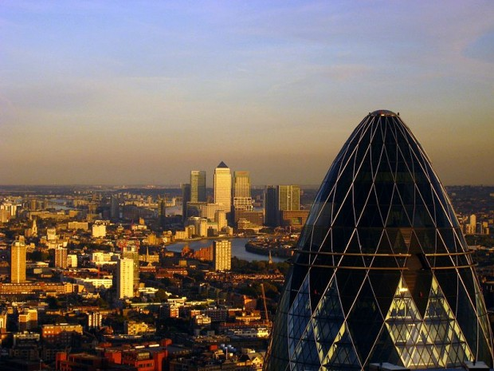

IDH: 0,892

Expectativa de vida no nascimento: 80,5

Anos de escolaridade: 12,3

Expectativa de anos de escolaridade: 16,2

PIB per capita: 35.002 dólares

### 15º Hong Kong (empatado com Coréia do Sul)

IDH: 0,891

Expectativa de vida no nascimento: 83,4

Anos de escolaridade: 10,0

Expectativa de anos de escolaridade: 15,6

PIB per capita: 52.383 dólares

### 15º Coreia do Sul

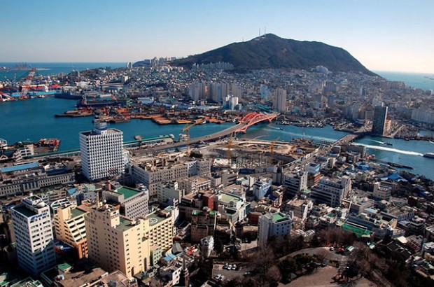

IDH: 0,891

Expectativa de vida no nascimento: 81,5

Anos de escolaridade: 11,8

Expectativa de anos de escolaridade: 17,0

PIB per capita: 30.345 dólares

### 17º Japão

IDH: 0,890

Expectativa de vida no nascimento: 83,6

Anos de escolaridade: 11,5

Expectativa de anos de escolaridade: 15,3

PIB per capita: 36.747 dólares

### 18º Lichtenstein

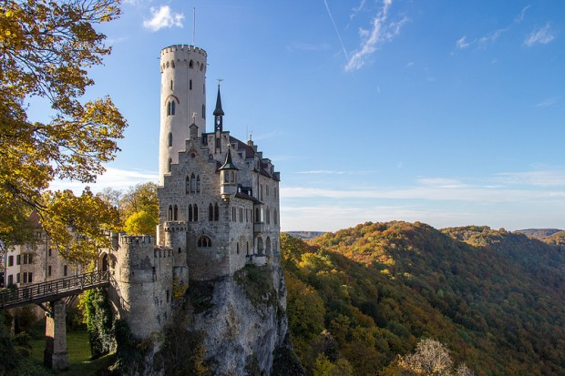

IDH: 0,889

Expectativa de vida no nascimento: 79,9

Anos de escolaridade: 10,3

Expectativa de anos de escolaridade: 15,1

PIB per capita: 87.085 dólares

### 19º Israel

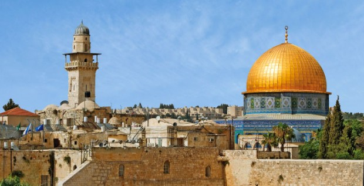

IDH: 0,888

Expectativa de vida no nascimento: 81,8

Anos de escolaridade: 12,5

Expectativa de anos de escolaridade: 15,7

PIB per capita: 29.966 dólares

### 20º França

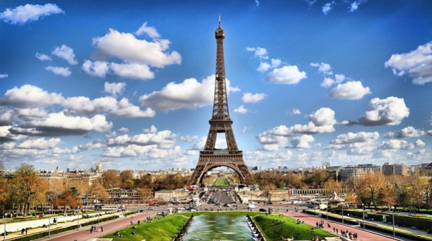

IDH: 0,884

Expectativa de vida no nascimento: 81,8

Anos de escolaridade: 11,1

Expectativa de anos de escolaridade: 16,0

PIB per capita: 36.629 dólares

### 21º Áustria

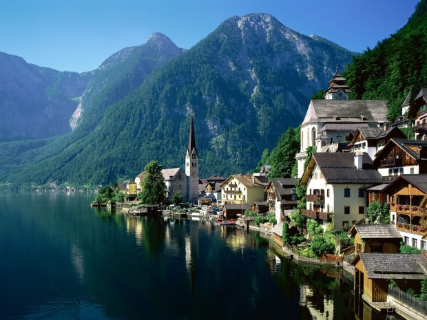

IDH: 0,881

Expectativa de vida no nascimento: 81,1

Anos de escolaridade: 10,8

Expectativa de anos de escolaridade: 15,6

PIB per capita: 42.930 dólares

### 22º Bélgica

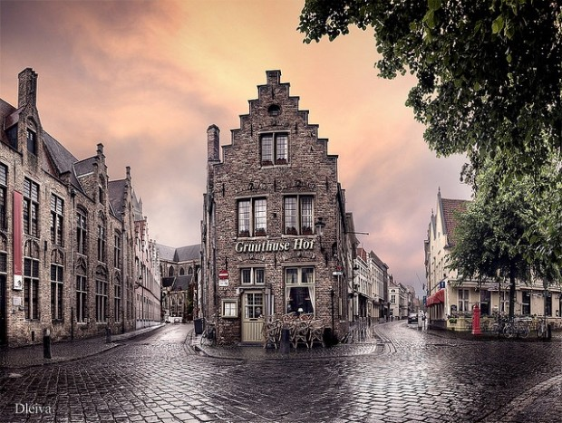

IDH: 0,881

Expectativa de vida no nascimento: 80,5

Anos de escolaridade: 10,9

Expectativa de anos de escolaridade: 16,2

PIB per capita: 39.471 dólares

### 23º Luxembrugo

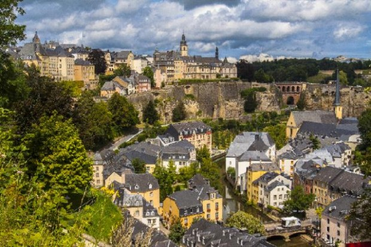

IDH: 0,881

Expectativa de vida no nascimento: 80,5

Anos de escolaridade: 11,3

Expectativa de anos de escolaridade: 13,9

PIB per capita: 58.695 dólares

### 24º Finlândia

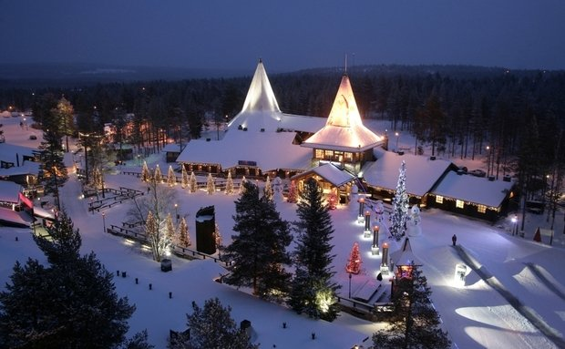

IDH: 0,879

Expectativa de vida no nascimento: 80,5

Anos de escolaridade: 10,3

Expectativa de anos de escolaridade: 17,0

PIB per capita: 37.366 dólares

### 25º Eslovênia

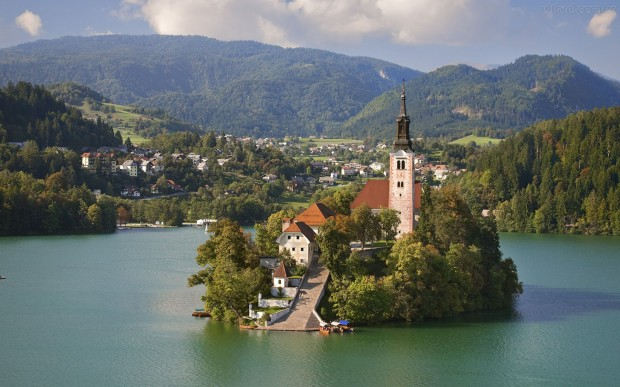

IDH: 0,874

Expectativa de vida no nascimento: 79,6

Anos de escolaridade: 11,9

Expectativa de anos de escolaridade: 16,8

PIB per capita: 26.809 dólares

### 26º Itália

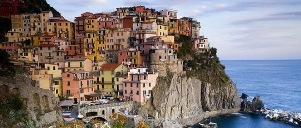

IDH: 0,872

Expectativa de vida no nascimento: 82,4

Anos de escolaridade: 10,1

Expectativa de anos de escolaridade: 16,3

PIB per capita: 32.669 dólares

### 27º Espanha

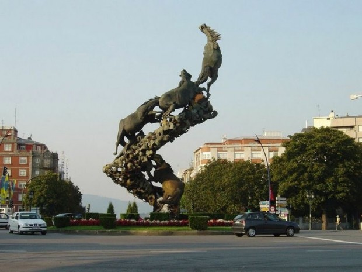

IDH: 0,869

Expectativa de vida no nascimento: 82,1

Anos de escolaridade: 9,6

Expectativa de anos de escolaridade: 17,1

PIB per capita: 30.561 dólares

### 28º República Tcheca

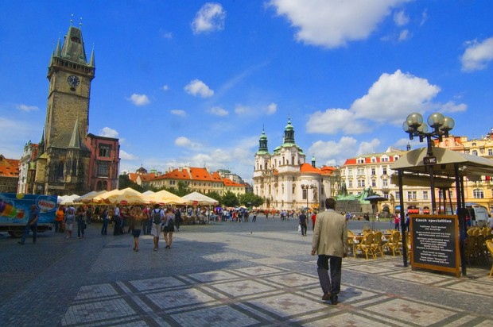

IDH: 0,861

Expectativa de vida no nascimento: 77,7

Anos de escolaridade: 12,3

Expectativa de anos de escolaridade: 16,4

PIB per capita: 24.535 dólares

### 29º Grécia

IDH: 0,853

Expectativa de vida no nascimento: 80,8

Anos de escolaridade: 10,2

Expectativa de anos de escolaridade: 16,5

PIB per capita: 24.658 dólares

### 30º Brunei

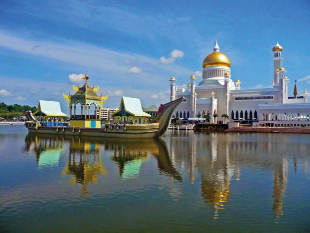

IDH: 0,852

Expectativa de vida no nascimento: 78,5

Anos de escolaridade: 8,7

Expectativa de anos de escolaridade: 14,5

PIB per capita: 70.883 dólares

### 31º Qatar

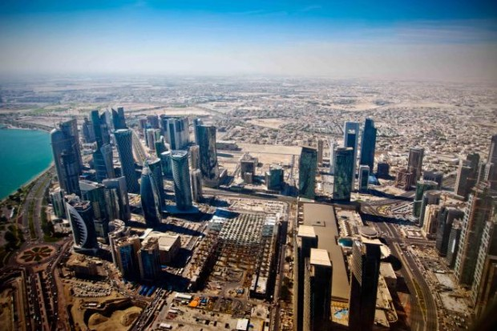

IDH: 0,851

Expectativa de vida no nascimento: 78,4

Anos de escolaridade: 9,1

Expectativa de anos de escolaridade: 13,8

PIB per capita: 119.029 dólares

### 32º Chipre

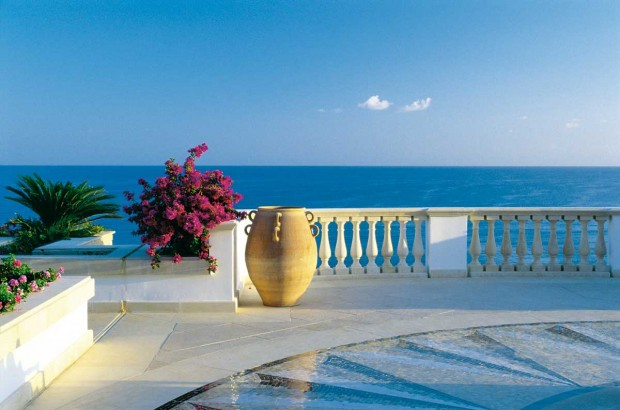

IDH: 0,845

Expectativa de vida no nascimento: 79,8

Anos de escolaridade: 11,6

Expectativa de anos de escolaridade: 14,0

PIB per capita: 26.771 dólares

### 33º Estônia

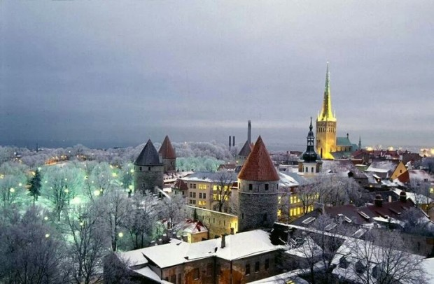

IDH: 0,840

Expectativa de vida no nascimento: 74,4

Anos de escolaridade: 12,0

Expectativa de anos de escolaridade: 16,5

PIB per capita: 23.387 dólares

### 34º Arábia Saudita

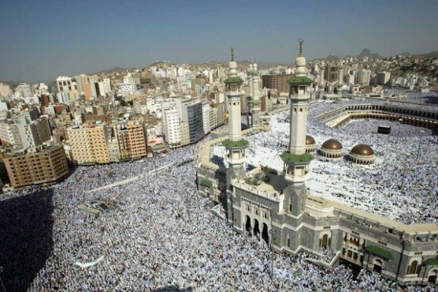

IDH: 0,836

Expectativa de vida no nascimento: 75,5

Anos de escolaridade: 8,7

Expectativa de anos de escolaridade: 15,6

PIB per capita: 52.109 dólares

### 35º Lituânia

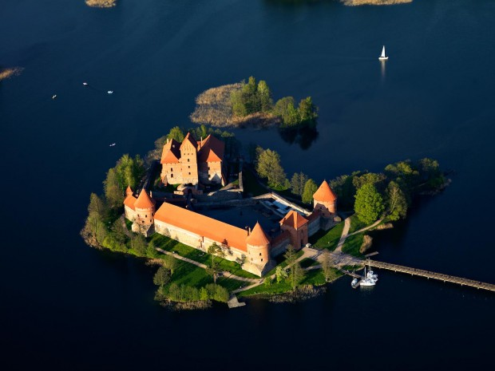

IDH: 0,834

Expectativa de vida no nascimento: 72,1

Anos de escolaridade: 12,4

Expectativa de anos de escolaridade: 16,7

PIB per capita: 23.740 dólares

### 36º Polônia

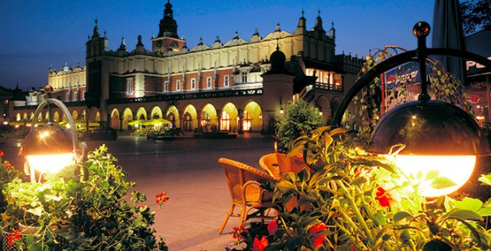

IDH: 0,834

Expectativa de vida no nascimento: 76,4

Anos de escolaridade: 11,8

Expectativa de anos de escolaridade: 15,5

PIB per capita: 21.487 dólares

### 37º Andorra

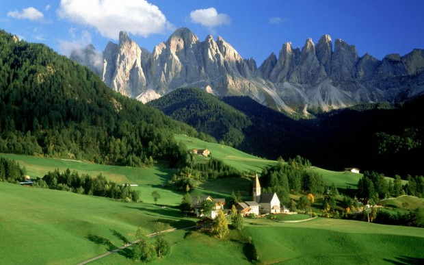

IDH: 0,830

Expectativa de vida no nascimento: 81,2

Anos de escolaridade: 10,4

Expectativa de anos de escolaridade: 11,7

PIB per capita: 40.597 dólares

### 38º Eslováquia

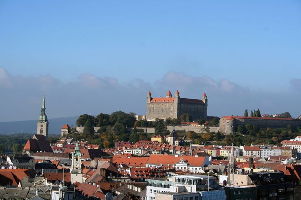

IDH: 0,830

Expectativa de vida no nascimento: 75,4

Anos de escolaridade: 11,6

Expectativa de anos de escolaridade: 15,0

PIB per capita: 25.336 dólares

### 39º Emirados Árabes

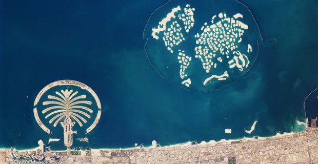

IDH: 0,827

Expectativa de vida no nascimento: 76,8

Anos de escolaridade: 9,1

Expectativa de anos de escolaridade: 13,3

PIB per capita: 58.068 dólares

### 40º Chile

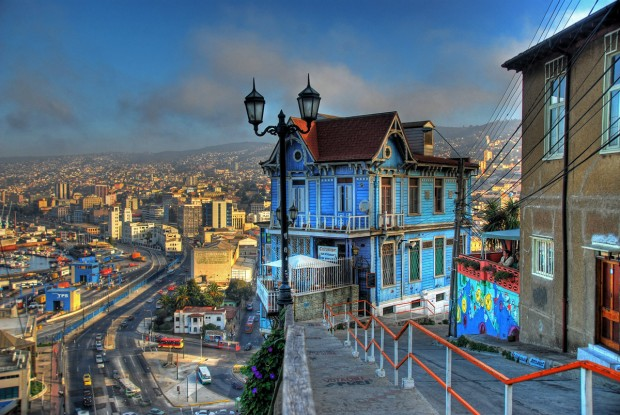

IDH: 0,822

Expectativa de vida no nascimento: 80,0

Anos de escolaridade: 9,8

Expectativa de anos de escolaridade: 15,1

PIB per capita: 20.804 dólares

### 41º Portugal

IDH: 0,822

Expectativa de vida no nascimento: 79,9

Anos de escolaridade: 8,2

Expectativa de anos de escolaridade: 16,3

PIB per capita: 24.130 dólares

### 42º Hungria

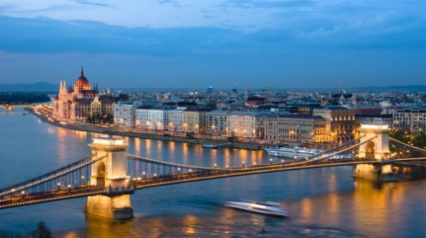

IDH: 0,818

Expectativa de vida no nascimento: 74,6

Anos de escolaridade: 11,3

Expectativa de anos de escolaridade: 15,4

PIB per capita: 21.239 dólares

### 43º Bahrein

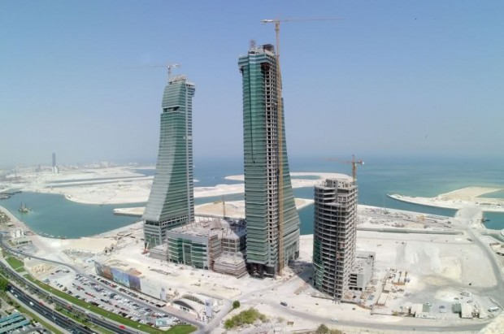

IDH: 0,815

Expectativa de vida no nascimento: 76,6

Anos de escolaridade: 9,4

Expectativa de anos de escolaridade: 14,4

PIB per capita: 32.072 dólares

### 44º Cuba

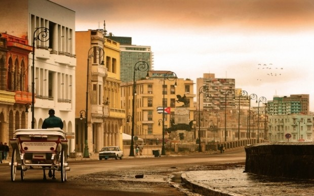

IDH: 0,815

Expectativa de vida no nascimento: 79,3

Anos de escolaridade: 10,2

Expectativa de anos de escolaridade: 14,5

PIB per capita: 19,844 dólares

### 45º Kuwait

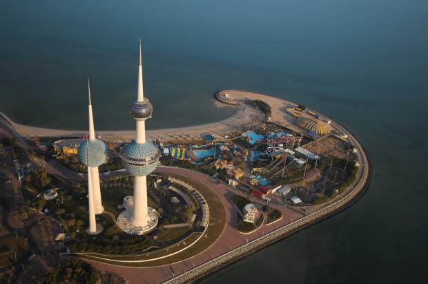

IDH: 0,814

Expectativa de vida no nascimento: 74,3

Anos de escolaridade: 7,2

Expectativa de anos de escolaridade: 14,6

PIB per capita: 85.820 dólares

### 46º Croácia

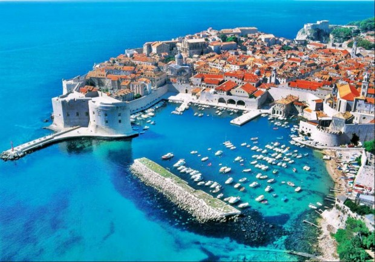

IDH: 0,812

Expectativa de vida no nascimento: 77,0

Anos de escolaridade: 11,0

Expectativa de anos de escolaridade: 14,5

PIB per capita: 19.025 dólares

### 47º Letônia

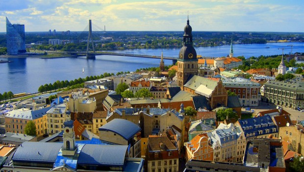

IDH: 0,810

Expectativa de vida no nascimento: 72,2

Anos de escolaridade: 11,5

Expectativa de anos de escolaridade: 15,5

PIB per capita: 22.186 dólares

### 48º Argentina

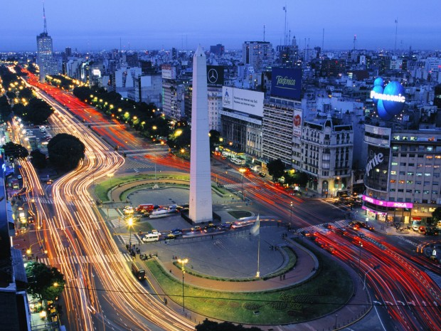

IDH: 0,808

Expectativa de vida no nascimento: 76,3

Anos de escolaridade: 9,8

Expectativa de anos de escolaridade: 16,4

PIB per capita: 17.297 dólares

### E o Brasil? 73º Brasil\*

IDH: 0,744

Expectativa de vida no nascimento: 73,9

Anos de escolaridade: 7,2

Expectativa de anos de escolaridade: 15,2

PIB per capita: 14.275 dólares

\*O Brasil não consta entre os países considerados pela ONU como desenvolvimento humano "muito alto”.

---

*publicado em 24 de Novembro de 2014, 22:00*
