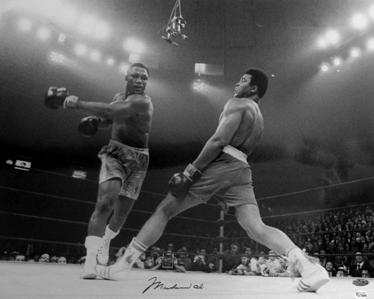
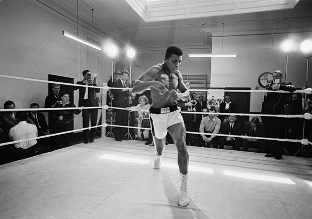
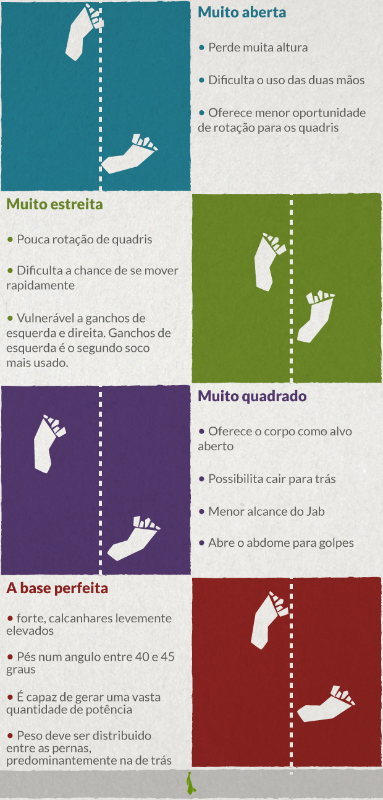
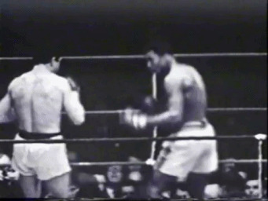

# Como dar o soco perfeito

  
  

Apesar de ser considerada uma habilidade de aplicação funcional para defesa pessoal, um soco vai muito além disso. Um soco bem feito é como um passo de dança milimetricamente ensaiado. Aqueles que observam de fora conseguem apenas visualizar o conjunto pronto, mas falham em captar o trabalho estrutural que existe na concepção do movimento.

Não vou me estender aos mais variados estilos de soco que existem, neste texto estamos abordando o clássico direto de direita do Boxe, que todos já viram alguma vez na vida.

### O segredo está na base

Ao longo dos anos de artes marciais que venho acumulando, escutei essa frase milhares de vezes, e para um soco, ela também se mostra verdadeira. Ao contrário do que a sabedoria popular acredita, um soco não é um golpe de mão, mas um movimento feito com as pernas, gerando força para ser transferida até o braço que praticamente só entrega o impacto. Um golpe lançado sem o trabalho de pernas raramente vai alcançar uma potência suficiente para causar um nocaute num adulto treinado.

A base precisa estar firme, pés na largura dos ombros, posicionados um na frente do outro, formando um ângulo entre 40 e 45 graus – é , a gente pensa nisso. Os pés ficam firmes mas com os calcanhares levemente erguidos, facilitando o deslocamento. O peso deve ser distribuído entre as duas pernas, com um pouco mais de peso na perna de trás. Assim é possível gerar maior potência, esquivar com facilidade e não acaba fragilizado caso alguém chute sua perna dianteira.

O soco será iniciado com o peso que está concentrado na perna de trás. O pé projeta o peso pra frente, rotacionando a ponta e gerando ainda mais potência. O pé de trás impulsiona, mas o da frente que se desloca com um curto passo em direção ao oponente.

Observe para onde está apontando o pé de Muhammad Ali. Antes apontava diagonal, agora direciona o movimento para frente.

### Use os quadris

Sempre dizem que lutadores fazem bons dançarinos e essa associação não surge atoa. Assim como na dança, na luta utilizamos os quadris como peça responsável pela transferência de energia entre as partes do corpo. Um bom dançarino necessariamente possui quadris leves e soltos, o mesmo se aplica ao mundo da luta.

Toda energia que foi gerada pela perna anteriormente precisa ser distribuída. Não basta apenas projetar o corpo com a perna e soltar o braço, precisamos combinar tudo para gerar o máximo de energia cinética. Assim, o pé inicia o trabalho que, transferindo potência para a perna, recebe o auxilio dos quadris e entrega a força ao braço. O giro iniciado pelos quadris é acompanhado pelo tronco e ombros, deixando tudo pronto para o braço fazer sua parte.

Como podemos ver na imagem abaixo, o corpo começa bem de lado, e termina ficando totalmente de lado. .

### Agora sim, o braço

No soco, nosso braço é como um vocalista de banda. Todos os integrantes tem importância crucial, mas o vocalista é quem acaba com recebendo o crédito pelo trabalho, por ser quem alcança o público mais diretamente. Assim é o braço, por ser quem faz o contato final, normalmente é associado ao bom resultado do soco, mesmo que o papel dele seja transmitir a mensagem coletiva, apenas somando forças ao resto do corpo.

Com toda energia carregada pelos ombros, o braço passa a se esticar, com uma ação similar a de uma mola aliviando sua pressão. É interessante observar que o braço não estica reto, mas mantém o mesmo movimento de rotação iniciado pelo pé, concentrando ainda mais energia. A mão que antes estava posicionada paralelamente ao rosto agora termina com o polegar quase virado para baixo, buscando que a área de contato do soco seja com os ossinhos dos dois primeiros dedos, o indicador e o médio.

Mostra pra eles, George St. Pierre.

Mesmo explicando e mostrando com imagens toda a execução do soco, fica claro que são necessárias inúmeras horas de prática para dominar a capacidade de unir todos os elementos, criando o máximo de eficiência. Pode até soar fácil quando pensamos em dar um soco no ar, mas quando estamos falando de uma luta com adversários se movimentando, barulho e infinitas variáveis, a coisa fica bem mais complicada.

É necessário também dizer que atualmente, mais que nunca, golpes são treinados por esporte, hobby e diversão, provavelmente nunca sendo utilizados para algo além disso. É extremamente perigoso tentar se defender, mesmo que seja um artista marcial com vários anos de treinamento. Nunca sabemos que tipo de armamento a outra pessoa está carregando e quais consequências uma simples briga poderá trazer. Então, chame um amigo, use luvas, pratique num saco de pancadas, mas não saia pela rua achando que é o novo Rocky Balboa.

O conjunto de todo trabalho corporal pode ser visto no belíssimo vídeo abaixo:

*[Link Youtube](https://www.youtube.com/watch?v=3pO7CNzAL8g)*

### Você gostaria de ensinar algo?

*“Deixa que eu faço” é a nova série colaborativa de textos mão na massa do PapodeHomem. A ideia é reunirmos pessoas dispostas a contribuírem com guias e tutoriais, ensinando a fazer as mais diversas tarefas, das rotineiras às inusitadas. Com o tempo, queremos ter um compilado com todo tipo de passo-a-passo, para tornar o PapodeHomem um espaço cada vez mais útil.*

*Pode se programar: toda sexta, um texto com um guia ensinando a fazer algo prático.*

*Tem alguma ideia? Manda pra gente no e-mail [deixaqueeufaco@papodehomem.com.br](http://www.papodehomem.com.br/como-dar-o-soco-perfeitomailto:deixaqueeufaco@papodehomem.com.br).*

*E, caso faça um dos tutoriais já publicados, põe a hashtag #deixaqueeufacopdh pra compartilhar com a gente. As mais legais a gente solta no [Instagram do PapodeHomem](http://instagram.com/papodehomem).*

---

*publicado em 14 de Novembro de 2014, 07:00*
