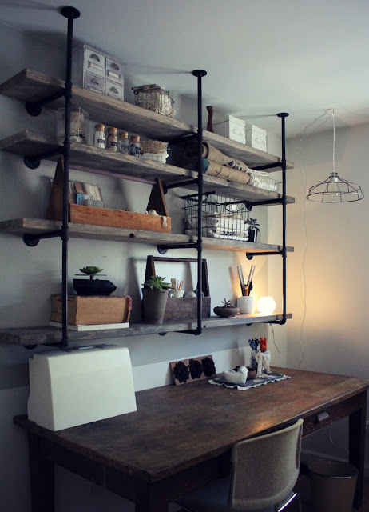
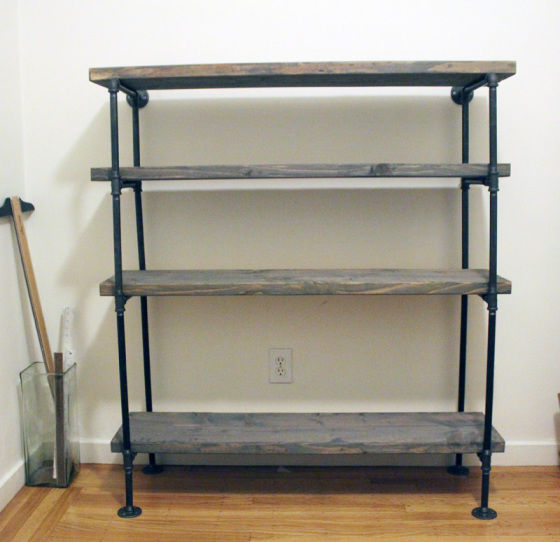
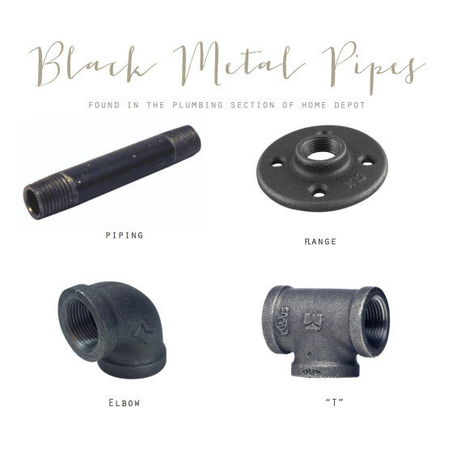
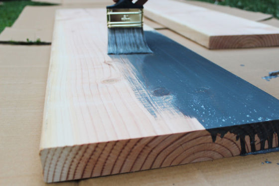
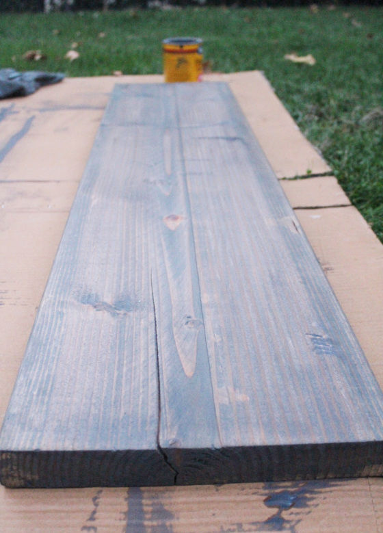
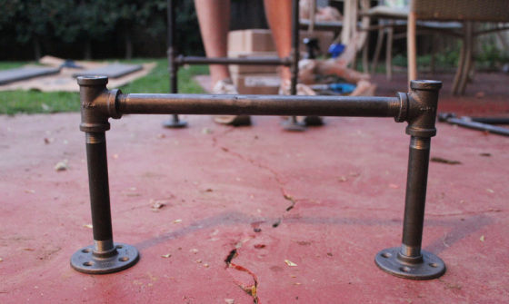
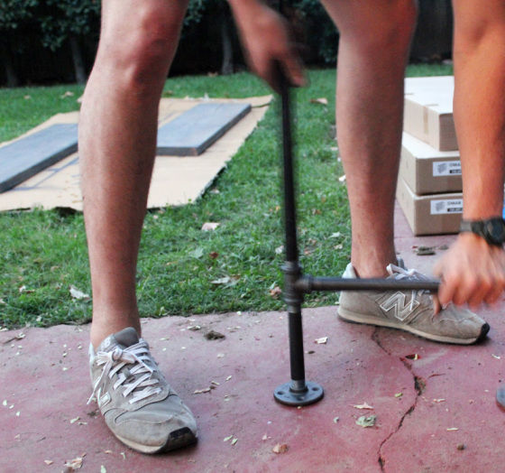
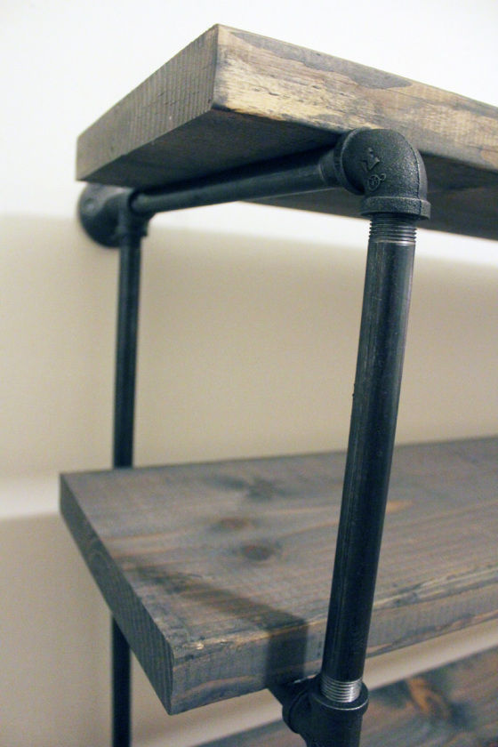
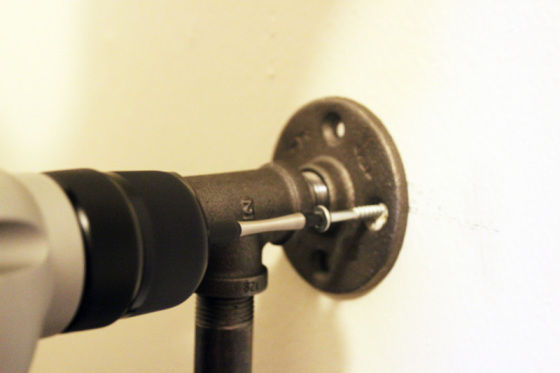
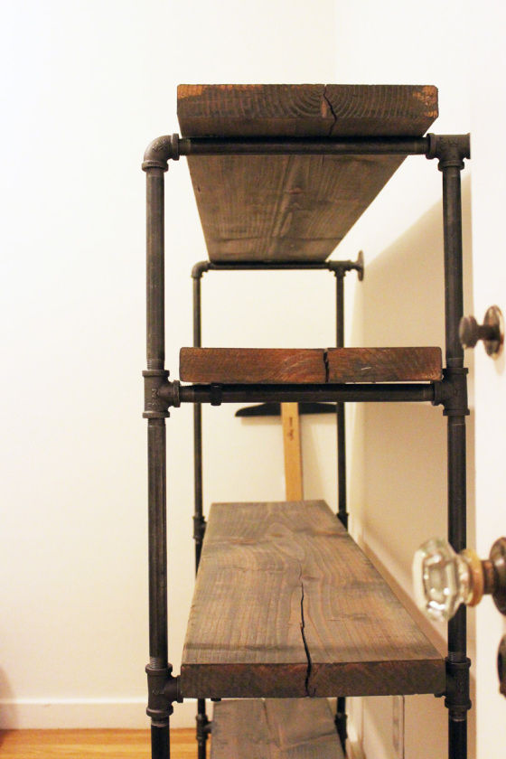

# Como fazer uma estante rústica com tubos de metal

Projeto simples e barato pra organizar suas coisas

Já publicamos aqui no Deixa que Eu faço um texto que mostrava [como construir uma mesa lateral usando tubos](http://www.papodehomem.com.br/como-fazer-uma-mesa-lateral-de-conduletes-e-eletrodutos). O mesmo princípio utilizado ali permite que você construa estruturas para outros projetos também, de forma bastante simples e versátil.

O projeto de hoje foi baseado em um outro, que coloca uma estante no teto, bem massa.

Vamos fazer aqui uma variação um pouco mais simples, mas nem por isso menos legal.

Os mesmos princípios dá pra utilizar pra construir a estante acima, caso você queira.

### Materiais

Esse é um projeto gringo e as medidas originais estavam em polegadas. No Brasil, usamos o sistema de metros, como você bem deve saber. Como aqui vamos ter de comprar bastante coisa em lojas de materiais de construção e, normalmente, as pessoas usam medidas em polegadas para esses materiais, resolvi deixar as medidas originais. Caso queira fazer as conversões, [pode usar qualquer conversor, como esse](http://www.convertworld.com/pt/).

Nem todo espaço é igual, então provavelmente você vai ter de fazer adaptações às medidas e quantidade de materiais.

Em primeiro lugar, você vai ter de medir a sua área, decidir o tamanho da estante e comprar os tubos de metal com rosca de 0.5". Para o nosso projeto, usamos esse comprimento:

- 2 tubos em 2"
- 4 tubos em 10"
- 4 tubos em 6"
- 4 tubos em 18"
- 12 tubos em 12"

Além disso, vamos precisar de:

- 4 T's de metal
- 6 flanges de metal
- 2 cotovelos (ou joelhos) de metal
- 2 tábuas de madeira não tratadas de 2" x 12" x 8' (96" ou aproximadamente 2,43m). Você vai ter de cortá-las pela metade para ter 4 tábuas de 4'.
- 1 lata de tinta para madeira

### Tratamento da madeira

É bom finalizar a madeira lixando e depois pintando. Use um pincel ou esponja para dar esse tratamento mais rústico.

Antes de secar, tire um pouco do excesso, para ela ficar com esse aspecto.

### Construindo a estrutura

O próximo passo é bem simples. Consiste em rosquear as peças em seus devidos lugares para montar a estrutura.

Não esqueça de limpar os canos antes de começar, eles devem vir bem sujos.

Outra possibilidade é pintá-los com spray, para dar um acabamento mais legal.

O toque final é furar a parede e parafusá-las para ganhar em estabilidade. Elas devem ficar bem sólidas e seguras dessa forma.

Finalmente, ela fica assim:

*“Deixa
que eu faço” é a série colaborativa de textos mão na massa do
PapodeHomem. A ideia é reunirmos pessoas dispostas a contribuírem com
guias e tutoriais, ensinando a fazer as mais diversas tarefas, das
rotineiras às inusitadas. Com o tempo, queremos ter um compilado com
todo tipo de passo-a-passo, para tornar o PapodeHomem um espaço cada vez
mais útil.*

*Pode se programar: toda sexta, um texto com um guia ensinando a fazer algo prático.*

*Tem alguma ideia? Manda pra gente no e-mail [deixaqueeufaco@papodehomem.com.br](http://www.papodehomem.com.br/como-fazer-uma-estante-rustica-com-tubos-de-metalmailto:deixaqueeufaco@papodehomem.com.br).*

*E,
caso faça um dos tutoriais já publicados, põe a hashtag
#deixaqueeufacopdh pra compartilhar com a gente. As mais legais a gente
solta no [Instagram do PapodeHomem](http://instagram.com/papodehomem).*

---

*publicado em 19 de Abril de 2015, 14:21*
