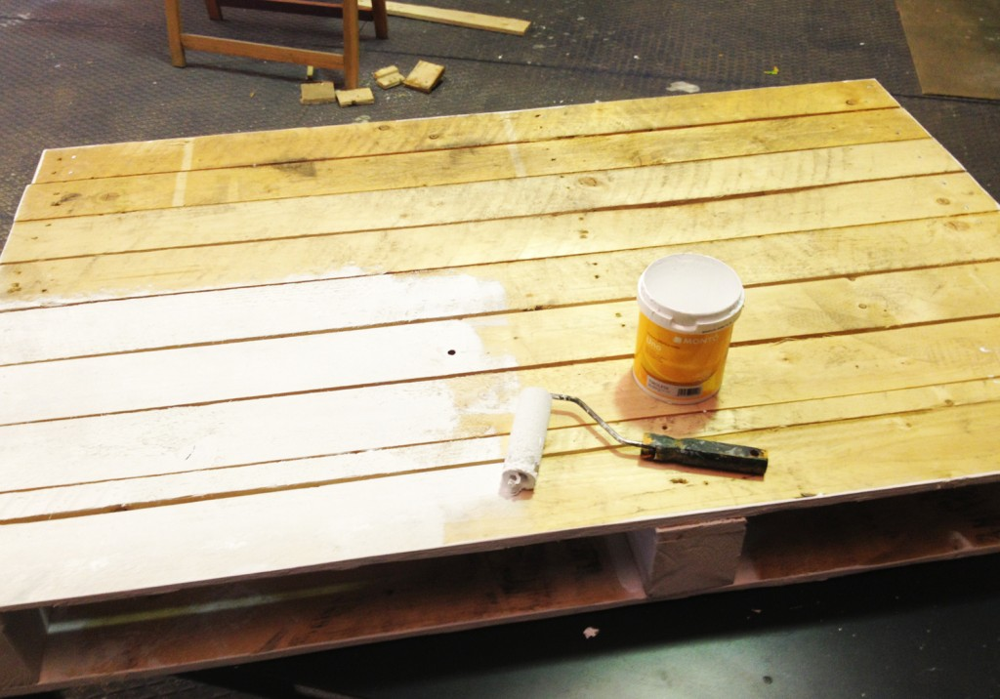
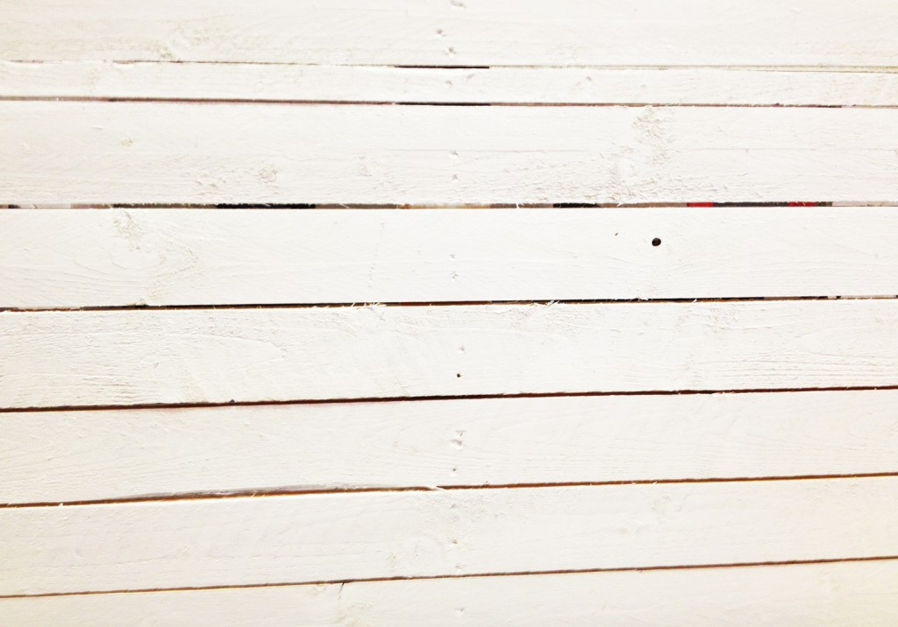
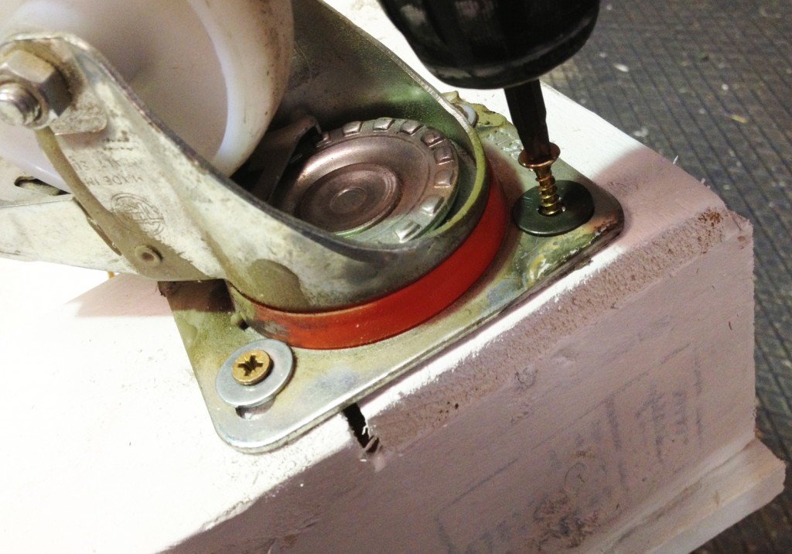
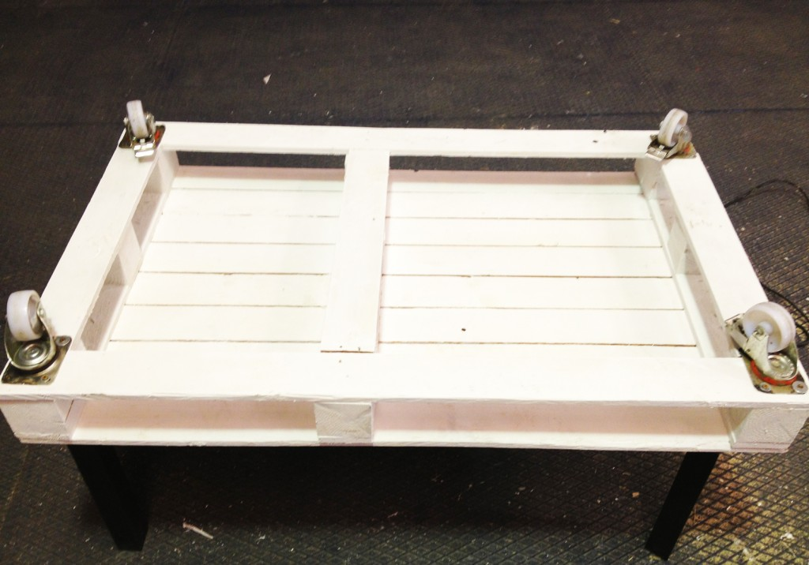
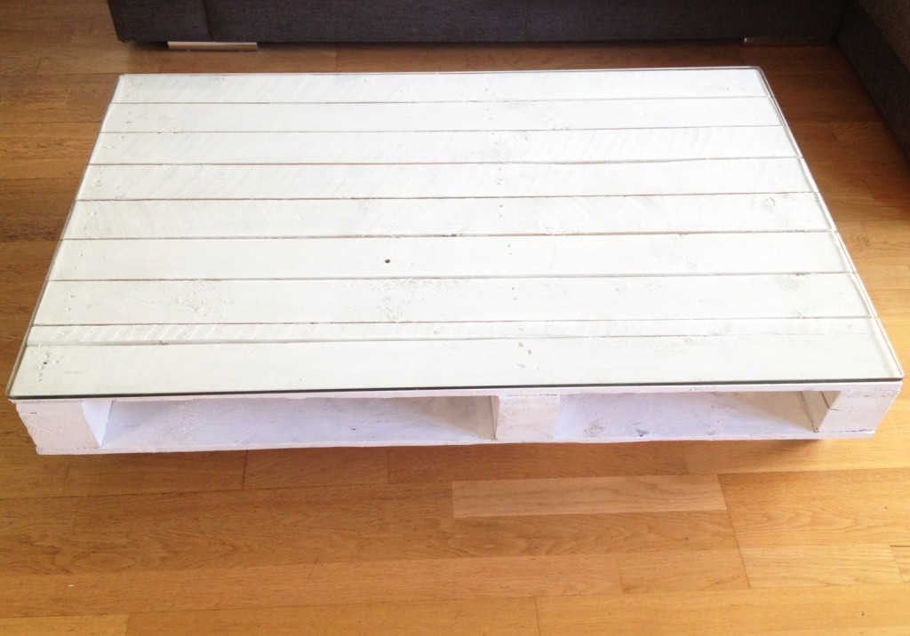
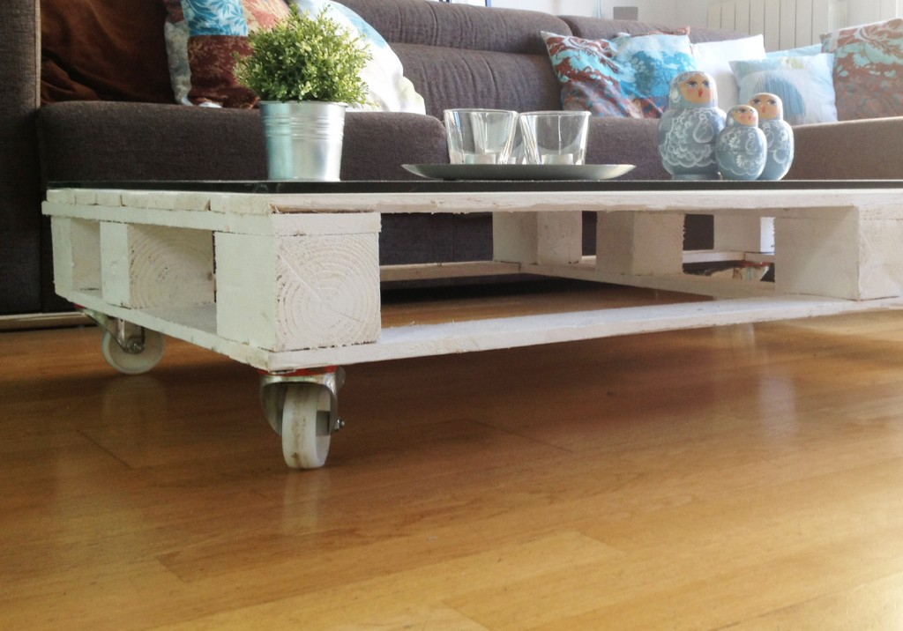
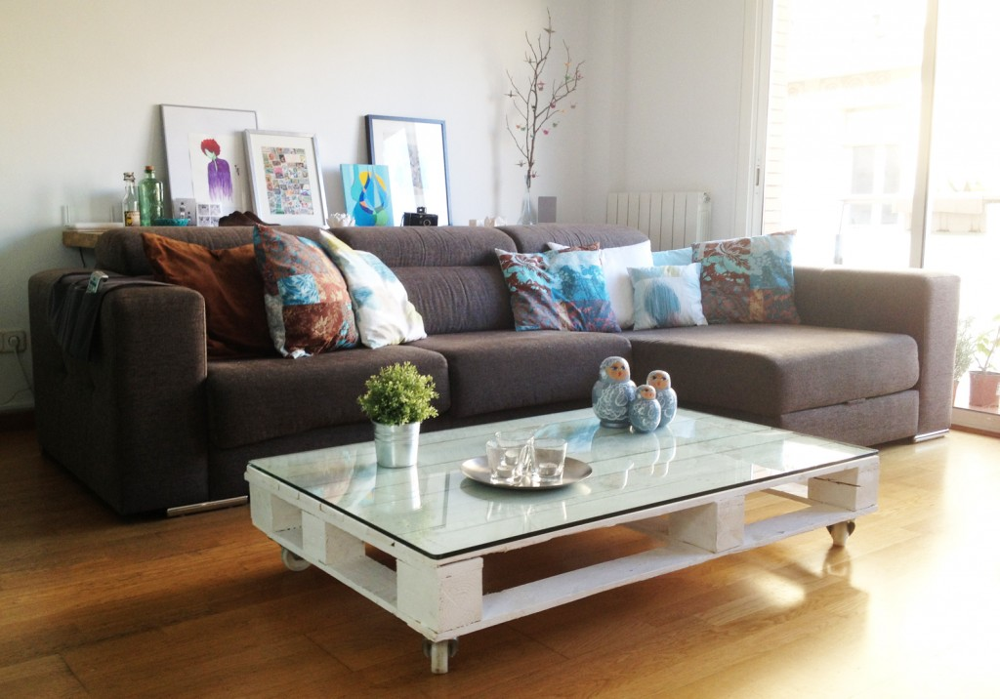

# Como fazer uma mesa de centro de pallet

Rápida e barata de fazer, a mesa de centro de pallet ainda por cima é bonita

Os pallets são uma espécie de matéria prima universal. Dá pra fazer de tudo utilizando-os como base para os seus projetos e, por sorte, há uma gama enorme de referências sobre isso pela internet.

Aqui um projetinho muito simples que ensina a fazer uma mesa de centro com rodinhas a partir de um pallet. Absolutamente sem segredo. [Vi aqui, ó](http://planb.annaevers.com/en/diy-mesa-pale/).

### Materiais

- 1 pallet
- 4 rodinhas parafusáveis ou pernas que você pode comprar em lojas de materiais de construção
- Parafusos
- Chave de fenda
- Pincel ou rolo
- Opcional: vidro no tamanho do pallet
- Se quiser, finalize com verniz fosco, ajuda a fazer durar mais

### 1. Lixe o pallet para remover farpas e suavizar a superfície, depois pinte

Passe uma ou duas demãos, dependendo de como preferir o acabamento.

Deixe secar bem

### Parafuse as rodinhas (recomendo uma parafusadeira, pra não passar o dia inteiro fazendo isso)

### Acabamento opcional: coloque um vidro em cima

Eu acho que dá um efeito bem legal e ajuda a proteger o pallet em caso de acidentes, como um eventual derramamento de café ou coisa do tipo.

*“Deixa que eu faço” é a série colaborativa de textos mão na massa do PapodeHomem. A ideia é reunirmos pessoas dispostas a contribuírem com guias e tutoriais, ensinando a fazer as mais diversas tarefas, das rotineiras às inusitadas. Com o tempo, queremos ter um compilado com todo tipo de passo-a-passo, para tornar o PapodeHomem um espaço cada vez mais útil.*

*Pode se programar: toda sexta, um texto com um guia ensinando a fazer algo prático.*

*Tem alguma ideia? Manda pra gente no e-mail [deixaqueeufaco@papodehomem.com.br](http://www.papodehomem.com.br/como-fazer-uma-mesa-de-centro-de-palletmailto:deixaqueeufaco@papodehomem.com.br).*

*E, caso faça um dos tutoriais já publicados, põe a hashtag #deixaqueeufacopdh pra compartilhar com a gente. As mais legais a gente solta no [Instagram do PapodeHomem](http://instagram.com/papodehomem).*

---

*publicado em 03 de Abril de 2015, 21:49*
