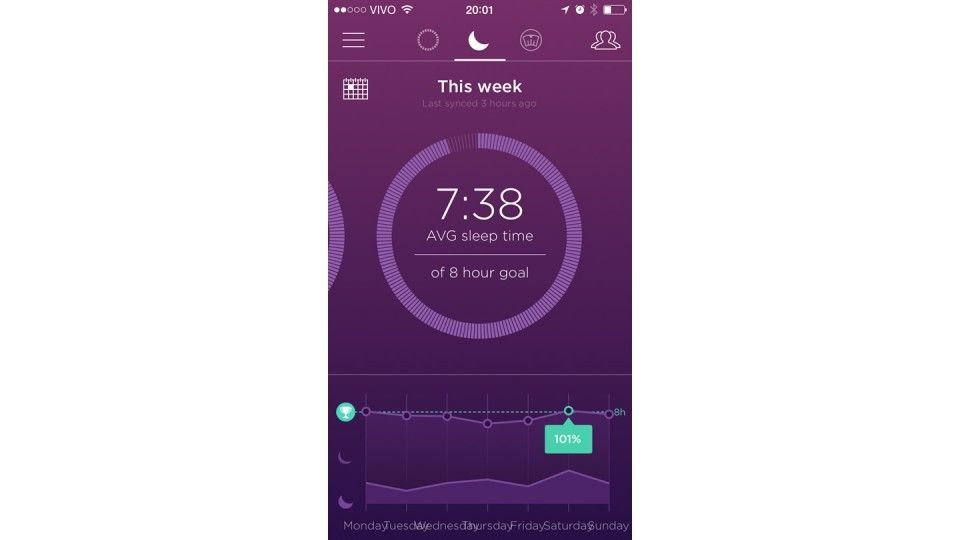
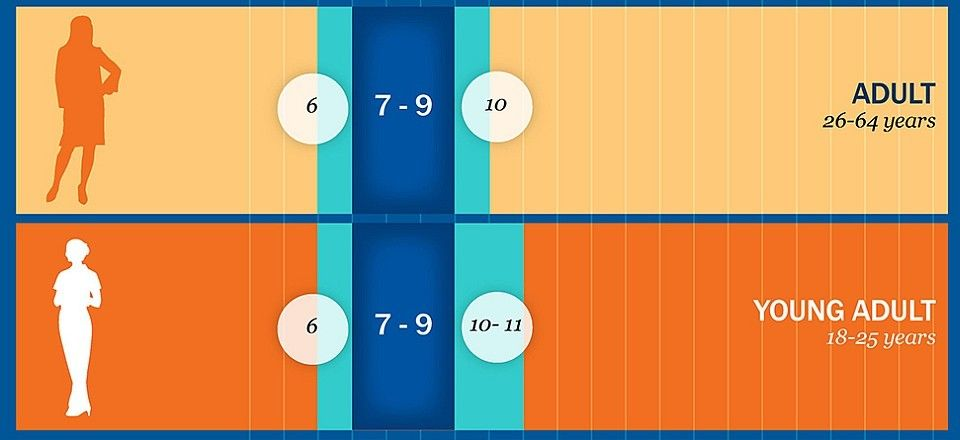
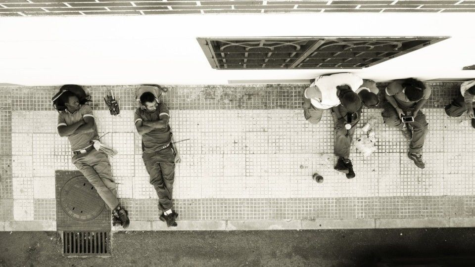

# Dormir é o melhor lifehack para a sua produtividade

Enquanto tem gente que prega noites em claro para produzir mais, que tal dormir certo para produzir melhor?

“Produtividade” é algo que todos buscamos. Executar mais tarefas com mais facilidade – quem pode não querer isso? Na busca pela otimização quase sempre recorremos a incrementos: se eu passar a fazer isso, produzirei mais; se comprar esse equipamento, trabalharei com mais conforto. Mas e se o contrário se apresentar como um caminho? E se, para produzir melhor, você precise produzir *menos*?

Uma coisa que nunca entendi é a ideia de madrugar em cima de um projeto. Ou estudando. Entendo a glamourização do ato, como quando Tim Cook [escreveu no Twitter](https://twitter.com/tim_cook/status/574910443413622785) ter dormido um pouco mais que o habitual para um grande dia, até as… 4h30 da manhã. De fato, dormir pouco faz com que pareçamos mais importantes e reforça a ideia de trabalho duro, mas não é sinônimo de produzir melhor. Com frequência, troca-se qualidade por quantidade, o que não é interessante em muitas áreas.

Quando minhas pálpebras ganham vida própria, o foco passa a se perder com facilidade e para continuar é preciso recorrer a líquidos baseados em cafeína, algo está errado. Eu estou no lugar errado. Deveria estar em uma cama, não trabalhando.

Recentemente assisti a uma [animação do TED-Ed](https://youtu.be/gedoSfZvBgE) que explica os benefícios cognitivos do sono. Em outras palavras, por que vale mais a pena tirar a noite véspera de uma prova ou de uma apresentação importante para dormir em vez de estudar ou ensaiar:

Domingo passado comecei a experimentar a rotina de 8h de sono por noite. Não foi muito difícil – costumo dormir em torno disso –, mas levei a meta a sério e programei não um, mas *dois* alarmes. Além do da manhã, configurei um para a noite também, a fim de me avisar a hora de ir para a cama.

Funcionou, como mostram as estatísticas de sono da [Shine](http://www.manualdousuario.net/misfit-shine-review/):

Tela do app da Misfit com minha semana de sono

Em busca das 8h de sono diárias

A Fundação Nacional do Sono, dos EUA, divulgou recentemente uma [nova tabela de períodos de sono recomendados](http://sleepfoundation.org/how-sleep-works/how-much-sleep-do-we-really-need) de acordo com a idade. Adultos e jovens adultos (dos 18 aos 64 anos) se inserem na faixa entre 7 e 9h de sono por noite. Parece-me um número satisfatório e está dentro daquele senso comum, de que precisamos de 8h de sono por noite.

Gráfico mostrando as horas de sono recomendadas para adultos | Fonte: Fundação Nacional do Sono

Entrar nesse ritmo exige disciplina. Às vezes não se está com sono na hora em que é preciso dormir a fim de acordar a tempo dos compromissos do dia seguinte chegando às desejadas 8h de sono. O lance é ir para a cama assim mesmo. Uma hora, salvo se houver outras forças agindo contra (insônia, preocupações etc), o sono vem. E, claro, existem ações que podem ser feitas com antecedência para ajudar.

Uma dica legal, que me ajuda sempre, é ativar o modo “não perturbe” do celular. iPhone e Android têm, e no meu deixo ele sempre configurado. Quando durmo em outros horários (vide abaixo), ativo manualmente o “Não Perturbe” do iOS. No Android, quem já tem a última versão do sistema pode ativar o [Modo Prioridade](http://www.manualdousuario.net/android-estrela-prioridade/); os demais, instalar o [Nights Keeper](https://play.google.com/store/apps/details?id=com.nightskeeper).

Outra dica bastante útil é fazer um bloqueio acústico do ambiente. A vida na cidade, especialmente em prédios, pode ser um tanto barulhenta – uma hora é o vizinho que resolve cozinhar de madrugada, em outra, alguém conversando na calçada altas horas da noite, sem falar nos cachorros da vizinhança. Aqueles mesmos sons que [ajudam a se concentrar no trabalho também auxiliam na indução do sono](http://www.manualdousuario.net/musica-concentracao-trabalho/) — o barulhinho de chuva é muito convidativo a uma noite bem dormida.

No iPhone, alterno entre os apps [Noisli](https://itunes.apple.com/br/app/noisli/id862773459?mt=8) (US$ 1,99) e o da [Misfit](http://misfit.com/products/app), que tem essa função nativa e é gratuito. O Android tem, além desse último, um punhado de outros. Dos que testei recentemente, gostei do [Rain Sounds](https://play.google.com/store/apps/details?id=net.metapps.watersounds) (grátis).

### Quando 8h não são o bastante

Pessoas dormindo na calçada | Foto: Calvin Smith/Flickr

Como disse, eu já vinha dormindo esse tanto, ou algo próximo, há muito tempo. Meu relógio biológico, nesse sentido, é bastante regulado; mesmo em feirados e nos fins de semana, sem a ajuda de um despertador, acordo cedo. E isso não parecia ser o bastante, já que no meio da tarde quase sempre sentia um cansaço enorme.

Foi pensando nisso, antes de começar meu experimento mais rígido, que lembrei-me de outra recomendação praxe: a *siesta*.

Você já deve ter lido em algum lugar que Grandes Nomes da História™ tinham esse hábito em comum. [Esta matéria de 1999](http://veja.abril.com.br/260599/p_076.html) da Veja diz que Napoleão Bonaparte, Albert Einstein, Winston Churchill, Thomas Edison, Salvador Dalí, John Kennedy e Leonardo da Vinci tiravam, todos, aquela soneca depois do almoço.

Por que a soneca pós-almoço é tão útil? Segundo [Renata Federighi](http://www.duoflex.com.br/blog/sono/hora-da-sesta-porque-dormir-apos-o-almoco-faz-bem-a-saude/), consultora de sono de uma fabricante de travesseiros, porque “é o período em que o corpo está relaxado e o cérebro está trabalhando com maior lentidão, já que durante a digestão parte do fluxo sanguíneo é desviado para o estômago, moderando a capacidade de sangue em outras áreas como o cérebro e os músculos.”

Ok, parece fazer sentido, então instituí mais esse período de sono à minha rotina, concomitantemente à missão de dormir no mínimo 8h por noite. Em [vários](http://www.cotiatododia.com.br/hora-da-sesta-porque-dormir-apos-o-almoco-faz-bem-a-saude/) [locais](http://www.minhavida.com.br/bem-estar/materias/12741-dormir-apos-o-almoco-faz-bem-a-saude) [li](http://obutecodanet.ig.com.br/index.php/2009/06/05/quem-diria-soneca-apos-o-almoco-pode-mudar-sua-vida/) que a duração máxima desse sono pós-almoço deve ser de 30 minutos, caso contrário ou algo está errado contigo, ou você cai no sono profundo, o que gera efeitos contrários aos esperados e ainda atrapalha o sono noturno daquele dia. Então, ok.

E… bom, faz pouco tempo que venho dando essa atenção maior e preventiva ao meu sono, em vez de tentar manter-me acordado quando ele bate no meio do dia. Mesmo considerando a hipótese de um efeito placebo estar agindo, sinto-me melhor disposto no período da tarde e essa sensação adentra a noite — até a hora de ir para a cama, claro. No mínimo, os resultados iniciais me animaram a continuar.

Nosso ritmo circadiano é implacável; ele não se curva, ou se adapta, às demandas contemporâneas. Em vez de brigar com a natureza em nome de uma produtividade que não faz muito sentido se vista de longe, com a mente aberta (e descansada!), resolvi aceitar meu sono, encará-lo como uma necessidade, e não um entrave, e me deixar dormir quando preciso. Até agora, pelo menos, tem funcionado.

**Nota do Editor:** Este post foi publicado originalmente no [Manual do Usuário](http://www.manualdousuario.net/dormir-produtividade-lifehack/), um blog de tecnologia que não tem notícias, nem rumores, e que não faz click baiting. Em vez disso, veicula menos posts sobre assuntos mais profundos. Vale a pena conhecer.

---

*publicado em 16 de Abril de 2015, 12:25*
