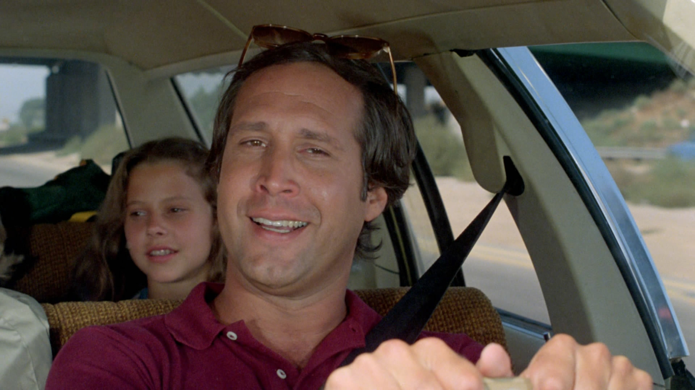

# Finanças pessoais para quem não quer economizar no cafezinho

Quais pequenas coisas podemos fazer para economizar sem nos privar de viver as pequenas coisas gostosas?

Um pouco por conta do interesse particular, outro pouco por conta da profissão, acabo consumindo muita informação sobre finanças pessoais. Gasto um bocado na livraria, mensalmente, e invisto muitas horas pesquisando sobre o que está sendo falado sobre isso na internet. Encontro muita abobrinha e muita coisa boa.

Dentre o que encontro de bom, o desafio é peneirar o que não é mais do mesmo.

### Entre o perdulário e o pão-duro existe um mundo

Corta o café?

Tem quem ache que economizar no cafezinho é o segredo para o primeiro milhão, e tem quem não ligue de gastar 100 reais por semana na banca de jornal. Para alguns, roupa só serve para cobrir o corpo, para outros faz sentido comprar um sapato de 700 reais.

Nosso desafio é encontrar nosso lugar entre os extremos e, para isso, precisamos entender o que é importante e o que está lá só para aplacar o tédio, ou só porque em certo momento fez sentido e desde então nunca foi questionado.

Além disso, nunca falamos só de dinheiro quando falamos sobre dinheiro. Muitas vezes, falar sobre dinheiro é falar sobre tempo, qualidade de vida, disponibilidade, espaço mental, escolhas e outros inúmeros fatores com os quais lidamos todos os dias.

### Na prática

Recentemente, numa das andanças por um fórum de discussão, encontrei um tópico interessante que listava maneiras de economizar. Os participantes da conversa se alternavam entre “putz, que boa ideia!” e “meu deus, que muquirana, isso não é vida”. Os comentários antagônicos muitas vezes se referiam a mesma prática.

Para alguns, carregar garrafinha d’água (ao invés de comprar na rua) é uma economia interessante. Para outros é absurdo. Alguns, que acharam um disparate carregar a garrafinha, veem como uma boa usar o Waze para encontrar o posto de gasolina mais barato – mesmo a economia sendo menor do que a da garrafinha.

Vou listar alguns itens que surgiram por lá e seguimos com a discussão nos comentários. São itens interessantes, não necessariamente bons, éticos ou vantajosos. Tomei a liberdade de reproduzir e comentar algumas justificativas dadas pelos autores. Algumas são cômicas.

Além de opinar, te convido a observar sua própria reação ao ler os itens. Você vai perceber que alguns te deixam desconfortável, e outros parecem uma boa ideia, e que isso pouco tem a ver com o montante financeiro atrelado, ou com qualquer outro motivo estritamente racional.

### Estoque de presentes

> Sempre que houver uma promoção de presentes genéricos (livros, perfumes, vinhos) ou se você estiver vindo de fora com espaço, aproveite pra comprar e criar um estoque. Bebidas de free shop são um ótimo presente e quem bebe acaba usando, vale a pena estocar. Idem para pequenos presentes de natal, dia das mães, dia dos pais etc.  
>   
> Assumindo que uma pessoa gasta R$50 com bebidas por semana (ex. 1 garrafa de vinho + um pack de cervejas) e R$200 com presentes por mês, e assumindo que, comprando em estoque, você economiza tranquilamente 20% desses valores, **a economia anual chega a R$960**.

Sendo bem transparente, essa me incomoda bastante. Costumo comprar poucos presentes, mas gosto do ritual de escolher um para aquela ocasião, para aquela pessoa. Prefiro encarar a situação de chegar em algum lugar de mãos vazias, do que chegar com um presente que serve pra Maria, pro João, pro Pedro e pra qualquer outro ser humano.

Por outro lado, eu fico feliz quando ganho um vinho ou uma cerveja boa. Coloco na geladeira e não ligo muito se ela foi comprada pensando em mim.

### Barba (e outros cuidados pessoais)

> Se você não tem muita barba, não precisa comprar creme de barbear. Basta usar o condicionador.

(pensamentos que surgiram por aqui: “não faça isso, meu filho”, “meu deus, que absurdo”, e, por último, “não faça a barba”).

Há pouco tempo eu descobri que o mundo dos shampoos e condicionadores é algo complexo e nebuloso. Existem potinhos preciosos que custam mais de 100 reais, e existe tralha que não devia nem ser vendida. Eu sempre oscilei entre lavar com sabonete ou com shampoo de 6 reais, não por pão-durisse, mas por ignorância. Atualmente achei um meio termo que me fez gostar do cabelo crespo. São 25 reais bem gastos, na minha opinião.

Um ponto comum, que sempre surge entre as meninas, é a manicure. Os depoimentos vão desde “pra mim é tranquilo ir a cada 15 dias”, até “se eu não faço, minha semana não começa”. Mais do que a unha feita, entra aqui uma sensação gostosa de estar vivendo um momento de cuidado e zêlo consigo mesmo.

Estou escrevendo este texto sentado em um café e perguntei para 3 mulheres o quanto elas gastavam a cada vez que iam na manicure. Uma falou 15 reais, a outra 20, e a outra 35. A moça que paga 35 mora na mesma região da moça que paga 20. Elas trocaram contato.

### Motorista paciente

> Ando cerca de 3000 km mês, então a dica que eu dou é... procure saber a velocidade que seu carro se torna econômico... o que eu ando se mostra econômico até os 100 km/h, o que da uma média de 14 km/l, se eu empurrar o pé e ficar andando a 120 - 130 ele faz 11 km/l.  
>   
> Nas minha contas com gasolina a 2,85 rodando 3000 km, diminui o gasto +- em 166 reais por mês, o que da quase 2000 reais por ano, só de gasolina.  
>   
> E, no final das contas, se eu andar a 120-130, além do risco ser bem maior, na prática eu economizo de 15 a 20 minutos por viagem, em um percurso de 230 km. Ou seja, é melhor ser paz e amor nas estradas.

Só o último parágrafo já seria um bom motivo para achar a “velocidade econômica”.

Esse é um movimento bem comum: já que optamos pelo carro, que é a opção cara, enfiamos o pé na jaca e desprezamos todas as maneiras de gastar menos. Dá para se beneficiar do conforto do carro sem gastar tanto.

O mesmo acontece na nossa alimentação. É bem comum tirarmos um sarro de quem pede um lanche gorduroso e um suco. Vale apenas pela piada, já que racionalmente a chacota não faz sentido. Entre pedir um lanche gorduroso e um refrigerante e um lanche gorduroso e um suco, a segunda opção prejudica muito menos.

Ainda na esfera automobilística, na ânsia de economizar, tem gente que vai além:

> Você pode comprar um daqueles rastreadores com bloqueadores que vendem no Mercado Livre e instalar no carro. Ai não precisar pagar seguro. Esses rastreador com bloqueador são muito bons, tem corta combustível, sensor de movimento, sirene, um monte coisa, não precisa ficar pagando seguro a toa

Muito risco (e pouca praticidade) para meu gosto.

### Dia de penitência

Ninguém gosta de ligar para a operadora de celular, para o provedor de internet, ou para a empresa que oferece TV a cabo. São horas e horas de musiquinha irritante, atendentes despreparados, enrolação, menus numéricos confusos. Tudo meticulosamente preparado para que você continue pagando o plano mais caro, inadequado para seu padrão de consumo.

Abaixo, o conselho do participante da discussão:

Todo plano funciona mais ou menos assim:

> . 1 ano de contrato;  
>   
> . 6 a 12 meses de valor promocional;  
>   
> Ao final desse um ano, você com certeza vai estar pagando mais caro que outros planos (da própria operadora ou concorrência). Então, sempre que fechar um plano, já marque no calendário um ano depois.   
>   
> Faça uma pesquisa, peça pra mudar e cancelar, vão te oferecer algo bem melhor. Valores abaixo da minha última renegociação com a NET, além de pagar menos a internet ficou mais rápida e me deram mais canais  
>   
> Internet + TV + tel: R$ 200,00  
>   
> Renegociado: R$ 129,00  
>   
> Diferenca anual R$ 852,00

Eu estenderia o conselho: vale tirar um dia para reavaliar TODAS as assinaturas que possuímos. O exemplo acima envolve apenas um dos serviços, e já resultou em R$ 852 reais. Facilmente você perceberá que, jogando num intervalo de um ano, é comum chegar a uma valor bem expressivo, sem abrir mão de praticamente nada.

Para deixar a coisa mais interessante, faça a conta inversa. Supondo que você gastou 4 horas para deixar tudo no jeito, e que economizou R$ 1200 no ano por conta disso, grosseiramente falando, seu valor-hora foi de 300 reais. Nada mal.

E você?

Como citei no começo do texto, a ideia aqui não é julgar ou buscar coerência.

Com o espaço aberto, deixo a pergunta: falando de finanças pessoais, o que você costuma fazer por ai, que não é lá muito racional –  e que as vezes dá um pouco de vergonha de contar –, mas que gera uma economia interessante?

Seguimos o papo nos comentários.

### Mecenas: [SUBWAY® – Baratíssimo](http://pdh.co/subwaymecenas)

*Nos encantamos tanto com coisas caras e exóticas e acabamos nos esquecendo que algumas das melhores coisas da vida não custam nada, ou são bastante acessíveis.*

*[Os restaurantes da SUBWAY®](http://pdh.co/subwaymecenas) servem, todos os dias o Baratíssimo de Frango, fresquinho e gostoso pra você lembrar que as coisas boas da vida não precisam custar caro.*

---

*publicado em 06 de Abril de 2015, 00:00*
