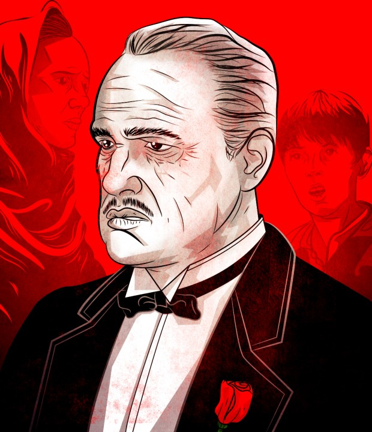
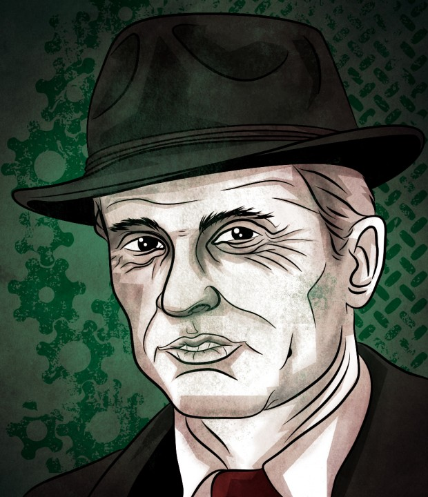
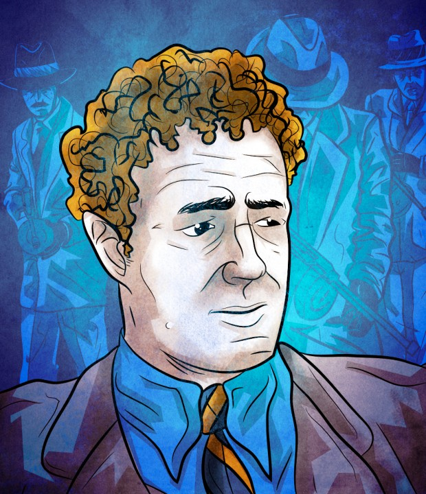
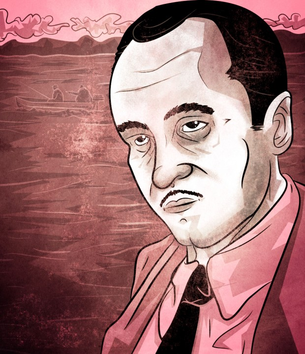
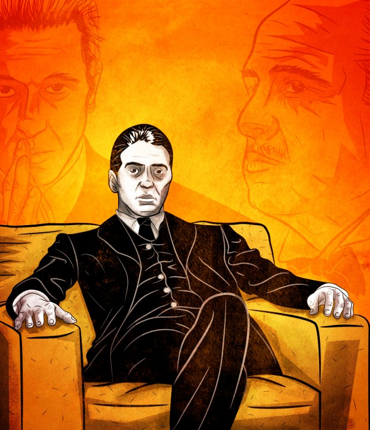
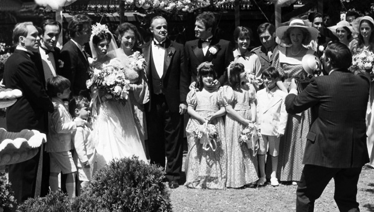

# O Poderoso Chefão: nem tão poderoso assim (ou o perfil psicológico da família Corleone)

  
  

***Nota do Editor:** se você nunca viu os filmes da trilogia O Poderoso Chefão, pare tudo e assista. Só depois volte. O texto contém spoilers e não fará nenhum sentido sem isso.*

A música tema do filme *O Poderoso Chefão* está no inconsciente coletivo. Ela é capaz de paralisar a respiração por uns segundos num tom que mistura ternura e terror.

*[Link Youtube](https://www.youtube.com/watch?v=GOA3WYeFpnY) | Vale dar o play para seguir a leitura*

Era esse o clima na casa dos Corleones quando inicia o primeiro filme da saga. Os primeiros trinta e cinco minutos do filme revelam toda a teia delicada de relações que se desdobrará pela trilogia.

O casamento da filha de Don Corleone ([Marlon Brando](http://pt.wikipedia.org/wiki/Marlon_Brando)) é o cenário propício para as conversas ao pé do ouvido com o *Godfather*. Ali, na sala reclusa, as decisões de vida e morte são tomadas num clima quase confessional. **Parece que todo o bem e a justiça do mundo são possíveis ao fazer apelos emocionados ao padrinho.**

Paralelamente, a nova namorada do filho caçula, Michael Corleone ([Al Pacino](http://pt.wikipedia.org/wiki/Al_Pacino)), é apresentada àquela aconchegante família. Ela acha tudo inabalável, acolhedor e quase indestrutível, mas ao longo da trama começa a perceber que não era uma família como as outras.

Ela será a pessoa que testemunhará como os Corleones lidam com a falta de lealdade de seus amigos e qual o alto custo emocional (e moral) do tipo de "serviço" que prestam para sua comunidade.

### Don Vito Corleone

A saga do pequeno Vito começou num mar de violência, bem retratada na segunda parte da trilogia. O menino indefeso testemunha o assassinato a sangue frio da mãe, durante uma tentativa de vingar a morte do marido. Obra de um antigo chefe de máfia siciliana.

Essa violência brutal certamente marcaria o *modus operandi* do *Godfather.*Essa falta primária associada a outras circunstâncias de vida pode virar o norte das escolhas de uma pessoa. É como se durante toda a vida ele tentasse reparar a perda e o vazio, usando o discurso da justiça para explicar as ações criminosas posteriores.

Já deportado para os Estados Unidos, aquele garoto descobre as sutilezas da criminalidade de Nova York e ali acontece o passo decisivo. Para se tornar Don Corleone, ele entendeu que era preciso certa influência emocional e troca de favores difíceis entre as pessoas. Essa sensação de débito era mais eficaz que o medo, a ameaça e a violência.

A agressão pode surgir depois e não antes de uma negociação.

Sua busca obsessiva por manter todos os filhos por perto é a marca de Corleone. Sem que o perceba, ele tenta ser o pai onipresente para todos. É possível imaginar uma tentativa inconsciente de não deixar ninguém desamparado como se sentiu por toda infância. Curiosamente, encarna também o imaginário da mãe que faltou, em seu tom afável e quase maternal.

No pano de fundo de Don Vito Corleone pode-se entrever um homem altamente fragilizado e temeroso de perder a importância que exerce sobre os outros. O bando de seguidores que o cercam garantem que ele seja o deus-sol no qual orbitam todos os filhotes.

Sem os afilhados o que seria do padrinho?

### Tom Hagen, o adotivo *consigliere*

consigliere

famiglia

O personagem de [Robert Duvall](http://pt.wikipedia.org/wiki/Robert_Duvall) sempre teve minha especial atenção, pois mesmo não tendo sangue italiano, foi adotado pela família. Ele é o (conselheiro) e age como um tipo de mentor e homem dos assuntos burocráticos da . Advogado de formação, conhece bem os trâmites da jurisdição americana e transita com discrição e total autocontrole nos meios políticos e criminosos.

Ele é o cara que dá os encaminhamentos das ações crimino..., ops, dos favores dos Corleones.

É o típico comportamento do homem engravatado que se exime da responsabilidade. Tal qual [Adolf Eichmann](http://pt.wikipedia.org/wiki/Adolf_Eichmann), que administrou o departamento nazista responsável pelas execuções genocidas, ele usa a linguagem de escritório para despachar o serviço sujo e faz parecer que apenas deu seguimento à uma papelada.

Sua expressão inabalável que mistura o leve sorriso com um cinismo inteligente faz dele uma peça chave e discreta na engrenagem corleônica, afinal, os demais filhos estão sempre se divertindo e usufruindo das vantagens da riqueza mafiosa. Tom não se dá essas regalias. Está sempre agindo seriamente, no epicentro das decisões, induzindo o leme para lá ou para cá, quase imperceptível, acobertando provas para fazer os assassinatos e negociações serem bem sucedidos.

Ao deitar a cabeça no travesseiro, essa seriedade deve isentar sua consciência de grande parte da violência exercida. "Apenas sigo ordens", deve ser o que o mantra que o alivia de noites mal dormidas sob o peso da consciência.

Nada inovador se comparado ao que se vê em qualquer empresa.

### Sonny

Don Corleone sabe o primogênito que tem. Dono de um gênio impulsivo, sexualizado e reativo, nunca é colocado na linha de frente das decisões. Em várias ocasiões é possível ver o cuidado exagerado ao aproximar "Sonnito" de um problema, para que não seja explosivo e inadequado.

Numa cena em meio a uma negociação o pai dá uma indireta a ele, dizendo:

> "Um homem que não se dedica à família nunca será um homem de verdade."

O pronome possessivo faltou ali propositalmente. **Não é dedicação exclusiva à sua família nuclear, mas à *famiglia*.**

Mas Sonny ignora todas as regras possíveis e age sempre com violência extrema, mesmo em impasses banais. É o esquentadinho da família e sempre recebe uma repreensão dura e falsa, por ser permissiva.

Como todo garoto-problema, ele é o bode expiatório da cólera sempre prestes a estourar presente entre todos, coisa muito comum em qualquer família. A manifestação que repercute é sempre a do louco que diz aquilo que todos pensam, mas se acovardam para aparentar seus bons modos perante o clã.

Toda vez que se sente afetado em seus mimos, quer reagir e se deixa cegar pela raiva justiceira. Nada efetivo. Morre metralhado numa emboscada até certo ponto previsível.

### Fredo

Fredo é o filho do meio de Vito e costuma agir como se estivesse alheio ao negócio. Naquela cena clássica em que Don Corleone é baleado, Fredo é incapaz de fazer a guarda do pai e mal consegue segurar a arma na hora de contra-atacar.

Seu pai conhece o caráter indolente e covarde do filho. E, por esse motivo, poucas vezes deixa algo sob suas ordens. No segundo filme isso é atestado pela traição à Michael.

Essa fraqueza perante o clã tem um efeito colateral que eu chamaria de *"síndrome de Príncipe Charles"*. Apesar de ser um dos possíveis herdeiros naturais de um império, não tem prestígio ou consistência para colocar as coisas no lugar.

Como represália inconsciente, reage ao pai com um comportamento passivo-agressivo, ao se perder distraidamente com bebida, drogas e jogo.

Internamente, nunca teria coragem de enfrentar o peso da relação paterna e por isso volta toda sua violência contra si mesmo, para ser percebido como incapaz. Se pudesse, Fredo diria:

> **"Se não posso ser o herdeiro da força, pelo menos quero ser o predileto de sua piedade."**

### Michael Corleone

Logo que conta para sua futura esposa uma história de tortura envolvendo [Luca Brasi](http://pt.wikipedia.org/wiki/Luca_Brasi), que tentou obter uma vantagem perpetrada pelo seu pai, ele diz:

> "Essa é minha família, Kay, não eu!"

Porém, o caçula querido, que tentou fazer uma rota oposta ao ser condecorado como herói de guerra, caiu sob a maldição da *famiglia*.

Dono de um desejo por retidão implacável ele rompe a película de sua boa moralidade. Quando Don Vito sofre uma tentativa de assassinato, Michael deixa sair toda a fúria e a frieza contida por anos. Aquele homem, aparentemente dócil e eticamente imune, vê justificado na ameaça ao patriarcado dos Corleones o chamado da [jornada do anti-herói](http://pt.wikipedia.org/wiki/Jornada_do_heroi).

Depois de recusar insistentemente sua semelhança assassina, por "justiça" e "reparação" tomou o cetro e fez as honras da casa.

O resultado foi um homem que lutou por muitos anos com a ex-esposa para sustentar o paradoxo de sua personalidade. Como um homem com tamanha necessidade de honra seria capaz de executar com frieza nos olhos seu ódio pelos inimigos e o descaso com sua querida esposa?

Há algo ainda mais emblemático em sua personalidade. Como alguém que tinha aversão ao pai se torna a exata cópia dele, talvez até mais cruel? Uma das maneiras que a mente primitiva encontrou para enfrentar um demônio é se identificando com ele. Os antigos maias nos rituais religiosos se vestiam como os animais que os ameaçavam. Outras tribos reverenciavam a chuva incorporando-a em seus rituais sagrados. Michael Corleone não foge a essa [identificação projetiva de ódio](http://www.infopedia.pt/%24identificacao-projectiva).

Ele teve seu ritual de passagem na execução do policial que o esbofeteou e do mandante da morte de seu pai. Seu pai, mesmo internado, chorou ao ouvir do filho predileto a anunciação.

> "Eu estou com você, pai."

Para enfrentar o medo, assumiu uma [postura contra-fóbica e radical](http://papodehomem.com.br/cao-que-morde-apenas-morde/), projetou para fora de si a porção de ódio ao pai. Agora ele via em cada oponente aquilo que era aversivo em si mesmo. Quando mais matava, mais aversão tinha de si e mais endurecido precisava ficar.

No cume do delírio paranoico, bem representado no terceiro filme, o contra-ataque já nem existe. Só o ataque já justifica sua sede de poder.

### O fascínio pela *famiglia*e seus princípios ativos

> "Eu tenho um fraco pelos meus filhos, acabo mimando-os e eles falam quando deveriam ouvir" – Don Vito

[Francis Ford Copolla](http://pt.wikipedia.org/wiki/Francis_Ford_Coppola), diretor do filme, conseguiu colocar pela primeira vez nas telas do cinema todas as peculiaridades da máfia italiana. Ao assistir os três filmes, é impossível não se identificar e até desejar fazer parte daquela família, mesmo nos momentos mais cruéis.

Gostaria de mostrar o tipo de visão de mundo que ela representa e que está mais perto de você do que gostaria.

### Eu x Outro

O termo famiglia é uma maneira bem afetuosa quando se trata de criminalidade que, em outros termos, trata-se de uma gangue qualificada.

Ela se alimenta da perspectiva bélica que divide o mundo em aliados e inimigos. **Está contra ou a favor, não há meio termo.**

Esse é o tipo de visão muito usual em casa, que em grande escala fomenta o preconceito, a guerra, as brigas de torcida e até de condomínio. O risco de uma operação mental distorcida por esse filtro é de estar sempre encontrando agressores e invejosos em potencial e agindo contra eles a pretexto de se defender.

### Moral do macho alpha

Do tipo de patriarcado que ainda herdamos os dividendos em associação com o Catolicismo, construímos uma mentalidade infantil e bipolar que diz *"os que são aliados merecerão o perdão e proteção e os inimigos e ímpios serão punidos".*

Essa noção de mérito e punição é muito conhecida de todos nós: [a culpa que achamos natural da mente humana](http://papodehomem.com.br/os-mecanismos-da-culpa-id-8/) e o sentimento de inadequação decorrente é um enraizamento social dessa mentalidade.

Mesmo as pessoas que se consideram mais modernas ainda sofrem desse processo de validação pessoal arcaico.

Para os Corleones não é o dinheiro que necessariamente importa, a não ser como ferramenta de suborno para pessoas de fora da máfia. **O essencial é a dívida moral.**

Vito Corleone deixa bem claro quando admoesta indignado um homem que vem pedir favores:

> "Não pede com respeito. Não oferece amizade. Nem pensa em me chamar de padrinho. Vem no casamento da minha filha e me pede para matar por dinheiro (…) Se tivesse pedido como amigo, os pilantras que desgraçaram sua filha estariam sofrendo nesse momento. Se um homem como você tivesse inimigos, seriam meus inimigos.  
> E eles teriam medo de você."

Sua mãe provavelmente já deve ter usado um argumento parecido.

### Pertencimento

******

A noção de grupo e coesão é muito forte. Ali, ninguém pode ficar de fora, em especial os cabeças da máfia.

Em certa cena, Don Corleone se recusa a tirar uma foto de família, mesmo com quase todos posicionados na frente do fotógrafo.

> "Não vamos tirar a foto sem Michael".

O segredo é a chave desse tipo de mentalidade de bando. Ainda que haja contradições, eles se defendem entre si para se proteger do "ataque" do mundo.

Isso fica claro quando Don Corleone repreende seu filho Sonny:

> "Nunca diga a ninguém fora da famiglia o que está pensando!"

### Lealdade

Como provar que se pertence a uma família, religião ou associação qualquer? As trocas de favores são a chave para fortalecer os laços, sempre reforçando o sentimento de constrangimento e dívida moral.

O custo dessa lealdade é a total falta de liberdade diante de qualquer discordância. Em outra de suas recomendações, Don Vito ameaça após fazer um favor:

> "Um dia – e talvez esse dia nunca chegue – vou lhe pedir um favor. Até lá, aceite a justiça como presente pelo casamento da minha filha."

Ton Hagen, o consigliere, explica muito bem essa noção ao afirmar:

> "Ele é um afilhado. Para os italianos, essa é uma condição sagrada."

### Capital Social

A noção de [capital social](http://pt.wikipedia.org/wiki/Capital_social) é de um vínculo de respeito, confiança entre um grupo ou pessoas. Quanto maior a rede de confiança e cooperação maior é a capacidade de influência e poder que uma pessoa possui. Na máfia italiana isso é um código de honra: ofereça, entregue e só depois peça.

### Violência explícita

Os Corleones trabalham no ramo dos jogos e casinos e lutam contra outras famiglias que estão adotando o tráfico de drogas. Don Vito tem princípios, para ele o jogo é um vício "inofensivo", já as drogas são perigosas e um negócio arriscado.

O filme, com uma legião de fãs que eu me incluo, é bem montado para que se pense que se trata de uma família unida e até bacana. Mas antes de tudo é bom lembrar uma história que Michael conta com certo desdem e orgulho:

> "Luca [afilhado e capanga de Don Corleone] pôs uma arma na cabeça dele [um devedor] e papai disse que ou seu cérebro ou a sua assinatura estariam no contrato."

A palavra munida de uma ameaça de ação violenta é uma arma muito poderosa.

### Fraqueza e Onipotência

No filme, um diretor de cinema inicialmente se atreve a recusar a atender ao "pedido" de Don Corleone e, como represália, tem a cabeça do seu cavalo de $600.000,00 cortada e deixada ao lado de sua cama quando acorda.

Esse é o símbolo do modus operandi da famiglia. A mensagem subliminar do pedido é:

> "Se você não se submeter de bom grado e aceitar fazer parte de nossa rede social sua força cavalar será arrancada pela raiz e você será deixado em desonra ou morto."

**Quantas vezes você já se submeteu contrariado a uma ordem dos pais ou chefe por ter medo de ter seu dinheiro ou prestígio social ameaçado?**

### Escolha moral

A imagem do velho [Fausto](http://pt.wikipedia.org/wiki/Fausto) vendendo a alma ao diabo é muito próxima de quando se pretende entrar nessa rede. Pague para entrar, reze para sair – se sair vivo.

O processo de admissão numa *famiglia* costuma ser um ritual de passagem que inclui assassinato ou algum tipo de ilegalidade em que você fica rendido moral e judicialmente. Se colaborar uma vez, está acorrentada até quando não for útil. Se tentar trair ou denunciar o grupo será colocado na lista negra até ser executado ou desacreditado. [PC Farias](http://pt.wikipedia.org/wiki/Paulo_C%C3%A9sar_Farias) é um dos casos mais notórios desse tipo de queima de arquivo aqui no Brasil.

Ali, todos estão de mãos unidas no crime, e é sempre alguém que toma as decisões difíceis e comete um crime em nome de todos.

Ao apertar o gatilho moral, perde-se a liberdade de agir por si mesmo e o que predomina são as ordens que vem dos superiores, [como numa seita](http://papodehomem.com.br/como-construir-uma-religiao-em-7-passos/%20).

Ao entender a estrutura ideológica da *famiglia,*acredito que o sucesso da trilogia se deveu não só ao bom roteiro e atuação de todos envolvidos, mas porque capturou memórias emocionais e facetas de nossa personalidade.

**De alguma maneira, [todas as famílias](http://papodehomem.com.br/o-que-e-e-como-cultivar-uma-familia-saudavel/) circulam em torno de um "Poderoso Chefão"** que dita as regras, aproxima as pessoas, pune os maus comportamentos e perpetua um amor carregado de culpa e ódio.

Infelizmente, não sou otimista. Deduzo que essa peste psicológica se perpetuará ainda por muitas gerações latinas que criam vítimas-perpetuadores desse sistema.

Quisera eu rezar com honestidade pedindo que todos os Don Corleones descansem em paz! Há muito trabalho a ser feito com o ditador que nos habita.

***Nota do Editor:** Todas as ilustrações são do Felipe Franco, o designer/ilustrador da casa.*

---

*publicado em 24 de Setembro de 2013, 21:46*
