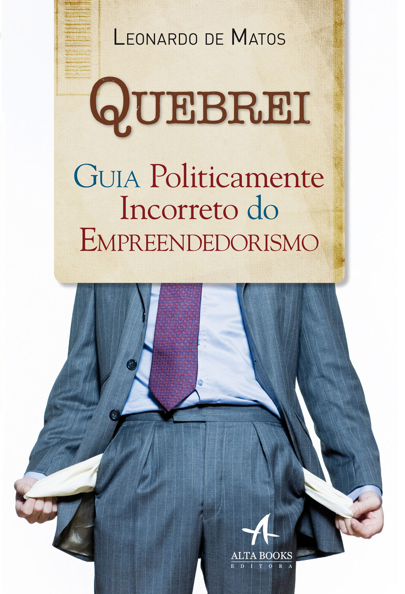

# Quebrei minha empresa

O relato sincero de alguém cujas apostas fracassaram e que chegou a ter prejuízo de mais de R$ 1 milhão

Empreender é para todo mundo?

Não. Claro que não. Assim como não dá para ser médico sem aguentar ver sangue ou querer ser veterinário sem gostar de bicho, há pessoas que simplesmente não devem ser donas de um negócio.

E não há problema nisso. É uma questão de escolha profissional. Admiro funcionários que estão felizes em seus empregos e que conseguiram estabelecer bom equilíbrio entre a vida pessoal e trabalho.

Eles não vivem o dilema "monto uma empresa ou continuo trabalhando para os outros"? Essa pergunta muitas vezes é o começo do problema.

Ainda que muitos brasileiros tenham o impulso empreendedor, nem todos têm a *capacidade* empreendedora. E acabam pagando caro para descobrir isso.

Eu paguei muito caro para descobrir que ainda não estava pronto. Perdi mais de um milhão de reais. Estou endividado até a tampa. Não posso mais ser ousado, arriscar além dos limites.

Ando com o carro da minha mãe e moro em um apartamento dela. Isso é triste para quem tem 39 anos e se imaginava rico nesse exato momento.

A boa pergunta a ser feita é: qual é a minha verdadeira vocação, quais minhas capacidades e até onde iria para fazer meu projeto dar certo? Resumindo: quem sou eu?

Por exemplo, descobri depois de quebrar que sou bom vendedor e muito criativo, mas deixei esses talentos de lado quando resolvi fazer minha confecção crescer. Pois tinha uma empresa e isso envolve uma série de áreas que precisamos dominar e monitorar constantemente, em especial aquelas nas quais somos deficientes.

Se você é um bom publicitário, começa a se coçar com a possibilidade de “criar” uma agência – até nisso tem a palavra com a qual se identifica, “criar”.

Mas talvez não tenha ideia da quantidade de competências que serão necessárias ao longo do caminho.

Na maioria das vezes a parte que mais gosta, criar, vai ficar de lado e abrir espaço para: contratar funcionário, atender cliente, vender, vender sua imagem, vender seus serviços, parte financeira, burocracia e levar muitos "nãos" mundo afora.

### O que fazer então?

Para descobrir se você tem ou não essa capacidade empreendedora, um caminho é montar um negócio e ver no que dá. Mas isso talvez seja melhor para quem tem recursos de sobra ou um pai milionário, que não se importaria em perder boa parte do patrimônio amealhado.

Hoje é difícil se dar essa oportunidade. Ouço pessoas dizendo que vão montar uma empresa e se não der certo, tudo bem. *Tudo bem uma ova! Preste atenção aqui.*

Custa muito caro perder dinheiro e patrimônio. Ficar endividado então, nem comento.

O que tenho dito é que, caso ache que está pronto para empreender, vá antes trabalhar para alguém na área.

É melhor e mais inteligente aprender e errar com o dinheiro dos outros. Seja curioso e pesquise sempre sobre as outras áreas da empresa, desde contas e impostos a pagar, até surpresas que surgem e como vão as vendas. Por no mínimo por 12 meses – acredito que uma empresa só existe depois de completar um ano de vida.

Empreender não significa ser super-herói, assim como não é preciso que um engenheiro ou enfermeiro sejam um. O ponto é que cada um desses é uma profissão a ser escolhida, respeitando sua vocação e seus talentos.

Ser empresário é viver a inconstância. É poder ter um revés a qualquer momento, em virtude das armadilhas que cercam todo tipo de negócio, e perder tudo. Lembre-se, os recursos ou a capacidade que você tem hoje não são garantia de sucesso futuro.

Cheguei a fazer sucesso durante 4 anos e depois que estava com “a” grana, me achando super capaz, pagando de “arrogantão”, comecei a cometer uma série de erros que só me fizeram andar para trás.

Me sentia tão competente que não fiz planejamento. Achava que bastava ter dinheiro. "Não dar o passo maior que a perna" é ditado antigo, mas acabei abrindo um espacate sem ser bailarino.

Não aceitar o conselho de outras pessoas e ter transformado minhas certezas absolutas em estátuas de concreto estão entre os erros que cometi.

Perdi tudo e mais um muito.

Essa história de que é melhor fazer do que se arrepender de não ter feito é pura balela. Há arrependimento no fazer também. E pode ser insuportável.

Tome sempre decisões cujas consequências possa suportar.

Sei que ninguém tem bola de cristal, mas ao planejar você consegue aumentar as chances de uma decisão certeira. No meu caso, lhe digo agora, **não estava preparado para quebrar**. Sofri bastante e ainda estou pagando o preço.

Meus percalços se transformaram em livro

“Todo homem deve ser, o que pode ser”, nos disse A. H. Maslow.

E o que há de errado com isso? Hoje faço palestras a respeito de minha história e vendo roupas da confecção de minha esposa. Trabalho para ela. Bacana, né?

---

*publicado em 19 de Abril de 2015, 23:11*
