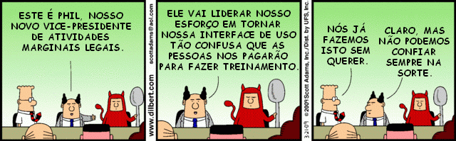
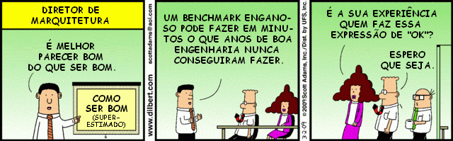

# Sobre o fenômeno dos trabalhos idiotas por David Graeber

No ano de 1930, [John Maynard Keynes](http://pt.wikipedia.org/wiki/John_Maynard_Keynes) previu que até o fim do século a tecnologia teria avançado suficientemente, ao ponto que países como a Inglaterra e os Estados Unidos teriam uma semana de trabalho de 15 horas.

Tudo nos leva a crer que ele estava certo.

Em termos tecnológicos, isso é possível. Ainda assim, não aconteceu. Pelo contrário, se a tecnologia fez algo foi **criar novas formas de nos fazer trabalhar mais.**

Para esse fim, foi necessário criar trabalhos que são, efetivamente, sem sentido. Enormes bandos de pessoas, em particular na Europa e na América do Norte, passam toda vida de trabalho realizando tarefas que secretamente acreditam não precisar fazer. O dano moral e espiritual que advém dessa situação é profundo. É uma cicatriz em nossa alma coletiva. Ainda assim, ninguém toca no assunto.

Porque a utopia prometida por Keynes – que até os anos 60 ainda era esperada com sofreguidão – nunca se materializou? A explicação padrão, hoje, é que ele não foi capaz de incluir em seus cálculos o grande aumento do consumismo.

Dada a escolha entre menos horas e mais brinquedos e prazeres, coletivamente teríamos feito segunda opção. Isso se apresenta como uma bela historinha com lição de moral, mas um instante de reflexão deixa claro que não pode ser verdade. Sim, testemunhamos a criação de uma infindável variedade de novos trabalhos e indústrias desde os anos 20, mas muito poucos deles têm a ver com a produção e distribuição de sushi, iPhones, ou tênis transados.

Então, no que consistem esses trabalhos novos, exatamente? Um relatório recente comparando o emprego nos EUA entre 1910 e 2000 nos revela claramente a situação (e, eu adiciono, os resultados são exatamente os mesmos no Reino Unido). Ao longo do último século, o número de pessoas trabalhando como empregados domésticos, na indústria e no setor agrícola diminuiu dramaticamente.

Ao mesmo tempo, trabalhos de “gerência, logística, vendedores e fornecedores de serviço” triplicaram, crescendo de “um quarto para três quartos dos empregos totais”. Em outras palavras, os trabalhos produtivos, exatamente como previsto, foram vastamente automatizados (mesmo quando contamos trabalhadores industriais em termos globais, incluindo aí as massas de gente que rala em indústrias na Índia e na China: trabalhadores deste tipo mesmo assim não totalizam uma porcentagem tão significativa quanto já representaram).

Mas em vez de permitir uma grande redução das horas de trabalho, liberando a população do mundo para seguir seus próprios projetos, prazeres, visões e ideias, o que vemos é o inchaço não só do setor de “serviços”, mas também do setor administrativo, ao ponto indústrias inteiras serem criadas, tais como serviços financeiros ou telemarketing, ou a expansão sem precedentes de setores como direito societário, administração acadêmica e de saúde, recursos humanos e relações públicas.

E esses números nem mesmo incluem todas as pessoas cujo trabalho é fornecer apoio administrativo, técnico ou de segurança para essas indústrias novas, ou mesmo para uma série de indústrias subsidiárias (lavadores de cães, entregadores de pizza) que só existem por que as outras pessoas passam tempo demais trabalhando.

Estes trabalhos são o que chamo de “trabalhos idiotas”.

É como se alguém estivesse inventando tarefas sem sentido só para nos manter todos trabalhando. E aí, precisamente, está o mistério.

No capitalismo se esperaria justamente que isso **não** acontecesse.

É claro, nos velhos estados ineficientes como a União Soviética, onde o emprego era considerado um dever sagrado e um direito, o sistema criava tantos trabalho quanto fossem necessários (e por isso havia três balconistas para vender um único pedaço de carne num açougue). Mas, é claro, esse é exatamente o tipo de problema que a competição de mercado deveria resolver.

De acordo com a teoria econômica, enfim, a última coisa que uma empresa que busca o lucro faria é colocar dinheiro em trabalhadores que não são realmente necessários. Ainda assim, de alguma forma, isso acontece.

Enquanto que as corporações implacavelmente desempreguem em massa para fazer seus “downsizings”, essas dispensas e remanejos invariavelmente recaem sobre a classe de pessoas que estão de fato fazendo, se movendo, consertando ou mantendo as coisas; por alguma alquimia esquisita, que ninguém ainda conseguiu explicar, o número de burocratas parece crescer, e cada vez mais empregados se encontram numa situação, não muito diferente da situação da antiga União Soviética, em que se passava 40 ou 50 horas por semana resolvendo papelada, só que agora produzem no máximo por 15 horas por semana, exatamente como Keynes previu, e o resto do tempo fica ocupado em seminários de organização ou motivacionais, em navegação no Facebook ou no download de séries de TV.

A resposta claramente não é econômica: é moral e política. A classe dominante entendeu que uma população feliz e produtiva com tempo livre nas mãos é um perigo mortal (pense no que começou a ocorrer quando se chegou perto disso, nos anos 1960).

E, por outro lado, o sentimento de que o trabalho é um valor moral por si mesmo, e que qualquer pessoa que não esteja disposta a se submeter a algum tipo de intensa disciplina de trabalho a maior parte de seu tempo de vigília não merece nada na vida, lhes é extraordinariamente conveniente.

Certa vez, quando contemplava o aparente crescimento infindável das responsabilidades administrativas nos departamentos acadêmicos britânicos, me deparei com uma visão possível do inferno.

O inferno é um grupo de indivíduos que passa a maior parte do seu tempo trabalhando numa tarefa de que não gosta e em que não é particularmente bom.

Digamos que foram contratados porque são ótimos carpinteiros, e então descobrem que se espera deles que passem a maior parte do tempo fritando peixe. E a tarefa nem mesmo precisa realmente ser feita –só existe um número limitado de peixes que precisam ser fritos.

Ainda assim, ficam cheios de ressentimento só de pensar que alguns de seus colegas de trabalho por acaso se dediquem a fazer móveis, e não estejam cumprindo sua responsabilidade, fritando sua meta de peixes; quando se vê, há pilhas incontáveis de peixe mal cozido inútil se empilhando por todo lado.

Creio que essa é uma descrição bem precisa da dinâmica moral em nossa própria economia.

Mas entendo que um argumento assim vai se deparar com objeções imediatas: “quem é você para dizer que trabalhos são realmente ‘necessários’? O que é necessidade, de todo modo? Você é um professor de antropologia, qual é a ‘necessidade’ disso?” (E de fato muitos leitores de tabloide tomariam a existência de meu trabalho como a própria definição de desperdício.) E, em certo nível, isso é obviamente verdadeiro. Não pode haver uma medida objetiva de valor social.

Eu não seria presunçoso de dizer a alguém que está convencido de estar fazendo uma contribuição significativa para o mundo que, de fato, não está. Mas e as pessoas que estão elas próprias convencidas de que seus trabalhos não tem sentido?

Não faz muito tempo entrei em contato com um amigo dos tempos de escola que eu não via desde os 12 anos de idade. Para minha grande surpresa, nesse intervalo em que não nos vimos, ele havia primeiro escrito poesia, depois virou vocalista de uma banda de rock independente. Eu até havia ouvido algumas de suas músicas no rádio, sem saber que a pessoa cantando era alguém que eu conhecia.

Obviamente tratava-se de uma pessoa brilhante, inovadora, e seu trabalho sem dúvida havia abrilhantado e melhorado as vidas de algumas pessoas ao redor do mundo. Ainda assim, depois de alguns álbuns mal sucedidos, ele perdeu o contrato com a gravadora, ficou cheio de dívidas, teve uma filha, e acabou, como ele colocou, “tomando a escolha padrão de tantos caras que não sabem o que fazer: estudar direito.”

Agora ele é um advogado na área de direito societário, trabalhando numa empresa proeminente em Nova York. Ele foi o primeiro a admitir que seu trabalho é completamente sem sentido, não contribui nada para o mundo, e, na visão dele mesmo, não devia sequer existir.

Há muitas perguntas que podemos nos fazer aqui, começando com: o que significa nossa sociedade parecer gerar uma demanda extremamente limitada para músicos e poetas talentosos, mas uma demanda aparentemente infinita por especialistas em direito societário?

(Resposta: se 1% da população controla a maioria da renda, o que chamamos de “mercado” reflete o que eles  pensam que é útil ou importante, e não o que o resto pensa.)

Mas mais do que isso, mostra que a maioria das pessoas engajadas nesses trabalhos no fundo sabe disso.

De fato, não estou certo se já encontrei um advogado que trabalha com direito societário que não achasse que seu trabalho não era idiota. O mesmo é válido em quase todas as indústrias que listei acima.

Há toda uma classe de profissionais assalariados que, se você os encontrar em festas e admitir que considera o que faz interessante (antropologia, por exemplo), vão evitar ao máximo discutir o que fazem. Se eles bebem um pouquinho, aí sim eles começam a fazer piadas sobre como o trabalho deles é burro e sem sentido.

Aqui há uma profunda violência psicológica. Como sequer começar a falar de dignidade no trabalho quando se considera que o próprio trabalho não deva existir? Como algo assim não vai acabar criando um sentido profundo de ressentimento e raiva?

Ainda assim, o gênio particular de nossa sociedade é que seus governantes descobriram um modo, exatamente como no exemplo dos fritadores de peixe, de garantir que a raiva seja dirigida exatamente contra aqueles que de fato fazem o trabalho que tem sentido.

Por exemplo, em nossa sociedade, parece haver uma regra geral de quanto mais obviamente um trabalho beneficia os outros, menos a pessoa será paga.

Novamente, uma medida objetiva é difícil de encontrar, mas um modo de sondar isso é se perguntar: o que aconteceria se essa classe inteira de pessoas simplesmente desaparecesse?

Diga o que quiser sobre enfermeiras, lixeiros ou mecânicos: é óbvio que se eles desaparecessem numa nuvem de fumaça, os resultados seriam imediatos e catastróficos.

Um mundo sem professores ou estivadores logo encontraria problemas, e mesmo um mundo sem escritores de ficção científica ou músicos que tocam ska já seria um lugar menos decente de se viver.

Mas não é completamente claro como a humanidade sofreria se todos os CEOs de equidade privada, lobistas, pesquisadores de Relações Públicas, tabeliões, operadores de telemarketing, mourinhos ou consultores legais desaparecessem. (Muitos entre nós até suspeitam que o um mundo sem eles possivelmente melhoraria.) Ainda assim, com algumas exceções muito claras (médicos), a regra da relação entre ganho e benefício parece se manter surpreendentemente bem.

Ainda mais perverso é que parece haver uma sensação ampla de que é assim mesmo que as coisas devem ser. Vemos isso quando os tabloides expressam ressentimento contra trabalhadores do metrô, por paralisarem Londres durante suas reinvindicações trabalhistas: o próprio fato dos trabalhadores do metrô serem capazes de paralisar Londres mostra que seu trabalho é efetivamente necessário, mas isso parece ser exatamente o que incomoda as pessoas.

E isso é ainda mais claro nos EUA, onde os republicanos tiveram muito sucesso em mobilizar ressentimento contra professores e trabalhadores da indústria automotiva (e não mobilizar ninguém, é importante frisar, contra os administradores de escola ou da indústria automotiva, que são a verdadeira causa dos problemas) por seus benefícios e salários supostamente inchados.

É como se eles dissessem para essas pessoas “mas você está ensinando crianças! Está montando carros! Você tem um trabalho de verdade! E, além disso, você ainda tem a audácia de esperar pensões de classe média e planos de saúde?”

Se alguém tivesse deliberadamente projetado um regime de trabalho perfeitamente adequado para manter o poder do capital financeiro, dificilmente conseguiria fazer algo melhor. Os trabalhos reais, produtivos, são incansavelmente oprimidos e explorados.

As outras pessoas estão divididas entre um estrato apavorado de desempregados – universalmente xingados – e um estrato mais numeroso que basicamente recebe para não fazer nada, em posições projetadas para que se identifiquem com as perspectivas e sensibilidades da classe dominante (gerentes, administradores, etc.) – e particularmente nos seus avatares financeiros – mas, ao mesmo tempo, cultivam ressentimento fervoroso contra qualquer um que tenha um trabalho com valor social claro e inegável.

Claramente, o sistema não foi projetado de forma consciente. Emergiu de quase um século de tentativa e erro. Mas é a única explicação para, apesar de nossas capacidades tecnológicas, não trabalharmos apenas 3 ou 4 horas por dia.

---

*publicado em 27 de Abril de 2015, 14:13*
