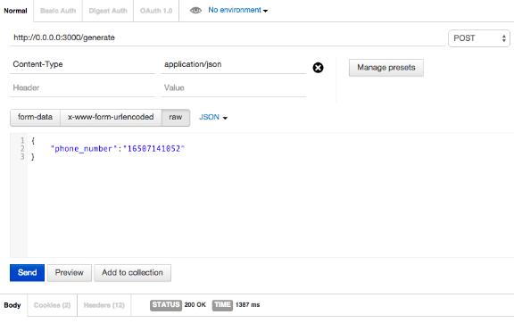
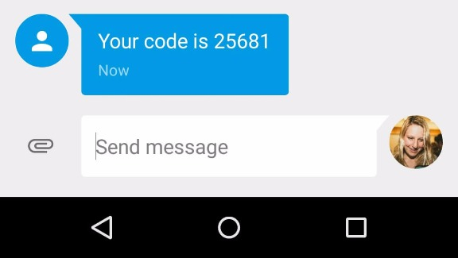
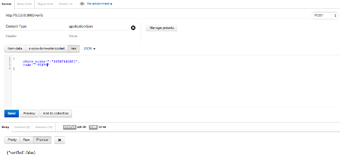

# Number Verification And Two Factor Authentication in Android/Ruby on Rails

More and more websites and apps rely on knowing your phone number and in many cases using that number for two factor authentication (more info about [2FA here](https://www.sinch.com/opinion/what-is-two-factor-authentication/)).

In this tutorial you will learn how to build your own two factor system in about 30 minutes. In [part 2](https://www.sinch.com/tutorials/ruby-two-factor-auth-part-2) you will implement it in an Android app, and it [part 3](https://www.sinch.com/tutorials/ruby-two-factor-auth-part-3), you will implement is as part of the login process in a rails app.

The full sample code can be downloaded [here](https://github.com/sinch/ruby-two-factor-auth).

## Prerequisites

1. Good understanding of Ruby on Rails and REST APIs
2. A Sinch account <http://sinch.com/signup>

## Create a Project

Create a new rails project and a verification controller:

```
1. $ rails YourProjectNamedatabasepostgresql
2. YourProjectName
3. $ rails generate controller Verifications
```

I chose to use a postgres database for my app to make hosting on Heroku easy, since they do not support the default sql database.

## Set up routes

Add to **routes.rb**:

```
1. '/generate'=>'verifications#generate_code'
2. '/verify'=>'verifications#verify_code'
```

## Set up Database

Create a table to store pairs of phone numbers and OTP codes:

```
1. $ rails generate migration CreateVerifications phone_numberstringstring
2. $ rake dbcreate
3. $ rake dbmigrate
```

Then, create the file **app/models/verification.rb** with the following:

```
1. classVerificationActiveRecord
2. validates_presence_of phone_number
```

## Add sinch\_sms Gem

You'll want to use Sinch to send SMS with the OTP (one time password) codes. Add `gem 'sinch_sms'` to your gem file and then bundle install.

## Generating and Verifying OTP Codes

In **app/controllers/verifications\_controller.rb** `generate_code`, you will:

1. generate random code
2. create new object with phone number
3. send an sms with the code

In `verify_code`, you will:

1. see if there is a verification entry that matches the phone number and code
2. if yes, destroy the entry and return {"verified":true}
3. if no, return {"verified":false}

```
1. classVerificationsControllerApplicationController
2. skip_before_filter verify_authenticity_token
3. generate_code
4. phone_number params"phone_number"
5. Random10000.99999
6. Verificationcreatephone_number phone_number
7. SinchSms'YOUR_APP_KEY''YOUR_APP_SECRET'"Your code is #{code}" phone_number
8. render status nothing
9. verify_code
10. phone_number params"phone_number"
11. params"code"
12. verification Verificationwherephone_number phone_numberfirst
13. verification
14. verificationdestroy
15. render statusverifiedto_json
16. render statusverifiedfalseto_json
```

In a production application you would most likely use Sinch to verify the format of a number before sending.

Also, one thing you might want to add in a production app is to wait to return until Sinch knows the message has been delivered to the operator by using:

```
1. SinchSmsstatus secret message_id
```

## Testing with Postman

I like to use postman for chrome to test out my rest apis. You can get it [here](https://chrome.google.com/webstore/detail/postman-rest-client/fdmmgilgnpjigdojojpjoooidkmcomcm?hl=en).

Use `$ rails s` to start a local rails server and take note of the port. In my case it was 3000.

In Postman, generate a code:



See the code arrive in an SMS:



And then verify the code:



## Hosting

If you're going to follow part 2 of this tutorial, you will need to host this backend somewhere. I chose [Heroku](http://www.heroku.com/), since it's easy to host a rails app, and has a huge free tier. After you've created an account, follow the steps on their site to deploy your app - <https://devcenter.heroku.com/articles/getting-started-with-rails4#deploy-your-application-to-heroku>. Make sure to follow through the section on migrating your database.

## Next Step

In the next step of this tutorial, I will show you how to use this in a native Android app.
