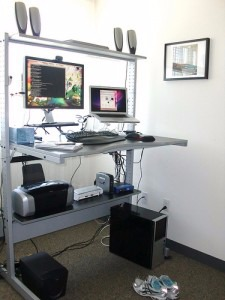
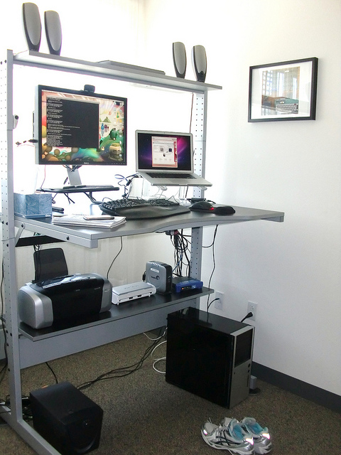
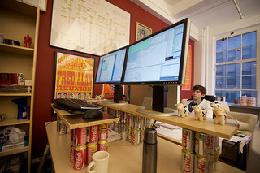
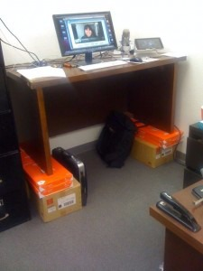
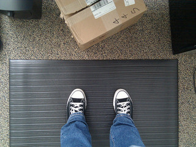

# [Why and How I Switched to a Standing Desk](http://smarterware.org/7102/how-and-why-i-switched-to-a-standing-desk)

I spend about 45 to 50 hours a week working on my computer. Up until a week ago, I did that work sitting on my ever-expanding behind.

Last Monday I adjusted my desk to standing height (pictured right). I spent the week working on my feet, and I'm never going back to a sitdown desk again. Here are some questions and answers about the change.

**What made you switch to a standing desk?**

Ever since I wrote about a "treadputer" treadmill desk [at Lifehacker in May of 2006](http://lifehacker.com/171537/coolest-workspace-contest--the-treadputer), I've been curious about and inspired by alternative desk setups. My workday—which consists almost entirely of typing on or talking into a computer—is completely sedentary, and is a big part of the reason I'm more than 20 pounds overweight. Burning more calories while I work is a better use of that time.

Building or buying a treadputer is too expensive an undertaking for something I'm not sure I'll like or even have the space to accomodate. A standing desk, however, is doable. In July of 2010 I featured [an Ikea Jerker treadmill desk](http://smarterware.org/6461/ikea-jerker-do-it-yourself-treadmill-desk), and mentioned I might just adjust my Jerker to standing height. This has been something I've been thinking about a long time.

Three straws finally broke the camel's back. First, I'm using [RescueTime](http://rescuetime.com/) to monitor how I spend my time on my computer, and the weekly report made me realize how many hours I really do spend sitting down (week before last: 48). Second, I'm actively working on losing weight right now, and this seemed like a small way to add to the effort (down 12 pounds in 3 months so far). Finally, Macworld posted a [guide to setting up a treadmill desk](http://www.pcworld.com/article/216353/set_up_a_treadmill_desk.html?tk=rss_news), and unequivocally recommended that you go from sitting to standing to walking, not straight from sitting to walking. That did it.

**Why use a standing desk?**

Two reasons: Higher calorie burn and better posture. When I'm sitting at my desk, even in a fancy ergonomic chair, I tend to slump, with my back curved and shoulders forward, which closes my chest and makes my breathing more shallow. When standing at a desk where my forearms are at a 90 degree angle on the desk surface, my shoulders go back, which makes my spine concave and opens my chest. Besides the initial foot pain and muscle aches of engaged thighs and calves, it feels great.

I didn't discuss the switch to a standing desk with my doctor, though there have been some [studies](http://www.usatoday.com/news/health/2010-07-27-sitting-death_N.htm) about [the negative health effects of excessive sitting](http://opinionator.blogs.nytimes.com/2010/02/23/stand-up-while-you-read-this/). I'm not a medical professional, but it seems obvious that human beings aren't meant to spend 45 hours a week sitting still in a chair. Now that I'm standing, I pace, dance, and fidget a lot more freely, which is just more natural activity and calorie burn built into my day.

**But don't your feet hurt?**

Yes, very much. In fact, the first three days were brutal, so painful I doubted the whole endeavor. By mid-day 2, I had to sit down every hour or so. I was distracted and had a hard time focusing on anything but how much my feet hurt. At night I sat on the couch with my feet elevated. I collapsed into bed totally exhausted. I never appreciated sitting as much as I did the first three days.

Then, on the fourth day, it wasn't so bad. On day 5, I got lost in work for 2 hours before I thought about the fact that I was on my feet once. Now it's my new normal.

**How did you convert your desk to a standing desk?**

I have a (sadly discontinued) Ikea Jerker desk, which is designed to let you set the table to any height you want when you assemble it. So, I put in the 3 hours it took to break down my whole computer setup, disassemble the desk, and put it together at standing height. I don't have a lot of willpower, so I wanted to make the change difficult to undo. Adjusting the desk back down to sitting height will take another half-day of tooling with Ikea furniture, not something I'll want to do again any time soon. Besides, if I want to sit, I always have the dining room table. Here's what my new setup looks like:

If you don't have a desk that you can assemble to standing height, you can always create a temporary standing desk by [putting shelves on your current desk](http://copperrobot.com/2011/01/getting-ready-to-try-a-standing-desk/).

Or you can use Coke cans, like [Marco](http://www.flickr.com/photos/marcoarment/3234209861/) did:

Or you can use printer paper, like [tbone7770](http://twitter.com/#!/tbone7770/statuses/26182053519163392) did:

Or you can just [buy a standing desk](http://www.nytimes.com/2010/04/22/technology/personaltech/22basics.html?_r=1).

**What about those treadputers?**

They're cool, aren't they? I'm not sure if I'll ever actually make it to the point where I'm walking and computing all day. I'm going to put in several months of standing before I consider it.

**What shoes do you wear?**

I wear ordinary running shoes, which are fairly new, well-padded and supportive. Changing your shoes seems to help the feet, too. Sometimes I go barefoot, but I don't usually last long.

**Do you stand on a soft mat? If so, which one?**

Not yet, but I've ordered a squishy mat to put under my desk. It's not one of those fancy $100 kitchen gel mats, it's more like a $17 cash register/factory mat. It arrives this week. I'll let you know how well I like it.

Week 2 update: Received [the mat](http://www.amazon.com/gp/product/B000EFK9KM/ref=nosim/lifehackerboo-20), and can confirm it makes working barefoot or in flat shoes like Chucks easier. I've also introduced a footrest, which is nice for shifting your weight from foot to foot. I'm using an old box of unsold books for that.

**Did you use any other gear in your switch to standing?**

I bought a $20 monitor riser to get my screen to the right height so I'm looking straight ahead at it, not down.

**How long did it take you to get used to standing all day?**

I'm not entirely used to it yet, but I'm through the worst. I started Monday. By Friday I felt comfortable. Monday through Wednesday were pretty tough, though.

**Do you take sit-down breaks?**

Yup. I sit down at lunchtime, on phonecalls (though I'm more apt to pace), at meetings, and maybe once or twice for 5-10 minutes at other times in the day, as needed. One day I was pretty exhausted and achy so I treated myself to a sitdown beverage at the coffee shop, which was a double treat. But for the most part, I'm not even thinking about it any more.

Update: Several people have pointed out that there are health risks associated with too much standing, like varicose veins. There's usually some health effect associated with too much of anything. I don't stand ALL the time now—I sit, stand, pace, and stretch. The difference between now and before is that I used to mostly sit. Now I mostly stand.

**Who else uses a standing desk?**

More people than I'd realized, especially techies! Former Twitter developer and founder of BankSimple [Alex Payne](http://www.francoiscote.net/2009/05/01/twitters-alex-paynes-desk-hack/). Creator of Instapaper [Marco Arment](http://articles.marco.org/268). Podcaster extraordinaire [Dan Benjamin](http://hivelogic.com/articles/sitting-standing-balance-ball). Novelist [Philip Roth](http://www.nytimes.com/2010/04/22/technology/personaltech/22basics.html?_r=1). Former U.S. Secretary of Defense [Donald Rumsfeld](http://en.wikipedia.org/wiki/Standing_desk). Lifehacker editor Jason Fitzpatrick. Now, newly, my fellow San Diego techie [Mitch Wagner](http://copperrobot.com/2011/01/at-my-standing-desk-standing/). Who else?

Any more questions re: the standing desk? Post 'em in the comments.

Week 2 update: Weighed in at the end of week 2 of standing desk plus eating well, and I'm down 3 pounds—no gym, just standing and doing my regular walking about town. Pretty happy about these results so far.
