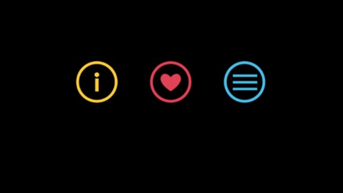
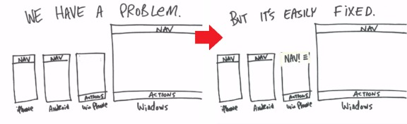

# Ex-Microsoft Designer Explains the Move Away from Metro

Windows Phone fans pining for the days of Metro panoramas and integrated experiences have had a tough couple of years, with Microsoft steadily removing many of the platform’s user experience differentiators. But as I’ve argued, there’s reason behind this madness. And now an ex-Microsoft design lead who actually worked on Windows Phone has gone public and agreed with this assessment. You may have loved Windows Phone and Metro, but it had to change.

As a backgrounder, be sure to familiarize yourself with my earlier take on this situation, [Five Years Later, a Full-On Retreat from What Made Windows Phone Special](https://www.thurrott.com/mobile/windows-phone/1380/five-years-later-full-retreat-made-windows-phone-special). In that post, I showed that Microsoft has slowly removed all of Windows Phone’s key differentiators over the past five years but that it had to for a variety of reasons.

Now, you can see a more internal view of what happened. And you can read the entire discussion—and some occasionally silly responses to it—in a Reddit AMA called [I designed the new version of Office for Windows Phone, AMA](http://www.reddit.com/r/windowsphone/comments/32yf85/i_designed_the_new_version_of_office_for_windows/). But here are the highlights.

**Why a hamburger menu?** “Windows Phone’s original interaction model put actions on the bottom and navigation on the sides, as swipes,” the design lead notes. “That’s not a great pattern for a variety of reasons.” Long story short, panoramas and pivots are good for exploration (like spinning through photos) but are not good for organizing information. And other platforms have adopted a common UX layout with common actions (commands) on the bottom, navigation on the top, and less-needed commands found hidden behind a hamburger menu or similar UI. Only Windows Phone lacked this UX model. So it had to change … And swiping sucks. It hides content. Let’s say you’re in Format and you want to get to something 5 tabs away. Five swipes is an unacceptable series of interactions. The carousel model has been disproven repeatedly, every single decade, for several decades. We have the data. It’s a dumb interaction model, full stop … But more objectively, when you ask 100 people to try iOS versus WP versus Android, some clear trends emerge. And the swiping worked against WP more than it helped, based on the data I saw.”

**Why is the hamburger menu in the top left of the display? It’s hard to reach, etc.** I actually argued for top right. The issue with top right is that no one else does [it]. Being a special unique snowflake works for art but not design. Design should be invisible, so people shouldn’t be thinking ‘oh that’s odd. I’ve never seen this button used like this. I wonder if it does the same thing?’ … The industry decided top left. So to go against it you need to earn it. You need to be far, far better or else it just stands out awkwardly.”

**But people need to be able to use it with one hand.** “What the research is showing is that people aren’t actually as wedded to one handed use as we used to believe they are. Don’t get me wrong, this is clearly a tradeoff. Frequently used things have to be reachable, even one-handed. But hamburgers are not frequently used, and one-handed use is not ironclad. Combine those two factors together and you see why the industry has settled on this standard. It wasn’t random … And, sorry. But the hamburger has some real issues, but ‘I can’t reach uncommon things without adjusting my hand on my massive phone and that annoys me because it reminds me of the dominant OS on earth” [is not one of them].

**But the bottom is better.** “It turns out bottom is not better. You’d think that something 3 pixels from your palm would be easier to reach than something in the middle of the phone. But nope. The way average people hold phones means the middle of the device is the best location. Both bottom and top require your hand to make a bit of a shift to reach. You don’t use the hamburger very often … You have to design for the 80% case, no matter how much that annoys the other (vocal) 20% [anexo ausente] … Here’s the distinction. Holding with your right hand in the average way makes it super easy to tap the bottom left but actually a bit of a context switch to hit the bottom right. So you put super common things on the bottom left, and important but less common things on the bottom right … Reach isn’t actually the biggest problem though. The issue is ‘why the hell is your app so complicated you need a junk drawer to stuff everything into?’ That’s why Apple doesn’t like it, and I agree. But you try designing Office for Mobile, supporting every feature, without a junk drawer [anexo ausente] It’s hard!”

**Office apps are complex so a hamburger was warranted.** The designer notes that simpler apps—like Twitter—don’t need a hamburger menu because they don’t have lots of commands. But complex apps like Office *do* need such a UI, simply because of the richness of the command set. “Due to the massive number of features in Office apps, and the extremely tight real estate, and alignment with tablets, that a hamburger was the best overall pattern.” [This video—by the design lead quoted here—explains this in more depth.](https://vid.me/RQsM)

**One Windows guided the design as well.** “Another big thing (one factor of like 100) was that we needed to make a model that works on a 60 inch TV set and everything in between … A truly universal design language needs to be ready to be anywhere, while still being highly tuned to each. You’d never put Apple Watch on 90 inch display or Xbox straight onto a phone, of course. But a design language that is aware of context and can do the right thing is a good idea.”

**Microsoft putting its apps on popular mobile platforms impacted the design of Windows Phone (Windows 10).** “Microsoft is focusing everywhere which upsets cheerleaders of Windows, but is the best bet moving forward.” But this decision of course impacts the design of these apps on *all* platforms. They need to look and work consistently where possible. And again, only Windows Phone had a different UX, so clearly this was the one that needed to change the most.

**Microsoft UX design can be summarized this simply.** “Nav on top, actions on bottom. No user consciously thinks that way, of course. And there will still be some actions tucked into the top. But that’s how the design of the system (in many cases) will work. I’ve thought about it across a ton of apps and it works well.” (This was technically true in Windows 8 too, by the way. Moving on.)

**He thinks the current UX design of Windows 10/Phone is pretty terrible.** Which it is. But … “I have some concerns, visually speaking. We’ll see what ships. The thing is, I know these folks personally. They’re great designers. They’d be the first to spot something ugly. So I’m hoping we see something exciting and new they’re just not ready to show yet … I’m not loving the visuals. I’m hoping there’s a big visual update they’re going to hit us with. They have to. Right?”

**Metro is less efficient than the interaction patterns on Android or iOS.** “The interaction patterns in Android and iOS are better designed (at least compared to [Windows Phone] 7). Get into the labs and watch people use all three platforms. There’s data here that not everyone is privy to, but that doesn’t make it less true. There are some real weaknesses in the old Metro patterns … Maybe iOS and Android forced everyone to two handed use with shitty design … [But] big screens exploded in popularity. You’re going two handed.”

**That’s only *in apps*.** To be clear, he’s talking about interaction patterns in apps: Android and iOS still use a terribly inefficient “whack a mole” home screen of nearly useless icons.

**This is not about imitating Android.** “That really did not happen. If anything, the company has been too slow to accept anything from Android or iOS because they’re so concerned about losing differentiation. I literally had to find ways to refer to common design patterns without referring to ‘the fruit company’ because I knew I’d immediately lose the argument. It was like the Cupertino version of Godwin’s Law … it turns out the design world (when it comes to interaction design) is similar. We have libraries full of research … It’s what sucks about being a power user minority – we don’t represent a large enough market to make it financially viable enough to design for us. The mainstream is where you get your market share.”

**Why does Microsoft support iOS first?** After evolving from “Windows first” to “First and best on Windows,” Microsoft had to adapt to the times. “Good riddance. It was an outdated philosophy. Now, I get it … If you make great software on other platforms, why will people buy Windows Phones at all? But sorry, the battle has been lost. The way Microsoft wins the long term war is to remind people where they’re strong. And no, it’s not through withholding Office on iOS. Not anymore. The ship sailed … and there are things you get for free on iOS that you don’t on Windows, and that slows development … it’s a sad situation. Let’s say someone emailed you and said ‘Hey your site doesn’t work in Opera.’ No one has infinite time to fix bugs, so you have to prioritize. And as long as Windows Phone has less market share, it’ll be harder to justify the support cost. But if Windows Phone can hold on for 3-5 years, I do think the landscape is going to look very different. I don’t suspect Android or iOS will lose their dominant grip on the market, but I do think Windows has a shot of getting on more stable ground. The fact is, the OS is just pretty immature right now, so it’s going to take some time to firm up … The scoreboard, right now, despite a lot of stuff that MS does better, paints a picture that leans the field away from Windows dev. But that can (and I suspect will) change.”

**What about the radial menu in OneNote Modern?** “Oh man. So … Scientifically there’s a lot to love about those menus. You can use them anywhere and actions are always nearby. And from what I heard, it tested well. But it was incongruous with the rest of the system. Metro is right angles. So it didn’t fit into any other [interaction design pattern] on the system so I suspect that’s why it went. Before you roll your eyes and think ‘stupid Microsoft, I loved a thing and they killed it being too passive’ you have to understand that software design is way more complex than fighting for each feature. There’s a higher level consistency that brings big results. You can’t just say ‘I like it, it should be in.’ It’s way bigger than that.”

**Do you believe in the Windows 10 platform?** “I think the design changes are going to be a hard pill to follow because they’re less distinct. But they’re vital. Some of my best friends are working on the redesign and they’re building a much stronger foundation for the long run even if it looks visually less arresting … Build is coming. So I suspect both visuals and docs will come a long way between now and release … But the next few years can be very kind to Microsoft. I’ve spoken to and worked with the people driving forward the evolution that 10 is just the first step of, and they’re great. It’s just going to take some time.”

**So why not just kill Windows Phone?** “Windows Phone is small, relatively speaking. But absolutely speaking it still sells a lot of units. And they can’t not have an OS. So it’d be nice if they had more market on mobile, but having zero just topples the whole strategy.”

**If you could change just one thing in Windows Phone, what would it be?** The interaction models, honestly. The pivots and the panoramas are a nightmare in day to day use. They’re as distinct as a Flower Power iMac, but it painted the interaction models into a corner … If Windows Phone had used stronger [interaction design pattern] models, maybe it would have looked too ‘me too’ … Metro had to shock people. It had to look like its own thing. And it did that really well. Pivots, panos, big text, black everywhere, it looked like art. And more than that it looked *different* … But I think the platform has paid for it ever since. They stood out, they were distinctive, but the interaction design wasn’t where it needed to be. So you have diehards that love it, but you have the mainstream of the market that struggles with it, if they try at all.”

**Marketing wasn’t the problem.** “We were all pretty bummed by how the marketing stuff panned out. But you know what was a thousand times worse? Going on site, handing someone a Windows Phone, and watching them universally struggle with it. Obviously when you have a camera crew in your face and a design researcher and two designers and a product manager all watching you use a device, you’re likely to say ‘I like it! This looks … nice …’ But it was clear that all three platforms had unique strengths, and WP had the fewest number. It was dispiriting. The stark look of Windows Phone seemed to turn off more people than fell in love with it. We’re all fans [here] but in the mainstream marketing was only one problem. Apps was another. But the biggest one was lack of relevance. People didn’t understand why they should care. A lot of people said it looked like a nice phone, but it wasn’t for them.” Want more? [He actually gave a talk about this issue!](https://www.youtube.com/watch?v=WjgpAVyE034)

**Windows Phone didn’t do *that* badly.** “If you look at in a binary way, like ‘success’ versus ‘fail’ then yeah. It didn’t immediately destroy iPhone, that’s for sure. But I don’t think you’re fully accounting for how fucked Windows Mobile was. You think Blackberry died quickly? Nokia? Palm Pre? The fact that Windows Phone is even alive shows it was far, far better than everything else. Really, think about it. Android is free. How do you compete with free? And iOS has such strong vertical integration that it’s really tough to break in for anyone. Notably at the high end. So I get that 3 percent marketshare feels like a failure. But actually, no one else has been able to do that from scratch. They’re around 10 percent in major western European markets. So yeah, they didn’t win. And 3 percent isn’t fun. But let’s be clear – Windows Mobile would be at zero. No question in my mind.”

**What does the future look like?** “Imagine your kid is writing a book report and doing a presentation in 10 years. I don’t think it’s in Word and PowerPoint as we know it today. But I do think it could be with Microsoft software. And statistically speaking, it’s on Android … the philosophy that birthed [Sway] is the literally the future. New things that help people communicate and express themselves in magical new ways. On every platform. Sway will never be the next Word, financially speaking. But 100 Sways, used and beloved on every OS? Imagine that. Imagine how Microsoft looks then. That’s the vision I’m excited about.”

Amazing stuff.

Tagged [Metro](https://www.thurrott.com/tag/metro), [Office universal apps](https://www.thurrott.com/tag/office-universal-apps)
