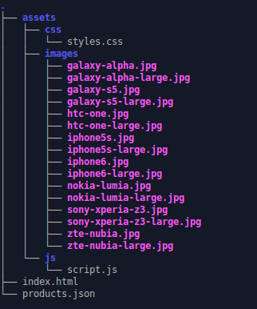
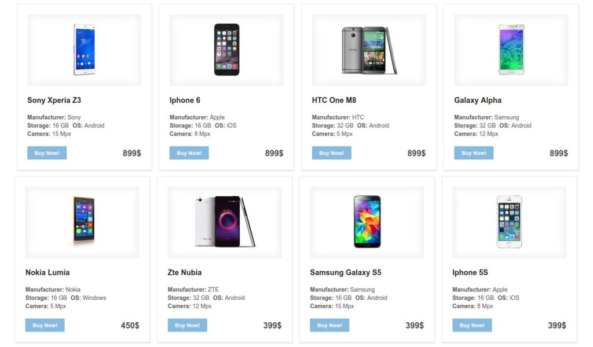
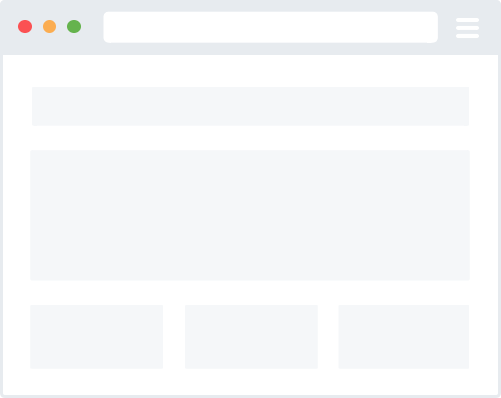

# Making a Single Page App Without a Framework

Danny Markov February 5th, 2015

The idea behind single page applications (SPA) is to create a smooth browsing experience like the one found in native desktop apps. All of the necessary code for the page is loaded only once and its content gets changed dynamically through JavaScript. If everything is done right the page shouldn’t ever reload, unless the user refreshes it manually.

There are many frameworks for single page applications out there. First we had [Backbone](http://tutorialzine.com/2013/04/services-chooser-backbone-js/ "Your First Backbone.js App – Service Chooser"), then [Angular](http://tutorialzine.com/2013/08/learn-angularjs-5-examples/ "Learn AngularJS With These 5 Practical Examples"), now [React](http://tutorialzine.com/2014/07/5-practical-examples-for-learning-facebooks-react-framework/ "5 Practical Examples For Learning The React Framework"). It takes a lot of work to constantly learn and re-learn things (not to mention having to support old code you’ve written in a long forgotten framework). In some situations, like when your app idea isn’t too complex, it is actually not that hard to create a single page app without using any external frameworks. Here is how to do it.

> **Note:** To run this example after downloading it, you need a locally running webserver like Apache. Our demo uses AJAX so it will not work if you simply double-click index.html for security reasons.

### The Idea

We will not be using a framework, but we *will* be using two **libraries** – jQuery for DOM manipulation and event handling, and [Handlebars](http://tutorialzine.com/2015/01/learn-handlebars-in-10-minutes/ "Learn Handlebars in 10 Minutes or Less") for templates. You can easily omit these if you wish to be even more minimal, but we will use them for the productivity gains they provide. They will be here long after the hip client-side framework of the day is forgotten.

The app that we will be building fetches product data from a JSON file, and displays it by rendering a grid of products with [Handlebars](http://handlebarsjs.com/). After the initial load, our app will stay on the same URL and listen for changes to the **hash** part with the **hashchange** event. To navigate around the app, we will simply change the hash. This has the added benefit that browser history will just work without extra effort on our part.

### The Setup



Our project’s folder

As you can see there isn’t much in our project folder. We have the regular web app setup – HTML, JavaScript and CSS files, accompanied by a products.json containing data about the products in our shop and a folder with images of the products.

### The Products JSON

The .json file is used to store data about each product for our SPA. This file can easily be replaced by a server-side script to fetch data from a real database.

#### products.json

```
[
  {
    : ,
    "name": "Sony Xperia Z3",
    "price": ,
    "specs": {
      "manufacturer": "Sony",
      "storage": ,
      : "Android",
      "camera": 
    },
    "description": "Lorem ipsum dolor sit amet, consectetur adipiscing elit. Nullam tristique ipsum in efficitur pharetra. Maecenas luctus ante in neque maximus, sed viverra sem posuere. Vestibulum lectus nisi, laoreet vel suscipit nec, feugiat at odio. Etiam eget tellus arcu.",
    "rating": ,
    "image": {
      "small": "/images/sony-xperia-z3.jpg",
      "large": "/images/sony-xperia-z3-large.jpg"
    }
  },
  {
    : ,
    "name": "Iphone 6",
    "price": ,
    "specs": {
      "manufacturer": "Apple",
      "storage": ,
      : "iOS",
      "camera": 
    },
    "description": "Lorem ipsum dolor sit amet, consectetur adipiscing elit. Nullam tristique ipsum in efficitur pharetra. Maecenas luctus ante in neque maximus, sed viverra sem posuere. Vestibulum lectus nisi, laoreet vel suscipit nec, feugiat at odio. Etiam eget tellus arcu.",
    "rating": ,
    "image": {
      "small": "/images/iphone6.jpg",
      "large": "/images/iphone6-large.jpg"
    }
  }
]
```

### The HTML

In our html file we have several divs sharing the same class “page”. Those are the different pages (or as they are called in SPA – states) our app can show. However, on page load all of these are hidden via CSS and need the JavaScript to show them. The idea is that only one page can be visible at a time and our script is the one to decide which one it is.

#### index.html

```
< class="main-content">

    < class="all-products page">

        <>Our products</>

        < class="filters">
            <>
                Checkboxes here
            </>
        </>

    < class="products-list">
      <script ="products-template" ="x-handlebars-template">​
        {{#each }}
          <li data-index="{{id}}">
            < = class="product-photo">< ="{{image.small}}" height="130" ="{{name}}"/></>
            <>< => {{name}} </></>
            < class="product-description">
              <><>Manufacturer: </>{{specs.manufacturer}}</>
              <><>Storage: </>{{specs.storage}} GB</>
              <><>OS: </>{{specs.os}}</>
              <><>Camera: </>{{specs.camera}} Mpx</>
            </>
            <button>Buy Now!</button>
            < class="product-price">{{price}}$</>
            < class="highlight"></>
          </>
        {{/each}}
      </script>

    </>

    </>

    < class="single-product page">

        < class="overlay"></>

        < class="preview-large">
            <>Single product view</>
            < =/>
            <></>

            < class="close">×</>
        </>

    </>

    < class="error page">
        <>Sorry, something went wrong :(</>
    </>

</>
```

We have three pages: **all-products** (the product listing), **single-product** (the individual product page) and **error**.

The **all-products** page consists of a title, a form containing checkboxes for filtering and a <ul> tag with the class “products-list”. This list is generated with handlebars using the data stored in products.json, creating a <li> for each entry in the json. Here is the result:



The Products

Single-product is used to show information about only one product. It is empty and hidden on page load. When the appropriate hash address is reached, it is populated with product data and shown.

The error page consist of only an error message to let you know when you’ve reached a faulty address.

### The JavaScript Code

First, lets make a quick preview of the functions and what they do.

#### script.js

```
$(function  {

    checkboxes.click(function  {
        // The checkboxes in our app serve the purpose of filters.
        // Here on every click we add or remove filtering criteria from a filters object.

        // Then we call this function which writes the filtering criteria in the url hash.
        createQueryHash(filters);
    });

    $.getJSON( "products.json", function( data ) {
        // Get data about our products from products.json.

        // Call a function that will turn that data into HTML.
        generateAllProductsHTML(data);

        // Manually trigger a hashchange to start the app.
        $(window).trigger('hashchange');
    });

    $(window).on('hashchange', function(){
        // On every hash change the render function is called with the new hash.
        // This is how the navigation of our app happens.
        render(window.location.hash);
    });

    function render(url) {
        // This function decides what type of page to show 
        // depending on the current url hash value.
    }

    function generateAllProductsHTML(data){
        // Uses Handlebars to create a list of products using the provided data.
        // This function is called only once on page load.
    }

    function renderProductsPage(data){
        // Hides and shows products in the All Products Page depending on the data it recieves.
    }

    function renderSingleProductPage(index, data){
        // Shows the Single Product Page with appropriate data.
    }

    function renderFilterResults(filters, products){
        // Crates an object with filtered products and passes it to renderProductsPage.
        renderProductsPage(results);
    }

    function renderErrorPage{
        // Shows the error page.
    }

    
    function createQueryHash(filters){
        // Get the filters object, turn it into a string and write it into the hash.
    }

});
```

Remember that the concept of SPA is to not have any loads going on while the app is running. That’s why after the initial page load we want to stay on the same page, where everything we need has already been fetched by the server.

However, we still want to be able to go somewhere in the app and, for example, copy the url and send it to a friend. If we never change the app’s address they will just get the app the way it looks in the beginning, not what you wanted to share with them. To solve this problem we write information about the state of the app in the url as #hash. Hashes don’t cause the page to reload and are easily accessible and manipulated.

On every hashchange we call this:

```
function render(url) {

        // Get the keyword from the url.
         temp = url.split()[];

        // Hide whatever page is currently shown.
        $('.main-content .page').removeClass('visible');

         map = {

            // The Homepage.
            : function() {

                // Clear the filters object, uncheck all checkboxes, show all the products
                filters = {};
                checkboxes.prop('checked',false);

                renderProductsPage(products);
            },

            // Single Products page.
            '#product': function() {

                // Get the index of which product we want to show and call the appropriate function.
                 index = url.split('#product/')[].trim();

                renderSingleProductPage(index, products);
            },

            // Page with filtered products
            '#filter': function() {

                // Grab the string after the '#filter/' keyword. Call the filtering function.
                url = url.split('#filter/')[].trim();

                // Try and parse the filters object from the query string.
                 {
                    filters = JSON.parse(url);
                }
                // If it isn't a valid json, go back to homepage ( the rest of the code won't be executed ).
                catch(err) {
                    window.location.hash = ;
                }

                renderFilterResults(filters, products);
            }

        };

        // Execute the needed function depending on the url keyword (stored in temp).
        (map[temp]){
            map[temp]();
        }
        // If the keyword isn't listed in the above - render the error page.
         {
            renderErrorPage();
        }

    }
```

This function takes into consideration the beginning string of our hash, decides what page needs to be shown and calls the according functions.

For example if the hash is ‘#filter/{“storage”:["16"],”camera”:["5"]}’, our codeword is ‘#filter’. Now the render function knows we want to see a page with the filtered products list and will navigate us to it. The rest of the hash will be parsed into an object and a page with the filtered products will be shown, changing the state of the app.

This is called only once on start up and turns our JSON into actual HTML5 content via handlebars.

```
function generateAllProductsHTML(data){

     list = $('.all-products .products-list');

     theTemplateScript = $("#products-template").html();
    //Compile the template​
     theTemplate = Handlebars.compile (theTemplateScript);
    list.append (theTemplate(data));

    // Each products has a data-index attribute.
    // On click change the url hash to open up a preview for this product only.
    // Remember: every hashchange triggers the render function.
    list.find().on('click', function  {
      e.preventDefault();

       productIndex = $().data('index');

      window.location.hash = 'product/' + productIndex;
    })
  }
```

This function receives an object containing only those products we want to show and displays them.

```
function renderProductsPage(data){

     page = $('.all-products'),
      allProducts = $('.all-products .products-list > li');

    // Hide all the products in the products list.
    allProducts.addClass('hidden');

    // Iterate over all of the products.
    // If their ID is somewhere in the data object remove the hidden class to reveal them.
    allProducts.each(function  {

       that = $();

      data.forEach(function (item) {
        (that.data('index') == item.id){
          that.removeClass('hidden');
        }
      });
    });

    // Show the page itself.
    // (the render function hides all pages so we need to show the one we want).
    page.addClass('visible');

  }
```

Shows the single product preview page:

```
function renderSingleProductPage(index, data){

     page = $('.single-product'),
      container = $('.preview-large');

    // Find the wanted product by iterating the data object and searching for the chosen index.
    (data.length){
      data.forEach(function (item) {
        (item.id == index){
          // Populate '.preview-large' with the chosen product's data.
          container.find().text(item.name);
          container.find('img').attr('src', item.image.large);
          container.find().text(item.description);
        }
      });
    }

    // Show the page.
    page.addClass('visible');

  }
```

Takes all the products, filters them based on our query and returns an object with the results.

```
function renderFilterResults(filters, products){

      // This array contains all the possible filter criteria.
     criteria = ['manufacturer','storage',,'camera'],
      results = [],
      isFiltered = false;

    // Uncheck all the checkboxes.
    // We will be checking them again one by one.
    checkboxes.prop('checked', false);

    criteria.forEach(function  {

      // Check if each of the possible filter criteria is actually in the filters object.
      (filters[c] && filters[c].length){

        // After we've filtered the products once, we want to keep filtering them.
        // That's why we make the object we search in (products) to equal the one with the results.
        // Then the results array is cleared, so it can be filled with the newly filtered data.
        (isFiltered){
          products = results;
          results = [];
        }

        // In these nested 'for loops' we will iterate over the filters and the products
        // and check if they contain the same values (the ones we are filtering by).

        // Iterate over the entries inside filters.criteria (remember each criteria contains an array).
        filters[c].forEach(function (filter) {

          // Iterate over the products.
          products.forEach(function (item){

            // If the product has the same specification value as the one in the filter
            // push it inside the results array and mark the isFiltered flag true.

            (typeof item.specs[c] == 'number'){
              (item.specs[c] == filter){
                results.push(item);
                isFiltered = ;
              }
            }

            (typeof item.specs[c] == 'string'){
              (item.specs[c].toLowerCase().indexOf(filter) != -){
                results.push(item);
                isFiltered = ;
              }
            }

          });

          // Here we can make the checkboxes representing the filters true,
          // keeping the app up to date.
          (c && filter){
            $('input[name='+c+'][value='+filter+).prop('checked',);
          }
        });
      }

    });

    // Call the renderProductsPage.
    // As it's argument give the object with filtered products.
    renderProductsPage(results);
  }
```

Shows the error state:

```
function renderErrorPage{
     page = $('.error');
    page.addClass('visible');
  }
```

Stringifies the filters object and writes it into the hash.

```
function createQueryHash(filters){

    // Here we check if filters isn't empty.
    (!$.isEmptyObject(filters)){
      // Stringify the object via JSON.stringify and write it after the '#filter' keyword.
      window.location.hash = '#filter/' + JSON.stringify(filters);
    }
    {
      // If it's empty change the hash to '#' (the homepage).
      window.location.hash = ;
    }

  }
```

### Conclusion

Single page applications are perfect when you want give your project a more dynamic and fluid feel, and with the help of some clever design choices you can offer your visitors a polished, pleasant experience.

###### Presenting **Bootstrap Studio**

a revolutionary tool that developers and designers use to create  
beautiful interfaces using the Bootstrap Framework.

[Learn more](http://tutorialzine.com/2015/02/single-page-app-without-a-framework/#)




##### by **Danny Markov**

Danny is Tutorialzine's Bootstrap and HTML5 expert. When he is not in the office, you can usually find him riding his bike and coding on his laptop in the park.
