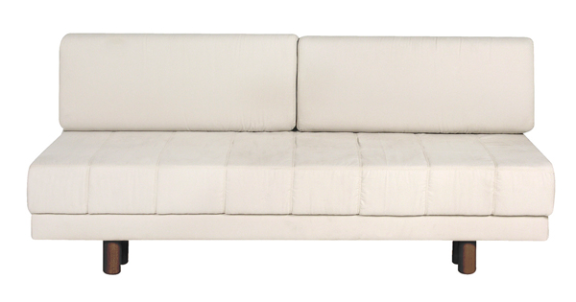
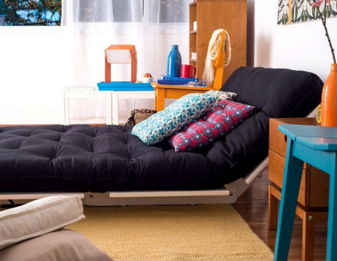
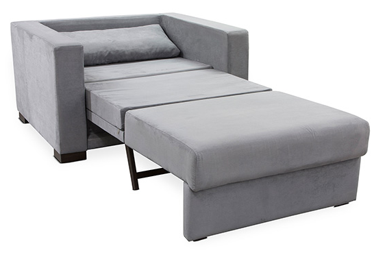
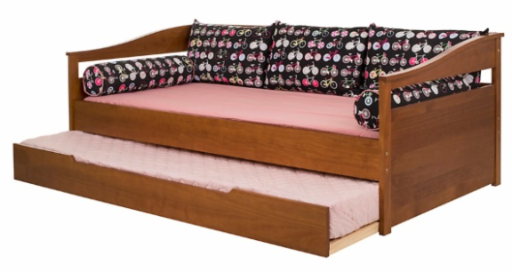

# Como comprar: sofá-cama

Todo mundo que gosta (ou precisa) receber pessoas em casa já deve ter pensado na possibilidade de comprar um sofá-cama. Como planejar uma compra é algo que podemos organizar, eu gostaria de começar aqui uma categoria chamada Como comprar, onde justamente vou dar dicas para fazer a melhor compra possível sempre.

### Por que comprar um sofá-cama?

O sofá-cama pode ser indicado para quem não tem um quarto de hóspedes em casa e gostaria de receber pessoas para passar a noite (geralmente amigos ou parentes). O sofá-cama acaba ficando no escritório ou na sala. Também pode ser indicado para quem mora em um apartamento muito pequeno (como uma kitnet) e precisa de espaço para circulação. Ainda pode servir para mães e pais de recém-nascidos, que querem colocar um móvel para dormir no quarto da criança, quando necessário.

### Como saber que sofá-cama comprar

É importante lembrar que, se o sofá-cama ficar na sala ou for comprado para servir como cama diariamente, ele precisa ser confortável.

Se ele ficar no escritório, pode não ter tanto espaço ao ser aberto, então o modelo precisa ser diferente.

### Tipos de sofá-cama

O sofá com design diferenciado, que será usado como sofá sempre e como cama ocasionalmente, somente se necessário;

Sofá da Tok&Stok

O sofá confortável, que será usado diariamente pelo morador para dormir e como sofá apenas para ajudar na circulação;

Sofá da Oppa

A poltrona que vira cama, recomendada especialmente para quartos de recém-nascidos;

Sofá da Etna

O sofá mais rústico, que pode ser usado como cama, para ficar em ambientes pequenos.

Sofá da loja Meu Móvel de Madeira

### Como comprar

- Defina o objetivo de acordo com a sua necessidade.
- Sempre meça o espaço disponível na sua casa para colocar um sofá-cama aberto, para não ter surpresas.
- O material também importa. Um sofá-cama que será usado diariamente deve ter material fácil de limpar, mas que não prejudique o conforto. Sofás-cama feitos de courino podem não parecer confortáveis, mas bastam ser forrados com jogo de cama. Não são recomendados, no entanto, porque esquentam muito. Os materiais naturais sempre são melhores.
- Confira se o mecanismo de extensão do sofá funciona com facilidade.

### Quanto pagar

O valor do investimento depende da intensidade do uso. A regra é clara: se for usar muito, pague mais pelo conforto; se for usar pouco, não precisa investir tanto. Você encontrar sofás-cama de R$500 a R$4.000 nas principais lojas do ramo em nosso país. Lembre-se: você paga pela qualidade do material, das ferragens e pelo design.

Boas compras!
