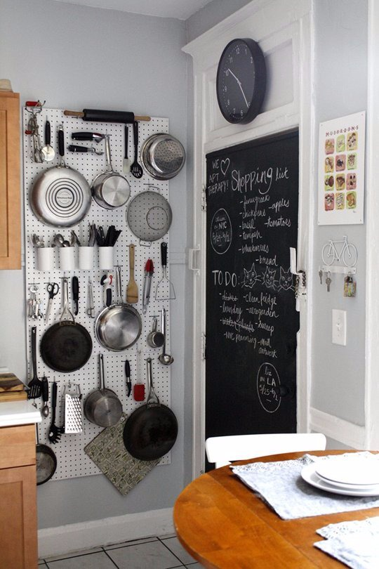
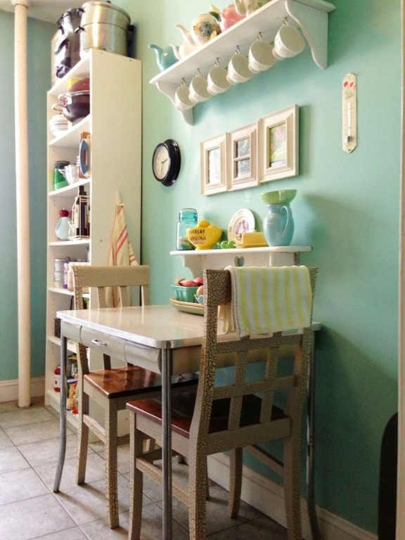
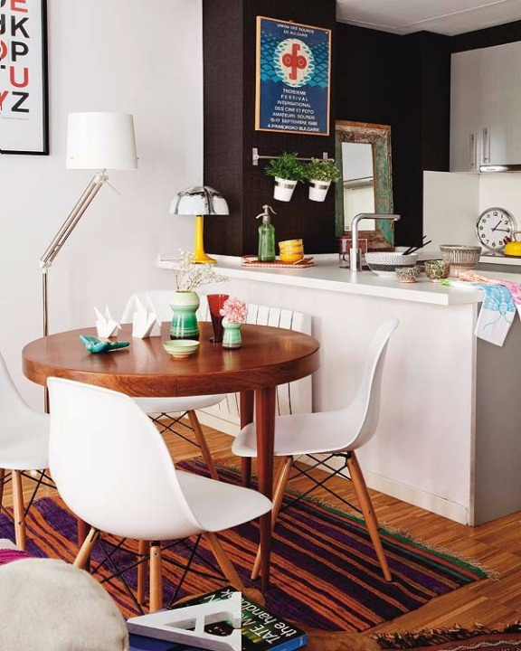
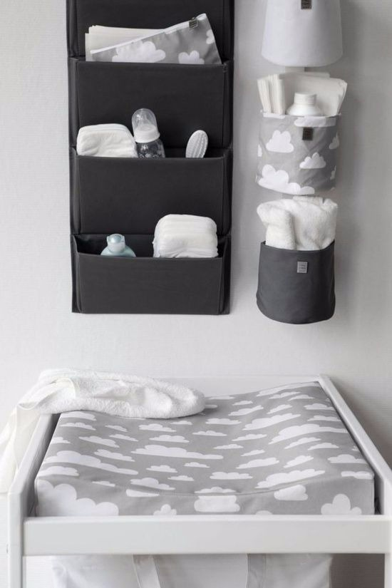
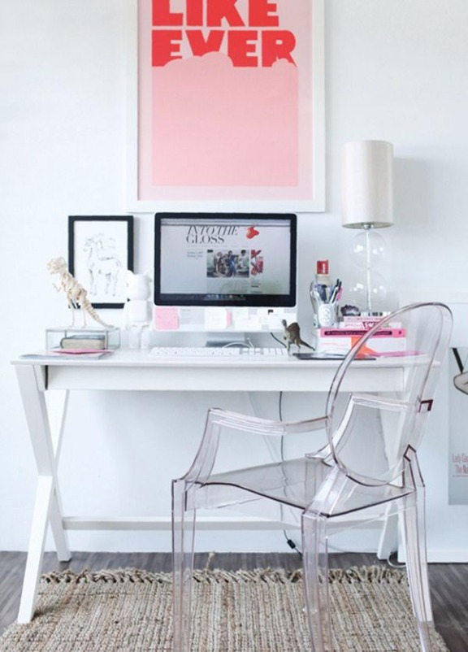

# Como decorar e organizar um imóvel pequeno

Os apartamentos hoje em dia estão cada vez menores. Sempre me surpreendo com o espaço que temos quando moramos em uma casa e sei como é difícil fazer a transição para um apartamento porque, no geral, mesmo sem querer a maioria das pessoas têm coisas demais. Eu sempre morei em uma casa grande. Há quatro anos, mudei para um apartamento pela primeira vez e senti na pele o que foi não ter espaço para coisas que eu considerava básicas, como a minha bateria e a barraca de camping. O que fazer com elas? Hoje, morando novamente em uma casa, tenho mais espaço, mas valorizo mais os espaços que não precisam ser preenchidos.

Thoreau disse no livro “Walden” que feliz é o homem que consegue carregar todos os seus pertences em um único carrinho de mão. Eu começo a ter convicção semelhante. Porque, quanto mais coisas a gente tem, mais a gente precisa limpar e cuidar. E, quando a gente muda pela primeira vez para um apartamento pequeno, pode estranhar bastante. Se não rolar um desapego, será difícil.

Por isso, eu resolvi escrever um post com algumas dicas para organizar e decorar um imóvel pequeno. Claro que, por não ser decoradora, minhas “dicas de decoração” vão mais na linha da organização mesmo. Decoradores podem ficar à vontade para puxar a minha orelha, se eu falar alguma besteira.

### Não dá para ter tralha

Eu sei que nem morando em um espaço grande eu recomendo você ter tralha. Porém, se você mora em um espaço pequeno, não tem como m-e-s-m-o. A gente sabe que tem tralha quando os objetos necessários do nosso dia a dia ficam meio que sem lugar para ficar porque outras coisas estão tomando o lugar deles. Por isso é comum a gente ler dicas de organização dizendo o padrão: tire tudo de um cômodo e coloque de volta apenas o que usa. Em resumo, é a simplificação do processo de não ter tralha. Porém, falar é fácil! Agora, o que a gente faz com o que não entrou no cômodo? Joga pela janela? Não tem como. Por isso, não precisa ser radical nem traumático – pegue 15 minutos por dia, apenas, e separe algumas coisas da sua casa que você não usa mais. E aí tome providências – pode ser doar, tirar fotos para vender na Internet, reciclar, dar de presente, jogar fora. As tralhas não pipocaram na sua casa da noite para o dia, então não precisa se preocupar em fazer isso do dia para a noite. Você não está em um reality show.

### Organize os seus espaços

Quando se livrar da tralha, organize o que você tem. Seus CDs estão organizados da melhor maneira possível ou dá para melhorar? Será que não seria mais confortável para você digitalizar tudo e dar os CDs para alguém? E seus livros, estão em uma estante organizados ou em pilhas espalhadas pela casa? Como estão os armários da sua cozinha? E os produtos de limpeza na área de serviço? Brinquedos? Roupas? Sapatos? Controles? Roupa de cama? Toalhas? Louça? Panos de prato? Artigos de escritório? Sempre há algo a melhorar. Mais uma vez: não se cobre tanto e organize aos pouquinhos, buscando soluções particulares para a sua casa.

Imagem: Apartment Therapy

### Compre mobiliário pequeno

Quando eu me mudei, a sala do apartamento era grande. Por isso, quis comprar uma mesa de jantar um pouco maior que o normal, para “preencher” o espaço. Eu amo a mesa mas, quando me mudei mais duas vezes, ela sempre ficou muito maior e desproporcional aos novos espaços que eu tinha. Eu sei que quando você muda em definitivo para um apartamento que você comprou, o investimento pode ser mais certeiro. Ao mesmo tempo, nada é para sempre nesta vida. Você não sabe se vai odiar seu condomínio e querer mudar em dois anos. Hoje eu penso que, quanto menor, melhor. Claro que sempre atendendo as nossas necessidades – um sofá de três lugares, uma cama *queen*. Mas, no geral, os móveis não precisam ser grandes – mesas, poltronas, racks, aparadores. Móveis pequenos ficam mais proporcionais em apartamentos pequenos e dão sensação de amplitude.

Imagem: The Kitchn

### Atente para a luz

Muitas pessoas dizem que um apartamento pequeno não deve ser pintado com cores escuras, mas já vi apartamentos pequenos e lindíssimos com parede de lousa ou uma única parede com uma cor mais forte. Acho que o segredo de tudo está na luz que entra na sua casa. Você pode ter um apartamento minúsculo, mas com muita luz. Assim, uma parede preta até quebra essa luminosidade de uma maneira positiva, deixando o ambiente mais acolhedor. Se seu apartamento ou casa for grande, mas com pouca luminosidade, pintar uma parede de preto vai fazer com que tudo fique meio estranho. Então, mais do que ser sobre cores, é sobre luz.

Imagem: homedit.com

### Aposte nos espaços verticais

Antes de comprar um móvel novo, investigue soluções verticais. Prateleiras, cabideiros e outras soluções que explorem mais o espaço nas paredes pode ser mais adequado que ocupar mais espaço no chão.

Imagem: babyli.st

### Abuse de elementos leves visualmente

Cadeiras de acrílico transparente, mesas com tampo de vidro e móveis com pés finos dão uma sensação de maior leveza a qualquer ambiente.

Imagem: French Design

### Deixe fácil de limpar

Com menos coisas dentro de casa, você precisará limpar menos. Quando um apartamento é pequeno, a mobilidade também fica mais reduzida, então sempre pense nisso ao comprar um bibelô ou móvel novo. Compensa o estresse que será toda vez ter que arrastar para limpar? Ou ter que tirar tudo de cima de uma prateleira? Veja bem: às vezes compensa. O que não dá é para ser assim com tudo o que você tem em casa, senão você precisará dedicar dois dias inteiros para conseguir limpar tudo. Busque a praticidade.

### Encontre o seu estilo

Reconhecer seu estilo de decoração pode ajudar você a fazer investimentos certeiros na sua casa e buscar ideias que poupem espaço. Outro dia eu postei um texto sobre [como descobrir seu estilo de decoração influencia na organização da casa](http://vidaorganizada.com/encontrando-seu-estilo-de-decoracao-e-como-isso-influencia-na-organizacao-da-casa/ "Encontrando seu estilo de decoração e como isso influencia na organização da casa") – vale a pena ler.
